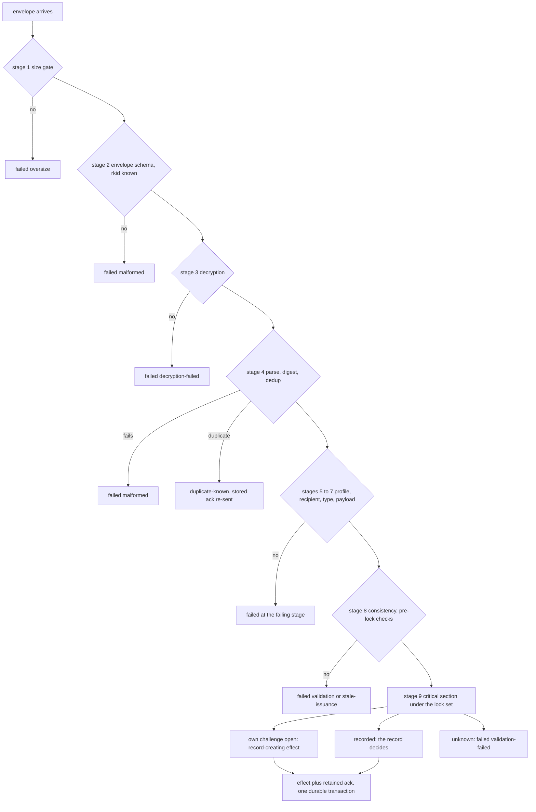

# RLTP Delivery Contract

**Real Life Trust Protocol — service contract: Delivery**

- **Status:** Editor's Draft
- **Version:** 0.32.0-draft (thirty-second casting — the answer to
  the **ninth** adversarial joint round (2 blockers; triage in
  `design/traeger-review9-2026-08.md`), jointly with Identity 0.23.
  **B-1 caught a false protection claim of this document's own
  making**: 0.31 called the registration-side denial "bounded" and
  "self-healing, for at most one `challenge-lifetime`", when
  nothing stops an attacker from re-taking every charge the moment
  it lapses, forever. The claim is withdrawn and the attack is
  carried as a **named residual of the DO-6 family** with its
  exact reach — it starves *new onboarding at one carrier* and
  touches no binding, queue, deposit, collection or conclusion —
  plus the one partition available without an identity: the new
  required constant **`challenge-reserve`**, a floor only requests
  naming an **already-bound** `rkid` may draw on, so device
  restore, nonce rotation and rebind cannot be starved at all.
  **B-2** gives `duplicate` the byte-exact rule a closed
  deterministic outcome set requires: two submissions are
  duplicates **iff their sealed envelopes are byte-identical** —
  the only comparison a key-blind carrier can make — a re-sealed
  document is expressly **not** one, the comparison lives exactly
  as long as the deposit, and a duplicate **charges the admission
  resource but consumes no storage**, checked after the charge and
  before storage admission so it can neither be free nor be
  counted twice. **No wire byte changes**)
- **Previous version:** 0.31.0-draft (thirty-first casting — the answer to
  the **eighth** adversarial joint round (2 blockers, 1 minor;
  triage in `design/traeger-review8-2026-08.md`), jointly with
  Identity 0.22. One blocker lands here and it finishes the
  charge: 0.30 made a challenge slot a non-refundable charge but
  never said **when it is taken** or **what a restart does with
  it**, so the carrier-wide bound could be reset by restarting in
  a loop — while persisting a record per challenge would have
  contradicted Section 9's own "nothing durable before both proofs
  verify". Both are closed without durable state: the charge is
  taken at the **budget check**, before any randomness, sealing,
  or asymmetric operation, and **a restart resumes with the full
  budget held** until `restart instant + challenge-lifetime`, so
  restarting can only ever cost capacity and never buy it. Two
  shipped counter-vectors decide both. **m-1** stops the socket
  residual from being overstated: a shared transport leaks no
  identifiers, but it does leak the two relationships' **common
  transport grouping**. **No wire byte changes**)
- **Earlier castings:** 0.30.0-draft (thirtieth casting — the answer to the
  **seventh** adversarial joint round (3 blockers, 1 major, 1
  minor; triage in `design/traeger-review7-2026-08.md`), jointly
  with Identity 0.21. All three blockers are **consistency
  remnants of the previous casting's own reforms** — the
  known class where a rule is recast and one of its consumers is
  not swept with it. **B-1**: 0.29 claimed a carrier-wide issuance
  rate of `max-open-challenges / challenge-lifetime`, but let a
  completed exchange return its slot at once — so an attacker
  holding its own keys could complete exchanges serially and force
  unbounded cryptography through one slot. A slot is now a
  **charge**: held for exactly `challenge-lifetime` from issuance,
  released by nothing else — not success, not abandonment, not a
  closed connection — and the claimed rate follows. **B-2**: the
  ingress side still forbade a "public" sender-side VID, the very
  word the collecting side had just been corrected away from; it
  now carries the same three prohibitions (**not well-known, not
  person-wide, not reused outside this relationship**), in §5a.10
  and in §11. **B-3**: §11 held two opposite verdicts for one
  shared persistent transport; the SHOULD stands and the
  contradicting nonconformance is withdrawn. **m-1** removes the
  last "evictable" from Section 9. Beyond the findings, this
  casting carries a **deliberate sweep of §5a's and §7a's
  consumers** against the 0.29 forms, which found and fixed two
  further stale statements the round had not reached. **No wire
  byte changes**)
- **Earlier castings:** 0.29.0-draft (twenty-ninth casting — the answer to
  the **sixth** adversarial joint round (3 blockers, 1 major;
  triage in `design/traeger-review6-2026-08.md`), jointly with
  Identity 0.20. The round ran under a corrected blocker
  definition, and the difference shows: no re-litigation, three
  precise findings, each of them a place where a rule said the
  right thing about the wrong object. **B-1**: the challenge
  budget bounded *storage* and not *work* — at the limit a carrier
  evicted the oldest slot and issued anyway, so connection churn
  still bought unbounded cryptography. Fixed by inverting that
  rule (**refusal, never eviction**), by normative
  **cheapest-first ordering** (syntactic checks, then the budget,
  then — only for a request holding a reserved slot — any
  randomness or asymmetric operation), and by declaring
  `challenge-lifetime`, so the resulting bound is an arithmetic
  consequence of two published constants:
  `max-open-challenges / challenge-lifetime`, carrier-wide,
  whatever the connection count. **B-2**: the TSP mapping demanded
  an outer VID that was not "public", which in TSP's routed model
  is unsatisfiable — the outer layer *is* the public layer. The
  word is replaced by the three prohibitions actually meant: **not
  well-known, not person-wide, not reused outside this
  relationship**. **B-3**: Live Delivery sat on both sides of the
  port line at once; it is now split along the line the session
  table draws — a **MUST** about the logical mediation
  relationship, a **SHOULD** about multiplexing one persistent
  transport, priced by E7's logic and recorded as a timing
  residual. **No wire byte changes**)
- **Earlier castings:** 0.28.0-draft (twenty-eighth casting — the answer to
  the **fifth** adversarial joint round (7 blockers, 1 major, 1
  minor; triage in `design/traeger-review5-2026-08.md`), jointly
  with Identity 0.19. Six of its findings are carried, and they
  cluster in the two places a contract is thinnest — where it
  meets a **neighbouring protocol** and where it bounds a
  **resource it does not own**. The registration defence is
  hardened against **connection churn**: the connection was the
  bucket key and connections are free to mint, so the challenge
  store gains a carrier-wide budget (`max-open-challenges`) beside
  its per-connection one, the capacity constants are stated as
  carrier-wide, and what this contract genuinely cannot bound —
  TCP/TLS accepts below the port line — is named instead of
  implied (4.4, 5a.3). The DIDComm mapping gains the **exclusivity
  and lifecycle** rules its TSP sibling already had, including a
  prohibition on `from_prior` rotation into a principal's
  connection (5a.10). "One session, one principal" is resolved
  where it read as MUST and SHOULD at once, by separating
  **authorization session**, **mediation connection** and
  **transport socket** (5a.3, 5a.7, §11). The TSP lifecycle gains
  the case a stable `C` with a changing direct intermediary
  produces — the outer VID is one **at a time**, not one forever —
  and the TSP **ingress** is made satisfiable by stating what
  principal-free submission always was: a rule about **this
  contract's port**, not a claim that a neighbouring protocol
  carries no hop identifier (5a.4, 5a.10). **No wire byte changes**)
- **Earlier castings:** 0.27.0-draft (twenty-seventh casting — the answer to
  the **fourth** adversarial joint round (5 blockers, 1 major;
  triage in `design/traeger-review4-2026-08.md`), jointly with
  Identity 0.18. **B-4 was a real arithmetic fault**: the whole-token
  bucket discarded the fractional remainder through its `ceil()`
  cursor, so granted capacity depended on *when* a carrier was
  asked — the round's own 334/667 ms counter-example is now worked
  through in the text, and the bucket is re-cast in **integer
  micro-tokens** where no remainder exists to lose, with **restart
  defined conservatively** (only `micro` persists, no elapsed
  credit crosses a restart, an unrecoverable counter starts
  empty). **B-3**: bytewise-smallest could settle a race but could
  not express an *intention*, so a deliberate nonce rotation
  succeeded only when the random bytes happened to sort lower —
  the register entry becomes `{nonce, generation}`, canonical =
  highest generation, ties by bytes, and entries are **superseded,
  never deleted**, which is what makes a restored old entry
  harmless without a tombstone (Identity §7a.3). **B-2**:
  possession proofs bound theft but not volume, so the
  registration side gains `max-queues` and `max-total-bytes` with
  the closed, deterministic `registration-refused(capacity)`, the
  admission resource is metered over the **registration and
  challenge phase** with the connection as bucket key, and
  challenge slots bounded and reclaimable (0.29 replaced that
  reclamation rule, and 0.30 made the charge non-refundable).
  **B-1** is answered by **classification, not
  mechanism**: against a third party the rules terminate the flood
  (rotation, two-phase wind-up); what remains is the
  **relationship insider**, carried as a named residual of exactly
  the class the Replication Contract holds for fork spam — the cost
  falls on the attacker's own relationship, the artifacts are
  attributable within it, the answer is social and never
  mechanical suppression. **B-5**: the recurring prose-pin drift is
  swept *and* the class is killed — `scripts/validate.mjs` now
  scans prose pins against the current versions. **No wire byte
  changes**)
- **Earlier castings:** 0.26.0-draft (twenty-sixth casting — the answer to
  the **third** adversarial joint round (4 blockers, 1 minor;
  triage in `design/traeger-review3-2026-08.md`), jointly with
  Identity 0.17. Three of its four blockers are the same charge in
  three places — **a rule was named but never made computable** —
  and all three are now byte- or state-level: the registration
  proof gets a **canonical, domain-separated signed object**
  (`rltp-carrier-proof/0.1`, JCS input, fixed-length challenges,
  a closed `purpose` set) with shipped transplant negatives
  (5a.3); `rate` becomes an **explicit token bucket** whose
  verdict reads only state, with clock discipline and a shipped
  sequence vector, so two byte-equal declarations can no longer
  disagree at a boundary that now does not exist (4.4); and orphan
  ageing becomes a **two-phase wind-up** — admission closes at a
  definite instant, held deposits run out their give-up life, then
  the binding is released — which bounds the surface by
  construction where the old horizon inequality proved nothing
  (5a.9, with `refused(queue-closed)` added to 5a.5). The fourth
  blocker, the targeted queue flood, is answered inside the
  resource-shaped frame: the residual is restated at **full**
  strength (the bucket is keyed to the queue, so a flooder spends
  the honest counterpart's allowance — a denial of service against
  one relationship), the impossibility is stated (telling the two
  senders apart *is* sender identification), and **rotation
  becomes a normative, in-relationship, terminating cure**; the
  closure remains DO-6 by the editor's standing decision.
  **No wire byte changes**)
- **Earlier castings:** 0.25.0-draft (twenty-fifth casting — the answer to
  the **second** adversarial joint round (6 blockers, 1 major, 1
  minor; triage in `design/traeger-review2-2026-08.md`), jointly
  with Identity 0.16. Its four Delivery-side blockers are one
  retraction and three completions: the rebind branch after
  **total** register loss demanded a proof the holder cannot
  construct — the pair contexts, and with them every `rkid`
  private key, are gone — so it is withdrawn rather than patched
  (5a.3, 5a.9); the admission declaration gains the **parameters
  per kind** without which its determinism claim was false, and
  the claim is narrowed to exactly how far they reach (4.4, 5a.5);
  the TSP outer VID must be **exclusive and relationship-private**,
  not merely bijective, and "a change of intermediary" is scoped
  to the **direct** carrier so hop changes beyond it change
  nothing (5a.10). Two editor's decisions land with it: the
  recipient-issued admission token is **not built and explicitly
  remembered** as DO-6 with its re-evaluation trigger and its
  retrofit point, and the field record's forty statusless minutes
  are answered by a new required constant **`status-horizon`**
  with the pre-transport report that keeps the trias closed
  (4.4, 6.1). **No wire byte changes**)
- **Earlier castings:** 0.24.0-draft (twenty-fourth casting — the
  answer to the first adversarial joint round against the
  carrier cut (7 blockers, 4 majors; triage in
  `design/traeger-review1-2026-08.md`), jointly with Identity 0.15.
  Section 5a keeps its architecture and gains what it was missing
  to be executable: **registration now proves possession of both
  halves** (5a.3 — a signature under the principal and the
  decryption of a challenge sealed to the `rkid`, bound into one
  signature; rebind and a closed outcome set with it), the
  **admission story is complete** (5a.5 — what a carrier may check,
  what it never may, a closed deterministic refusal set, and the
  flooding residual named rather than papered over), **nothing
  admitted ends silently** (5a.8 — the conclusion duty that clears
  a slot, the field record's 1148-pending stall answered, and the
  carrier's give-up duty before any discard), the **metadata claim
  of principal-free submission is narrowed to what it can carry**
  (5a.4), and the **neighbouring-form mappings become normative
  adapter obligations** (5a.10 — one principal ↔ one TSP outer VID
  of the direct carrier, one DIDComm mediation connection per
  principal). 4.4 registers `give-up-horizon` as a third required
  carrier constant with `orphan-horizon ≥ give-up-horizon`.
  **No wire byte changes**)
- **Editors:** Anton Tranelis
- **Date:** 2026-08-27
- **Vocabulary namespace:** `https://real-life.org/rltp/v1`
- **Task-type namespace:** `https://real-life.org/trust-tasks/`
- **Target Trust Tasks framework version:** 0.4
- **Conformance profile:** `rltp-delivery@0.32` (draft)
- **Supersedes:** version 0.31 (archived as
  `archive/delivery-contract-0.31.md`) and versions 0.30–0.1,
  archived alongside it.
- **Position:** not a layer. Delivery is the service behind the port
  the Encounter Layer requires; every layer may use it, none depends
  on its internals.

## Abstract

This document specifies how RLTP documents travel between people. The
delivery service moves **signed, anchor-encrypted, typed documents**
from one person to another — eventually, at least once, never silently
lost — and tells both sides honestly what it knows: the sender its
transport state, the receiver nothing the content does not prove
itself, and the sender **never** what the receiver decided.

Messages are **Trust Task documents** of private, versioned types under
`https://real-life.org/trust-tasks/` (ToIP DTGWG Trust Tasks framework
0.4, §6.5 private specifications). This casting registers four types
of its own — `encounter-bundle`, `delivery-ack`,
`encounter-credential-delivery`, `registry-declaration` — the RLTP
document profile all types
share, the sealed envelope they travel in, and the **task registry**
(4.4) through which companion layers register theirs: the membership
and access types (registered in their own documents), the
introduction and continuity types of the network-visibility layer,
and the member-mapping disclosure of the access layer.

Addressing is a **triple**, never an account (Section 5a): the
`rkid` a sender seals to, one per relationship; a queue locator
that is the carrier's own business and appears in no rule of this
contract; and a **control principal**, derived per (relationship ×
carrier) by Identity §7a, under which a recipient registers
addresses and collects what arrives. Submission needs no sender
identity, and abuse is answered with resources rather than
accounts. The point is a modest one, stated plainly: a carrier of a
relationship knows that relationship — but relationships must not
converge into a person at whoever carries them.

## Status of This Document

This is an **Editor's Draft** with no standing beyond its own
argument. It is developed together with the Encounter Layer through
an adversarial convergence process — each casting is reviewed in full
by an independent adversarial reviewer and recast, never patched. The
seventeenth casting's review round returned no findings and the pair
was judged blocker-free and compatibly implementable.

The eighteenth and nineteenth castings carried this document
through the **M-DID loop**: the Encounter re-pin to the
fresh-always wire, and the **task registry** of 4.4 as an
implementable contract — registry-entry form, published
operational constants, and the `registry-declaration/0.1` type
that carries them per party. The twenty-second casting took two
cuts from the replication joint loop: the service-identity `rkid`
clause was withdrawn, and the registry gained its direct-effect
prohibition.

The twenty-third casting was the **carrier cut**, cast jointly
with **Identity 0.14** against the decomposition
`design/traeger-beziehungsidentitaet-zerlegung-2026-08.md`
(editor's decisions E1–E9, 27.08.2026). Its subject is not what a
carrier reads — a carrier is key-blind and always was — but **under
which identity one faces it**, and what it can therefore add up
about who corresponds with whom, how often. Three things were true
before this casting and are now said: the recipient address is
already per relationship and stays so; submission carries no
sender identity at all; and §10 promised a bound ("derived service
identities bound what a transport learns") that Identity §7 never
defined for a delivery relationship. Section 5a redeems the
promise with the addressing triple, decides the principal-free
submission, and adds the two prohibitions the decomposition found
to be load-bearing: the role separation between storage entry and
delivery pickup, and the discipline of not bundling principals
into one collection session. What remains correlatable is stated
in §10 rather than implied away.

The twenty-fourth casting answered the **first** adversarial joint
round against that cut — 7 blockers and 4 majors, triaged in
`design/traeger-review1-2026-08.md` — jointly with **Identity
0.15**. The round did not dispute the architecture; it found the
carrier *interface* underspecified in five places where an
implementer would have had to invent something, and one place
where the text claimed more than it delivered. Registration now
proves possession of both halves rather than asking for honesty
(5a.3), with rebind and a closed outcome set; the admission story
is written out — what a carrier may check, what it never may, a
closed deterministic refusal set, and the flooding residual named
(5a.5); the conclusion duty closes the loop that let a decided
document be redelivered forever and an admitted one be dropped in
silence (5a.8, with `give-up-horizon` registered in 4.4 beside
`orphan-horizon` and ordered against it); the metadata claim of
principal-free submission is narrowed to what any construction
without a mix network can carry (5a.4); and the mappings onto the
neighbouring carrier forms become normative adapter obligations
with one determinate object each (5a.10).

The twenty-fifth casting answered the **second** round — 6
blockers, 1 major, 1 minor, triaged in
`design/traeger-review2-2026-08.md` — jointly with **Identity
0.16**, and it is worth naming what the round was about, because
it is not what the first one was about. Round 1 found things that
were **missing**; round 2 found things that were **claimed**. One
finding is answered by taking a promise back: the recovery branch
told a holder who had lost the whole register to rebind an address
it can no longer prove possession of, which is not a hard step but
an impossible one — it is withdrawn, and Identity §9.3 now decides
which of the two losses leaves a way back (5a.3, 5a.9). Two more
are claims that outran their declarations: admission called itself
deterministic while declaring a bare resource *kind*, so the kinds
now carry the parameters that make them computable and the claim
is cut to exactly their reach (4.4, 5a.5); and the TSP mapping
called itself a bijection when the property it needed was
**exclusivity** — a public or reused outer VID satisfies a
bijection and hands over the join anyway (5a.10). The fourth
sharpens "a change of intermediary" to the **direct** carrier, so
a hop change beyond it changes nothing. Two editor's decisions
arrive with the same casting: the recipient-issued admission token
stays unbuilt but is now **remembered on the record** with its
trigger and its retrofit point (DO-6), and the last open line of
the delivery addendum — a submission may be undelivered for weeks
but not **undescribed** for forty minutes — becomes the
`status-horizon` constant and the pre-transport report (4.4, 6.1).

The twenty-sixth casting answered the **third** round — 4 blockers
and 1 minor, triaged in `design/traeger-review3-2026-08.md` —
jointly with **Identity 0.17**, and three of the four blockers make
one point three times: *a rule that is named is not yet a rule that
can be computed.* The registration proof said "byte-precisely" over
a paragraph that would have admitted JCS, CBOR, length-prefixed
fields and raw concatenation alike — it now has one signed object
with its domain tag inside the signed bytes, fixed-length
challenges, a closed `purpose` set, and shipped transplant
negatives, because a transplant vector cannot exist without a
canonical input to transplant (5a.3). `rate` had parameters but no
algorithm, so two byte-equal declarations could still disagree at a
window edge and a flooder could burst across one — it is now
exactly a token bucket, with the verdict reading state only, the
clock discipline written down, and no boundary left to exploit
(4.4). Orphan ageing rested on an inequality between two horizons
measured from different events, which proves nothing and left a
queue that anyone could keep alive by depositing into it — it is
now a two-phase wind-up whose termination follows from closing
admission at a definite instant (5a.9). The fourth blocker is the
targeted queue flood, and it is the one that stays open on purpose:
the residual is restated at full strength, the reason no resource
parameter can close it is written down, rotation is made a
normative and terminating cure, and the actual closure remains
DO-6.

The twenty-seventh casting answered the **fourth** round — 5
blockers and 1 major, triaged in
`design/traeger-review4-2026-08.md` — jointly with **Identity
0.18**. Two of its blockers were **arithmetic and lifecycle faults
in rules this document had just declared executable**, which is
the useful kind of finding: the token bucket lost fractional
remainders and made capacity depend on polling instants (it is now
counted in integer micro-tokens, with restart defined), and the
nonce convergence rule could settle a race but could not express a
rotation (the register entry now carries a generation, and entries
are superseded rather than deleted). Two more were bounds this
contract had left open at the *registration* side rather than the
submission side — arbitrarily many self-minted pairs, and
challenge state before any queue exists — now closed
resource-shaped, with `registration-refused(capacity)` and
evictable challenge slots. The fifth is the recurring pin drift,
answered this time by fixing the pins **and** teaching
`scripts/validate.mjs` to catch prose pins, so the class cannot
recur silently.

And one finding is answered by classification rather than by
construction, deliberately: the targeted queue flood. Against a
third party the rules terminate it. What is left is the
relationship **insider**, and that residual is now carried in the
same words this stack already uses for fork spam — the cost falls
on the attacker's own relationship, the artifacts are attributable
within it, and the answer is social rather than mechanical. Saying
so precisely is the closure; a delivery contract is not the
instrument for a person who has decided to wreck their own
channel.

The twenty-eighth casting answered the **fifth** round — 7
blockers, 1 major, 1 minor, triaged in
`design/traeger-review5-2026-08.md` — jointly with **Identity
0.19**, and its findings sit almost entirely at the two seams
where a contract is thinnest: where it meets a **neighbouring
protocol**, and where it bounds a **resource it does not own**.

At the resource seam, the registration defence was keyed to the
connection, and connections are free to mint — so the bound was a
bound in name only. The challenge store is now bounded
**carrier-wide** as well as per connection, the capacity constants
are stated as carrier-wide facts, they are required even where the
admission resource is `none`, and the one thing this contract
genuinely cannot bound — TCP and TLS accepts, below the port line
— is named rather than implied away (4.4, 5a.3).

At the protocol seam, three findings and one honest correction of
our own text. The DIDComm mapping had exclusivity rules for TSP
and none for itself, so a connection DID could be a value the
person already publishes, or be bound to a prior DID by
`from_prior` — both now forbidden (5a.10). "One session, one
principal" was a MUST here and a SHOULD three sections later,
which is resolved by separating **authorization session**,
**mediation connection** and **transport socket**, and by saying
that 5a.7 was always about *timing* (5a.3, 5a.7). The TSP
lifecycle had no exit when the direct peer changed under a stable
`C`; it does now, and it is the obvious one once "one VID per
principal" is read as *at a time* rather than *forever* (5a.10).
And the correction: **5a.4's prohibition is a statement about this
contract's port**, not a claim that neighbouring transports carry
no hop identifiers — read as the latter it made a conforming TSP
ingress impossible, which is a defect in our sentence and not in
TSP (5a.4, 5a.10).

The twenty-ninth casting answered the **sixth** round — 3
blockers and 1 major, triaged in
`design/traeger-review6-2026-08.md` — jointly with **Identity
0.20**. It is the first round under the corrected blocker
definition, and the shape of the findings changes accordingly:
nothing is re-argued, and all three blockers are the same species
of error — a rule that constrained the **wrong object**. The
challenge budget constrained stored slots rather than performed
work, and a limit answered by eviction is not a limit at all; the
TSP rule constrained the *visibility* of an outer VID, which in a
routed model is not ours to forbid, instead of its *linkability*,
which is; and the Live Delivery rule constrained a socket that
this contract's own session table had already placed below the
port line. Each is fixed by moving the constraint onto the object
it was always about — work, linkability, and the logical
mediation relationship — rather than by adding machinery.

The thirtieth casting answered the **seventh** round — 3 blockers,
1 major, 1 minor, triaged in
`design/traeger-review7-2026-08.md` — jointly with **Identity
0.21**. The round is worth reading for its shape: none of the
three blockers disputes a decision of the previous casting, and
all three are places where a recast rule left a **consumer**
standing in the old form. That is a known failure class in this
repository — the replication loop paid for it twice — and it has
one honest answer, which is to sweep the consumers deliberately
rather than to wait for a reviewer to enumerate them. This casting
therefore does both: it fixes the three (the challenge slot
becomes a non-refundable **charge**, so the rate the previous
casting claimed is finally true; the TSP **ingress** rule gets the
same three prohibitions the collecting side got; §11's second,
contradicting verdict on a shared transport is withdrawn), and it
then walks §5a and §7a against the 0.29 forms and repairs what the
round had not reached — a §11 ingress verdict still saying
"public", a Section 9 paragraph still saying "evictable", and a
sentence still listing Live Mode among the cross-principal
answers.

The thirty-first casting answered the **eighth** round — 2
blockers and 1 minor, triaged in
`design/traeger-review8-2026-08.md` — jointly with **Identity
0.22**, and the round is the smallest of the series. Its Delivery
blocker is the last piece of the charge introduced one casting
earlier: a charge that is never refunded still needs a **start**
and a **restart**, and 0.30 gave it neither, so a carrier could be
restarted in a loop to reissue its whole budget. The fix is
constrained by a property this document already holds — nothing
durable is written before both proofs verify — and it turns out
that property is not an obstacle but the shape of the answer: the
charge starts at the budget check, and a restart simply **assumes
the full budget is held** for one `challenge-lifetime`. No record
survives a restart because none needs to, and a restarted carrier
has strictly less capacity than it had. The minor removes an
overstatement that had crept into the socket residual.

**This thirty-second casting answers the ninth round** — 2
blockers, triaged in `design/traeger-review9-2026-08.md` — jointly
with **Identity 0.23**. Both are about **saying what is true**
rather than about building anything. The first is a protection
claim this document made about itself and could not keep: the
registration-side denial was called bounded and self-healing, and
it is neither — an attacker re-takes the charges at every lapse
and can keep new onboarding at a carrier shut indefinitely. That
sentence is withdrawn, the attack is classified where it belongs
(the DO-6 family, with its reach written out), and the one thing
that *can* be done without asking who is calling is done: a floor
reserved for addresses the carrier already carries, so a person
coming back to an existing relationship is never in the queue
behind an attacker. The second is an outcome that had a name but
no condition — `duplicate` — now fixed to the only bytes a
key-blind carrier can compare, with its state and its metering
decided against the two hazards that shape them: a free replay
channel on one side, a single message counted many times on the
other.

Known open questions are
collected in Section 12; the joint convergence loop with Identity
continues. Feedback is welcome via the issues
of the publication repository
(github.com/real-life-org/rltp-spec).

## 1. Introduction (informative)

### 1.1 Essence and principles

- **Eventually, at least once, never silently lost.** Delivery time is
  unbounded and never affects validity (Encounter 1.3). At-least-once
  makes duplicates and lost acknowledgements the *normal case*, so
  idempotency is law, not precaution. A document the service accepted
  is delivered or reported failed; silent loss is non-conformant.
- **Documents and promises, never pipes.** No normative statement
  mentions a relay, a broker, a socket, or a wire. Transport-internal
  signals never appear here.
- **Authenticity always has exactly one carrier.** Where a document's
  payload contains material signed under the Layer-1 binding rule
  (credentials, cards), that material is the carrier and the document
  needs no proof. Where it does not — the acknowledgement — the
  document itself carries a proof. Nothing is trusted because a
  channel said so.
- **The acknowledgement is arrival, and arrival only.** It is
  machine-generated at the durable recording of a document's defined
  effect, waits on no human, and carries no statement about any
  decision. The mutual-recognition moment of an encounter is carried
  by the counter-credential itself, not by any receipt.

### 1.2 The user experience this serves (informative)

After A scans and confirms, A's app shows a waiting state; the arrival
acknowledgement dissolves it ("nothing more to do on your side"), and
its absence within `ack-wait` flips A's screen to the optical
presentation of the sent card — the same enactment on another
carrier. When B's counter-credential later arrives, A sees the
relation confirmed; B's own view becomes mutual only when A's
credential reaches B (Encounter 4.2 — every view is local). Section 8
gives both state machines; a lost acknowledgement after B's commit
reconciles through redelivery and `duplicate-known`, never through a
second enactment (6.3).

## 2. Conventions and Terminology

The key words "MUST", "MUST NOT", "REQUIRED", "SHALL", "SHALL NOT",
"SHOULD", "SHOULD NOT", "RECOMMENDED", "NOT RECOMMENDED", "MAY", and
"OPTIONAL" are to be interpreted as described in BCP 14 [RFC2119]
[RFC8174] when, and only when, they appear in all capitals.

The **interim securing profile** of Encounter 2.3 applies (did:key
anchors, Ed25519/X25519 as Multikeys with decoded multicodec
verification, `eddsa-jcs-2022` embedded proofs, JCS, SHA-256,
multibase, RFC3339-UTC-`Z` timestamps).

**Document** — a Trust Task document conforming to the RLTP document
profile (Section 3). **Document digest** — the multibase-encoded
multihash (Encounter 2.3: emit `u`, accept `u`/`z`, SHA-256) over
`JCS(document)` of the plaintext document; the document's identity for
idempotency and acknowledgement reference, and format-identical to
DTGWG `digestMultibase` values. **Sealed
envelope** — the encrypted form in which a document travels
(Section 5). **Disposition** — the receiver's classification of a
processed envelope (Section 6).

**Carrier** — a party that holds delivery queues on behalf of
recipients: the adapter side of this contract, below the port
line, key-blind by construction (Section 5a). **Control
principal** — the carrier-relationship identity of Identity §7a,
the identity a recipient presents to one carrier for one
relationship. **Queue locator** — a carrier-local, opaque handle
for one queue (5a.1).

*Disambiguation, because the word does double duty in ordinary
English:* where 1.1 says authenticity "has exactly one carrier",
and where 1.2 and 6.3 speak of the **carrier switch** to the
optical leg (Encounter 5.8), the word means "that which carries"
and names no party. The role defined here is always the party of
Section 5a, and every normative sentence about it points there.

| Term | Fragment |
|---|---|
| Document digest | `#DocumentDigest` |
| Sealed envelope | `#SealedEnvelope` |
| Disposition | `#Disposition` |
| Delivery acknowledgement | `#DeliveryAck` |
| Carrier | `#Carrier` |
| Control principal | `#ControlPrincipal` |
| Queue locator | `#QueueLocator` |

## 3. The RLTP Document Profile

RLTP delivery documents are Trust Task documents [TT], target framework
version **0.4**, under the private task-type rules of TT §6.5. The
profile — normative wire form
`schemas/rltp-delivery-document.schema.json` — requires:

- `id` — REQUIRED; UUID v4.
- `type` — REQUIRED; a registered RLTP task type
  (`https://real-life.org/trust-tasks/<slug>/<MAJOR.MINOR>`). Slugs
  never match `^trust-task(-|/)?` (TT §6.1).
- `issuer`, `recipient` — REQUIRED, in-band, as anchors. A consumer
  MUST reject a document whose `recipient` is not its own anchor
  (TT §7.2 rule 5 — the receiver principle at the envelope level).
- `threadId` — REQUIRED: fresh (UUID v4) on thread-opening documents,
  equal to the answered document's `threadId` on responses.
- `ceremony` — OPTIONAL, and **entirely unconstrained by the task
  specifications**, per TT §4.11.1: a task specification declares
  nothing about ceremonies, absence is never grounds for rejection,
  and every framework-defined member (`enactment`, `step`, `round`,
  `terminal`, `prev`, …) passes through unrejected. One RLTP
  *profile-level* rule applies to consumers of this contract: **where
  the member is present and carries an `enactment`, that value MUST
  recompute** against the enclosed material or the document is
  `failed(validation-failed)`; a member that grants nothing can still
  not be allowed to lie. It grants no authority (TT §7.2 rule 9); the
  authoritative enactment binding always lives in the enclosed
  credential itself.
- `issuedAt` — REQUIRED.
- `expiresAt` — MUST be absent. Delivery time is unbounded; validity
  windows live in payloads and ceremonies, with issuance semantics.
- `proof` — REQUIRED on `delivery-ack` and on
  `registry-declaration` (4.4) — the two types whose authenticity
  has no other carrier (1.1); MUST be absent on the other types of
  this casting, whose authenticity is carried by the signed
  payloads inside. Where `proof` is present, TT §4.8.2 audience binding is
  satisfied by the in-band `recipient`.
- `payload` — REQUIRED; governed by the type's **payload schema**.
  For the types this document registers itself, the schema's `$id`
  is the Type URI (TT §6.3); companion-registered types dispatch
  through their registry entry (4.4), whose schema reference is
  authoritative — one dispatch rule, stated once. Payload schemas describe only
  the payload; the outer members are validated by the document-profile
  schema.

**Offline schema rule:** implementations MUST pre-register every
schema of this contract by its `$id` and MUST NOT resolve any `$ref`
over the network. The shipped `schemas/` directory is the complete
closure; a validator that cannot resolve a reference from its local
registry treats the document as `malformed`.

Unknown `type` → the document MUST be rejected with disposition
`failed(unknown-type)`; a document that would have an effect is never
silently ignored.

## 4. Registered Task Types

Each type below is a private Trust Task specification with: Type URI,
target framework 0.4, payload schema (shipped), proof declaration (per
Section 3), and the consistency rules stated here.

### 4.1 `encounter-bundle/0.1`

The transmission of the one-scan ceremony (Encounter 5.8): the
scanner's sent card and step credential.

- `payload`: `{ "card", "credential" }` per
  `schemas/payload-encounter-bundle.schema.json`.
- `threadId`: fresh (opens the exchange). `proof`: absent.
- **Declarations (TT §7.3):** side effects: *mutating* (creates the
  enactment record); exposure: recipient-only, never retained by
  third parties.
- **Outer/inner consistency (MUST, before any effect):**
  `issuer` = `card.anchor` = `credential.issuer`;
  `recipient` = `credential.credentialSubject.id`;
  the card carries a sent-challenge with `sentTo` = `recipient` and
  `boundTo` = `credential.credentialSubject.challenge`
  (Encounter 6); a present `ceremony.enactment` equals
  `credential.credentialSubject.enactmentBinding`. Under
  fresh-always enactment (Encounter §4.4) every anchor of these
  equalities is a **fresh pair anchor** of the enacting parties;
  the checks are anchor-class-neutral and stand unchanged.
- **Pre-lock validation (MUST, in order — validate, then consume:
  read-only against local state **except for Encounter 5.3's aging
  latch, which every resolution writes**, and consuming nothing;
  together with the authoritative in-lock resolution this implements
  the acceptance set of Encounter 5.6):**
  1. document profile + payload schema valid; timestamps
     calendar-valid; keys decode to correct multicodec + length;
  2. card proof verifies under `card.anchor`;
  3. credential proof verifies under its issuer anchor;
  4. `credential.credentialSubject.id` = the local anchor;
  5. the credential's bound challenge **resolves** (Encounter 5.3;
     the resolution itself latches any held aged value it observes —
     the latch is monotone and lock-free, so this provisional
     observation already stands) to `open` or `recorded` — an
     `unknown` resolution ends the pre-lock checks, but is **never
     final pre-lock**: the evaluation skips the remaining checks and
     proceeds directly to the serialization point (6.2 stage 9),
     where the authoritative resolution decides. If it is still
     `unknown`, the disposition is `failed(validation-failed)` — the
     one state-free outcome that covers garbage, foreign,
     rotated-away, and record-gone bundles alike, always produced
     under the lock. If it is **any other state** (the state moved —
     e.g. the optical record arrived between pre-lock and lock), the
     evaluation MUST NOT proceed on the skipped checks: it releases
     the lock and **re-enters at stage 4** (the waiter rule of 6.2),
     completing every check under the new state before any effect;
     **`credentialSubject.ceremony` equals this
     ceremony (`encounter-scan@0.25`)** — a credential labelled
     with any other ceremony is `failed(validation-failed)`, so the
     record's ceremony is grounded rather than copied from the
     sender's label; and the enactment binding recomputes per
     Encounter 5.4 from {the resolved own challenge, card's
     sent-challenge};
  6. **the issuance window (Encounter 5.6 step 6):** `validFrom` and
     `proof.created` inside the closed interval anchored at `t_ch`
     from the resolution — held with an `open` value by its owner,
     held in the record for a `recorded` one (Encounter 5.5/5.3) —
     and `proof.created ≥ validFrom − skew-tolerance`.

  This pre-lock resolution is **provisional**; the resolution
  repeated inside the critical section is authoritative and alone
  selects the effect.
  Only after 1–6 pass does evaluation reach the final stage (6.2
  stage 9), whose critical section is keyed for bundles on **both**
  the document digest and the credential's bound challenge — the
  **record key**, the same serialization point the optical input of
  Encounter 5.8 passes through. Inside that section, and only there,
  the bound challenge is **re-resolved authoritatively** (Encounter
  5.3), and the resolution selects the effect:

  **`open` → record-creating effect:** the explicit future check
  (Encounter 5.5) — an own challenge future-dated beyond
  `skew-tolerance` is `failed(gate-future)`; the expiry side is
  structural (an aged value never resolves `open`), so no
  `gate-expired` disposition exists — then the effect committed **as
  one durable transaction**: the enactment record, **the accepted
  credential itself with its direction and credential digest** (the
  state Encounter 4.2 needs to hold `received` across restarts), the
  completed-effect cache entry, **and the acknowledgement document
  itself, retained with the cache entry** (4.2). After commit the
  credential **is accepted**; no later check can fail it.

  **`recorded` → the record decides:** a record whose counterparty is
  **not** the document issuer means the challenge was consumed by a
  different enactment — `failed(consumed-challenge)`, the only way
  this disposition arises, and it is stable under waiter re-entry:
  the record survives, so re-resolution yields `recorded` again and
  the same disposition. Otherwise (the offline path completed first,
  Encounter 5.8) the enclosed card MUST be **JCS-identical to the
  counterparty card stored in that record** — a bundle combining a
  valid credential with any other card, however well signed, is
  `failed(validation-failed)`. The binding is verified against the
  record, and the credential MUST pass Encounter acceptance (5.6) in
  full, including uniqueness; `ERR_STALE_ISSUANCE` maps to
  `failed(stale-issuance)`, every other rejection to
  `failed(validation-failed)`, and nothing is consumed. On pass, the
  **record-aware effect** committed as one durable transaction: the
  accepted credential with direction and credential digest, the
  completed-effect cache entry, and the retained acknowledgement —
  **no gate, no record creation, no consumed-challenge conflict**.

  **`unknown` → `failed(validation-failed)`:** nothing exists to
  consume; a provisional pre-lock pass only means the state moved.

  Any failure before a committed effect consumes nothing and earns no
  acknowledgement (the poisoning rule). Documents with **distinct
  digests** competing for one challenge serialize on the record key:
  exactly one commits first; each later evaluation re-selects its
  branch against the new state — an identical enclosed credential
  (equal credential digest) lands idempotently via Encounter 5.6
  step 8 with its own effect and acknowledgement; a conflicting
  credential **from the record's counterparty** (it passed the
  counterparty check) is `failed(validation-failed)`; a foreign
  counterparty is always `failed(consumed-challenge)` (above) —
  never a second record.

### 4.2 `delivery-ack/0.1`

The arrival acknowledgement (DO-1).

- `payload`: `{ "ref": <document digest of the acknowledged document>,
  "meaning": "received" }` per
  `schemas/payload-delivery-ack.schema.json`.
- **Declarations (TT §7.3):** side effects: sender status update only;
  exposure: retained only by the acknowledged document's sender.
- `threadId`: = the acknowledged document's `threadId`.
- `proof`: **REQUIRED** — `eddsa-jcs-2022` under the ack's `issuer`
  anchor. An unsigned or foreign-signed acknowledgement is invalid.
- **Consistency (MUST, on receipt):** proof verifies under `issuer`;
  `issuer` = the acknowledged document's `recipient`; `recipient` =
  the acknowledged document's `issuer`; `threadId` matches; `ref`
  matches a document this sender actually sent on that thread. Any
  failure → the ack is discarded (`failed(validation-failed)`) and the
  sender's status is unchanged.
- Generation: **automatic at the durable recording of the referenced
  document's defined effect** (4.1: the committed bundle effect,
  record-creating or record-aware; 4.3: durable buffering). It MUST NOT wait for, depend on, or reveal any
  human decision, and MUST NOT be sent for a document rejected at
  document level. **The acknowledgement document is created inside
  the effect's transaction and retained together with the
  completed-effect cache entry it belongs to** — both persist at
  least `key-retention` after commit (Section 7), the bound that
  outlives every adapter's give-up horizon and therefore every live
  redelivery. Within that bound, redelivery of a `duplicate-known`
  document MUST re-send exactly this stored document, byte-identical
  — never a newly generated one. After the bound, entry and stored
  acknowledgement MAY be discarded together; a document redelivered
  later is re-evaluated as fresh, and byte-identity binds only within
  the retention bound. The re-evaluation is harmless in both possible
  states: a bundle whose enactment record still exists (records live
  for the life of the relation, Encounter 5.5) lands in the
  **record-aware effect** and is accepted idempotently (equal
  credential digest, Encounter 5.6 step 8), earning a **freshly
  generated** acknowledgement; a bundle whose record is gone fails
  **by derivation from the state model**: with the record deleted,
  the bound challenge resolves `unknown` (Encounter 5.3 — no
  challenge history exists beyond open values and records), so
  check 5 of 4.1 fails — `failed(validation-failed)` — and no gate
  is ever reached or needed. Its sender has long reported
  `failed` either way, and a late acknowledgement only transitions
  that status honestly (6.1).
- Meaning, normatively and honestly bounded: *the recipient's anchor
  **attests** that the document reached its authenticated device and
  that its defined effect is durably recorded.* It is an attestation,
  not a proof of causal receipt — a recipient who signs falsely harms
  only their own state, and the sender's `delivered` is exactly as
  strong as that attestation. Implementations MUST NOT present it as
  acceptance, verification beyond the recording gate, or any human
  act (Encounter 7.4). `meaning` is a closed one-value set in this
  version.
- **Terminal.** The acknowledgement is a **terminal document**: its
  defined effect (the sender-status update, idempotent by
  construction) earns a completed-effect cache entry like any other,
  retained at least `key-retention` after commit — the same bound as
  every cache entry — but it generates **no acknowledgement of its
  own**: there is no acknowledgement of an acknowledgement, and the
  chain ends here by rule, not by accident. A stage-4 duplicate of a
  terminal document is `duplicate-known` with **nothing to re-send**
  (6.2).

### 4.3 `encounter-credential-delivery/0.1`

Post-enactment delivery of a step credential: the counter-step of
`encounter-scan` (`"counter"`), or a standalone credential delivery
outside any bundle thread (`"deliver"`).

- `payload`: `{ "credential" }` per
  `schemas/payload-encounter-credential-delivery.schema.json`.
- **Declarations (TT §7.3):** side effects: buffering only; exposure:
  recipient-only.
- `threadId`: fresh for standalone deliveries (`ceremony.step` =
  `"deliver"` when the member is used); = the bundle's `threadId` for
  a one-scan counter-step (`"counter"`). `proof`: absent.
- **Outer/inner consistency (MUST, before any effect):**
  `issuer` = `credential.issuer`; `recipient` =
  `credential.credentialSubject.id`; if `ceremony` is present, its
  `enactment` = `credential.credentialSubject.enactmentBinding`.
  A document violating these is `failed(validation-failed)` and
  produces no acknowledgement — an acknowledgement never goes to a
  party other than the credential's own issuer.
- **Defined effect:** durable buffering of the enclosed credential for
  Encounter acceptance. The acknowledgement is sent at buffering;
  Encounter acceptance (5.6) runs separately, never acknowledges, and
  its outcome is never signaled to the issuer (Encounter 7.4).

### 4.4 The task registry — companion-registered types

Every type under the task-type namespace shares the document
profile (Section 3), the sealed envelope (Section 5), and the
disposition and acknowledgement rules (Section 6). Beyond the
four types this document registers itself, the registry's
members are registered **where their semantics live**, each as a
private Trust Task specification naming its type URI, payload
schema, proof declaration, and consistency rules:

- `membership-invite/0.2` · `membership-accept/0.2` ·
  `access-operation/0.1` · `membership-evidence/0.1` — Membership
  Tasks §3;
- `key-delivery/0.1` · `removal-notice/0.1` — Access §10;
- `introduction-request/0.1` · `introduction-forward/0.1` ·
  `introduction-reply/0.1` · `introduction-ack/0.1` ·
  `introduction-voucher/0.1` — Network Visibility §8.1; payload
  schemas `schemas/visibility-payload-introduction-request.schema.json`,
  `…-forward…`, `…-reply…`, `…-ack…`, `…-voucher….schema.json`;
  proofs per Visibility §2.1 (the artifacts carry their own MACs
  and signatures; the documents carry none — one carrier);
- `continuity-probe/0.1` · `continuity-mapping/0.1` — Network
  Visibility §6a.2/§6a.4; the payload is the artifact itself
  (`schemas/visibility-continuity-probe.schema.json`,
  `schemas/visibility-continuity-mapping.schema.json`), travelling
  on the enactment tuple's own channel (its §6a.3);
- `member-mapping/0.1` — Access §5.5; payload
  `schemas/member-mapping.schema.json`, travelling on the existing
  relationship channel between discloser and addressee, never a
  group space.

**The registry-entry form (normative):** a registry is a set of
entries, one per type, each carrying exactly: the **type URI**
(under the task-type namespace) · the **payload schema
reference** (the shipped schema file the receiver validates
against — dispatch resolves through the entry, so a companion
schema needs no `$id` equal to the type URI; §3's `$id` rule
binds the types this document registers itself) · the **proof
declaration** (proof present/absent and its carrier, per the
registering specification) · and optionally **operational
constants** of the role (below). A type absent from a receiver's
registry is `unknown-type` (6.2), exactly as for this document's
own types; registration creates no authority anywhere — every
type's effects are governed by its own specification, **under one
global rule no registration can waive: a registered type's
defined effect MUST NOT write replicated state directly. Where an
effect touches replicated state, it does so exclusively by
handing full entries with their closure to the Replication
Contract's ingest admission (Replication §7, I14) — the admission
verdict, not the delivery disposition, decides any replicated
effect.** A registry entry whose specification defines a direct
replicated write is not registrable.

**Operational constants and `registry-declaration/0.1`
(normative):** a party serving a role whose specification names a
published constant declares it **per party** — fixed,
non-adaptive — and its counterparts MUST hold it before they
depend on it. The carrier is this contract's own task type
`registry-declaration/0.1`: `payload`
`{ "declaration": { "role": <type URI of the served role>,
"revision": <int-string, ≥ 1>,
"constants": { <name>: <value string> } } }`
per `schemas/payload-registry-declaration.schema.json`;
`threadId` fresh; `proof` **REQUIRED**, verifying under the
document `issuer` (the declaring party — §3's proof rule names
this type). Defined effect: durable recording per (issuer,
role) under the **generic revision rule** (the pattern of
Visibility §6.4): a higher `revision` wins; an equal revision
with JCS-identical payload is idempotent; an equal revision with
a different payload is an equivocation error — reject, keep
state; a lower revision is rejected — so a delayed or redelivered
older declaration can never roll a value back. A replacement is
prospective, never retroactive for a running act. **Roles and
their constants are named by the registering specification**: the
role URI is the type URI of the task the party serves as
receiver — for the introduction mediator,
`https://real-life.org/trust-tasks/introduction-request/0.1` —
and the registering specification closes which constant names a
role admits and their domains; unknown constant names or
out-of-domain values reject the declaration. The first
registration: `ack-delay`, an RFC 3339/ISO-8601 duration,
`PT1S ≤ ack-delay ≤ PT1H` (Visibility §8.4). **This declaration IS
the "task registration entry" Visibility §8.4 publishes from** —
that entry's per-party published form; one mechanism, two names.
**Act binding and revision skew, stated honestly:** each side of a
running act computes from the declaration it holds — the mediator
from its own current value at the act's arrival, the requester
from the highest revision it holds at send. A revision landing
between the two is safe by construction: the requester's early
`failed` is Visibility §8.4's named role divergence, converged by
the retry as a new act; a mediator that raises its `ack-delay`
SHOULD expect such retries until the new declaration reaches its
contacts. **A party MUST declare identical constants to all
counterparts** ("per party, fixed"); the declaration is
transferably signed for exactly this reason — two counterparts
comparing declarations hold attributable proof of an
equivocation. The first registered constant is the introduction
mediator's `ack-delay` (Visibility §8.4): a requester computes
its verdict window from the mediator's declared value and MUST
NOT send an `introduction-request` to a mediator whose
declaration it does not hold — asking first is the flow, not an
error path.

**The carrier role and its eleven mandatory slots (normative).** A
**carrier** (Section 5a) serves no task type — it is below the
port line and is nobody's document counterparty — but it does run
a role with published constants, and those constants belong in
this registry for the same reason every other constant does: a
counterpart must be able to check a declaration against a
**domain** it did not invent. The carrier role is therefore
registered here under the role URI
`https://real-life.org/trust-tasks/delivery-carrier/0.1`. **This
slug is a role identifier, not a task type:** it registers no
payload schema, is never a document `type`, and a document
carrying it as `type` is `failed(unknown-type)` like any unknown
slug. **Eleven constants** are **REQUIRED** of every carrier — a
carrier that declares fewer is nonconformant, and a principal MUST
hold all of them before it registers anything (5a.4, 5a.5, 5a.8,
5a.9):

- **`admission-resource`** — what the carrier spends to admit
  submissions and registrations. Closed domain: `none` · `size` ·
  `rate` · `work` · `payment`. Whatever the token, the metering
  scope is fixed by this contract and not by the carrier: it MUST
  be **per principal or per submission, never per person**. A
  carrier MUST NOT operate an account, an invitation, a device
  certificate, a device attestation, or any counter or quota that
  spans two principals — the precedent is Access §7.3, whose
  `divergenceQuota` is group-scoped for the same reason. `none` is
  a **declared** residual and a conformant value: a carrier that
  gates nothing says so, and the honest reading of §9's
  "adapters are untrusted" is that submission defence is
  resource-shaped, never identity-shaped. `payment` is admissible
  **only** where the instrument is itself per principal and
  carries no identifier common to two of them; a payment
  instrument that identifies the paying person across principals
  is a person-wide counter under another name and is nonconformant.

  **The kind alone declares nothing — parameters are REQUIRED per
  kind.** A carrier that publishes `"rate"` and stops has told a
  counterpart which *sort* of thing it spends and nothing it could
  compute with; two such carriers would have to invent their own
  windows and could decide oppositely on identical inputs, which
  makes the determinism this registry claims (below) false. Each
  kind therefore carries its own closed parameter set, and a
  declaration missing a parameter of its kind, or carrying a
  parameter of another kind, is **invalid**:
  - `none` — no parameters. Declared residual.
  - `size` — no parameters of its own: the size gate **is**
    `max-submission-bytes` below, which every carrier declares
    regardless. Choosing `size` says that this bound is the whole
    of the carrier's defence.
  - `rate` — `admission-rate-window` (an RFC 3339 / ISO 8601
    duration, `PT1S ≤ window ≤ P1D`) and `admission-rate-max` (an
    integer ≥ 1). The **bucket key is fixed by this contract, not
    by the carrier**: it is the queue — that is, the `rkid` — and
    never anything spanning two of them, which is the
    metering-scope rule above restated where it becomes operative.

    **The algorithm is fixed too, because parameters without one
    are still not deterministic.** "At most *max* per window"
    admits a sliding window, a tumbling window, and a token
    bucket, which disagree at boundaries — and a tumbling window
    would additionally let a flooder place nearly `2 × max`
    deposits across one boundary. `rate` is therefore **exactly a
    token bucket**, and it is specified as a closed state machine
    whose **verdict reads only state, never a clock**. It is
    counted in **integer micro-tokens**, and that is not a
    presentational choice: an earlier casting counted whole tokens
    and advanced a `lastRefill` cursor by `ceil(...)`, which
    **discards the fractional remainder** and makes the granted
    capacity depend on when a carrier happens to be asked. The
    counter-example is exact and worth keeping in the text, since
    it is what this rule now excludes — `window = 1000 ms`,
    `max = 3`, empty bucket: a request at 334 ms earns one token
    and spends it; a second at 667 ms sees `elapsed = 333` and
    earns nothing, so it is refused — while **two** requests
    arriving only at 667 ms both succeed, because
    `floor(667 × 3 / 1000) = 2`. Same declaration, same elapsed
    time, different capacity, decided by polling frequency. In
    micro-tokens no remainder exists to lose:

    - **State per queue:** a single integer `micro`, with
      `0 ≤ micro ≤ admission-rate-max × windowMs`, plus
      `lastRefill` (a monotonic instant) used only to measure
      elapsed time. `windowMs` is `admission-rate-window` in whole
      milliseconds. A queue is created **full**:
      `micro = admission-rate-max × windowMs`.
    - **Refill, computed before every verdict:** with `elapsed` =
      whole milliseconds since `lastRefill`,
      `micro := min(admission-rate-max × windowMs,
      micro + elapsed × admission-rate-max)`, and `lastRefill`
      advances to the instant just measured. **Nothing is rounded
      away**, because nothing is divided: one millisecond is worth
      exactly `admission-rate-max` micro-tokens, always.
    - **Price:** one admitted deposit costs exactly `windowMs`
      micro-tokens.
    - **Verdict:** `micro ≥ windowMs` admits and, **only on
      `admitted`**, subtracts `windowMs`. **A refusal changes no
      state at all** — a flood of refused attempts cannot deepen a
      queue's own penalty, and repeated presentation of one
      submission is idempotent in the metering.
    - **Why the counter-example is now closed:** at 334 ms the
      bucket holds `334 × 3 = 1002 ≥ 1000`, so one deposit is
      admitted and 2 micro-tokens remain; at 667 ms it holds
      `2 + 333 × 3 = 1001 ≥ 1000`, so the second is **admitted
      too** — exactly matching the two requests that arrive
      together at 667 ms (`0 + 667 × 3 = 2001`, two deposits, 1
      micro-token left). **Capacity is now a function of elapsed
      time alone**, independent of how often or at which instants
      the carrier is asked. Section 11 ships this configuration as
      the vector, deliberately choosing a `window`/`max` pair that
      does **not** divide evenly — the previous vector used
      `PT1M`/3 and could not have caught the fault.
    - **Clock discipline:** `elapsed` MUST be read from a
      **monotonic** source. A backwards step yields `elapsed = 0`
      — never a negative refill, never a rollback. A forward jump
      grants at most a full bucket, because the cap is applied
      before the verdict.
    - **Restart is defined, and defined conservatively.** Only
      `micro` is persisted; `lastRefill` is **not**, because a
      monotonic instant has no meaning across a process or host
      restart. On restart, `lastRefill` is set to the **first
      monotonic instant the carrier observes**, and **no elapsed
      credit is carried across the restart**. A carrier therefore
      never resumes with a bucket fuller than it stopped with, a
      restart never refills and never resets to full, and two
      carriers restarting from the same persisted `micro` behave
      identically. Losing `micro` entirely is not a licence to
      start full: a carrier that cannot recover it MUST start the
      queue **empty** (`micro = 0`), the fail-closed direction.
    - **There is no window boundary at all**, which is the point:
      the burst-across-the-edge attack has no edge to cross, and
      two carriers holding byte-equal declarations and the same
      `micro` return the same verdict for the same elapsed time.
  - `work` and `payment` — `admission-scheme`, an absolute URI
    naming the proof-of-work or payment scheme, compared **byte-
    exactly** by the rule Identity §7a.2 gives for carrier
    identifiers (no normalization, no alias, no resolution), plus
    the parameters that scheme defines. **This contract defines no
    such scheme**, and says so rather than gesturing at one: a
    carrier declaring `work` or `payment` is predictable only to a
    counterpart that already holds that scheme's profile, and
    toward every other counterpart its admission is **not
    computable in advance**. That is a stated limit of these two
    values, not a hidden one — and it is the reason a carrier that
    wants interoperable, checkable admission today declares
    `none`, `size`, or `rate`.
- **`max-submission-bytes`** — an integer, `65536 ≤ n ≤ 16777216`,
  the largest envelope the carrier admits. It is what makes
  `refused(bounds)` (5a.5) a decidable outcome instead of a
  carrier's private opinion, and it is the constant Section 5's
  size gate has always presupposed.
- **`max-queue-bytes`** — an integer, `1048576 ≤ n ≤ 1073741824`,
  the storage one queue may occupy before further admissions meet
  `refused(queue-saturated)` (5a.5, retriable). Without it that
  outcome is unpredictable in exactly the way the flooding
  residual is unpleasant: a submitter could not tell a full queue
  from an arbitrary refusal.
- **`max-queues`** — an integer ≥ 1 and finite: how many live
  bindings the carrier holds at once. **`max-total-bytes`** — an
  integer, finite and ≥ `max-queue-bytes`: the storage all queues
  together may occupy. It is deliberately **not** required to be
  ≥ `max-queues × max-queue-bytes`, because that would demand
  preallocation for a worst case no carrier meets; what it must be
  is **declared and finite**, so that a global refusal is a
  published bound rather than an opaque mood. Together the two
  close the **registration side**, which possession proofs alone
  do not:
  proving possession stops a stranger from taking *your* queue, it
  does not stop anyone from minting arbitrarily many `rkid`/
  principal pairs of their own and registering all of them.
  Beyond either bound a registration is refused with the closed,
  deterministic outcome **`registration-refused(capacity)`**
  (5a.3, retriable) — never silently, never by a judgement about
  the presenter. The pattern is the Replication Contract's §9
  service capacity (`maxGroups` plus a global bound with
  `registration-refused(capacity)`), adopted rather than invented,
  and it is resource-shaped in the same way: it bounds **how
  much**, never **who**.
- **`max-open-challenges`** — an integer ≥ 1 and finite: the
  **carrier-wide** number of outstanding challenges the carrier
  holds at once, across every connection. A global budget cannot
  be churned, because there is nothing to churn it against.
- **`challenge-lifetime`** — an RFC 3339 / ISO 8601 duration,
  `PT5S ≤ challenge-lifetime ≤ PT5M`, after which an outstanding
  challenge expires and its slot is reclaimed. 5a.3 has always
  required challenges to expire; the duration is **declared** here
  because, together with the constant above, it is what bounds the
  *work* a carrier can be made to do — see immediately below.
- **The admission resource applies to the registration and
  challenge phase too.** An earlier casting created rate state "at
  the instant of its registration" and keyed it to the new queue,
  so the work *before* a queue exists was metered by nothing.
  A carrier MUST therefore meter registration attempts and
  challenge issuance under its declared `admission-resource`, with
  the **connection** as the bucket key for this phase (there is no
  queue yet to key it to, and there is deliberately no sender
  identity — the connection is the only resource-shaped handle
  available, and it identifies nobody). That is the *local* layer:
  it slows one connection down, and by itself it is churnable.
- **Bounding state was not enough: the ordering below bounds the
  work (normative).** A previous casting bounded the challenge
  *store* and then let a carrier at its limit **evict the oldest
  slot and issue anyway** — which caps memory and caps nothing
  else. The expensive part of this exchange is not the slot; it is
  the randomness, the X25519 seal, the HKDF/AES-GCM, the response
  bytes, and later the signature verification. An attacker who
  churns connections was therefore still able to make a carrier
  perform unbounded cryptography, and the earlier claim that a
  global budget bounds "all connections together" was true of
  state and false of work. Three rules close it:

  1. **Cheapest first, and the budget before the work.** For every
     registration or challenge request a carrier MUST evaluate, in
     this order: **(a)** syntactic checks only — shape, field
     presence, declared size and encoding bounds; **(b)** the
     budget: the declared `admission-resource` for this phase and
     a **slot reservation against `max-open-challenges`**;
     **(c)** and only then any expensive operation — randomness,
     the sealing of the address challenge, any asymmetric
     operation at all — and only for a request that holds a
     reserved slot. **A carrier MUST NOT perform an asymmetric
     operation, derive key material, or emit challenge bytes for a
     request that has not already been charged.** Symmetrically,
     a response is verified only against a **live reserved slot**;
     an unsolicited or expired response is discarded at step (a).
  2. **At the budget, the answer is refusal — never eviction.**
     A request arriving while `max-open-challenges` charges are
     held is refused with `registration-refused(capacity)` (5a.3,
     retriable). A charge is **never** released to make room for a
     newcomer.
  3. **A slot is a charge, not a lock, and completing the exchange
     does not refund it.** This is the sentence the previous
     casting was missing, and without it the rate below was simply
     false: if a completed registration returned its slot
     immediately, an attacker holding its own keys could open,
     answer, and complete exchanges **serially** — one slot,
     unbounded X25519, HKDF/AES-GCM and signature verification,
     with `max-queues` and `max-total-bytes` untouched because
     re-registering the same address is idempotent. So:

     > **A charge is held for exactly `challenge-lifetime` from
     > the moment it is taken, and is released only by the
     > passage of that duration** — never by success, failure,
     > abandonment, or the closing of a connection.

     **When it is taken, exactly:** at step (b) of the ordering
     above — the budget check — and therefore **before** any
     randomness, sealing, or asymmetric operation of step (c). A
     request that is refused at (b) took no charge (it also caused
     no work); a request that passes (b) holds one whether or not
     step (c) or anything after it succeeds. The charge is taken
     first and released late, which is the only arrangement in
     which the budget can bound work that has not happened yet.

     Completion still ends the *exchange* (the challenge is
     single-use and cannot be replayed); it ends the **work**,
     which is what the budget meters. The instrument is the
     Replication Contract's charge, in its own words: a charge is
     a **retention instance**, not a lease on a live object.
  4. **The bound that results is therefore a rate, and now it
     actually follows:** at most `max-open-challenges` charges
     exist at once and each lasts exactly `challenge-lifetime`, so
     a carrier can be made to issue at most
     `max-open-challenges / challenge-lifetime` challenges per
     unit time, carrier-wide, **whatever the number of connections
     and whatever the attacker does with the exchanges it
     opens**. Two declared constants, one arithmetic consequence,
     nothing per-connection to churn and nothing to reclaim early.

  **Restart, and why the conservative rule needs no durable
  state.** A bound that a process restart resets is not a bound: a
  carrier that forgot its charges could be restarted in a loop —
  issue `max-open-challenges`, restart, issue them again. But
  persisting a record per outstanding challenge would contradict
  Section 9's own property that **nothing durable is allocated
  before both proofs verify**, and that property is worth more
  than the convenience. The rule is therefore built so that no
  record is needed at all:

  > **On restart, a carrier MUST treat its full budget as held,
  > with a single deadline of `restart instant +
  > challenge-lifetime`, and issue no challenge until that
  > deadline passes.** No per-request state is persisted, nothing
  > durable is written, and the carrier resumes with strictly less
  > capacity than it had — never more.

  This is the same direction the rate bucket takes across a
  restart (no elapsed credit crosses it; an unrecoverable counter
  starts empty), and it closes the loop attack by construction:
  restarting **cannot** be a way to obtain issuance, because the
  first thing a restarted carrier has is a full set of charges it
  did not use. The cost is bounded and lands where a restart
  already lands: registrations wait at most one
  `challenge-lifetime` after a restart — at most five minutes by
  the constant's own domain — and existing queues, deposits, and
  collections are untouched, since none of them passes through
  this budget. A carrier that wants that window shorter MAY
  persist charge deadlines and resume from them, but **only if
  doing so releases no more charges than it actually held**: an
  optional refinement may be more restrictive than this rule and
  never less.

  **The price, and it is larger than an earlier casting admitted.**
  An honest registrant carries its charge for the full duration
  after completing; that part is small, since registrations are
  rare per relationship and a carrier sizes `max-open-challenges`
  for its population rather than for one person's burst. The part
  that was **understated** is the other one: a previous casting
  called the resulting denial "bounded" and "self-healing, for at
  most one `challenge-lifetime`", and that is **false**. Nothing
  stops an attacker from re-taking every charge the moment it
  lapses, and repeating that forever. Neither possession proofs
  nor existing queues are needed for it, and `none` is a
  conformant admission resource. **Repeated carrier-wide challenge
  starvation is therefore possible, and it is named as a residual
  rather than dressed as a bound** — see 5a.5, which carries it
  with its exact limits.

  **What the contract does do about it — without reaching for an
  identity.** One partition is available that needs nothing an
  attacker can mint, because it reads only state the carrier
  already holds: whether the `rkid` named in a request **already
  has a live binding**. An attacker minting fresh keys never
  names one; a person restoring a device, rotating a nonce, or
  reopening a closing queue always does. Hence the reserve, in the
  shape the Replication Contract's §9 already uses for service
  capacity — a floor that ordinary traffic never consumes:

  - **`challenge-reserve`** — an integer, `1 ≤ challenge-reserve <
    max-open-challenges`: charges kept exclusively for requests
    naming an `rkid` the carrier **already holds a binding for**
    (5a.3's `registered(idempotent)` and `rebound` paths, and the
    reopening of a closing queue, 5a.9). Requests naming an
    unknown `rkid` draw only on
    `max-open-challenges − challenge-reserve`; requests naming a
    bound one may draw on the whole budget.

  The consequence is the one that matters and it is stated
  plainly: **an attacker can starve new onboarding at a carrier;
  it cannot starve the return of a relationship that carrier
  already carries.** Device restore, nonce rotation, and rebind
  keep a floor that no volume of minted keys can reach.

  Together with `max-queues` and `max-total-bytes`, which bound
  what survives verification, **every bound in this phase is a
  carrier-wide fact or a carrier-declared constant — none is
  per-connection alone**, which is what churn defeats. All of them
  are REQUIRED even where `admission-resource` is `none`:
  declaring no resource is a statement about *metering*, never a
  licence for unbounded state or unbounded work.
- **What this contract cannot bound, named rather than implied:**
  opening TCP connections and completing TLS handshakes costs a
  carrier work **below the port line**, and no rule here reaches
  it — connection admission is transport and deployment terrain,
  exactly like the network layer of 5a.4. What this contract owes
  and now delivers is that **nothing it defines grows with
  connection count**: not challenge slots, not queues, not bytes,
  and — since this casting — not cryptographic work either. A
  carrier under connection churn spends handshakes; it does not
  spend protocol state and does not spend key operations.
- **`give-up-horizon`** — an RFC 3339 / ISO 8601 duration,
  `P1D ≤ give-up-horizon ≤ P90D`, after which the carrier stops
  offering an admitted deposit for collection, measured from its
  admission. It has always existed in this contract as "the
  adapter's declared give-up bound" behind
  `failed(expired-by-adapter-policy)` (6.1) and as the lower bound
  of `key-retention` (Section 5); it is **registered** here so
  that it is a checkable declaration rather than an unstated
  local policy, which is what 5a.8's conclusion duty needs to be
  decidable at all. Reaching the horizon is the deposit's
  **conclusion**, not its silent disposal: the carrier releases
  the storage only after the deposit is given up (5a.8).
- **`orphan-horizon`** — an RFC 3339 / ISO 8601 duration,
  `P7D ≤ orphan-horizon ≤ P365D`, and REQUIRED to be ≥ the same
  carrier's declared `give-up-horizon` (a declaration violating
  this is invalid, and a principal MUST reject it), after which a
  principal's **registration binding** stops accepting new
  deposits and begins to be wound up, measured from the last
  successful collection under that principal, or from its
  registration if it never collected. **Reaching it is a
  transition, not a deletion** — the two-phase wind-up of 5a.9
  governs what happens next, and it is what actually bounds the
  orphan surface. The inequality above is kept as a sanity
  constraint on declarations, and it is explicitly **not** the
  proof of anything: an earlier casting argued from it that an
  orphaned queue must be empty when the binding ages out, which
  does not follow — the two horizons are measured from different
  events (the binding's from the last collection, a deposit's from
  its own admission), so a deposit admitted just before the orphan
  horizon still owns its full give-up life. The bound comes from
  closing admission, not from comparing durations.
  It exists because principals **do** go orphaned — a register
  lost without a state copy is unrecoverable for carrier nonces
  (Identity §9.3), and the relationship then re-registers or
  rebinds under a fresh principal (5a.3) — and without a published
  horizon the carrier's binding surface grows monotonically.
  Expiry is a **storage decision of the carrier** about a binding,
  never a verdict about a party, and it is reported to nobody: a
  sender learns only what §6.1 already gives it.
- **`status-horizon`** — an RFC 3339 / ISO 8601 duration,
  `PT5S ≤ status-horizon ≤ PT5M`, within which an adapter that has
  been handed a submission MUST report **some** honest state for
  it to the party it serves. It is declared by **every delivery
  adapter**, sending side included — the registry carries it under
  the carrier role because that is where this document keeps
  adapter constants, not because only carriers owe it.

  **Field provenance, because this constant exists for a
  reason.** A single-broker WebSocket adapter with no connect
  timeout left a socket in CONNECTING for roughly **forty
  minutes**, and for those forty minutes the sender received no
  status of any kind — not a failure, not a wait, nothing (field
  record wot#355/#357, follow-on wot#359). Nothing in this
  contract was violated, which was the problem: §7 says delivery
  time is unbounded, and no rule said anything about *statuslessness*.

  **The distinction this constant draws, stated so it cannot be
  read as a retreat:** *delivery* time stays unbounded and still
  never affects validity (§7, Encounter 1.3) — what is now bounded
  is the time a submission may spend with **no honest report at
  all**. A submission may legitimately be un-delivered for weeks;
  it may not be un-*described* for more than `status-horizon`.
- **An offline sender never violates this**, and the rule is built
  so that it cannot: what must be reached within the horizon is a
  **state**, not a success. `failed(…)` satisfies it, `accepted`
  satisfies it, and so does an honest **pre-transport report** —
  which is not a fourth status of the §6.1 trias but a statement
  about the adapter's own situation, from the closed set
  `awaiting-transport(offline)` ·
  `awaiting-transport(transport-unreachable)` ·
  `awaiting-transport(carrier-refused-retriable)` (the last is
  where 5a.5's retriable refusals surface). A device in a tunnel
  reports the first of these immediately and conforms; the forty
  silent minutes do not.

**Determinism, once for all eleven.** Every outcome these constants
govern — registration (5a.3), admission (5a.5), give-up (5a.8),
orphan expiry (5a.9) — MUST be a function of the **declared**
values and the carrier's held state, and of nothing about the
party presenting a submission or a proof. That is what makes a
declaration worth checking: a counterpart can compute the answer
it will get, and a carrier that varies it by anything undeclared
has left the contract regardless of which value it declared.

**How a principal holds these, honestly:** the mediator case
travels as a `registry-declaration/0.1` over an existing
relationship channel, because a mediator *is* a document
counterparty. A carrier is not, so its declaration reaches a
principal through the carrier's own registration interface, which
is **below the port line and deliberately unspecified here**. What
this registry fixes is what the declaration must contain and which
values are admissible; where it fixes nothing, it says so rather
than pretending the carrier is a party it is not. A carrier MAY
additionally publish its declaration as a signed
`registry-declaration/0.1` where it happens to hold a relationship
channel; nothing in this contract requires it to.

## 5. The Sealed Envelope

A document travels sealed to its recipient:

```
seal = { "rkid":       <recipient key-agreement key, Multikey z6LS…>,
         "epk":        <ephemeral X25519 public key, base64url, 32 bytes>,
         "nonce":      <96-bit nonce, base64url>,
         "ciphertext": <AES-256-GCM ciphertext || 128-bit tag, base64url> }
```

Normative construction, exactly one way:

- **Plaintext** is the JCS canonicalization of the document (UTF-8),
  at most **65 536 bytes**; larger documents are non-conformant and
  oversize envelopes MUST be rejected without decryption
  (`failed(oversize)`).
- **Ephemeral key:** a fresh X25519 key pair MUST be generated per
  envelope from a CSPRNG and MUST NOT be reused. **Nonce:** 96 bits
  from a CSPRNG per envelope.
- **Shared secret:** X25519(ephemeral private, recipient public),
  where the recipient public key is the one identified by `rkid` —
  the key-agreement Multikey from the recipient's card. (A derived
  service identity is **not** admissible here: Identity §7 defines
  it Ed25519-only, and no sealing-to-service exists in the 0.x
  stack; a future service-seal capability needs its own X25519
  key, binding artifact, and flow.) An all-zero shared secret MUST be
  rejected on both sides.
- **Key derivation:** AES-256 key = HKDF-SHA-256(ikm = shared secret,
  salt = empty, info = ASCII `rltp/v1/seal`), 32 bytes.
- **Encryption:** AES-256-GCM, 128-bit tag, **AAD = empty (exactly
  zero bytes; nothing is authenticated outside the ciphertext by
  design — all binding lives inside the document)**. Ciphertext of a
  zero-length plaintext is invalid.
- **The document digest is computed over the plaintext, never the
  ciphertext** — re-sealing on retry changes `epk`, `nonce` and
  `ciphertext`, never the document's identity.
- **Key retention (bounded by the delivery horizon):** recipients
  MUST retain every key-agreement private key that ever appeared in a
  displayed or sent card, addressable by `rkid`, for at least
  `key-retention` (Section 7) after the key last appeared in any
  card — **including keys displayed before any relation or record
  existed**, because a scanner may hold the card before the recipient
  knows them. `key-retention` MUST be at least the longest give-up
  horizon any adapter in the deployment declares (6.1), so a key can
  never retire while a delivery sealed to it is still live; adapters
  therefore declare their horizon. **A retired identifier remains
  known indefinitely as a tombstone** — the `rkid` value alone, its
  private key destroyed; tombstones are a few bytes per card ever
  issued, and they keep the disposition honest: stage 2's "known"
  includes tombstones (6.2), so an envelope sealed to a retired key
  reaches decryption and fails as `failed(decryption-failed)` —
  never `malformed`, which is reserved for identifiers this party
  never issued.

A **shipped test vector** (`vectors/seal.json`) fixes recipient key,
ephemeral key, nonce, plaintext, ciphertext, and document digest;
implementations MUST reproduce it byte-for-byte. The vector's
plaintext document is a **seal-only sample** (type
`…/seal-vector-sample/0.1`, never a wire type): it exercises this
section's construction, not the document profile, and MUST NOT be
processed as a delivery document.

No channel authentication is required or assumed **of a sender**:
confidentiality comes from the seal, authenticity from proofs and
signed payloads bound to anchors by the Layer-1 binding rule. This
is a decision, not an omission, and 5a.4 states it as one. The
**recipient** side is the exact opposite and always has been:
registering, collecting from, and concluding a queue are
authorized acts under a control principal, and 5a.3 fixes the
proofs they require. The two are not in tension — they are the
asymmetry the whole section rests on: anyone may put something
into a queue, and exactly one party may take it out.

## 5a. Addressing, registration, and collection

A **carrier** holds queues for other people. It never reads a
document — the seal of Section 5 sees to that, and no rule of this
contract asks a carrier to be trusted with content. What it does
see is who registers which addresses and who comes to collect
them, and that is a social fact even when every byte is opaque.

This section fixes the identities involved. Its aim is bounded and
worth stating before the rules, so that nobody reads more into
them: **it is not a goal to hide from a carrier the relationship
it carries.** The carrier of a relationship knows the
relationship. The goal is that a person's relationships **do not
converge into a person** at whoever carries them — that a carrier
holding six of someone's relationships holds six relationships,
not a directory of one life.

### 5a.1 The addressing triple (normative)

Addressing is three identifiers with three different owners, and
conflating any two of them is where the previous generation went
wrong:

| Identifier | Owned by | Seen by | Governed in |
|---|---|---|---|
| `rkid` | the recipient | sender and carrier | Section 5, 5a.2 |
| queue locator | the carrier | the carrier, and whoever it hands it to | 5a.1 (below the port line) |
| **control principal** | the recipient | the carrier | Identity §7a, 5a.3–5a.10 |

- The **`rkid`** is the end-to-end address: the recipient's
  key-agreement Multikey, the only thing a sender needs, and the
  only one of the three a sender ever sees. Senders MUST use it and
  MUST NOT be required to know anything else about the carrier
  arrangement of the recipient.
- The **queue locator** is a carrier-local, opaque handle for one
  queue. It is **below the port line**: no rule of this contract
  constrains its form, lifetime, or allocation, and no document
  field carries it. It is named here only so that it is not
  silently fused with either of the other two — a locator that is
  the `rkid`, or that is the principal, is not a third identifier
  but a leak.
- The **control principal** is the identity a recipient presents
  to **one carrier** for **one relationship**, derived per
  (relationship × carrier) by **Identity §7a**. Registration,
  query, collection, and conclusion happen under it. It is
  Ed25519-only: it signs and authenticates, and nothing is ever
  sealed to it.

**The binding rule (MUST):** a principal registers, queries, and
collects **only the `rkid`s of its own relationship**. A carrier
MUST NOT expose any operation that answers, for one principal,
about another principal's registrations, and a conforming
recipient MUST NOT ask for one. A convenience query returning
"every key of this person" is the whole failure this section
exists to prevent, wearing a helpful face. **What makes this rule
enforceable rather than merely stated is 5a.3**: the carrier does
not take the claim "this is my relationship's address" on trust,
because it cannot check it by computation — it requires it to be
proved.

### 5a.2 The recipient address is per relationship (normative)

An `rkid` MUST NOT be reused across relationships. This is less a
new rule than a rule finally written down: under fresh-always
enactment (Encounter §4.4) every relationship-creation act derives
its own pair context with its own key-agreement key (Identity
§5.2), so encounter relationships already address differently by
construction. What this section adds is that the property is
**required**, not incidental: a `persona/` or `group/` context that
shows one card to many counterparts makes those counterparts
neighbours of one node at the carrier, and a recipient MUST NOT
register such a shared `rkid` at a carrier as if it were a
relationship address.

A recipient MAY hold arbitrarily many `rkid`s (this is the
recipient-managed property the contract has always allowed), and
Section 5's `key-retention` rule applies to every one of them
unchanged.

### 5a.3 Registration proves possession, of both halves (normative)

5a.1 states the binding rule — a principal registers only the
`rkid`s of **its own** relationship — as a duty of honest
behaviour. Duty is not enough here, and the gap is exactly the
kind this contract does not leave open: an `rkid` is a **public**
value. A sender sees it, a carrier sees it on every envelope, and
anyone who holds a contact card holds one. If registration is a
mere assertion, whoever observed an `rkid` registers it under a
principal of their own — a perfectly well-formed principal, since
principals are derived, not issued — and the carrier has no way to
tell the two claims apart, **because 7a.5's first prohibition
deliberately removed every computable relation between a principal
and the addresses it registers**. The consequence is not
confidentiality loss (the attacker decrypts nothing; sealing is to
the `rkid`) but it is queue hijack: collecting, concluding, and
thereby discarding another person's deliveries.

The answer follows from where the ambiguity comes from. The
binding cannot be **computed** — that is the privacy property — so
it MUST be **proved**. Registration is therefore a challenge
exchange in the shape Access §7.3 already uses for its authorized
identities, with one addition this contract's key types force:

> **A carrier MUST NOT bind an `rkid` to a principal without,
> in one exchange, a valid proof of possession of the
> principal's Ed25519 private key and a valid proof of possession
> of the `rkid`'s key-agreement private key.** A registration
> presenting one proof, or neither, is refused.

- **Principal possession** is a signature under the principal over
  a carrier-issued challenge — Access §7.3's proof of possession,
  adopted unchanged.
- **`rkid` possession** cannot be a signature: an `rkid` is an
  X25519 key-agreement key and signs nothing (Section 5, Identity
  §7a.1). It is proved by **decryption instead**: the carrier
  seals a second challenge to the `rkid` using exactly the
  envelope construction of Section 5 — the one construction both
  sides already implement — and the registrant returns the opened
  challenge value. Only a party holding that `rkid`'s private key
  can open it, and no observer of the wire, past or present, can.

**The proof exchange, byte-precisely — and this time the heading
is earned.** An earlier casting named the five values a signature
had to bind and left the bytes to the implementer, which is not a
signature specification: a JCS object, CBOR, length-prefixed
fields and raw concatenation would all have satisfied the prose,
raw concatenation would have left the boundary between a variable
`C` and two variable challenges ambiguous, and without a literal
domain tag nothing excluded transplanting a signature from another
protocol that happens to sign similar bytes. So the signed object
is fixed here, in the shape Access §7.3 and the key-rotation
statements already use — a **versioned artifact whose `v` constant
is inside the signed bytes**:

```json
{ "v": "rltp-carrier-proof/0.1",
  "type": "carrier-registration-proof",
  "purpose": "register",
  "carrier": "did:web:carrier.example",
  "principal": "did:key:z6Mk…",
  "rkid": "z6LS…",
  "principalChallenge": "…43 base64url characters…",
  "addressChallenge": "…43 base64url characters…",
  "sig": "…" }
```

- **The signature input is the JCS serialization (RFC 8785) of
  this object with `sig` omitted**, and the signature is Ed25519
  under `principal`. JCS fixes field order, escaping, and number
  form, so the bytes are a function of the values and of nothing
  else — the same rule the Access registration core uses, adopted
  rather than re-invented. `sig` itself is canonical base58btc
  with the `z` multibase prefix, exactly 64 signature bytes, by
  the rule Encounter §2.3 imposes on every signature of this
  stack: a shortened or non-canonical rendering is not a
  signature.
- **`v` is the domain tag and it is inside the signed bytes.**
  `rltp-carrier-proof/0.1` appears in no other signed artifact of
  this stack, so a signature made here verifies as nothing else,
  and no signature made elsewhere verifies as this. A verifier
  MUST reject an object whose `v` is not byte-equal to the
  constant.
- **`purpose`** is a closed set: `register` · `rebind` ·
  `collect` · `conclude`. It is part of the signed bytes, so a
  proof made for one purpose is not a proof for another — a
  collection authorization can never be replayed as a
  registration. For `register` and `rebind` every field above is
  REQUIRED. For `collect` and `conclude`, `rkid` and
  `addressChallenge` are **absent** (those acts are authorized
  per session, not per address), and their absence is part of the
  JCS bytes like everything else.
- **Both challenges are exactly 32 bytes** from a cryptographically
  secure source, carried as canonical unpadded base64url — exactly
  43 characters, fixed length, no padding, `mod 4 ≠ 1`, zero
  trailing bits, the same canonicity rule Section 5 applies to
  envelope fields. "At least 32" was the last variable length in
  the construction and it is gone: every field of the object is
  either a fixed-length encoding or a JCS string, so there is no
  concatenation left to be ambiguous about.
- Challenges MUST be **single-use** and MUST expire on the
  carrier's declared `challenge-lifetime` (4.4) — an unexpiring
  challenge is a standing forgery target, and an *undeclared*
  lifetime leaves the carrier's own work bound unstated, since
  that bound is `max-open-challenges / challenge-lifetime`.
  **Issuing a challenge is itself a charged act** and follows
  4.4's ordering: syntactic checks, then the budget, then — only
  for a request holding a reserved slot — any randomness, sealing,
  or asymmetric operation at all. A carrier MUST reject a proof whose
  `carrier` field is not byte-equal to its own configured
  identifier (Identity §7a.2), whose `principalChallenge` it did
  not issue for this exchange, or whose `addressChallenge` is not
  the value it sealed to exactly this `rkid`.
- **What stays below the port line is the carriage, not the
  bytes.** How the object travels — HTTP body, DIDComm message,
  socket frame — is unspecified here, deliberately. What it
  contains, how it is serialized, and what is signed are fixed
  above, because those are what two independent implementations
  must agree on and what a transplant vector needs in order to
  exist at all. `vectors/carrier-proof.json` ships it (Section 11):
  the object, its JCS bytes, its signature, and the negatives — the same proof
  presented for a second `rkid`, for a second principal, at a
  second carrier, and under a changed `purpose`, each of which
  changes the signed bytes and therefore fails.

**The queue belongs to the `rkid`; the principal is who may
collect from it.** This is already implied by 5a.1 — a sender
knows only the `rkid`, and the locator is a carrier-local handle
for one queue — and it is stated here because registration is
where it becomes operative. Registration does not create the
address; it names who is authorized to act on the queue that
address feeds.

**Outcomes are a closed, deterministic set**, in the manner of the
Replication Contract's §7.4 verdicts — a function of the proofs,
the carrier's declared constants, and its held state, and of
**nothing about the party presenting them**:

`registered` · `registered(idempotent)` · `rebound` ·
`refused(possession-failed)` · `refused(malformed)` ·
`registration-refused(capacity)` *(retriable)* ·
`refused(admission-resource)` *(retriable)*

- `registered` — the `rkid` held no live binding; it now binds to
  this principal.
- `registered(idempotent)` — the `rkid` already binds to **this
  principal**; re-presentation is a no-op with the same outcome,
  so a retry after a lost response is safe.
- `rebound` — the `rkid` held a live binding to a **different**
  principal, and both proofs verified. The binding moves; the
  queue does not, because it never belonged to the old principal.
  The old binding is terminated, and nothing queued is discarded
  (5a.8 governs what happens to what is in it).
- `refused(possession-failed)` — one or both proofs failed. This
  outcome is **not** retriable in the sense that repetition
  changes it; a carrier MAY meter repeated failures under its
  declared admission resource, per principal, never per person.
- `registration-refused(capacity)` — the carrier is at
  `max-queues`, or the registration would take it past
  `max-total-bytes` (4.4). It is **retriable** (capacity is a
  state, not a judgement) and **deterministic**: a function of the
  declared bounds and the carrier's held state, never of anything
  about the presenter. It is the same closed outcome the
  Replication Contract's §9 uses for a service at `maxGroups`, and
  it exists because possession proofs bound *theft* and not
  *volume*: without it, minting fresh `rkid`/principal pairs is an
  unbounded Sybil surface.
- `refused(admission-resource)` — the declared resource is
  exhausted for this phase. **The registration and challenge phase
  is metered**, with the **connection** as the bucket key (4.4):
  before a queue exists there is nothing else resource-shaped to
  key it to, and there is deliberately no sender identity.
- `registration-refused(capacity)` also covers **the challenge
  budget**: a request arriving while `max-open-challenges` charges
  are held is refused, and a charge lapses **only on
  `challenge-lifetime`** — never evicted to make room, and **never
  refunded by completing the exchange** (4.4). That last clause is
  what keeps the bound a bound on *work* rather than on
  concurrency: completing an exchange ends the exchange, not the
  charge, so an attacker cannot recycle one slot through
  unbounded cryptography. A refused request costs a syntactic
  check and a counter, and no key operation at all.
- Both retriable refusals are the carrier's resource and capacity
  limits; they are named here so that a registration cannot be
  refused for a reason outside the closed set.

**Rebind, and the exact condition under which it exists.** A
rebind is the ordinary path, not an incident: the holder comes
back with a **new** principal for an address it already
registered, because its carrier nonce changed while the address
did not (Identity §7a.3, §9.3). Three situations produce it — a
carrier entry lost or corrupted, a deliberate rotation of `N`, and
the convergence of two concurrently created nonces in a
multi-device register (Identity §7a.3) — and all three share the
one property the proof rule needs:

> **A rebind requires the `rkid`'s private key, so it exists
> exactly where the pair context survived.** That key is the pair
> context's key-agreement half (Section 5, Identity §5.2); it does
> not live in the carrier entry and is not reconstructible from
> anything a counterpart holds — a counterpart holds the
> **public** address. **After a total register loss with no state
> copy there is therefore no rebind at all**: the pair contexts
> are gone with everything else, the sealed challenge cannot be
> opened by anyone, and the relationship re-addresses instead
> (5a.9). An earlier casting of this section claimed the private
> key was "exactly what the holder still has"; that is true of the
> partial cases above and false of the total one, and the
> distinction is now where it belongs — in Identity §9.3, which
> decides which loss took the pair contexts with it.

What the rule buys is unchanged and worth restating: an attacker
never holds that key in **any** of these cases, so no loss on the
holder's side ever becomes an opportunity on the attacker's.
Three rules complete the mechanism:

1. **Possession is the authority; incumbency is not.** A live
   binding does not outrank a fresh valid pair of proofs. Any
   other rule would let a hijack that once succeeded become
   permanent, and would leave the honest holder with no way back
   short of abandoning the address.
2. **Both proofs, every time.** A rebind is not a lighter
   exchange than a first registration; there is no "renew" that
   skips the sealed challenge.
3. **A rebind is one durable commit** — the linearizable
   compare-and-swap of Access §7.3's acceptance rule, for the same
   reason: verification, the displacement of the old binding, and
   the installation of the new one either all take effect or none
   do. Two concurrent valid registrations for one `rkid` yield one
   binding, never two, and never a queue with no authorized
   collector.

**The residual this creates, named.** A carrier that observes a
rebind learns that two principals successively controlled one
`rkid` — a link **within one relationship at one carrier**, which
is precisely what that carrier already carries and is not a join
across relationships (the same argument Identity §7a.3 makes for
one principal across a relationship chain). A holder who does not
want even that link rotates the `rkid` as well, which is the
ordinary Section 5 tombstone path and costs one card exchange.
And a rebind is only ever available to a party that can open a
challenge sealed to the address — so the rule buys the honest
holder a return path without buying an attacker anything.

**Collection is the same proof, without the sealed half.** Every
collection and every conclusion (5a.8) under a principal MUST be
authorized by a fresh proof of possession of that principal's key
— a signature over a carrier-issued challenge, Access §7.3 again.
A carrier MUST NOT grant standing to a bearer token that outlives
the session, and MUST NOT accept a collection for one principal
inside a session authorized for another.

**Three things have been called "session" here, and they are now
kept apart** — the ambiguity was real enough to make one behaviour
read as forbidden in this section and merely discouraged in 5a.7:

| Term | What it is | Rule |
|---|---|---|
| **Authorization session** | the scope of one proof of possession: what a carrier has been shown the right to act on | **MUST** carry exactly one principal. A collection or conclusion for a second principal inside it is nonconformant, full stop. |
| **Mediation connection** | the neighbouring protocol's long-lived relationship (a DIDComm connection, a TSP relationship) | **MUST** be one per principal (5a.10). |
| **Transport socket** | TCP, TLS, WebSocket, an HTTP connection | **below the port line**; it carries whatever the transport carries, and this contract says nothing about it. |

The MUST of the first row is what this section owns. What 5a.7
discusses is none of the three: it is the **timing** of separate
authorization sessions — whether a device runs its principals'
collections close together in time — and that is a SHOULD because
it is a scheduling cost, not an authorization question. Nothing is
both permitted and forbidden: sharing an authorization session is
forbidden, scheduling two of them back to back is discouraged and
priced.

### 5a.4 Submission is principal-free (normative)

**A sender presents no identity to a carrier.** There is no sender
principal, no sender account, no channel authentication, and no
carrier-visible sender identifier of any kind. **No protocol field
at or above this contract's port line identifies a submitter or
links two submissions to one**: a submission carries an `rkid`, a
size, and the sealed bytes, and that is the whole of what this
contract puts on the wire.

**What that sentence does not say, stated in the same breath**,
because an earlier casting of it claimed more than any
construction can deliver. Principal-free submission removes the
*identifier*; it does not remove the *observation*. A carrier
still sees, and this contract does not pretend otherwise:

- the **network layer** — source addresses, connection reuse,
  TLS session resumption, everything a transport carries beneath
  us; without network anonymity, a carrier that wants a submitter
  identity has one, and it did not need a protocol field for it;
- **timing and volume** — when submissions arrive, how large they
  are, in what bursts;
- **ack pairing** — the `delivery-ack` is a document in the
  opposite direction, so a carrier holding both directions pairs
  two `rkid`s by response time with no identity whatsoever;
- **collection patterns** — see 5a.7, where the residual is priced
  rather than defined away.

The honest formulation is therefore the narrow one: *this
contract contributes no submitter identifier, and no rule of it
requires one*. Unlinkability is a property of a mix network —
cover traffic, randomized delay, constant-rate collection, in the
manner of the Loopix line of work — and **this contract implements
none of it and claims none of it** (Section 10 restates the same
boundary from the privacy side; the two MUST NOT drift apart).

This is a decision with a price, and the price is named: there is
no sender quota, no sender ban, and no negotiated permission to
send. Defence is **resource-shaped**, and its form is the
`admission-resource` constant every carrier declares (4.4),
metered per principal or per submission and never per person. A
carrier that answers abuse by identifying senders has not hardened
this contract; it has replaced it.

The neighbours resolve this the same way, which is some comfort
that it is not eccentric: a DIDComm mediator does not authenticate
the sender at all and draws its permission from the *recipient's*
standing connection, and ToIP/TSP addresses a carrier under a
**per-relationship VID** rather than a person. Both authorize
**relationship-wise**, not person-wise. *(An earlier casting
called that VID "private", which crosses TSP's own taxonomy: the
**outer** VID of a direct carrier relationship is visible to that
carrier — it is the *nested inner* VID that is private, and 5a.10
forbids mapping the control principal onto that one. The property
that matters here is per-relationship scope, not privacy.)*

### 5a.5 Admission: what a carrier may check, and what it never may (normative)

A declaration slot is not an admission rule. 4.4 fixes **which**
resource a carrier spends and at **what scale** it meters it; this
section fixes what a carrier is allowed to look at when a
submission arrives, and closes the outcome set — otherwise
"principal-free submission" is a prohibition with no positive
story, and an implementer fills the silence with the first thing
that works, which is a sender identity.

**A carrier MAY consider exactly these, and MUST consider nothing
else:**

1. **Whether the `rkid` names a queue it holds** — live per 5a.3,
   or tombstoned per Section 5. This is a lookup on the value the
   envelope carries, not a judgement about anyone.
2. **The envelope's shape and size** against Section 5 and its own
   declared bounds.
3. **Its declared `admission-resource`** (4.4), evaluated at the
   fixed metering scale: per submission, or per principal — that
   is, per **queue** — and never per person.
4. **Its own held state**: the storage already occupied by that
   queue, and its overall capacity.

**A carrier MUST NOT consider, require, or record as an input to
this decision:** any sender identity, account, credential,
invitation, device certificate or attestation; any channel
authentication of the submitter; any counter, quota, or reputation
keyed to a submitter rather than to a submission or a queue; or
any correlation of two submissions to one submitter. The last one
is the subtle one and is stated as a rule about **inputs**: a
carrier inevitably *observes* addresses and timing (5a.4), and
this contract does not pretend to prevent that — but it MUST NOT
turn such an observation into an admission rule, because a rule
keyed to an inferred submitter is a sender account under another
name, reached by inference instead of by registration.

**The outcome set is closed and deterministic**, in the manner of
the Replication Contract's §7.4 verdicts, with retriability marked
because the sender's behaviour depends on it:

`admitted` · `duplicate` · `refused(no-such-queue)` ·
`refused(queue-closed)` · `refused(bounds)` ·
`refused(admission-resource)` *(retriable)* ·
`refused(queue-saturated)` *(retriable)* ·
`refused(capacity)` *(retriable)*

- **`duplicate`, byte-exactly** — an outcome cannot be part of a
  closed deterministic set while the condition that produces it is
  unstated. Three rules, and each is forced by the carrier being
  **key-blind**:
  - **Identity.** Two submissions to one queue are duplicates
    **iff their sealed envelopes are byte-identical** — the same
    `rkid`, `epk`, `nonce`, and `ciphertext`, compared as bytes.
    That is the only comparison a key-blind carrier can make, and
    it is therefore the only one this contract asks for. A carrier
    MAY hold the comparison as a digest over exactly those bytes;
    it MUST NOT derive the condition from anything else.
  - **What is *not* a duplicate, said explicitly because the two
    mechanisms are easy to confuse.** **Re-sealing the same
    document is a different envelope**: Section 5's construction
    draws a fresh `epk` and `nonce` every time, so two seals of
    one document share no bytes and are two **admitted**
    submissions. The receiver's duplicate machinery of §6.2 works
    on the **document digest after decryption**, and that is where
    re-sealed repetition is handled — precisely, and only, as far
    as §6.2 actually reaches: its cache holds the digests of
    effects whose **stage 9 completed**, so a repetition of a
    completed document is absorbed as `duplicate-known` with the
    stored acknowledgement re-sent, while a repetition of one that
    failed at any earlier stage is re-evaluated in full. Two
    layers, two comparisons, and neither pretends to do the
    other's work: a carrier that tried to see through the seal
    would be neither able nor permitted to.
  - **State.** A carrier holds the comparison value for a
    submission **exactly as long as it holds the deposit** —
    until collection and conclusion, or until give-up (5a.8). It
    is a value over bytes the carrier already stores, so it adds
    no storage class and no new retention question, and it is
    bounded by the two-phase wind-up like everything else in a
    queue. Once a deposit has left, a byte-identical
    re-presentation is a **new** submission and is `admitted`;
    the carrier has nothing left to compare it against, and
    pretending otherwise would require keeping digests forever.
  - **Metering, and why this direction and not the other.** A
    `duplicate` **consumes the admission resource** exactly like
    an `admitted` submission, and **consumes no storage**: no
    second copy is kept, and the queue's occupancy against
    `max-queue-bytes` does not move. Both halves are chosen
    against a specific failure. Not charging the resource would
    make byte-identical replay a **free amplification channel** —
    an attacker could force lookups at no cost, which is exactly
    the shape of hazard 4.4's ordering exists to prevent. Charging
    storage twice would let one deposit's bytes be counted many
    times and starve a queue with a single message. So: the work
    is charged because work happened; the storage is not, because
    no storage happened.
  - **Where the check sits in the order.** After the cheap
    syntactic checks and **after** the resource charge, and
    **before** storage admission. That position is what makes the
    two metering rules above true rather than aspirational: a
    duplicate cannot bypass the charge, and cannot reach the
    store.
  - **What the sender sees:** nothing new. The deposit is
    present, so the status stays `accepted` (6.1); `duplicate` is
    an outcome at the carrier interface, never a fourth status and
    never a statement about a party.

- **Determinism** means: the outcome is a function of the four
  admissible inputs above, the carrier's **declared** constants
  *including their parameters* (4.4), and its held state — so two
  carriers whose declarations are byte-equal answer the same on
  the same state, and a submitter can predict the answer without
  knowing anything about itself. A carrier that varies the outcome
  by anything else is nonconformant.

  **The claim is only as wide as the declaration, and this is
  where it ends.** An earlier casting asserted determinism while
  the admission resource was a bare kind — a carrier could publish
  `"rate"` and still choose its own window, so two conforming
  carriers could decide oppositely on identical inputs and the
  claim was simply false. 4.4 now requires the parameters that
  make each kind computable, and the claim holds **exactly** as
  far as they reach: fully for `none`, `size`, and `rate`; for
  `work` and `payment` only toward a counterpart that holds the
  named `admission-scheme`'s profile, since this contract defines
  no scheme. One outcome stays honestly unpredictable in every
  case: `refused(capacity)` is the carrier's global fill, which no
  carrier can publish in advance without publishing its
  occupancy — it is retriable, it is a resource statement, and it
  is named here rather than pretended away.
- **Retriable** means: the same submission, presented later, may
  be admitted; the resource was momentarily unavailable, and
  nothing about the submission was judged. **Non-retriable** means
  repetition changes nothing.
- `admitted` is what the sender sees as `accepted` (6.1) and
  carries the durability duty from that moment. The refusals map
  into the sender's closed status set without adding a state:
  `refused(no-such-queue)` and `refused(queue-closed)` →
  `failed(unroutable)` (the address no longer receives, and a
  sender learns exactly that much — never why, never that a
  wind-up is in progress);
  `refused(bounds)` → `failed(oversize)`; a retriable refusal is
  **not yet a status** — the sender retries until its adapter's
  declared `give-up-horizon` (4.4), at which point it is
  `failed(expired-by-adapter-policy)`.
- **No refusal ever carries a reason about a party**, and none is
  reported to the recipient. A carrier that answers "this sender
  is not allowed" has left this contract.

**The residual, stated at full strength rather than at a
comfortable one.** Because admission is resource-shaped and the
address is public, **anyone who holds an `rkid` can spend that
queue's budget** — sealed garbage is indistinguishable from sealed
content to a key-blind carrier. Two consequences follow, and the
second is sharper than earlier castings admitted:

- The queue fills and legitimate submissions meet
  `refused(queue-saturated)` until it drains.
- **The rate bucket is keyed to the queue, so a flooder spends the
  honest counterpart's allowance.** This is not a tuning problem
  to be fixed with a bigger bucket: it is what per-queue metering
  *means*. The flooder and the one legitimate sender share one
  budget, so the attack is a **denial of service against one
  relationship**, not merely a storage nuisance.

**And the reason no resource parameter closes it is worth writing
down, because it is the whole architecture in one sentence:**
telling the flooder apart from the honest sender **is** sender
identification. Every resource-shaped lever — a smaller bucket, a
larger one, `work`, `payment` — changes what the attack costs and
never who is allowed; a lever that distinguished them would be the
sender account 5a.4 abolishes, reached by another name. So the
defence available inside this design is not prevention but a
**cheap, terminating cure**, and the contract owes that path
precisely:

> **Rotation is the named healing path (normative).** A recipient
> whose queue is under flood **SHOULD rotate the `rkid`** of that
> relationship: it publishes a fresh key-agreement key to its
> counterpart in a new contact card **over the existing
> relationship channel** — not a new encounter, not an
> out-of-band meeting — and retires the flooded one by the
> ordinary Section 5 tombstone rule. The carrier then winds the
> old queue up by 5a.9's two phases: admission closes, everything
> already admitted is concluded or given up, nothing is silently
> lost, and the flooded address stops consuming anything. The
> counterpart's outbound path is uninterrupted, because it holds
> the new card before the old address dies (`key-retention`,
> Section 5, keeps the old key alive for exactly this overlap).

Three properties bound what remains, and none of them removes it:
the blast radius is **one relationship at one carrier** (the same
granularity property Section 9 states for key compromise), never
the person; the attacker must **already hold the address**, which
means it was a counterpart or saw a card, so this is not a
broadcast attack on strangers; and rotation is repeatable and
in-relationship, so the cost of curing is bounded and does not
grow with the number of attempts.

**Who is actually left, once rotation is in place — and this is
the classification, not an excuse.** An `rkid` is not a public
identifier in the way a phone number is: it travels only inside
the relationship it addresses (Section 5, Encounter §4.4), and a
rotated one travels only over the established end-to-end channel.
So the flood needs the address, and there are exactly two ways to
hold it:

- **A third party** who obtained an old address once — a leaked
  card, a compromised backup, an old device. Against this attacker
  **the rules do stop the attack**: rotation removes the address
  it holds, the new one never reaches it, the old queue winds up
  by 5a.9's two phases with everything in it concluded, and the
  attack **terminates**. There is nothing open here.
- **The relationship insider** — the counterpart itself, which
  receives every new address by construction. This one the rules
  do not stop, and it is a **named residual of exactly the class
  the Replication Contract carries for fork spam**, with the same
  three properties, which is why the answer is the same:

> **The insider residual, named and priced.** A counterpart that
> floods its own queue is submitting to the one relationship it
> holds. There is exactly **one** counterpart per queue
> (`rkid`s are per relationship, 5a.2), so the attacker is
> **known to the victim by name** — not a pseudonym to be
> unmasked, but the person on the other side of an encounter. The
> cost falls on **the attacker's own relationship**: it destroys
> the only channel it has, and it gains nothing it did not
> already have, since it may send legitimately whenever it likes.
> The artifacts are attributable **within** that relationship. And
> the answer is **social — ending the relationship — never
> mechanical suppression**: the recipient rotates and does not
> re-establish, the old queue is concluded and released, and the
> attacker addresses nothing. This is not a gap the contract
> failed to close; it is the point at which a delivery contract
> stops being the right instrument.

**The rotation observer, stated precisely rather than
vaguely.** An earlier casting worried about "an attacker
positioned to observe the new card". Made precise, that party is
not a third category: new `rkid`s travel **only** over the
existing end-to-end encrypted channel, so anyone who learns them
**continuously** either *is* the insider or has **compromised the
insider's endpoint**. The first is the residual above; the second
is an **endpoint-compromise residual**, which lies outside this
contract entirely — no carrier rule reaches a compromised device,
and Section 9 says so rather than implying otherwise.

**A second residual of the same family: registration starvation.**
The flood above aims at a queue; this one aims at the door. Because
the challenge budget is carrier-wide and takes no identity, an
attacker can hold `max-open-challenges − challenge-reserve` charges
continuously — re-taking each the moment it lapses — and keep doing
so indefinitely. An earlier casting called this bounded and
self-healing; it is neither, and the honest classification is the
one this contract already uses for the flood:

- **What it reaches:** *new* onboarding at **that one carrier**.
  Nothing else. Existing bindings, queues, admitted deposits,
  collections, conclusions and give-ups run untouched — none of
  them passes through this budget — and the `challenge-reserve`
  (4.4) keeps a floor that only requests naming an **already
  bound** `rkid` may use, so device restore, nonce rotation and
  rebind cannot be starved at all.
- **Why no rule here closes it:** every remedy that separates this
  attacker from an honest newcomer is a statement about **who is
  asking**, and that is the sender identity 5a.4 abolishes.
  Refusing to say so would be the same overclaim the flooding
  residual avoids.
- **What a carrier can actually do, today, without identity:** the
  `admission-resource` slot is the lever — `work` or `payment`
  makes sustained starvation cost the attacker continuously rather
  than once, which does not forbid the attack but prices it. And
  the deployment answer is the plural one this whole design
  assumes: **a person's relationships are not all at one carrier**,
  and a starved door is a reason to register at another rather
  than a reason to lose a relationship.

It is, in short, the DO-6 family: an attack the rules do not stop,
bounded in blast radius, priced rather than prevented, and
answered structurally rather than mechanically. The re-evaluation
trigger is DO-6's — evidence of it happening in operation, not the
possibility, which is conceded here.

**The road not taken, named rather than omitted.** The
recipient-issued admission token — a secret capability a recipient
hands to counterparts it accepts, presented with each submission,
revoked by rotation — would close this residual, and it is the
shape the deployed neighbours converged on (Signal's sealed-sender
delivery token is exactly that). It is **deliberately not in this
casting**: it is a new artifact class with its own distribution,
rotation, and revocation surface, and it would make the carrier
interface a place where a *permission* is presented — the seam at
which "resource-shaped, never identity-shaped" starts to erode. If
it is ever adopted it belongs in a casting of its own, and the
property it must preserve is stated in advance: the token MUST be
per (relationship × carrier), like the principal beside it, or it
is a person-wide credential with a friendly name. **The editor's
decision for the 0.x line is: not now, and remembered** — carried
as candidate work in Section 12 (DO-6) rather than left as a
sentence that reads like an oversight.

### 5a.6 Two roles, one process, never one principal (normative)

A party may run both the storage a person recovers from and the
queues a person's relationships are delivered to. The deployed
previous-generation relay does exactly that in one process. The
port line between the two roles MUST therefore also be an
**identity line**:

> A party MUST NOT present, to the same carrier, one identity for
> both the storage-entry role (the recovery context, Identity §5.3)
> and any delivery-collection role (a control principal, Identity
> §7a). The two MUST be distinct identities even where one process,
> one operator, and one endpoint serve both.

The reason is not tidiness. The recovery context is, by
construction, the one identity of a person that is **derivable
with no register at all** — it must be, or recovery could not
start. It is therefore the closest thing a person has to a
person-wide constant. A service that saw a person's delivery
principals and their recovery context on one connection would join
every one of those relationships to that constant: not to a
pseudonym, but to the root of the person's own storage. That is
the strongest join available anywhere in this stack, and it is
available for free to any service that is asked to be both things
at once.

Two consequences, stated so that implementers do not have to
derive them: a device MUST NOT reuse a storage session for
collection or the reverse, and a carrier MUST NOT offer, and a
recipient MUST NOT accept, any "link your storage account"
convenience that establishes such a binding.

**What this MUST proves — and what it does not, which is the part
that must not be overstated.** The rule is written as an
**identity and interface** rule precisely because that is the part
that is *checkable*: the two identities are distinct values, the
sessions are distinct sessions, and no operation of either role
answers about the other. A conformance run can decide all three
from what crosses the interface, and 5a.3's session rule makes the
last one operative. What no rule reachable from here can decide is
**operator conduct behind the interface**: one company running
both roles can join a recovery context and a set of control
principals through source addresses, timing, device telemetry,
billing, or an internal account, and it needs no protocol field to
do it. That is a **named residual, not a MUST** — a MUST that a
conformance run cannot decide is a claim, not a requirement, and
this document would rather carry the residual honestly (Section
10 restates it from the privacy side). What the rule therefore
buys, exactly: it removes the **free** join — the one that needs
no analysis, only an equality check on two identifiers presented
on one connection — and it makes the remaining join a matter of
deployment trust, which a person can at least choose against by
choosing two operators. A recipient that wants the residual closed
rather than named uses a **different party** for storage and for
delivery, and this document RECOMMENDS exactly that.

**Migrated identities are the honest exception.** For an identity
migrated from the previous generation, the historic recovery
context already carries social attachments (Identity §10), and its
own storage is already bound to the person. The separation of this
section therefore works **prospectively** for them — new
principals are separate from the first day — and cannot undo what
the deployed generation already showed its relay.

### 5a.7 Collection discipline (normative, SHOULD)

**This section is about timing, and only about timing.** Serving
two principals inside **one authorization session** is already
forbidden by 5a.3's MUST, and sharing one mediation connection
between them is forbidden by 5a.10; neither is discussed here. The
join this section addresses is the one that survives all of those
rules being kept: a device that opens two perfectly separate,
perfectly authorized sessions **three seconds apart, every time**,
hands the carrier the same grouping through their shape in time.
No derivation can prevent that: it is scheduling, not
cryptography.

> A recipient SHOULD NOT correlate its collection times across
> principals more tightly than its traffic already requires — and
> an implementation that claims this discipline **MUST declare the
> policy by which it does so**: its minimum spacing between
> collection sessions for different principals, the range of the
> randomization it applies to that spacing, and **whether it
> multiplexes two principals' mediation relationships over one
> persistent transport** (5a.10's SHOULD, which lands here because
> a shared transport is a co-timing decision and nothing else).

**The declaration is what makes a SHOULD checkable**, which is the
half an earlier casting was missing: "more tightly than its
traffic already requires" can excuse any burst, so a conformance
run had nothing to test and the rule was decorative. It is
deliberately **not** a fixed number in this contract — a phone on
a metered link and a desktop on mains power have honestly
different answers, and a value invented here would be wrong for
both. What is required is that the answer be **stated and then
kept**: a run can check the declared spacing against observed
behaviour, and a party that declares `PT0S` has said plainly that
it does not take this discipline, which is information rather than
silence.

It stays a SHOULD for a reason this document would
rather write down than pretend away: separate, spaced sessions
cost connections, battery, and latency, and on a mobile device
that cost is real and recurring. A MUST that implementations
cannot afford is a MUST that gets quietly worked around, and a
specification that carries such a rule is less honest, not more.
**And the honest ceiling is named too:** spacing and jitter raise
the cost of the correlation, they do not remove it. Removing it is
mixnet terrain — cover traffic, Poisson delays, constant-rate
pulls, the Loopix line of work — and this contract implements none
of that and claims none of it (5a.4, §10).

*Several devices, one principal (informative).* Under the
shared-seed device model of Identity §3.2 every device of a person
derives the **same** principal for the same (relationship,
carrier). A carrier therefore sees one principal collected from
several sessions, which reveals device multiplicity for that one
relationship and nothing across relationships. This is DO-3's
question in the identity dimension, and it is answered the same
way: the principal is relationship-scoped, not device-scoped, and
whatever a future device model brings must keep it so.

### 5a.8 Conclusion: nothing admitted ends silently (normative)

The Abstract's promise — "eventually, at least once, **never
silently lost**" — has, until this casting, had no counterpart on
the carrier side of the interface. Two holes followed from that,
and the field record found both:

- **Nothing cleared a slot.** A receiver that terminally rejected
  a collected document simply did not acknowledge it, so the
  carrier redelivered it at every connection, forever, and the
  queue only grew. The deployed previous generation shows the
  end state of this: one address stalled at **1148 pending**
  documents, every one of them already decided and none of them
  concludable. This is a *contract* gap, not an implementation
  bug: 6.2 gives a closed, ordered disposition taxonomy from which
  "deterministically final" is derivable, but no duty existed to
  say so to the carrier.
- **Nothing bounded the other end.** A document nobody ever
  collects sat in a queue until a carrier decided, unilaterally
  and silently, to drop it.

Both are closed here, in one rule and its two directions.

**The receiver's duty (MUST).** A recipient that has reached a
**terminal** disposition for a collected document MUST conclude it
toward the carrier, under the principal that collected it, and a
carrier MUST offer that operation and MUST NOT redeliver what has
been concluded. Terminal means every 6.2 outcome that repetition
cannot change: the failure dispositions of stages 1–8, a stage-9
outcome that completed, and `duplicate-known`. A disposition that
is **transient** — the device could not complete the critical
section, storage was unavailable, the lock set was not obtained —
is expressly not terminal, is not concluded, and is redelivered;
that distinction is what keeps this rule from turning a local
fault into a silent loss.

**A conclusion carries no reason.** It says "this digest is
decided", and nothing else — not the disposition, not the stage,
not whether the document was accepted or rejected. The
carrier is key-blind and stays verdict-blind, and 6.1's rule that
the sender never learns what the receiver decided is untouched:
the sender's view of a concluded-but-rejected document is
`accepted` and, absent an acknowledgement, nothing more.

**The carrier's duty (MUST).** A carrier MUST NOT discard an
admitted deposit without first concluding it toward the sender
path. Concretely: a deposit that reaches the carrier's declared
`give-up-horizon` (4.4) without being collected and concluded is
**given up** — the carrier stops offering it and the sender's
status becomes `failed(expired-by-adapter-policy)`, the reason
6.1 has always carried for exactly this — and only then may its
storage be released. There is no other way for an admitted
deposit to leave a queue: it is collected and concluded, or it is
given up. **A carrier that silently drops an admitted deposit is
nonconformant**, and no other constant of 4.4 — the
`orphan-horizon` included (5a.9) — creates an exception.

*Why the sender path can be served at all here, since the carrier
knows no sender:* it does not need to. `failed(...)` is a
statement the sender's **own** adapter makes about a submission it
is tracking, from the carrier's refusal to keep offering it; the
carrier concludes the deposit, not the person. That is the same
asymmetry 6.1 already relies on, written down.

### 5a.9 Loss, re-registration, and orphans (normative)

The carrier nonce of a relationship lives in the holder's
register (Identity §7a.3), and its recovery is the recovery of the
register itself — which this stack does **not** get from the
Replication Contract's group rebind (that machinery rebinds a
stable *group* identity and presupposes held or recovered group
and member identity; it defines no path to a person's own
register). It gets it from the storage side of the S-DID cut, and
Identity §9.3 states it conditionally, which is the honest form
and is adopted here verbatim in substance: the recovery context of
Identity §5.3 is derivable with no register at all, and **with any
state copy it unlocks**, the register returns and every principal
re-derives, with no carrier involved. Ordinary device loss is that
case. The storage contract that makes the state copy exist is a
**named, still unwritten external prerequisite** (Identity §6.3),
satisfied in fact by today's encrypted vault rather than by a
referenceable specification — so this section claims recovery
exactly where §9.3 does, and not one sentence further.

**Two losses, and only one of them leaves a way back.** Which one
happened is decided in Identity §9.3, and this contract follows it
without adding anything:

- **A carrier entry is lost, the pair contexts are held** — a
  corrupted or selectively restored entry, a deliberate rotation
  of `N`, or the convergence of two concurrent nonces in a
  multi-device register (Identity §7a.3). The addresses and their
  **private** keys survive, so the holder can open a sealed
  challenge and re-registers under the new principal: this is the
  **rebind** of 5a.3, the binding moves, and **the queue's
  contents move with nothing, because they were never the old
  principal's**.
- **The whole register is lost with no state copy** — then the
  **pair contexts go with it**, and every `rkid`'s private key
  with them (Identity §9.3). A counterpart's copy of an address is
  the **public** value and re-derives nothing, so the sealed
  challenge of 5a.3 cannot be opened by anybody: **there is no
  rebind in this case, and this contract does not offer one.** An
  earlier casting claimed the opposite — that a surviving `rkid`
  carried the proof — which would have made the recovery branch a
  normative instruction to perform an impossible step. The
  relationship re-addresses by the ordinary Section 5 path
  (a new encounter or a new introduction act, Identity §9.3), and
  the old queues are collected by nobody.

- Old principals that are not rebound become **orphans**:
  bindings nobody will ever present again. A carrier MUST NOT
  offer to hand a person "their" principals back — such an
  operation is precisely the cross-principal answer 5a.1 forbids,
  and offering it would make every carrier a de-anonymization
  service for its own users. A rebind is not that operation and
  must not be confused with it: it answers about **one address
  whose possession was just proved**, and it names no principal to
  anyone.
- Orphaned bindings are aged out, never reclaimed, on the
  published `orphan-horizon` (4.4). Ageing out is a storage
  decision about a **binding**, is reported to no one, and changes
  no verdict about any party.

**The wind-up has two phases, and it needs both (normative).** A
single deadline cannot do this job, and the arithmetic shows why:
the orphan horizon runs from the last collection, a deposit's
give-up horizon runs from **its own admission**, so a deposit
admitted the day before the orphan horizon still owns its full
give-up life — with both constants at 90 days, a registration on
day 0 and a deposit on day 89, the deposit concludes on day 179
while the binding was due on day 90. Comparing the two durations
proves nothing. And forbidding the removal of a non-empty queue,
by itself, hands anyone holding the public `rkid` a way to keep it
non-empty forever: the orphan surface would then grow
monotonically *because* of the rule meant to bound it. So:

1. **Live.** The ordinary state. Admission per 5a.5, collection
   and conclusion per 5a.3/5a.8.
2. **Closing** — entered when the `orphan-horizon` elapses. The
   carrier **closes admission for that queue**: every further
   submission to that `rkid` meets `refused(queue-closed)`
   (5a.5, non-retriable — repetition cannot change it, because
   nothing about the submission was wrong). Deposits already
   admitted are **kept**, and each runs out its own
   `give-up-horizon` and is concluded exactly as 5a.8 requires.
   Nothing is discarded, and nothing new arrives.
3. **Released.** When the last held deposit has been concluded,
   the queue and the binding are removed.

**The bound now follows from the construction rather than from a
comparison:** admission closes at a definite instant `T`, so the
newest deposit the queue can ever hold was admitted at or before
`T`, so every deposit is concluded by `T + give-up-horizon` at the
latest, so the wind-up terminates — **whatever a flooder does,
because after `T` it cannot add anything.** A carrier that
discards a binding together with undisposed admitted deposits has
violated 5a.8, whatever its horizons say; a carrier that keeps a
closing queue admitting has violated this section.

**A holder who comes back reopens it.** A successful registration
or rebind under both proofs (5a.3) during **closing** returns the
binding to **live** and reopens admission — possession is the
authority here as everywhere, and a person who recovers a device
on day 91 should not lose a relationship to a bookkeeping state.
What was concluded stays concluded; what is still held is
collectable again.

Senders are unaffected in their contract: an envelope to a retired
address fails through the ordinary path (Section 5's tombstone
rule, §6.2 stage 2/3), with the ordinary status.

### 5a.10 Neighbouring carrier forms: adapter obligations (normative)

E9's decision stands — the control principal is mapped onto the
form the neighbouring layer already has, and **no second wire form
is added here**. What changes in this casting is the *status* of
the mapping: "an adapter maps it onto the relationship VID" and
"an adapter maps it onto the connection" were sentences that named
no unique object, and a naive adapter built exactly against the
neighbouring standard's defaults would re-create the very joins
5a.1 exists to prevent. The mapping stays adapter work; the
**obligations** of that work are normative, and they are stated
here because there is nowhere else they could live. An adapter
profile that does not declare them is not a conforming carrier
adapter.

**ToIP/TSP (deterministic mapping).** TSP names several distinct
relationships at once — the endpoint's relationship with its
direct intermediary, each intermediary-to-intermediary hop, the
end-to-end relationship, and private VIDs nested inside it — so
"the private relationship VID" was underdetermined. The rule:

- **One principal ↔ exactly one endpoint-side outer VID of the
  relationship with the *direct* carrier**, and the mapping is
  injective in both directions **at any one time**: an adapter MUST
  NOT serve two principals under one outer VID, and MUST NOT hold
  two **live** outer VIDs for one principal at one carrier. The
  words "at any one time" are load-bearing and were missing: TSP
  identifies the direct relationship by the VID pair with **that**
  intermediary, while `C` — and therefore the principal — is a
  string the holder configured and survives a proxy, a federation
  member, or a key rotation behind it (Identity §7a.2). So the
  direct TSP peer or its VID can change underneath a stable `C`,
  and an earlier casting left that case with three exits and no
  door: reusing the local VID broke exclusivity, minting a second
  one broke a 1:1 read over all time, and deriving a new principal
  contradicted the derivation. The resolution is the third of
  those, read correctly:

  > **When the direct TSP peer or its VID changes under an
  > unchanged `C`, the adapter establishes a fresh outer VID for
  > the *same* principal and retires the old one.** The old VID is
  > retired — never reused, never reassigned, never live beside
  > its successor. The principal does not change, because nothing
  > that enters its derivation changed; the registration does not
  > change either, because the carrier's identity is the
  > configured string and not its hop. It is one live VID per
  > principal, in sequence, and that is exactly what exclusivity
  > requires — exclusivity forbids *sharing* an identifier, not
  > succeeding one.
- **That outer VID MUST be exclusive to this principal — and
  "exclusive" is three prohibitions, not the word "public".** A
  mapping can be perfectly one-to-one *inside* the adapter and
  still hand over the whole join: an adapter could satisfy the
  bullet above with a VID the person already publishes, or with
  the same VID it uses for three other TSP relationships, and a
  carrier that recognizes it has joined those relationships
  without doing any analysis. An earlier casting tried to forbid
  that by forbidding a "public" VID — **which is unsatisfiable and
  was a mistake in our sentence, not in TSP**: in TSP's routed
  model the outer layer *is* the public layer, so the endpoint's
  outer VID toward its direct carrier is public **by
  construction**, and a rule requiring it not to be could never be
  met. Visibility to the direct carrier is inherent and is not the
  danger; **linkability beyond the relationship** is. The three
  MUSTs that actually say that:

  1. **Not well-known.** The VID MUST NOT be published in a
     directory, a well-known location, a profile, a card, or any
     place that resolves it for a party that is not this carrier
     — a VID an outsider can look up is a name, and a name joins.
  2. **Not person-wide.** It MUST NOT be used for a second
     principal, a second carrier, or any purpose of the same
     person beyond this one relationship — including, expressly,
     that it MUST NOT be, or be derivable from, a control
     principal (5a.4's ingress rule states the mirror image for
     the sending side).
  3. **Not reused outside this relationship.** It MUST NOT appear
     in another TSP relationship, application, or account, and it
     is **retired with the principal**, never reassigned.

  What remains permitted, and must remain permitted for the
  mapping to exist at all: the direct carrier **sees** this VID,
  observers of the outer envelope may see it, and TSP's own
  metadata-privacy properties in routed mode apply exactly as that
  specification defines them. One principal, one relationship, one
  carrier, one live VID — the sentence Identity §7a.5(4) makes
  about principals, carried through the mapping so it survives it.
  **Honest limit:** exclusivity is a property of what an adapter
  does with an identifier, and nothing at this contract's port
  line can observe an adapter reusing a VID elsewhere. It is a
  declared obligation of the adapter profile, checkable against
  that profile and against the adapter's own key management, not
  from the wire.
- **The nested private end-to-end VID is expressly NOT the
  principal.** It is hidden from intermediaries by construction,
  which is the opposite of what a control principal is for: the
  principal MUST be visible to the carrier — it is what
  registration, collection, and conclusion are authorized under
  (5a.3). Mapping the principal onto an inner VID is a category
  error and is nonconformant.
- **Per-hop VIDs beyond the first are never the principal.** The
  carrier identifier `C` is the string the holder configured for
  the **direct** carrier (Identity §7a.2, "never the next hop");
  what that carrier arranges beyond itself is below the port line
  and does not enter any derivation.
- **Lifecycle coupling is total — and "intermediary" here means
  the *direct* one, always.** TSP routes through hop lists that
  the carrier may vary at will, so the rule has to say which
  change matters:
  - A change of the **direct** carrier is a change of the
    configured string `C`, therefore a different principal,
    therefore a new registration (Identity §7a.2's move rule) —
    the adapter MUST establish a **new** outer VID and MUST NOT
    re-point the old one.
  - A change **beyond** the direct carrier — hop 2 and onward,
    including a carrier that adds, drops, or reorders its
    downstream intermediaries — changes **nothing here**: same
    configured string, same principal, same outer VID, no
    re-registration. It is the carrier's own arrangement, below
    the port line, and an adapter that re-derived on such a change
    would be deriving from something the holder does not control
    (Identity §7a.2). The two bullets are one rule read at two
    distances, and an earlier casting's bare "a change of
    intermediary" left them looking like two rules in conflict.
  - A rebind (5a.3) is likewise a new principal: the adapter
    establishes a new outer VID and retires the old one; an
    orphaned outer VID is retired, never reassigned.

**TSP ingress, and what "principal-free" was always a statement
about.** A complete TSP carrier adapter must also *deliver into*
a carrier, and there it meets a real collision: an outer TSP
envelope carries and authenticates the **sender-side VID of its
direct neighbour relationship**, and nesting hides the inner VIDs
from intermediaries, not the outer one from the direct carrier. A
reviewer reading 5a.4's "no carrier-visible sender identifier of
any kind" as a claim about **every layer beneath us** is reading
it correctly as written, and as written it made a conforming TSP
ingress impossible. So the rule is restated as what it always
was — **a statement about this contract's port**:

> This contract defines no sender identity, requires none, carries
> none in any field it specifies, and permits no rule of its own
> to depend on one (5a.4). It does **not** claim that a
> neighbouring transport carries no hop identifier; a transport
> that authenticates its own hops is not thereby nonconformant,
> and pretending otherwise would exclude every real protocol from
> the port.

What an adapter owes instead is that the hop identifier stays
**hop-local and relationship-scoped**, and these are MUSTs:

- the sender-side outer VID an adapter presents when depositing
  MUST be **per (relationship × carrier it deposits to)**, freshly
  established for that pair;
- it carries **the same three prohibitions the collecting side
  carries**, and for the same reason — the word "public" is not
  among them, because in TSP's routed model an outer VID is public
  by construction and a rule forbidding that could never be met
  (the collecting side was corrected for exactly this a few
  paragraphs above; the ingress side must not re-introduce it):
  **not well-known** (in no directory, profile, card, or other
  location that resolves it for a party which is not this
  carrier), **not person-wide** (no second relationship, no second
  carrier, and expressly never a **control principal** of the same
  person or a value derivable from one — the sending side and the
  collecting side of one person must never meet in one
  identifier), and **not reused outside this relationship** (no
  other TSP relationship, application, or account);
- being **visible** to the carrier it deposits to, and to
  observers of the outer envelope, is inherent and is not
  forbidden — linkability beyond the relationship is;
- it is retired with the relationship, never reassigned.

**What that buys, exactly, and what it does not.** A carrier then
sees, for one queue, deposits arriving under one stable
sender-side VID — which links those deposits **to each other**
inside a relationship the carrier already carries end to end
(there is exactly one counterpart per `rkid`, 5a.2). It learns
nothing across relationships and nothing about the person. A
**fresh VID per deposit** is explicitly *not* required and *not*
better: it is equally visible, buys nothing the per-relationship
rule does not already buy, and costs an establishment handshake
per message. The residual is stated plainly: a TSP carrier sees a
per-relationship ingress identifier, and this contract's claim is
bounded accordingly — no join **across** a person's relationships,
never a claim that ingress is unobservable (§10).

**DIDComm mediation and pickup (the standard's defaults are the
attack).** Coordinate Mediation 2.0 and Message Pickup 3.0 are
**connection-scoped** protocols: a `keylist` belongs to a
connection, `keylist-query` returns everything registered for that
connection, `status-request` and `delivery-request` may omit
`recipient_did` and then speak for the whole connection, batches
and `messages-received` receipt lists span recipients, and Live
Mode is a state of a connection that a persistent transport
carries. Each of the first four is, in this contract's terms, a
cross-principal answer; the last is two things at once, and is
split accordingly below — the **logical** live state is governed
here, the **transport** underneath it is not. A conforming adapter
therefore MUST:

- maintain a **separate mediation relationship — its own
  connection and its own connection DID — per control principal**,
  and give that connection DID the **same exclusivity the TSP
  outer VID has above**, for the same reason: separating
  connections *internally* is worth nothing if the DID naming one
  of them is a value the person already publishes elsewhere. So
  the connection DID MUST be **created for this principal and for
  nothing else**, under the same three prohibitions the outer VID
  carries above and for the same reason — **not well-known** (in
  no directory, profile, or resolvable public location), **not
  person-wide** (no second principal, no second mediator, never a
  control principal or derivable from one), **not reused outside
  this connection** — and it is **retired with the principal**,
  never reassigned. As there, the mediator's *seeing* the
  connection DID is inherent and is not what is forbidden;
  linkability beyond this one relationship is.
  **`from_prior` is forbidden here** — DIDComm's DID rotation
  hands a mediator a signed statement binding a new DID to a prior
  one, which would re-identify the principal externally no matter
  how principal-local its keylist is. An adapter MUST NOT rotate
  *into* a principal's connection DID from any other DID, MUST NOT
  emit `from_prior` on such a connection, and where a new
  connection DID is needed it establishes a **fresh mediation
  relationship** and registers again (5a.3) rather than linking
  the two.
  This is the load-bearing rule, and everything below follows from
  it: once one connection carries exactly one principal, the
  standard's connection-scoped operations become principal-scoped
  by construction, which is the only way to use them at all;
- keep **keylists principal-local**: the `rkid`s registered on a
  connection are those of that principal's relationship and no
  others, and the adapter MUST NOT construct, cache, or answer any
  keylist view spanning two principals — including for its own
  operational convenience;
- **scope every status, pickup, batch, and receipt operation to
  one principal's connection.** An ungrouped `status-request`,
  an omitted `recipient_did`, a batched `delivery` and its
  `messages-received` acknowledgement are all admissible *only*
  because the connection they run on is one principal wide;
- **keep Live Mode a per-principal property of the mediation
  relationship (MUST), and treat the socket underneath it as what
  5a.3's table says it is (SHOULD).** An earlier casting wrote
  "never share a Live Delivery socket across principals" as a
  MUST, and that put the same object on both sides of the port
  line: the session table declares TCP, TLS and WebSocket
  **below** it, while this bullet made a property of a WebSocket
  nonconformant. Message Pickup 3.0 settles which object is which
  — Live Mode is activated **on a mediation connection**, and a
  dropped transport comes back with Live Mode **off** until it is
  activated again, so live state belongs to the logical
  relationship and its re-arming is transport behaviour. Split
  accordingly:
  - **MUST:** Live Mode is enabled per **mediation relationship**,
    and since one relationship carries exactly one principal, no
    live delivery ever spans two principals *logically*. An
    adapter MUST NOT activate live delivery for two principals
    within one mediation relationship, MUST NOT let a
    `status`/`delivery` flow on one relationship report or carry
    another's, and MUST NOT treat the re-arming of a reconnected
    transport as authorization for anything — authorization is
    5a.3's, and it is per session.
  - **SHOULD:** an adapter SHOULD NOT multiplex two principals'
    mediation relationships over **one persistent transport**. The
    reason it is a SHOULD and not a MUST is 5a.7's reason exactly,
    and it would be dishonest to pretend otherwise: a shared
    socket leaks no **identifiers** — the DIDs, keylists, pickups,
    batches and receipts stay separate by the rules above — but it
    does leak their **common transport grouping**, which is a
    correlation and not nothing: a carrier can tell that these two
    mediation relationships arrive together, and that is the
    residual 5a.7 prices and §10 records. The distinction the
    SHOULD rests on is that the grouping is a *timing* fact, not
    an identity one; saying it leaks "nothing about identity"
    overstated even that. And a mobile device that must hold one live
    socket per relationship pays in connections and battery
    exactly where E7 said an unaffordable MUST gets worked around.
    An implementation that multiplexes declares it under 5a.7's
    spacing policy, because that is what it is: a timing decision.
  - The honest note: a carrier that sees two mediation
    relationships arrive and re-arm on one transport can group
    them, and no identity rule prevents that. It is the same
    residual as bundled collection, reached through a socket
    instead of through a schedule;
- map conclusions (5a.8) onto the standard's `messages-received`
  and nothing more — the acknowledgement clears the slot and
  carries no verdict.

Both mappings remain adapter work, below the port line, and
neither adds a wire form to this contract. The vector debt they
create is named in Section 11: these obligations are decidable
only against an implementation with a carrier interface, and the
first place that exists is the mediator adapter itself.

## 6. Delivery Promises

### 6.1 Sender: the status trias

| State | Meaning |
|---|---|
| `accepted` | the service durably buffered it; delivery is owed |
| `delivered` | a **valid** `delivery-ack` (4.2 consistency) referencing its digest arrived |
| `failed(reason)` | the service gave up; reason from the closed set below |

Sender failure reasons (closed set): `unroutable` · `oversize` ·
`expired-by-adapter-policy` (the adapter's declared give-up bound) ·
`rejected-by-receiver(<receiver reason>)` where an adapter conveys
one. A late valid acknowledgement after `failed` transitions the
status to `delivered`; implementations MUST surface the transition.
No other states exist — in particular, no acceptance state.

**Before the trias there is a report, not a fourth state.** The
three states above describe a submission a service has **taken**.
A submission an adapter still holds — because it is offline, the
transport is unreachable, or the carrier refused retriably (5a.5)
— has no trias state yet, and inventing one would break the
closed set. What it MUST have, within the adapter's declared
`status-horizon` (4.4), is an honest **pre-transport report** from
the closed set `awaiting-transport(offline)` ·
`awaiting-transport(transport-unreachable)` ·
`awaiting-transport(carrier-refused-retriable)`. These are
adapter conditions, never verdicts about a party, never visible to
a receiver, and they end the moment the submission enters the
trias. Silence is not one of them: an adapter that reports nothing
within its declared horizon is nonconformant, and that rule —
not a shortened delivery time — is what the forty-minute
CONNECTING socket of the field record would have caught.

### 6.2 Receiver: dispositions, in mandatory order

The pipeline, as a picture (informative — the numbered stages below
are normative):



Every received envelope is evaluated in this order, and the first
failing stage names the disposition:

1. size bound (5) — else `failed(oversize)`;
2. envelope schema, **base64url canonicity** (lengths `mod 4 ≠ 1`,
   zero trailing bits) and `rkid` known — live or tombstoned
   (Section 5) — else `failed(malformed)`;
3. decryption (all-zero check, tag) — else `failed(decryption-failed)`;
4. document parse + digest computation — a plaintext that does not
   parse as JSON or defeats JCS/digest computation is
   `failed(malformed)`; **duplicate check against the
   completed-effect cache** — the cache contains ONLY digests whose
   stage 9 completed successfully; a digest previously rejected at
   any stage is NOT in it and is re-evaluated in full. Duplicate →
   `duplicate-known`: the prior outcome applies idempotently and the
   **stored** acknowledgement of the completed effect **MUST be
   re-sent, byte-identical** (it exists by construction for every
   acknowledging type: the ack document is retained inside the
   effect's transaction, stage 9; a crash between commit and
   transmission would otherwise lose it permanently — for a
   **terminal** document, 4.2, no acknowledgement exists and nothing
   is re-sent). Evaluation ends;
5. document-profile schema + `recipient` = own anchor — else
   `failed(malformed)` / `failed(wrong-recipient)`;
6. `type` known — else `failed(unknown-type)`;
7. payload schema — else `failed(malformed)`;
8. type consistency rules and pre-lock acceptance checks
   (Section 4, incl. the issuance window for bundles) — else
   `failed(validation-failed)` / `failed(stale-issuance)`; **one
   exception:** a bundle whose bound challenge provisionally
   resolves `unknown` (the resolution itself has already latched any
   held aged value — Encounter 5.3) skips the rest of this stage and
   enters stage 9, where the authoritative resolution decides:
   still `unknown` → dispose; any other state → release and
   re-enter at stage 4 (4.1 check 5);
9. **gates and effect, serialized per lock set:** stage 9 is a
   critical section whose **lock set** is the document digest and,
   for bundles, additionally the credential's bound challenge (the
   **record key**). The lock protocol, normatively:
   the full lock set is acquired **atomically, as one acquisition**
   — never one key after the other; an evaluation whose set overlaps
   a held set **holds nothing while waiting**; and when the way is
   free it does not resume — it **re-enters at stage 4**, rechecking
   the completed-effect cache and re-selecting its branch on the
   state actually found. One rule covers both keys; there is no
   ordering to get wrong and no lock held across the re-entry. The
   record-key namespace and lifetime are shared with the optical
   input of Encounter 5.8/5.5 — the same lock, not an equivalent one
   — so record creation, branch selection, and credential uniqueness
   are serialized with every competing trigger. The completed-effect
   cache therefore never holds provisional state: a waiter either
   finds a completed entry (→ `duplicate-known`, mandatory re-ack
   where one is retained — for a terminal document, 4.2, there is
   nothing to re-send) or finds nothing and proceeds as a fresh
   evaluation. Inside the critical section: the authoritative
   resolution and effects of 4.1 — `open` → record-creating behind
   the future check (else `failed(gate-future)`), `recorded` → the
   record decides (foreign counterparty: `failed(consumed-challenge)`;
   else record-aware), `unknown` → `failed(validation-failed)` —
   each effect committed as one durable
   transaction (record where created, accepted material, cache
   entry, **the acknowledgement document itself where the type
   acknowledges, retained together with the cache entry per 4.2**;
   4.1) → `unique`.

**Validate, then consume:** no stage before 9 consumes single-use
material, and stage 9 consumes only after 1–8 passed in full — for a
bundle that includes the issuance window, so **nothing that stage 9
records can subsequently fail** (the poisoning rule, closed).

**`incomplete(missing)`** exists in the taxonomy for types with
declared dependencies. **No type of this casting declares any**; a
future type that does MUST define its closed `missing` vocabulary,
its re-evaluation trigger, and its retention bound in its own
specification.

### 6.3 At-least-once and reconciliation

Adapters MAY deliver any envelope multiple times; receivers converge
via stage 4 (`duplicate-known`). A lost acknowledgement is
indistinguishable from a lost document to the sender; the sender's
remedy is the carrier switch of Encounter 5.8 — the **same
enactment** continues on the optical leg, and the late bundle is
accepted via the record (4.1). A **fresh enactment** arises only when
the optical leg's `boundTo` no longer resolves — the `gate-expired`
outcome of Encounter 5.8; the resulting parallel enactments are
reconciled by **Encounter 0.29 (wire 0.25), 4.2 and 5.8**: both are valid, a late
counter-credential to the first is accepted, and enactment
multiplicity never multiplies edges (one edge per anchor pair). This
contract adds nothing to those rules and relies on them.

## 7. Timing

| Parameter | Default | Meaning |
|---|---|---|
| `ack-wait` | PT30S | RECOMMENDED sender-side wait before **automatically** presenting the optical leg — the carrier switch within the same enactment (Encounter 5.8); presentation is permitted at any moment, and conformance never depends on when the switch happens; **cancelled by an arriving acknowledgement or counter-credential** |
| `key-retention` | max(P90D, longest adapter give-up horizon) | minimum retention of a key-agreement private key after it last appeared in any card (Section 5) |

`ack-wait` is a UX pacing parameter, not a validity rule: an
acknowledgement arriving after it is still valid (6.1 late
transition), and the record-aware effect (4.1) makes any switch
timing safe.
Delivery time itself is unbounded; no rule in this contract references
arrival time for validity.

## 8. State Machines (informative)

**Sender (A, one-scan):**
`scanning → confirmed/sent (waiting animation) → delivered ("nothing
more to do") → [counter-credential accepted] → relation confirmed`
— with `waiting --ack-wait elapsed--> optical presentation (show the
sent card as QR)`, and `failed --late valid ack--> delivered`.

**Receiver (B, one-scan):**
`envelope → staged evaluation (6.2) → recorded + auto-ack → prompt:
"verify A back?" → [human confirms] → counter-step issued → relation
confirmed` — any rejection before the final stage (6.2 stage 9) sends
no ack and consumes nothing; B's prompt is C4, never automated.

## 9. Security Considerations

- **The seal is to a card key.** Whoever holds the recipient's card
  can seal to them — including the bystander of the challenge race
  (Encounter §13). The seal provides confidentiality, never sender
  authenticity.
- **The acknowledgement is now a proof-carrying document.** Forging
  one requires the acknowledging anchor's key; replaying one is
  idempotent (same digest, same thread); redirecting one fails the
  4.2 consistency rules. Suppressing acknowledgements causes fallback,
  not loss, and the late-ack transition plus the Encounter merge rule
  bound the damage of selective suppression to UX, never to state
  divergence.
- **At-least-once is an attack surface made safe by idempotency.**
  Replayed envelopes converge by plaintext digest; re-sealed replays
  converge identically.
- **Oversize and garbage envelopes are rejected before expensive
  work** (6.2 order; size bound before decryption).
- **Adapters are untrusted for content.** A transport can delay, drop,
  duplicate, and observe metadata; it can never read, alter, or forge
  documents without detection.
- **Principal-free submission is a deliberate exposure, bounded by
  resources.** Without a sender identity there is no sender ban and
  no sender quota, so a carrier's only lever against flooding is the
  declared `admission-resource` (4.4). That constant is where this
  contract is most easily defeated **from behind**: an admission
  scheme keyed to an account, an invitation, a device certificate,
  or any person-wide counter would re-identify every principal of a
  person at the moment of admission and undo all of 5a at once.
  Hence the metering scope is fixed by this contract and not
  negotiable by the carrier (4.4, 5a.4) — the registration
  mechanism is the most dangerous surface of this design, and it is
  the one this document constrains most tightly. What the resource
  lever does **not** reach is named beside it in 5a.5: a party
  holding an `rkid` can spend that queue's budget and, because the
  bucket is keyed to the queue, spends the **honest counterpart's**
  allowance with it — a denial of service against one relationship,
  bounded to one relationship at one carrier, cured by rotation and
  never by identification. Separating the two senders would *be*
  identification, which is why no parameter of 4.4 closes it and
  why the closure is deferred as DO-6 rather than improvised.
- **A public address plus an unproved registration would be a
  queue hijack, and is not.** An `rkid` is public by construction —
  it is on every envelope and in every card — so a registration
  that merely *asserted* ownership would let any observer bind a
  stranger's address to a principal of its own and collect,
  conclude, and thereby destroy that relationship's deliveries
  (decrypting nothing). 5a.3 closes this with the only instrument
  available once the derivation deliberately shares no computable
  relation with the address: a **proof of possession of both
  halves** — a signature under the principal and the decryption of
  a challenge sealed to the `rkid` — bound into one signature over
  principal, address, carrier string, and both challenges, so that
  no half can be transplanted from another exchange.
- **Possession proofs bound theft, not volume — so the
  registration side is bounded separately.** Proving possession
  stops an attacker from taking *someone else's* queue; it says
  nothing about an attacker minting arbitrarily many pairs of its
  own. That is a Sybil surface, and it is closed the way this
  stack closes Sybil surfaces everywhere: **resource-shaped, with
  a declared bound and a deterministic refusal** — `max-queues`
  and `max-total-bytes` with `registration-refused(capacity)`
  (4.4, 5a.3), the admission resource metered over the
  registration and challenge phase with the **connection** as the
  bucket key, and **challenge charges that lapse on
  `challenge-lifetime` and are never released early** — not by
  completion, not by abandonment, not by a closed connection, and
  not by a restart, which resumes with the **full budget held**
  (4.4) — which is what makes the issuance bound a bound on *work*
  (`max-open-challenges / challenge-lifetime`) rather than on
  concurrency. **Nothing durable is allocated before both proofs
  verify, and the restart rule is built so that this stays true:**
  it needs no per-request record, only a deadline the restarted
  carrier computes for itself, so the bound survives a restart
  without the interface acquiring durable state an attacker could
  aim at.
- **A second residual, and it is not the flood:** because the
  challenge budget is carrier-wide and identity-free, an attacker
  can hold the unreserved charges continuously and **keep new
  onboarding at that carrier starved indefinitely** — re-taking
  them at every lapse. An earlier casting called this bounded and
  self-healing; it is neither, and 5a.5 now carries it with its
  exact limits. What bounds it is not time but **reach**: existing
  bindings, queues, deposits, collections and conclusions never
  pass through this budget, and `challenge-reserve` (4.4) keeps a
  floor that only requests naming an already-bound `rkid` may use,
  so restore, rotation and rebind cannot be starved. Every remedy
  beyond that would have to distinguish the attacker from an
  honest newcomer, which is sender identity by another name; the
  levers that remain are the priced ones (`work`, `payment`) and
  the plural carrier world.
- **The flooding residual is classified, not merely conceded**
  (5a.5): against a **third party** holding an old address the
  rules terminate the attack — rotation removes the address, the
  new one travels only inside the relationship, the old queue
  winds up and is concluded. What remains is the **relationship
  insider**, and it carries the three properties this stack
  already accepts for fork spam in the Replication Contract: the
  cost falls on the attacker's own relationship, the artifacts are
  attributable within it, and the answer is social — ending the
  relationship — never mechanical suppression. A party who learns
  rotated addresses *continuously* is either that insider or has
  **compromised the insider's endpoint**; endpoint compromise is
  outside this contract, and no carrier rule reaches it.
- **A control principal is a signing identity and nothing else.**
  Compromise of a principal's key lets an attacker collect and
  conclude for one relationship at one carrier; it decrypts
  nothing (sealing is to the `rkid`, Section 5) and reaches no
  other principal, because principals share no derivation path
  (Identity §7a.4). The blast radius is one relationship at one
  carrier — which is what per-(relationship × carrier)
  granularity buys on the compromise side, not only the privacy
  side.

## 10. Privacy Considerations

- **What a carrier sees, exactly.** From an envelope: the `rkid`,
  the size, and the time — and **not** the recipient's anchor,
  which travels inside the sealed document and never in the
  envelope (Section 5). From the registration and collection side:
  the control principals presented to it, the `rkid`s each one
  registers, and when each one collects. Earlier castings named
  the recipient anchor here and credited "derived service
  identities (A7)" with bounding what a transport learns. Both
  were wrong: the anchor is not on the envelope, and Identity §7's
  service identities are scoped **per group** and never applied to
  a delivery relationship. The bound is now real and has a name —
  the carrier-relationship identity of Identity §7a, consumed by
  5a — and this section states what it does and does not buy.
- **What the identity discipline buys.** A carrier cannot join two
  of a person's relationships through the identities it is shown:
  principals are per (relationship × carrier), the `rkid`s are per
  relationship, submission carries no sender identity, and no
  operation answers across principals (5a.1). Two carriers of one
  person see principal sets with no computable relation. That
  closes the **list join** — the one that needs no analysis at
  all, only a query — which was the cheapest and most dangerous of
  the four.
- **What it does not buy, named one by one.** *Timing and volume:*
  the `delivery-ack` is a document in the opposite direction, so a
  carrier holding both directions can pair two `rkid`s by response
  time with no identity whatsoever; no identity rule reaches this.
  *The collection pattern:* a device that serves several principals
  closely together gives back exactly what the derivation
  separated — this is why 5a.7 is a SHOULD with its price named,
  and it is the strongest residual join that remains. *The network
  layer:* without network anonymity a carrier sees addresses; that
  is deployment terrain and is not argued away here. *Colluding
  carriers:* two carriers comparing traffic correlate by time and
  volume; the derivation defeats the shared list, not the shared
  analysis. *Migrated identities:* they carry the previous
  generation's exposure forward, and 5a.6 helps them prospectively
  only. *One operator in both roles:* 5a.6's MUST is an identity
  and interface rule and is checkable as one — distinct
  identities, distinct sessions, no cross-role answer — but it
  cannot reach an operator that joins a recovery context with a
  person's control principals **behind** that interface, through
  addresses, timing, telemetry, or billing; the residual is named
  there rather than defined away, and the only full answer to it
  is two operators. *A rebind:* a carrier that sees one `rkid`
  successively bound to two principals (5a.3) learns a link
  **within the one relationship it already carries**, and nothing
  across relationships. **No unlinkability claim follows from this
  section**, and implementations MUST NOT present one — the same
  boundary 5a.4 draws from the submission side, and the two
  statements MUST NOT drift apart.
- **An acknowledgement is a probe response, and this is stated
  precisely:** its presence tells the sender that the recipient's
  device was online **and** that the document passed every stage
  through recording — including, for a bundle, that either the
  displayed challenge was still unconsumed and the gate open
  (record-creating effect) or that the optical leg had already
  created the matching record (record-aware effect); the
  acknowledgement does not distinguish the two. A sender can
  distinguish "online but gate closed" from "recorded" by ack
  presence. This is inherent to the flow the acknowledgement serves.
  Its life differs by effect, and this is stated honestly: the **gate
  probe** ("was the challenge still open?") is bounded by the
  challenge's short life, but on the **record-aware path** an
  acknowledgement — stored or freshly generated after retention — can
  arise for as long as the enactment record lives, revealing arrival
  and the record's existence to its own counterparty, and nothing
  more. Implementations MUST NOT extend the ack with further detail.
- **Sealed content is opaque end to end.**

## 11. Conformance

- **Profile** `rltp-delivery@0.32`; the Identity pin is
  **Identity 0.23** (§7a, the control principal); the Encounter pin is
  `rltp-encounter@0.29` (wire 0.25); companion registrations per
  4.4 (Network Visibility 0.16, Access 0.53, Membership Tasks 0.16, Replication 0.26).
- **Classes:** *sender* (sealing, status trias, ack-wait switch
  trigger; principal-free submission, 5a.4) · *receiver*
  (unsealing, staged dispositions, ack generation; the addressing
  triple of 5a.1, per-relationship `rkid`s 5a.2, the registration
  proofs of 5a.3, the role separation of 5a.6, the collection
  discipline of 5a.7, the conclusion duty of 5a.8) ·
  adapters are below the port line, but **every** adapter declares
  `status-horizon` and reports a trias state or a pre-transport
  condition within it (4.4, 6.1). A **carrier** is an adapter
  and conforms through 4.4's carrier role: it declares all eleven
  required constants **with the parameters of its declared
  admission kind**, binds no address without both possession
  proofs (5a.3), admits on the closed deterministic outcome set
  and meters admission per principal or per submission and never
  per person (5a.5), answers no query across
  principals, concludes or gives up every admitted deposit rather
  than dropping it (5a.8), and ages orphaned bindings on its
  published horizon (5a.1, 5a.9). An adapter for a neighbouring
  carrier form conforms additionally through 5a.10.
- **Normative schemas (shipped, complete closure for offline
  registration):** `schemas/rltp-delivery-document.schema.json` ·
  `schemas/sealed-envelope.schema.json` ·
  `schemas/payload-encounter-bundle.schema.json` ·
  `schemas/payload-delivery-ack.schema.json` ·
  `schemas/payload-encounter-credential-delivery.schema.json` ·
  `schemas/payload-registry-declaration.schema.json` —
  plus, by reference through 4.4, the companion-registered payload
  schemas named there.
- **Shipped vectors:** `vectors/seal.json` (5) ·
  **`vectors/carrier-proof.json`** (5a.3, 4.4) — the registration
  proof object, its JCS bytes and signature; the `collect` form
  with its absent fields; six transplant negatives (second `rkid`,
  second carrier, second principal, changed `purpose`, foreign
  domain tag, replaced challenge), each of which changes the
  signed bytes so the shipped signature fails; and **three `rate`
  micro-token sequences on a deliberately non-divisible
  configuration** (`PT1S`, max 3): the round-4 counter-example
  polled at 334 ms and 667 ms, the same elapsed time asked for
  only at 667 ms — the two MUST admit the same number of deposits,
  which is the executable form of "capacity is a function of
  elapsed time alone" — and a **restart** sequence showing that
  only `micro` persists and no elapsed credit crosses it; and the
  **challenge-charge machine** (4.4) in two sequences: completing
  `max-open-challenges` exchanges in a row and still meeting a
  refusal (the charge is not refunded by success), and a restart
  after which the full budget counts as held (restarting buys no
  issuance); the **reserve and starvation** sequence (4.4, 5a.5),
  which shows both halves — unknown-`rkid` requests starved
  repeatedly across a lapse, and an already-bound `rkid` still
  getting through the reserve; and the **duplicate** cases (5a.5),
  byte-identical replay against re-sealed repetition.
- **Vector plan:** seal/unseal roundtrip against the shipped vector ·
  digest invariance under re-sealing · every disposition stage of 6.2
  as a distinct vector, in-order (including oversize before
  decryption, tag-only ciphertext as `malformed`, unknown `rkid`,
  all-zero secret rejection) · validate-then-consume (a bundle
  failing stage 8 consumes nothing) · duplicate and concurrent
  delivery converge with identical re-ack · **ack forgery matrix:**
  unsigned ack rejected, foreign-signed rejected, wrong-thread
  rejected, wrong-direction rejected, valid ack accepted, late valid
  ack transitions `failed → delivered` · ack generation at each
  type's defined effect, none on rejection, no dependency on the
  confirmation step · outer/inner consistency vectors per type
  (Mallory-wrapped credential produces no ack to Mallory) ·
  `ceremony` member absent (accepted), present-and-matching
  (accepted), present-and-wrong (rejected) · threadId rules per type
  · status trias transitions including every failure reason ·
  **record-aware effect:** bundle after optical completion → accepted
  via record + ack · binding mismatch against record → rejected,
  nothing consumed · enclosed card not JCS-identical to
  the record's stored counterparty card → `failed(validation-failed)`
  · conflicting or re-proofed credential on an existing record →
  `failed(validation-failed)`, no ack · every Encounter 5.6 rejection
  exercised on the record-aware path · optical record creation racing
  a bundle between stage 8 and stage 9 → branch re-selected inside
  the critical section, accepted via record, never
  `failed(consumed-challenge)` · two bundles with distinct digests
  competing for one challenge → exactly one record-creating effect;
  the other accepted idempotently (equal credential digest), or —
  **from the record's same counterparty** — a conflicting credential
  `failed(validation-failed)`, or — foreign counterparty —
  `failed(consumed-challenge)`; never a second record · crash after a
  record-aware commit and before ack transmission → redelivery yields
  the mandatory byte-identical re-ack · **state-model additions:**
  resolution selects every branch: `open` → record-creating,
  `recorded` → record decides, `unknown` → `failed(validation-failed)`
  · card `boundTo` ≠ credential's bound challenge →
  `failed(validation-failed)` at outer/inner consistency ·
  wrong-counterparty disposition stable under waiter re-entry
  (re-resolution yields `recorded` again → `failed(consumed-challenge)`
  both times) · aged-out challenge, no record → resolution `unknown`
  → `failed(validation-failed)`, no gate disposition · envelope
  sealed to a retired (tombstoned) `rkid` → passes stage 2, fails
  stage 3 `failed(decryption-failed)`; `rkid` never issued →
  `failed(malformed)` at stage 2 · **polish-round additions:**
  future-dated own challenge beyond skew at the record-creating gate
  → `failed(gate-future)` · record held by a different counterparty →
  `failed(consumed-challenge)`, nothing consumed anew · redelivered
  `delivery-ack` → `duplicate-known`, no ack-of-ack, sender status
  unchanged · post-retention redelivery with surviving record →
  record-aware idempotent acceptance, freshly generated ack;
  without surviving record → `failed(validation-failed)` at the
  pre-record checks (check 5), no gate reached · lock-set
  atomicity: interleaved bundle/optical triggers on one record key
  under load → no deadlock, one effect per document: every delivery
  waiter re-enters at stage 4, every optical waiter reacquires its
  singleton lock and reruns the record resolution of Encounter 5.5 ·
  invalid JSON inside a valid seal → `failed(malformed)` at stage 4 ·
  **polish-round additions:** framework-expanded `ceremony`
  (`round`/`terminal`/`prev` present → accepted) · credential with
  foreign ceremony label in a bundle → `failed(validation-failed)` ·
  concurrent first deliveries → exactly one `unique`, one
  `duplicate-known`, identical acks · crash between effect commit and
  ack transmission → redelivery yields the mandatory re-ack ·
  key retirement never precedes the declared adapter horizon ·
  **eighteenth-casting additions (the registry):** a
  companion-registered type with a registry entry → dispatched to
  its own specification's consistency rules; the same type absent
  from the registry → `failed(unknown-type)` per 6.2, no effect · a
  registry entry publishing an adaptive constant → nonconformant
  (constants are fixed) · `registry-declaration/0.1`: valid
  declaration recorded; unsigned or foreign-signed → discarded;
  replacement prospective-only · introduction-ack timing computed
  from the declared `ack-delay` (Visibility §8.4's verdict
  window); an introduction-request sent without holding the
  mediator's declaration → nonconformant at the sender ·
  a `member-mapping/0.1` document from a party the receiver holds
  no relationship with → rejected by the receiver's own
  acceptance list (Access §5.5 step 2 — the transport verdict is
  ordinary; the channel rule is the artifact's, stated honestly) ·
  **twenty-third-casting additions (the carrier cut, §5a):**
  the derivation seam itself is executable in
  `vectors/identity-derivation.json` (`carrierRelationship`) and
  MUST be reproduced by any implementation claiming this profile:
  one relationship at two carriers → two principals with no
  computable relation; a case-variant carrier string → a third
  principal (byte-exactness, Identity §7a.2); no key-agreement key
  derived for the class · one `rkid` registered under two
  principals → nonconformant (5a.2) · a cross-principal query
  (`list the keys of this principal's person`) offered by a carrier
  → nonconformant; the same query issued by a recipient →
  nonconformant (5a.1) · a submission carrying any sender
  identifier at the carrier interface → nonconformant (5a.4) ·
  an `admission-resource` metered by an account, invitation,
  device certificate, or any counter spanning two principals →
  nonconformant, `none` accepted as a declared value (4.4) · a
  carrier declaring fewer than the eleven required constants →
  nonconformant; a principal registering before it holds all eleven
  → nonconformant (4.4, 5a.9) · **declaration parameters:** a
  declaration of `rate` without `admission-rate-window` **and**
  `admission-rate-max`, of `work` or `payment` without
  `admission-scheme`, or carrying a parameter belonging to another
  kind → invalid; a `rate` bucket keyed to anything but the queue
  → nonconformant (4.4) · `orphan-horizon` outside
  `[P7D, P365D]`, `give-up-horizon` outside `[P1D, P90D]`,
  `status-horizon` outside `[PT5S, PT5M]`,
  `admission-rate-window` outside `[PT1S, P1D]`,
  `challenge-lifetime` outside `[PT5S, PT5M]`,
  `challenge-reserve` outside `[1, max-open-challenges − 1]`,
  `max-open-challenges` absent or not finite,
  `max-submission-bytes` outside `[65536, 16777216]`,
  `max-queue-bytes` outside `[1048576, 1073741824]`, or a
  declaration with `orphan-horizon < give-up-horizon` → the
  declaration rejects, as for every out-of-domain constant (4.4) ·
  **status horizon:** a submission held with no report beyond the
  declared horizon → nonconformant; an offline or unreachable
  adapter reporting `awaiting-transport(...)` within it →
  conformant, and the report MUST NOT be surfaced as a trias state
  (4.4, 6.1) ·
  **registration:** a binding created without both possession
  proofs → nonconformant · a signature input that is not the JCS
  serialization of the 5a.3 object with `sig` omitted, an object
  whose `v` is not byte-equal to `rltp-carrier-proof/0.1`, a
  challenge that is not exactly 32 bytes in canonical unpadded
  base64url, or a `sig` that is not canonical 64-byte base58btc →
  nonconformant (**shipped transplant negatives**: the same
  signature against a second `rkid`, a second carrier, a second
  principal, a changed `purpose`, a foreign domain tag, a replaced
  challenge — each fails because the signed bytes differ) · a
  `collect` or `conclude` proof carrying `rkid` or
  `addressChallenge`, or a `register` proof omitting them →
  nonconformant · a challenge accepted twice, or without expiry →
  nonconformant · **rate metering:** an implementation whose
  admission sequence diverges from any shipped micro-token
  sequence → nonconformant; a refusal that changes bucket state, a
  backwards clock step that grants tokens, a forward jump that
  exceeds the cap, or any window-boundary burst → nonconformant;
  **two sequences with equal elapsed time but different polling
  instants that admit different counts → nonconformant** (this is
  the arithmetic the whole-token casting failed); a restart that
  refills, resets to full, or carries elapsed credit across itself
  → nonconformant, and an unrecoverable counter MUST start the
  queue empty (4.4) · **registration capacity:** a registration
  beyond `max-queues` or `max-total-bytes` →
  `registration-refused(capacity)`, deterministic and retriable,
  never silent and never a judgement about the presenter; an
  unbounded challenge store → nonconformant; **challenge state or
  challenge *work* that grows with the number of connections** →
  nonconformant, since `max-open-challenges` and
  `challenge-lifetime` are carrier-wide; **a challenge issued by
  evicting a live charge** → nonconformant; **a charge released by
  completing, abandoning, or dropping the connection of an
  exchange** → nonconformant; **a charge taken later than the
  budget check** — that is, after any randomness, sealing, or
  asymmetric operation — → nonconformant, and a request refused at
  the budget check takes no charge and causes no work; **a restart
  that resumes with fewer charges held than the full budget** →
  nonconformant, the deadline being `restart instant +
  challenge-lifetime` (an implementation MAY persist real
  deadlines and resume from them, but only if that releases no
  more than it held). Both are shipped counter-vectors: completing
  `max-open-challenges` exchanges in sequence must leave the next
  request refused, and the first request after a restart must be
  refused; **a request naming an
  already-bound `rkid` refused while fewer than `max-open-challenges`
  charges are held** → nonconformant, the reserve being exactly the
  floor that unknown-`rkid` requests may not touch (4.4) —
  and the shipped sequence carries the residual honestly: after a
  lapse the attacker re-takes the unreserved charges, so a
  conformance run MUST NOT read the reserve as a bound on
  starvation; **any randomness, sealing, key
  derivation or other asymmetric operation performed for a request
  that has not been charged and holds no reserved slot** →
  nonconformant, as is verifying a response against no live slot;
  the capacity constants REQUIRED even where `admission-resource`
  is `none` (4.4, 5a.3) · re-presentation by the same principal →
  `registered(idempotent)`, not a second binding · a valid pair of
  proofs against an `rkid` bound to another principal → `rebound`,
  with nothing queued discarded · two concurrent valid
  registrations for one `rkid` → exactly one binding (the
  compare-and-swap vector) · a registration outcome outside the
  closed set of 5a.3 → nonconformant (5a.3) · **admission:** an
  outcome outside 5a.5's closed set, or one varying by any
  property of the submitter, → nonconformant; retriability
  reported per 5a.5 · **`duplicate`:** two submissions to one
  queue whose sealed envelopes are byte-identical → `duplicate`,
  **one** stored copy, and the admission resource charged for
  both; the **same document re-sealed** (fresh `epk`, `nonce`,
  `ciphertext`) → `admitted` twice, since a key-blind carrier
  cannot and must not see through the seal (§6.2 absorbs that
  repetition at the receiver); identical bytes to a **different**
  `rkid` → `admitted`, a different queue; a byte-identical
  re-presentation **after** the first deposit concluded or was
  given up → `admitted`; a duplicate that skips the resource
  charge, or that moves the queue's occupancy against
  `max-queue-bytes`, → nonconformant, as is a duplicate check
  placed before the charge or after storage admission (5a.5) · **conclusion:** a terminal 6.2
  disposition not concluded toward the carrier → nonconformant; a
  transient one concluded → nonconformant; a concluded digest
  redelivered by a carrier → nonconformant; a conclusion carrying
  any reason, stage, or verdict → nonconformant (5a.8) · an
  admitted deposit discarded without give-up or conclusion →
  nonconformant; give-up at the declared horizon →
  `failed(expired-by-adapter-policy)` and only then storage
  release (5a.8, 6.1) · one identity presented for both
  storage entry and delivery collection at one party → nonconformant
  under 5a.6, **including where one process serves both roles** ·
  a carrier operation offering to enumerate or restore a person's
  principals after register loss → nonconformant (5a.9); a rebind
  under proof of possession of one named `rkid` → conformant, and
  the two MUST NOT be conflated · **the two loss cases:** a
  rebind attempted after total register loss (no state copy, pair
  contexts gone) → the sealed challenge is unopenable and the
  attempt fails at `refused(possession-failed)`; a rebind after
  loss of a carrier entry alone, or after a nonce convergence
  (Identity §7a.3), with the pair context held → succeeds
  (5a.3, 5a.9, Identity §9.3) · orphan
  expiry produces no document, no disposition, and no status
  change beyond §6.1's ordinary path, and never discards an
  undisposed admitted deposit (5a.9) · **two-phase wind-up:** a
  queue still admitting after its `orphan-horizon` → nonconformant;
  a submission to a closing queue → `refused(queue-closed)`,
  non-retriable, mapped to `failed(unroutable)` and carrying no
  hint that a wind-up is in progress; a binding released while a
  held deposit is undisposed → nonconformant; a queue kept alive
  indefinitely by continued deposits → impossible by construction
  and tested as such (admission closed at `T` ⇒ release by
  `T + give-up-horizon`); a valid registration or rebind during
  closing → the binding returns to live and admission reopens
  (5a.9) · **live delivery:** live mode activated for two principals
  inside one mediation relationship, a status or delivery flow
  reporting across relationships, or a reconnected transport's
  re-armed live mode treated as authorization → nonconformant; two
  mediation relationships **multiplexed over one persistent
  transport** → conformant but SHOULD-violating, declared under
  5a.7's spacing policy because it is a timing decision (5a.10) ·
  **the three sessions:** a
  collection or conclusion for a second principal inside one
  **authorization session** → **nonconformant** (5a.3), and an
  earlier casting's "conformant but SHOULD-violating" for this
  case is withdrawn as the contradiction it was; two principals on
  one **mediation connection** → nonconformant (5a.10); several
  messages on one **transport socket** → not this contract's
  business · two authorization sessions for different principals
  scheduled inside the declared spacing → conformant but
  SHOULD-violating, and reported as such rather than passed
  silently; an implementation claiming the discipline without
  declaring spacing and jitter → nonconformant (5a.7) · **an
  adapter** serving two principals under one TSP outer VID, or one
  DIDComm mediation connection, keylist, pickup scope, batch, or
  receipt list → nonconformant (5a.10) — **the persistent
  transport is not in this list, deliberately**: two mediation
  relationships sharing one socket is the SHOULD above, not a
  violation, and an earlier casting carried both verdicts for the
  same case ·
  a principal mapped onto a nested private end-to-end VID, or onto
  a per-hop VID beyond the direct carrier → nonconformant (5a.10) ·
  an outer VID that is **well-known** (resolvable in a directory,
  profile, or other public location), **person-wide** (a second
  principal, a second carrier, or any control principal of the
  same person or a value derivable from one), or **reused** in
  another TSP relationship, application, or account →
  nonconformant — while an outer VID merely being **visible** to
  the direct carrier or to an observer of the outer envelope is
  **conformant**, because in TSP's routed model it cannot be
  otherwise;
  and a retired one reassigned → nonconformant; **two live** outer
  VIDs for one principal → nonconformant, while a fresh one
  succeeding a retired one under an unchanged `C` (a changed
  direct TSP peer) → conformant, with the principal and the
  registration unchanged (5a.10) · a DIDComm **connection DID**
  that is well-known, person-wide, or used in any other
  connection, application, or account → nonconformant; `from_prior`
  emitted on a principal's connection, or a rotation into one from
  any other DID → nonconformant (5a.10) · **TSP ingress, in the same three
  prohibitions as the collecting side:** a sender-side outer VID
  that is **well-known**, **person-wide** (a second relationship,
  a second carrier, or any control principal of the same person or
  a value derivable from one), or **reused** in another TSP
  relationship, application, or account → nonconformant — while a
  sender-side outer VID being **visible** to the carrier it
  deposits to is **conformant**, because in TSP's routed model it
  cannot be otherwise; a per-(relationship × carrier) VID →
  conformant, and a carrier authenticating its own hop is
  **not** a violation of 5a.4, which speaks about this contract's
  port (5a.4, 5a.10) · a change
  of the **direct** carrier → new principal, new outer VID; a
  change of hops beyond it → **no** change of principal, VID, or
  registration (5a.10) ·
  `https://real-life.org/trust-tasks/delivery-carrier/0.1` used as
  a document `type` → `failed(unknown-type)` (4.4).

## 12. Open Issues

- **DO-2b HPKE.** Whether to align the seal with RFC 9180 in a future
  version; the 0.2 construction transcribes the deployed one.
- **DO-3 Multi-device delivery.** What `delivered` means when an
  anchor has several devices; adapter-defined until the Layer-1
  device model (IO-4) lands; the ack meaning is deliberately
  device-scoped.
- **DO-4 Third-party task types.** The first type retained by third
  parties beyond the ack's sender needs its proof rules stated per
  TT §4.7.1; the ack itself is retained only by its sender.
- **DO-5 Ordering.** No global ordering is promised; thread
  causality plus the merge rule cover every current flow.
- **DO-6 Recipient-issued admission token.** *Deliberately not
  built in the 0.x line; kept as named candidate work rather than
  as an unstated gap.* The flooding residual of 5a.5 — anyone
  holding a public `rkid` can spend that queue's admission budget
  — is bounded to one relationship at one carrier and answered
  today by rotation and by a resource-shaped defence, never by
  identifying a sender. **Independent review has now twice judged
  this residual blocker-level under the rule "an attack the rules
  do not stop", and the record says so rather than softening it**:
  the sharpest form is a denial of service against **one
  relationship**, because the rate bucket is keyed to the queue
  and a flooder therefore spends the honest counterpart's
  allowance (5a.5). The editor's decision stands for the 0.x line,
  with the reasoning stated rather than assumed: the cure
  (rotation, in-relationship and terminating) is cheap and
  bounded, the blast radius is one relationship at one carrier,
  and the alternative changes what the carrier port *is*. The
  neighbouring deployed answer is a
  recipient-issued capability presented with each submission
  (Signal's sealed-sender delivery token), and it would close the
  residual. **Re-evaluation trigger, stated in advance so the
  decision is revisited by evidence rather than by mood:** adapter
  evidence of *real* floods in operation — a queue's budget
  repeatedly exhausted by a party the recipient did not accept —
  not the theoretical possibility, which is already conceded. **The
  retrofit point is already in place and needs no change to this
  contract:** a token would arrive as a further value and
  parameter set of the `admission-resource` declaration (4.4),
  which is precisely why that slot is a declaration with a closed
  domain rather than a fixed mechanism. Its non-negotiable
  property is fixed here in advance: per (relationship × carrier),
  or it is a person-wide credential under a friendlier name.

## Appendix A (informative): mapping to the current implementation

| This contract | Today (Sync 001/003, wot-core) |
|---|---|
| Document (Trust Task, profile §3) | `MessageEnvelope` / DIDComm plaintext + `MessageType` union |
| `threadId` | `thid`/`pthid` |
| Sealed envelope (5) | ECIES body `{epk, nonce, ciphertext}`, info `wot/ecies/v1` → `rltp/v1/seal`, plus new `rkid` |
| Status trias (6.1) | `RelayReceipt accepted/delivered/failed` |
| `delivery-ack` (4.2) | `attestation-receipt` (Häkchen 2) — semantics move to arrival-at-recording, **and the ack gains a proof** |
| Dispositions (6.2) | K1 `InboxAck*` taxonomy, now with mandatory order |
| Transport queue ack | relay `{type:'ack'}` — below the port line, unspecified here |

## References

[RFC2119] · [RFC8174] BCP 14 · [RFC3339] · [RFC8785] JCS · [RFC5869]
HKDF · **RLTP Identity Layer 0.23** (normative; §5.2 the `rkid`'s
key material, §5.3 the recovery context, §7 service identities,
**§7a the carrier-relationship identity**, §9.3 recovery) ·
[TT] ToIP DTGWG Trust Tasks framework specification 0.4
(§4.8.2, §4.11.1, §6.1, §6.3, §6.5, §7.2–7.3) · RLTP Encounter Layer
0.29, wire 0.25 (delivery port, binding 5.4, ceremony 5.8,
fresh-always §4.4, state model 5.3, merge rule 4.2) · RLTP Network
Visibility 0.16 (§2.1, §6a, §8) · RLTP Access Layer 0.53, wire
0.24 · RLTP Replication Contract 0.26 (§7/I14, the
direct-effect seam of 4.4) · RLTP Membership Tasks 0.16 (§3) · Sync
001/003 (superseded transport specs, Appendix A).
