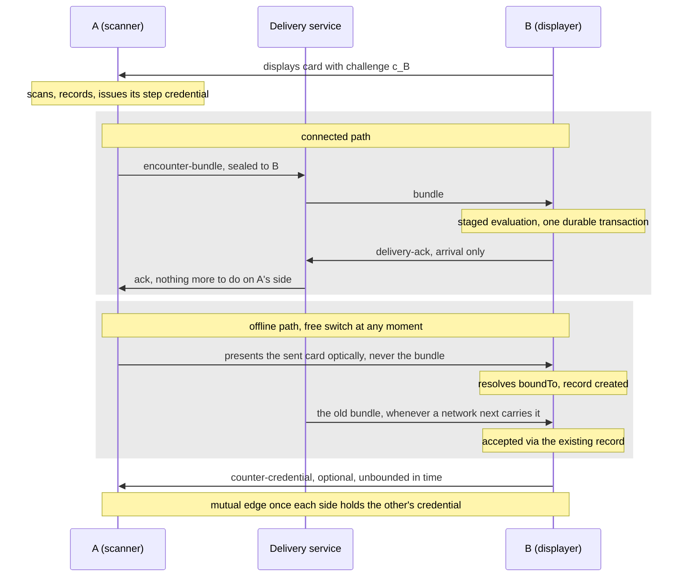

# RLTP Encounter Layer

**Real Life Trust Protocol — Layer 2: Encounter**

- **Status:** Editor's Draft
- **Version:** 0.30.0-draft
- **Editors:** Anton Tranelis
- **Date:** 2026-10-05
- **Vocabulary namespace:** `https://real-life.org/rltp/v1`
- **Conformance profile:** `rltp-encounter@0.30` (draft). Wire forms:
  `rltp-card/0.25`, `rltp-encounter-credential/0.25`, ceremony
  `encounter-scan@0.25`.
- **Companions:** RLTP Identity 0.51 (securing profile, 2.3); RLTP
  Delivery Contract 0.79 (normative reference, Section 11).
- **Supersedes:** version 0.29 (archived as
  `archive/encounter-layer-0.29.md`). Earlier versions: Appendix C.

## Abstract

This document specifies the Encounter layer of the Real Life Trust
Protocol: how two people establish, record, and maintain the fact that
they have met and recognized each other.

An encounter is performed as an **enactment** of a registered
**ceremony**, in which each party sees the other's fresh challenge and
deliberately confirms recognition. Each confirmation is a **step**
whose product is an **encounter credential**, immutable and issued to
the person it is about. Credentials between two anchors form an
**edge**, which may be one-sided or mutual; recognition is mutual when
both parties confirm, and one-sided outcomes are legitimate. Every
ceremony produces the same kind of credential; the one registered
ceremony has a connected path and an offline path, and the application
switches carriers — never ceremonies — as conditions change.
Relations that are not encounters exist as paths in the graph and are
computed rather than asserted.

Cryptography proves freshness and authorship; only a human can witness
a human. When a person's anchor changes, their edges follow through
witnessed succession, specified separately in *RLTP Succession*
(currently parked).

## Status of This Document

This is an Editor's Draft with no standing beyond its own argument.
Its rules and wire forms are stable enough to implement against and
are implemented in the reference library (Appendix A); the next
expected change is a wire step that moves the credential onto the
DTG registry context and adds registry-defined fields, leaving the
ceremony as it is. Open questions are listed in Section 16, and
feedback is welcome via the issues of the publication repository
(github.com/real-life-org/trust-protocol).

## 1. Introduction (informative)

### 1.1 Essence

> An encounter is a **protocolled act of recognition between people**,
> cryptographically bound to key control and freshness, whose cost is
> a real interaction and whose yield is a durable, immutable record
> between stable anchors — mutual when both confirm.

Three consequences shape this document:

1. **The protocol does not prove personhood.** It proves that a key
   was controlled and that an exchange was fresh. That a human is
   present, and that this human is the one they appear to be, is
   witnessed by another human. Because anchors are free to create,
   nothing in a credential proves that distinct anchors are distinct
   people; what the protocol makes expensive is forging an edge **to a
   specific, known anchor** (Section 13).
2. **An encounter is one thing.** An enactment establishes fresh
   recognition — mutual when both parties confirm; whatever ceremony
   it enacts, it produces the same kind of credential. Relations of
   other kinds are **paths and shared contexts derived from the
   graph**, computed rather than asserted.
3. **Recognition is not trust.** An encounter says "this person is
   real and I met them". It does not say "I trust them".

### 1.2 Position in the layer model

This layer consumes Layer-1 anchors and produces the edges that Layer
3 policies may reference and that applications display. It requires no
authority substrate. It uses the Delivery service through a port
(Section 11), whose message semantics are the **RLTP Delivery
Contract**; nothing in this layer depends on a transport, and the
ceremony's offline path depends on no connectivity at all.
Applications switch **carriers**, never ceremonies: the connected path
where connectivity exists, the optical path where it does not,
including mid-enactment and back again (5.8).

### 1.3 Design principles

*SRP:* this layer owns recognition and its record, nothing else.
*OCP:* ceremonies and channels are an open set extended by
registration. *LSP:* any enactment satisfying the contract in 5.2
produces an equivalent encounter credential — which is what makes
carrier switching free. *ISP:* consumers of an edge need not
understand the ceremony that produced it. *DIP:* the Delivery port is
defined by this layer's needs.

Three further principles govern this family. Each is stated here
informally; the rules that carry it are referenced.

- **Issuance counts, arrival does not — for delivery after an
  enactment.** The validity of a credential delivered after its
  enactment is a function of signed and locally recorded issuance-time
  data, never of when it arrived (RLTP-ENC-11030). A synchronous leg
  inside the enactment is permitted (RLTP-ENC-5030); real-time checks
  on that leg bound the enactment itself and do not touch this
  principle.
- **Clock tolerance never rejects, and the clock's resolution never
  decides.** Every time comparison widens its interval by
  `skew-tolerance` in the direction favorable to acceptance
  (RLTP-ENC-9040), a timestamp slightly in the local future is not a
  rejection cause within the tolerance (RLTP-ENC-9010), and every
  comparison of this layer is performed on whole seconds
  (RLTP-ENC-2170). The two halves do not pull against each other:
  because every parameter of Section 9 is a whole number of seconds,
  truncating both operands can only add accepted borderline cases and
  never withdraw one (2.3).
- **Every mechanism names its user action.** The user actions of this
  layer are exactly two: exchange cards (by scanning, one way or both
  ways), confirm recognition.

## 2. Conventions and Terminology

### 2.1 Requirement language

The key words "MUST", "MUST NOT", "REQUIRED", "SHALL", "SHALL NOT",
"SHOULD", "SHOULD NOT", "RECOMMENDED", "NOT RECOMMENDED", "MAY", and
"OPTIONAL" in this document are to be interpreted as described in
BCP 14 [RFC2119] [RFC8174] when, and only when, they appear in all
capitals, as shown here.

Every normative statement of this document is one numbered rule of
the form `RLTP-ENC-nnnn`. The leading digits of a rule number name
the section block it belongs to (2xxx for 2.3, 5xxx for Section 5,
10xxx for Sections 13 and 14, 13xxx for Section 15); the number is a
stable name, never reused, and gaps are left for insertions.
Paragraphs marked *Rationale* and *Editor's note*, the "In plain
terms" paragraphs, and the sections marked informative carry no
requirement.

### 2.2 Terms

Permanent identifiers are `https://real-life.org/rltp/v1#<Fragment>`.
The names are those of the RLTP term register (`terms/rltp.skos.jsonld`).

- **Anchor** — a Layer-1 identifier of a person toward one context
  (Identity 0.51); in this version a `did:key` (2.3).
- **Pair anchor** — an anchor derived for one enactment (Identity
  §6.1 `pair/` context; DTG scope `pairwise`). The enacting anchor
  of a ceremony is a pair anchor, fresh at every enactment (4.4).
- **Contact card** — a person's signed self-description carrying the
  verification material needed to recognize and reach them and, when
  used in an enactment, a fresh challenge; **displayed** (shown for
  scanning) or **sent** (transmitted inside an enactment, naming its
  recipient). Not a credential (Section 6).
- **Challenge** — a fresh, single-use, high-entropy value carried in a
  contact card for one enactment (5.3). One concept; displayed and sent
  cards differ only in lifecycle.
- **Ceremony** — a registered, versioned definition of an encounter
  interaction, including its time parameters (Sections 5, 9).
- **Enactment** — one performed run of a ceremony between two people,
  never reused; complete when both parties hold records (5.2).
- **Step** — one credential issuance within an enactment.
- **Enactment binding** — the digest, identical in both step
  credentials of an enactment, that ties them to one exchange
  descriptor (5.4).
- **Enactment record** — a party's durable local record of an
  enactment (5.5).
- **Encounter credential** — the immutable credential in which one
  party records that they recognized another (Section 7).
- **Credential digest** — the multibase-encoded multihash (2.3) over
  `JCS(document)` of the complete credential including its proof.
- **Bundle** — the one-scan transmission, specified as the Delivery
  Contract task `encounter-bundle` (its 4.1).
- **Edge** — the relation between two anchors constituted by the
  encounter credentials between them; **incoming**, **outgoing**, or
  **mutual** from a party's local view (4.2). One edge exists per
  anchor pair.

| Term | Fragment | | Term | Fragment |
|---|---|---|---|---|
| Anchor | `#Anchor` | | Enactment record | `#EnactmentRecord` |
| Pair anchor | `#PairAnchor` | | Encounter credential | `#EncounterCredential` |
| Contact card | `#ContactCard` | | Credential digest | `#CredentialDigest` |
| Challenge | `#Challenge` | | Bundle | `#Bundle` |
| Ceremony | `#Ceremony` | | Edge | `#Edge` |
| Enactment | `#Enactment` | | Incoming edge | `#IncomingEdge` |
| Step | `#Step` | | Outgoing edge | `#OutgoingEdge` |
| Enactment binding | `#EnactmentBinding` | | Mutual edge | `#MutualEdge` |

Referenced: **Credential** (W3C VC 2.0, RLTP-owned type per 7.1),
**Delivery port / RLTP Delivery Contract** *(services)*.

### 2.3 Securing profile (bound to Identity 0.51)

RLTP Identity 0.51 defines derivation, the label registry (including
the `pair/` contexts this layer enacts under), anchor form, and the
anchor–key binding rule this section applies. The rules below restate
the consumed surface; where they and Identity 0.51 disagree, Identity
governs. Method-agnosticism is a Layer-1 goal and is not claimed by
this document.

#### Anchors and keys

**RLTP-ENC-2010** — An anchor MUST be a `did:key` DID whose
method-specific identifier encodes an Ed25519 public key as `z6Mk`
followed by exactly 44 base58btc characters, verified without
resolution, registry, or directory.

**RLTP-ENC-2020** — A signature under an anchor MUST verify under key
material bound to that anchor by the Layer-1 binding rule (Identity
§8.4; for `did:key`, containment).

**RLTP-ENC-2030** — On parsing, a `z6Mk` value MUST decode to
multicodec `ed25519-pub` followed by 32 key bytes.

**RLTP-ENC-2040** — On parsing, a `z6LS` key-agreement Multikey MUST
decode to multicodec `x25519-pub` followed by 32 key bytes.

*Rationale.* A self-certifying anchor has no directory that could fail,
censor, or observe encounters, and it verifies offline. An artifact
naming anchor X but verifying only under unbound material is an anchor
substitution and is invalid whatever it carries. A value that matches
the pattern but decodes to another multicodec, or to the wrong number
of bytes, would otherwise pass as an Ed25519 or X25519 key; decoding
on parse closes that, whatever the string's length.

#### Proof suite

**RLTP-ENC-2050** — A credential and a card MUST carry an embedded
`DataIntegrityProof` with cryptosuite `eddsa-jcs-2022` [DI-EDDSA]
(canonicalization JCS [RFC8785], hash SHA-256, signature Ed25519)
whose `verificationMethod` is the anchor's `did:key` verification
method.

**RLTP-ENC-2060** — Proof creation and verification MUST follow the
W3C `eddsa-jcs-2022` procedure exactly, including its `@context`
rule: creation copies a present document `@context` into the proof
configuration and the returned proof, and verification reconstructs
the configuration from the embedded proof alone.

**RLTP-ENC-2070** — A credential's proof MUST carry the pinned
context array (2250).

**RLTP-ENC-2080** — A card's proof MUST NOT carry an `@context`.

**RLTP-ENC-2090** — A `proofValue` MUST be the character `z` followed
by 64 to 88 base58btc characters — 65 to 89 characters in total.

*Rationale.* One proof suite without RDF means every implementation
signs and verifies the same bytes; there is no canonicalization
dispute. A deviation from the W3C procedure makes RLTP proofs
unverifiable for standard verifiers: without the context copy in the
proof, such a verifier reconstructs a different proof configuration
and the signature fails. A card has no document context, so a copied
one would be invented. The `proofValue` bound is a property of the
encoding, not a chosen number: an Ed25519 signature is exactly 64
bytes [RFC8032]; 58⁸⁷ ≤ 2⁵¹² − 1 < 58⁸⁸, so the largest 64-byte value
needs 88 digits and none needs 89, and base58btc renders each leading
zero byte as one `1`, so the shortest encoding of 64 bytes is 64
characters. A string outside the interval is not the encoding of a
64-byte value and cannot be a signature; rejecting it at the format
check discards no signature that could have verified, and an
unbounded field would defeat the size guarantee of 7.5.

#### Digests

**RLTP-ENC-2100** — A producer MUST emit digest values as multibase
`u` (base64url without padding) over the multihash of a SHA-256
digest (`0x12 0x20` + 32 bytes), 46 characters after the header.

**RLTP-ENC-2110** — A verifier MUST accept digest values with
multibase header `u` and with header `z`.

**RLTP-ENC-2120** — A verifier MUST check the decoded multihash
algorithm and length when parsing a digest value.

**RLTP-ENC-2130** — Digest equality — every digest equality this
profile or a companion requires — MUST be evaluated over the
validated, decoded multihash bytes, never over the encoded strings.

**RLTP-ENC-2140** — Digest canonicalization MUST apply to comparison
only; signed JSON MUST NOT be rewritten before JCS or proof
verification.

*Rationale.* The digest form is W3C VCDM `digestMultibase` and CID
1.0, so one verifier serves RLTP and DTGWG artifacts alike; a `z`
rendering of a genuine artifact must not be rejected. A digest with a
foreign algorithm or length would otherwise be compared as if it were
SHA-256. A string comparison treats the `u` and `z` renderings of the
same digest as different, which breaks binding recomputation and the
uniqueness check. Rewriting signed bytes before JCS breaks every
proof.

#### Timestamps

**RLTP-ENC-2150** — Every timestamp MUST be an [RFC3339] date-time in
UTC with `Z`, seconds `00`–`59`, and at most three fractional-second
digits — at most 24 characters.

**RLTP-ENC-2160** — An implementation MUST reject a calendar-invalid
date when parsing a timestamp.

**RLTP-ENC-2170** — Every time comparison of this layer MUST be
performed at whole-second granularity.

**RLTP-ENC-2180** — Before every Encounter comparison — every
comparison this document requires, and every comparison a companion
document delegates to this one — each operand MUST be normalized to
whole seconds: every timestamp read from an artifact (`validFrom`,
`proof.created`, a card's `challenge.issuedAt`), every timestamp read
from local state (a record's or a held value's `t_ch`), and the
locally read `now`.

**RLTP-ENC-2190** — An implementation MUST NOT perform an Encounter
comparison whose two sides are normalized differently.

**RLTP-ENC-2200** — The whole-second rule governs Encounter
comparisons only; a time window a companion defines with its own
parameter and its own interval is governed by that companion.

**RLTP-ENC-2210** — Normalization MUST truncate toward the past: the
fractional part is deleted, never rounded.

**RLTP-ENC-2220** — A producer SHOULD emit timestamps in whole
seconds.

**RLTP-ENC-2230** — Timestamp normalization MUST apply to comparison
only; the bytes canonicalized, hashed, signed, verified, and digested
are the artifact's own.

**RLTP-ENC-2240** — A producer holding a timestamp with more than
three fractional-second digits MUST truncate it.

*Rationale.* Schemas enforce the timestamp syntax by pattern, but a
pattern admits 31 February; implementations would otherwise normalize
such dates differently. Without the whole-second rule the verdict of
a gate would depend on the resolution of the verifier's clock or on a
fraction chosen by whoever wrote the timestamp, and the aging latch
(5.3) would be deterministic only per implementation. The rule
reaches every comparison of the record gate, the challenge
resolution, the aging latch and the issuance window wherever they are
performed — when the Delivery Contract's staged evaluation resolves a
challenge or evaluates the issuance window, it performs this
document's comparisons — and it stops at a companion's own windows
(the Membership Tasks' invite validity under `membership-skew`, the
Access Layer's service views, duty slots, provisional window and
retention bounds), which are not computed from Section 9. Half
normalization recreates exactly the fraction dependency the rule
removes. Truncation is a lexical operation on the wire form — delete
the `.` and everything between it and the `Z` — so it needs no
arithmetic and no agreed rounding mode; it is the same operation an
over-precise producer performs, so producer truncation and verifier
normalization compose to one instant; and on whole-second values it
is the identity. Truncation cannot narrow acceptance: for a
whole-second offset `S`, `t ≤ now + S` implies `⌊t⌋ ≤ ⌊now⌋ + S`,
since `⌊t⌋ ≤ t` and `⌊now + S⌋ = ⌊now⌋ + S`, and every offset of this
document is whole-second (Section 9); so truncation can accept a
borderline case an exact comparison would refuse, never the reverse.
Rounding to the nearest second would also have been deterministic
and monotone; truncation is preferred because it is already imposed on the
producing side. Normalizing before JCS breaks every proof
(`ERR_SIG`). The three-digit bound is byte economy: an unbounded
fraction is an unbounded field in a size-capped artifact (7.5);
three digits are what common ISO 8601 serializers emit unaided, and
nine would buy precision no rule reads. Whole seconds are the
canonical form in which one instant has exactly one serialization
and hence one digest.

#### Contexts

**RLTP-ENC-2250** — A credential's `@context` MUST be exactly
`["https://www.w3.org/ns/credentials/v2",
"https://firstperson.network/credentials/dtg/v1",
"https://real-life.org/rltp/v1"]`, in order, with no additions.

**RLTP-ENC-2260** — The DTG context MUST be present as the second
pinned context.

**RLTP-ENC-2270** — An implementation MUST NOT apply RDF or JSON-LD
expansion.

**RLTP-ENC-2280** — A receiver MUST reject a document with any other
context set at the format check.

*Rationale.* Term meaning comes from this specification and the
published RLTP context document (`contexts/rltp-v1.jsonld`, a
normative deliverable), never from JSON-LD processing at runtime;
verification is JSON Schema plus the rules of this document. Runtime
expansion fetches contexts over the network and makes meaning depend
on it; an injected context would redefine terms. Without the DTG
context the credential is not a DTG RelationshipCredential (7.1).

*Editor's note.* The DTG context IRI is pinned at its WD01 value.
The next wire step moves it to the DTG registry context; the pin
changes with that step, not before.

## 3. What an Encounter Establishes

*In plain terms.* Two people exchanged fresh codes — by one scan or
by two — and whoever issues a credential first pressed "yes, I
recognize this person". That proves that the issuer's key was in the
right hands at that moment and that a human decided; when both issue,
it proves that for both. It does not prove that they stood in the
same room, that they are who their names say, or that either trusts
the other.

An encounter establishes exactly four things:

| Established | By |
|---|---|
| **Key control** — the issuer controlled their anchor's key | proof (2.3) |
| **Freshness** — the exchange happened within one enactment | challenge binding (5.3) |
| **Deliberate recognition** — a human decided to confirm | the confirmation step (5.2, C4) |
| **A durable record** — the fact survives the moment | the encounter credential (Section 7) |

**RLTP-ENC-3010** — An implementation MUST NOT present an encounter
as establishing more than key control, freshness, deliberate
recognition, and a durable record.

*Rationale.* An encounter does not establish physical presence,
personhood, identity of a name to a legal person, or trust; a user
who reads it as a presence, person, or trust proof is misled.
Freshness and recognition are established toward the participants;
what a third party can later verify is strictly less (Section 8).

## 4. Anchors, Credentials, Edges

*In plain terms.* Each confirmation produces one credential, issued
by one person about the other. The credentials between two anchors
make up one edge, however often the two met. Only what others say
about you counts for you. And every meeting runs under a brand-new
identifier, so a displayed code never reveals an existing
relationship to whoever scans it.

### 4.1 The atom is the encounter credential

An encounter credential is issued by one party about another. It is
complete on its own and is delivered to its subject, who holds it
(7.4). Holding does not confer authority.

**RLTP-ENC-4005** — The issuer MUST retain a copy of each encounter
credential it issues.

*Rationale.* The issuer's `issued` state (4.2) and the receiver
principle (7.4) both rest on the issuer holding what it issued:
without the copy the issuer could not show its own side of the edge,
and the statement that the subject gets no control over the issuer's
copy would describe nothing. Holders therefore include the issuer
(Section 14).

### 4.2 The edge is the relation, and it is per anchor pair

An edge between anchors A and B is constituted by the encounter
credentials that exist between them. A party's view of an edge is
local.

**RLTP-ENC-4010** — An implementation MUST model, per counterparty
and direction, the states **recorded** (an enactment record exists),
**issued** (own step credential issued), and **received**
(counterparty credential accepted under 5.6).

**RLTP-ENC-4020** — An implementation MUST classify an edge, from its
local view, as **outgoing** when it has issued and not received,
**incoming** when it has received and not issued, and **mutual** only
when, for at least one enactment, it has both issued and received.

**RLTP-ENC-4030** — An implementation MUST hold exactly one edge per
anchor pair, whatever the number of enactments between the two
anchors.

**RLTP-ENC-4040** — An implementation MUST attach every valid
credential between the same two anchors to that one edge, including a
late counter-credential to an earlier enactment, accepted under 5.6
against that enactment's record.

**RLTP-ENC-4050** — Counting and Layer-3 evaluation MUST count edges,
never enactments or credentials.

**RLTP-ENC-4060** — Counting MUST consider only incoming credentials
or mutual edges.

**RLTP-ENC-4070** — An outgoing credential MUST NOT count toward its
issuer's own standing.

**RLTP-ENC-4080** — A Layer-3 policy that counts edges MUST state
that a count is meaningful only relative to anchors the evaluator
already has reason to care about.

*Rationale.* Mutuality is held, never inferred: without separate
states a `sentTo` card would be read as recognition. Parallel
enactments arise legitimately — from a `gate-expired` fresh enactment
or from the simultaneous-scan race (5.8 step 5) — and a late
counter-credential must neither be lost nor open a second edge;
without the merge rule, repeated enactments with the same person
would inflate counts. An outgoing credential is evidence about the
other party and no evidence about its issuer, so counting it would be
self-promotion. Anchors are free to create, so edges between unknown
anchors are free to manufacture (Sybil); a count is only meaningful
against anchors already known to the evaluator.

### 4.3 Anchor scope

This version requires `did:key` anchors (2.3). A counterparty using
any conforming client is verifiable offline, from the card alone.
Interoperating with other DID methods is a Layer-1 concern (Identity
§8.3, the waist rule); this document makes no method-agnosticism
claim of its own.

### 4.4 The enacting anchor: fresh always (normative)

**RLTP-ENC-4090** — The rules of this section MUST be applied to
cards used in an enactment and to encounter credentials; card uses
defined by other layers (Membership's and Access's member-anchor-bound
founder, invite, accept and key-request cards; DTG scope `directed`)
are governed by those layers and their frozen schemas (Section 12).

**RLTP-ENC-4100** — The anchor a party enacts under — card `anchor`,
credential `issuer`, credential `credentialSubject.id` — MUST be a
freshly derived pair anchor (Identity §6.1: fresh 32-byte nonce), in
every enactment, first contact and re-encounter alike.

**RLTP-ENC-4110** — The pair context's label MUST be recorded in the
label register before the card is displayed or sent.

**RLTP-ENC-4120** — Relationship continuity MUST be established after
the ceremony, by the visibility layer's continuity probe and
continuity mapping over the fresh enactment channel
(`rltp-visibility` §6a), never inside the ceremony.

**RLTP-ENC-4130** — A party MUST NOT enact under a group anchor, its
community anchor included.

**RLTP-ENC-4140** — A party MUST NOT enact under a persona anchor
(DTG scope `public`).

**RLTP-ENC-4150** — A party MUST NOT enact under any previously used
pair anchor.

*Rationale.* A standing anchor on the ceremony wire reveals an
existing relationship to a wrong scanner and correlates enactments;
with a fresh anchor a party never needs to know who will scan before
displaying — the displayed anchor is always new and discloses
nothing. A crash between display and registration would leave an
anchor whose key can no longer be derived, orphaning the label. Only
a counterpart that actually holds the prior relationship can match
the continuity probe; on a match the new pair tuple is chained to the
relationship and the prior tuple is deactivated — one relationship,
one active tuple, a chained history of enactments, with evidence
accumulating on the relationship through its chain as a holder-local
notion invisible to third parties (Section 8). A group or community
anchor is standing and shared, so an edge would hang on a group
instead of a person; a persona anchor is public and stable, so every
encounter under it would be attributable to collectors (Section 14);
a reused pair anchor links two enactments. A received artifact naming
such an anchor is not detectably invalid — the receiver cannot
distinguish anchor classes, which is the point — but issuing it is
nonconformant. What a pair anchor means beyond this ceremony is the
visibility layer's contract. Re-recognition after data loss follows
Identity §9.3: relationships are re-created, not recovered — a party
that cannot answer the continuity probe is, protocol-wise, a new
relationship.

## 5. Ceremonies and Enactments

*In plain terms.* One registered ceremony: B shows a code, A scans
it, A confirms and sends B a card and a credential — over the network
if there is one, otherwise by showing a second code that B scans. B
may confirm back, whenever. Every code is a single-use challenge with
a short lifetime: a card that reaches B after B's own challenge has
aged out creates no record, whichever way it travelled. Each side
keeps a record of what it saw before it issues anything, and a
credential is accepted only against such a record. Once the records
exist, a credential may arrive at any later time; its validity never
depends on when it arrived.

### 5.1 Registered ceremonies

Ceremonies are an open set. This version registers one ceremony,
`encounter-scan@0.25` (5.8), whose connected and offline paths carry
the same enactment material on different legs.

**RLTP-ENC-5010** — A ceremony registration MUST pin the ceremony's
time parameters (Section 9).

**RLTP-ENC-5020** — An implementation MUST NOT vary a registered
ceremony's parameters per deployment.

**RLTP-ENC-5030** — A ceremony MAY include a synchronous leg inside
the enactment.

**RLTP-ENC-5040** — An enactment MAY be two-phase, completing when
both parties hold enactment records.

*Rationale.* Two conforming parties evaluating the same credential
under the same registered ceremony reach the same verdict;
deployment-local parameters would let two verifiers judge the same
credential differently. Real-time checks on a synchronous leg bound
the enactment itself and never the validity of a credential delivered
afterwards. On the one-scan and offline path the second record is
created at receipt; completion is about the exchange, recognition
remains per step.

### 5.2 The enactment contract

**RLTP-ENC-5050** — An implementation MUST treat an interaction as an
enactment of an encounter ceremony if and only if it establishes all
of C1 to C5:

- **C1 Material exchange.** Each party obtains the other's contact
  card, each card carrying a fresh challenge — by scanning a displayed
  card, or by receiving a sent card.
- **C2 Freshness, enforced by the generator.** Each challenge is
  single-use and fresh at enactment time.
- **C3 Binding.** Each step credential binds the challenge of its
  subject and the enactment binding (5.4).
- **C4 Deliberate confirmation.** Before issuing, a human confirms
  recognition.
- **C5 Enactment record.** Each party durably records the enactment
  (5.5) before issuing. In a two-phase ceremony the enactment
  completes when the second record exists (5.8); one-sided outcomes
  are legitimate.

**RLTP-ENC-5060** — Each party MUST enforce freshness and single use
for its own challenge.

**RLTP-ENC-5070** — A party MAY accept the counterparty's challenge
without verifying its age.

**RLTP-ENC-5080** — An implementation MUST NOT issue an encounter
credential automatically.

**RLTP-ENC-5090** — An interaction that does not establish C1 to C5
MUST NOT produce a credential under this specification.

*Rationale.* The contract is what makes every ceremony produce the
same credential, so carriers are interchangeable. Only the generator
of a challenge holds the state that decides freshness and single use;
the counterparty's challenge age is unverifiable without the
counterparty's state and clock. C4 is the security boundary of this
layer: automating it removes the only thing the layer secures.
Interactions that establish something else — possession of a phone
number, control of a domain — would otherwise be counted as
encounters.

### 5.3 Challenges

**RLTP-ENC-5100** — A challenge MUST be a string of 22 to 88
characters of the base64url alphabet without padding.

**RLTP-ENC-5110** — A challenge MUST carry at least 128 bits of
cryptographically random material.

**RLTP-ENC-5120** — A producer SHOULD emit challenges of exactly 22
characters.

**RLTP-ENC-5130** — A challenge MUST travel in a contact card together
with its issuance time and MUST be generated by the party it
protects.

**RLTP-ENC-5140** — The owner of a displayed card MUST rotate its
challenge and MUST enforce single use across scans.

**RLTP-ENC-5150** — A sent card's challenge MUST be generated at the
moment of sending and dedicated to that one enactment.

**RLTP-ENC-5160** — A displayed card's challenge MUST NOT be reused as
a sent card's challenge.

**RLTP-ENC-5170** — A challenge value present in any enactment record
MUST NOT be accepted in a new enactment.

*Rationale.* A guessable challenge allows targeted forgery of an edge
to a specific anchor; UUID v4 carries 122 bits and is non-conformant.
22 characters are the shortest encoding of 128 bits (22 × 6 = 132),
and the upper bound keeps the field finite (7.5). The issuance time
carries the age bound and the issuance window (5.6 step 6). Two
scanners must not bind the same displayed challenge (the challenge
race, Section 13); a sent card's challenge must not be replayable
into another enactment; a publicly displayed value reused in a sent
card would not be dedicated to one enactment, and the two challenges
of the binding would coincide. A consumed value accepted again is a
replay.

#### The own-challenge state model

**RLTP-ENC-5180** — An implementation MUST hold every challenge value,
by its own state, in exactly one of three states: `open`,
`recorded`, `unknown`.

**RLTP-ENC-5190** — An implementation MUST treat a value as `open`
only while it was issued by this party (displayed, or sent in an
enactment awaiting its record), is held with its issuance time
`t_ch`, is not superseded by a record, and satisfies
`now ≤ t_ch + challenge-max-age + skew-tolerance` with `now` and
`t_ch` normalized to whole seconds (2.3) before the parameters are
added.

**RLTP-ENC-5200** — A party MUST retain every issued challenge value
with its issuance time until it is recorded or ages past the bound;
rotation changes which value is displayed, never the retention of
previously issued values.

**RLTP-ENC-5210** — A party MAY physically discard aged-out values.

**RLTP-ENC-5220** — Record creation MUST supersede the open entry
atomically: the transition `open → recorded` happens inside the
record's transaction, within the serialization point.

**RLTP-ENC-5230** — An implementation MUST NOT keep challenge history
beyond open values and enactment records.

**RLTP-ENC-5240** — Resolution MUST map a bound challenge value to a
state by this precedence: `recorded` if a surviving enactment record
holds it as own challenge; otherwise `open` if a retained issued value
is within the age bound; otherwise `unknown`.

**RLTP-ENC-5250** — Resolution MUST be total and deterministic and
MUST write nothing except the aging latch.

**RLTP-ENC-5260** — Every resolution — provisional or authoritative —
that finds a held value past the age bound MUST mark it `aged` before
returning `unknown`.

**RLTP-ENC-5270** — The aged mark MUST be atomic per value and
set-only; an aged value MUST NOT resolve `open` again, whatever the
clock later says.

**RLTP-ENC-5280** — A provisional `unknown` MUST NOT finalize a
rejection; the evaluation proceeds to the lock, where the
authoritative resolution decides.

**RLTP-ENC-5290** — The transitions of a challenge value MUST be
exactly: issuance → `open`; `open → recorded` (record creation,
atomic, in-lock); `open → unknown` (the aging latch only, never early
discard); `recorded → unknown` (record deleted with its relation);
and none out of `unknown`.

**RLTP-ENC-5300** — A resolution performed outside the record-key
serialization point (5.5, Delivery Contract 6.2) MUST be treated as
provisional; the resolution performed inside it is authoritative and
selects the branch taken (Contract 4.1).

**RLTP-ENC-5310** — Every consumer of a bound challenge — bundle
evaluation, optical input, credential acceptance — MUST go through
resolution.

**RLTP-ENC-5320** — A step credential MUST bind the challenge of its
subject in this enactment.

*Rationale.* Exclusivity of the states is guaranteed by the precedence
of the resolution algorithm, not by disjoint predicates: a freshly
recorded value whose open entry has not yet been discarded resolves
`recorded`, so no observer resolves the same value both ways. The age
bound falls on the same second in every implementation. Discarding a
rotated value early would fail a legitimate late scan of a rotated
card; expiry is structural (an aged value is no longer open) and
cannot be forgotten, while the future side remains an explicit check
at record creation (5.5). The three causes of `unknown` — never
issued, aged out, recorded once but deleted with its relation — are
indistinguishable by design, so no data pile accumulates. Resolution
must consume nothing, or garbage could burn a challenge. A
backward-moving clock could otherwise resurrect an aged value; the
latch stands from the first observation, wherever it was made, the
authoritative resolution observes every previously written latch, and
because the mark is set-only, concurrent unserialized writers can
only agree, so the latch needs no lock. Whether an aged value is
physically retained after the latch is unobservable. A rejection
finalized outside the authoritative resolution races a concurrent
record. Without a state model, "the displayed challenge" is ambiguous
whenever challenges rotate — several issued values are live at once —
so every consumer resolves instead. Binding the subject's
challenge keeps acceptance checkable against the subject's own record
however late the credential is delivered (5.6).

### 5.4 The enactment binding

**RLTP-ENC-5330** — Both step credentials of an enactment MUST carry
the same enactment binding, constructed as

```
binding = multibase( multihash( SHA-256( JCS( {
    "ceremony":   <ceremony identifier and version>,
    "challenges": [ <value_1>, <value_2> ]   // ascending lexicographic
  } ) ) ) )                                  // emit u, accept u/z (2.3)
```

**RLTP-ENC-5340** — Implementations and documentation MUST NOT claim
that the enactment binding hides the relation between the two
credentials.

*Rationale.* Both sides compute the same descriptor independently of
their role. For the participants, whose records tie the values to a
live exchange, the binding proves one enactment; for a third party it
proves consistency, not occurrence (Section 8). The two credentials
of an enactment name the two anchors in plaintext, so anyone holding
both can correlate them from the anchors alone; a claim to the
contrary would be a false privacy promise.

### 5.5 The enactment record

**RLTP-ENC-5350** — Before issuing, a party MUST durably record: the
ceremony identifier and version; the counterparty anchor and its card
as received; both challenge values and the issuance time of the
party's own challenge (`t_ch`); the computed enactment binding; and
the local time of the enactment.

**RLTP-ENC-5360** — Enactment records MUST be retained for the life
of the relation.

**RLTP-ENC-5370** — An implementation MUST treat the enactment
records as the consumed-challenge history; no separate history
exists.

**RLTP-ENC-5380** — A record MUST be created only for an own
challenge that resolves `open`.

**RLTP-ENC-5390** — A record MUST be created only if
`t_ch ≤ now + skew-tolerance` by the creating party's own clock, both
operands normalized to whole seconds (2.3); a value failing this check
is refused with the named outcome `gate-future`, on every leg.

**RLTP-ENC-5400** — The scanner MUST apply the record gate at scan
time and the receiver at receipt of the sent card, whichever carrier
brought it (5.8).

**RLTP-ENC-5410** — An implementation MUST create at most one record
per own-challenge value; repeated or concurrent triggers with the same
material — a redelivered bundle (Delivery Contract 6.2), a re-scanned
optical card, or one of each — converge on one record.

**RLTP-ENC-5420** — Every trigger for the same own-challenge value
MUST pass through the record-key serialization point of the Delivery
Contract (its 6.2), one namespace and lifetime for bundles and
optical inputs alike.

**RLTP-ENC-5430** — An optical input whose own challenge resolves
`recorded` with a JCS-identical counterparty card MUST be treated as
an idempotent no-op.

**RLTP-ENC-5440** — An optical input whose own challenge resolves
`recorded` with a card from a different counterparty MUST be refused;
the challenge is consumed.

**RLTP-ENC-5450** — An optical input whose own challenge resolves
`recorded` with the same counterparty but different material MUST be
refused as invalid.

**RLTP-ENC-5460** — An optical input whose `boundTo` resolves
`unknown` MUST create nothing and MUST be refused at the
serialization point with the outcome `gate-expired`.

*Rationale.* Without a record no credential can be accepted, which is
what defeats backdating and a pocketed card (Section 13); records
outlive delivery, which is unbounded, and they are the one source of
single use. The expiry side of the gate is structural; the future
side catches a pre-dated challenge. The gate applies on both legs,
carrier-independent. A redelivered bundle, a re-scan, or both at once
would otherwise create two records, and concurrent triggers on
different carriers would not see each other unless they share the
serialization point, where the authoritative resolution is performed.
An optical input on a recorded challenge meets the same taxonomy a
bundle meets (Contract 4.1): a re-scan of the same card changes
nothing, a second person on the same displayed challenge finds it
consumed, and swapped material after the record is invalid. The
`unknown` refusal is produced at the serialization point, where the
authoritative resolution latches any held aged value first (5.3), and
is honest in both of its indistinguishable causes — aged out, or
never this device's. No second record arises in any of these cases.

### 5.6 Acceptance

**RLTP-ENC-5470** — On receiving a credential claiming to be an
encounter credential about the local anchor, an implementation MUST
evaluate steps 1 to 8 in order.

**RLTP-ENC-5480** — Step 1, format: the document MUST validate against
`schemas/encounter-credential-0.25.schema.json`, its
`credentialSubject.format`, ceremony, and ceremony version MUST be
known, its timestamps MUST parse calendar-valid, and its keys MUST
decode per 2.3; else reject `ERR_VERSION`.

**RLTP-ENC-5490** — Step 2, signature: the `DataIntegrityProof` MUST
verify under the key bound to the issuer anchor (2.3); else reject
`ERR_SIG`.

**RLTP-ENC-5500** — Step 3, addressee: `credentialSubject.id` MUST be
the local anchor; else reject `ERR_ADDRESSEE`.

**RLTP-ENC-5510** — Step 4, record: exactly one enactment record MUST
exist whose own challenge equals the credential's bound challenge and
whose counterparty anchor equals the credential's issuer; else reject
`ERR_NO_RECORD`.

**RLTP-ENC-5520** — Step 5, ceremony: the credential's ceremony MUST
equal the record's ceremony; else reject `ERR_CEREMONY`.

**RLTP-ENC-5530** — Step 6, issuance window: with `t_ch` from the
record, both `validFrom` and `proof.created` MUST lie in the closed
interval `[t_ch − skew-tolerance, t_ch + challenge-max-age +
issuance-window + skew-tolerance]`; else reject
`ERR_STALE_ISSUANCE`.

**RLTP-ENC-5540** — Step 6, order: `proof.created` MUST NOT be earlier
than `validFrom − skew-tolerance`; else reject `ERR_STALE_ISSUANCE`.

**RLTP-ENC-5550** — Step 6 MUST compare whole-second operands —
`validFrom`, `proof.created`, `t_ch`, and hence both endpoints
normalized per 2.3 — with inclusive endpoints.

**RLTP-ENC-5560** — Step 7, binding: the enactment binding MUST
recompute from the record per 5.4; else reject `ERR_BINDING`.

**RLTP-ENC-5570** — Step 8, uniqueness: if a credential has already
been accepted for this record and direction, a credential with an
equal credential digest MUST be accepted idempotently and any other
credential — including a re-proofed copy — MUST be rejected
`ERR_CONFLICT`.

**RLTP-ENC-5580** — A credential failing any check MUST NOT be
counted as an encounter.

**RLTP-ENC-5590** — A credential failing any check MUST NOT satisfy a
Layer-3 encounter predicate.

*Rationale.* A fixed order yields a deterministic error code for every
state (Section 15). Step 1 catches an unknown version, foreign fields,
and oversize (7.5); step 2 forgery and tampering; step 3 a credential
slipped in from another relationship; step 4 participation without an
encounter and backdating (5.5 guarantees at most one record); step 5 a
credential evaluated under foreign time parameters; step 6 back- and
pre-dating of the credential and a proof created before the claimed
issuance; step 7 a credential hung on a different exchange; step 8 a
re-signed copy presented as a second credential (equivocation, double
counting) while retries stay safe. A millisecond on either side of an
inclusive endpoint is not a discriminator, and skew always widens. A
credential failing any check is not an encounter credential; counting
it or satisfying a policy with it would reward an invalid artifact.

### 5.7 The channel is informative

**RLTP-ENC-5600** — An implementation MUST treat the channel and its
properties (in person, video, near-field) as informative metadata
carrying no normative weight.

*Rationale.* Channel properties are not verifiable: a channel can be
relayed (Section 13). The one-scan transmission rules are enactment
mechanics specified in the Delivery Contract: confidentiality to the
receiver via the sealed envelope, authenticity from the signed
material inside.

### 5.8 The registered ceremony of this version

**`encounter-scan@0.25`** — the one ceremony of this version. It has
a **connected path** and an **offline path**, which carry the same
enactment material on different legs: the connected path delivers the
**bundle** (card + credential) through the Delivery service; the
offline path presents the **sent card alone** as a ceremony-level
optical input. What varies is never the ceremony — only the carrier
of the enactment material.

The ceremony, as a picture (informative — the normative rules follow):



**RLTP-ENC-5610** — Switching between the connected path and the
offline path MUST be possible in both directions at any moment, and a
switch MUST NOT start a second enactment.

#### Common trunk

1. B displays a card with challenge `c_B`.
2. A scans it and generates a sent card.
3. A applies the record gate, records, confirms, issues, and hands the
   bundle to the Delivery service. The enactment completes when B
   holds a record; how A's material reaches B is the carrier's
   business.

**RLTP-ENC-5620** — The scanner's sent card MUST carry a fresh
challenge `c_A` created at that moment, `sentTo` = the displayer's
anchor, and `boundTo` = `c_B` (Section 6).

**RLTP-ENC-5630** — The scanner MUST, in this order: apply the record
gate on `c_A`, record (5.5), confirm (C4), issue its step credential
binding `c_B` and the binding over `{c_B, c_A}`, and hand the
`encounter-bundle` task (sent card + credential) to the Delivery
service.

*Rationale.* `boundTo` tells B's device which of its own challenges
this enactment answers, and `sentTo` makes the card non-redirectable.
The record precedes issuance (C5) and the human confirmation precedes
issuance (C4).

#### Connected path

The bundle travels as the Delivery Contract task, sealed to B's
key-agreement key. The Contract's staged evaluation governs B's
processing.

**RLTP-ENC-5640** — On the connected path, an implementation MUST NOT
consume `c_B` before the bundle's credential has passed the complete pre-lock
acceptance set (Contract 4.1: format, signatures, addressee, ceremony,
binding recomputation, and the issuance window with `t_ch` from
`c_B`'s resolution — `open` here, 5.3).

**RLTP-ENC-5650** — Inside the lock-set critical section of Contract
6.2, `c_B` MUST be re-resolved authoritatively, and on `open` the
record-creating effect MUST be selected: the future check
(`gate-future`), then one durable transaction writing the record, the
accepted credential with direction and digest, and the retained
proof-carrying `delivery-ack`.

**RLTP-ENC-5660** — After that transaction, an implementation MUST NOT
fail the credential by any later check.

*Rationale.* Validate, then consume: a garbage bundle must not burn a
displayed challenge (Section 13). A crash between the record and the
accepted credential would leave half-written state. Withdrawing an
acceptance that has already been acknowledged would make the sender's
status a lie.

#### Offline path

**RLTP-ENC-5670** — The scanner's device MAY present the sent card
itself optically at any moment after step 3.

**RLTP-ENC-5680** — Optical presentation MUST NOT be gated on a
timer, and conformance MUST NOT depend on when the switch happens.

**RLTP-ENC-5690** — `ack-wait` (Delivery Contract §7) is the
RECOMMENDED automatic trigger for the optical switch.

**RLTP-ENC-5700** — The optical leg MUST carry enactment material
only, never credentials.

**RLTP-ENC-5710** — The displayer MUST validate a presented sent card
(proof under its anchor, version, `sentTo` = own anchor) and then
resolve its `boundTo` (5.3): `open` → future check → record creation
under the serialization rule of 5.5; `recorded` → the taxonomy of 5.5;
`unknown` → refused, the `gate-expired` outcome.

**RLTP-ENC-5720** — After an optical record, the displayer MUST hold
its view of the edge as outgoing at most until the scanner's
credential is accepted.

**RLTP-ENC-5730** — A bundle accepted via an existing record MUST
enclose a card JCS-identical to the record's stored counterparty
card.

**RLTP-ENC-5740** — A bundle arriving after an optical record MUST be
accepted via that record (Contract 4.1 record-aware effect, selected
inside the challenge-keyed critical section of Contract 6.2): the
binding verified against the record, the credential passing
acceptance (5.6), effect = credential acceptance and acknowledgement —
no second gate, no second record, no consumed-challenge conflict.

*Rationale.* An encounter must remain possible without a network, and
no verdict may depend on a race between carriers. The sent card is
card-sized and scannable where a sealed bundle is not; credentials
belong to the delivery layer, whose time is unbounded. A foreign-
addressed or tampered card must not create a record. Mutuality is
held, never inferred (4.2): a `sentTo` card suggests recognition, only
the credential proves it. The optical leg is idempotent per own
challenge — a re-scan or a racing bundle converges on the one record —
and a bundle whose card differs from the stored one would be a card
swap between legs; a legitimate bundle arriving after the optical leg
must not be refused as a consumed challenge.

#### Counter-step and path switching

4. B may confirm and issue the counter-step.
5. Path switching and merge.

**RLTP-ENC-5750** — The displayer MAY confirm (C4) and issue the
counter-step credential binding `c_A`, unbounded in time, over any
carrier.

**RLTP-ENC-5760** — The counter-step MUST be delivered as task
`encounter-credential-delivery` (step `counter`), continuing the
bundle's `threadId` (Contract 4.3).

**RLTP-ENC-5770** — Where the displayer's record arose on the optical
leg before the bundle arrived, the displayer MAY issue and durably
hold its credential at once.

**RLTP-ENC-5780** — The counter-step's delivery document MUST be
produced only after the bundle has landed and been accepted via the
record; the counter-step MUST NOT open a thread of its own.

**RLTP-ENC-5790** — Receipt of the counter-credential or of the
acknowledgement MUST cancel any pending automatic switch.

**RLTP-ENC-5800** — A fresh enactment MUST be started only when the
optical leg's `boundTo` no longer resolves (`gate-expired`).

*Rationale.* One-sided outcomes are legitimate, so confirmation stays
a free decision and need not wait for the network; mutuality depends
on the bundle either way, so deferring the delivery document defers
nothing that could otherwise complete. The counter-step in a foreign
or fresh thread would break thread continuity. The scanner accepts
the counter-credential under 5.6 with `t_ch` = `c_A`'s issuance time.
The acknowledgement is a delivery signal, never acceptance (7.4), and
a switch after a completed delivery is superfluous. Switching is safe
because each leg is idempotent at its own level: record creation is
unique per own challenge (5.5), delivery of the bundle document is
idempotent per document digest (`duplicate-known` with byte-identical
re-ack, Contract 6.2), and the two levels meet only inside the
lock-set critical section, where the authoritative resolution selects
the branch. A fresh enactment is the last resort, and the merge rule
(4.2) keeps even that at one edge per anchor pair, as it does for the
simultaneous-scan race where both parties scan each other's displayed
cards and two enactments arise. Neither path requires a third party;
the connected path requires transient connectivity for both ends, the
offline path none. Until the counter-issuance the edge is one-sided —
a legitimate outcome.

## 6. The Contact Card

*In plain terms.* A card is what you show or send so that the other
side can recognize and reach you: your anchor, your encryption key,
a one-time challenge, optionally a name and how to reach you. A sent
card additionally says whom it is for and which displayed challenge
it answers. It is a self-description, not a credential.

A contact card is a person's self-description — explicitly not a
credential.

**RLTP-ENC-6010** — A card MUST validate against
`schemas/contact-card-0.25.schema.json`.

**RLTP-ENC-6020** — A card MUST carry a format version, the anchor, a
key-agreement key (Multikey, decoded-verified, 2.3), a challenge with
its issuance time whenever the card is used in an enactment, and a
`DataIntegrityProof` per 2.3 verifying under the anchor.

**RLTP-ENC-6030** — A receiver MUST reject a sent card without
`sentTo`.

**RLTP-ENC-6040** — A receiver MUST reject a sent card without
`boundTo`.

**RLTP-ENC-6050** — A receiver MUST reject a sent card whose `sentTo`
is not its own anchor.

**RLTP-ENC-6060** — A receiver MUST reject a bundle whose card's
`boundTo` differs from the enclosed credential's bound challenge.

**RLTP-ENC-6070** — A displayed card MUST NOT carry `sentTo` or
`boundTo`.

**RLTP-ENC-6080** — A card MAY carry a display name and delivery
hints.

**RLTP-ENC-6090** — A card's display name MUST be at most 200
characters, and a card MUST carry at most eight delivery hints of at
most 512 characters each.

**RLTP-ENC-6100** — Where a card travels inside another document, the
sender of that document MUST ensure the card fits that document's
size bound.

**RLTP-ENC-6110** — A card with an unknown format version MUST NOT
enter an enactment.

**RLTP-ENC-6120** — A recipient MUST treat the display name as
self-declared and MUST bind its own local name to the anchor.

*Rationale.* An unvalidated card (missing challenge, missing
`issuedAt`) would enter the state model with holes. A sent card
without `sentTo` is redirectable to another recipient; without
`boundTo` the displayer cannot tell which of its challenges is
answered; with a foreign `sentTo` it is a replay of a card addressed
to someone else; a card whose `boundTo` differs from the credential's
bound challenge mixes two enactments; a displayed card is not
addressed. Every field of a card is bounded, by the shared rules of
2.3 for its proof and timestamp and by the card's own maxima, so a
card has a finite largest JCS serialization: 26 683 bytes at the
adversarial escaping maximum of its free text (C0 control characters,
six bytes each), 5203 bytes when that text is unescaped one-byte
ASCII — the qualifier matters, because a quote or a backslash is
one-byte ASCII and still costs two bytes under JCS (7.5). No layer
places an acceptance cap on a card, so unlike the credential (7.5) the
card needs no source guarantee: fit inside another document is that
document's sender duty, and the bound is what makes the duty
dischargeable; it keeps the `encounter-bundle` payload, a maximal
card plus a maximal credential, under 28 KiB and so inside the
Delivery Contract's 65 536-byte plaintext bound by construction. The
generosity of the card bound against the document maxima above this
layer is OI-6. Unknown constructs degrade toward less assurance
(Section 12). A self-declared name invites impersonation; the petname
principle binds the local name to the anchor. Cards are updated in
the relationship.

*Editor's note (RLTP-ENC-6090).* The values 200, 8 and 512 are
upper bounds chosen for a finite serialization; nothing in this layer
derives them, and OI-6 records that they are generous.

## 7. The Encounter Credential

*In plain terms.* The credential is one sentence, signed: "I, this
anchor, recognized that anchor in this enactment." It is a W3C
Verifiable Credential and at the same time a DTG Relationship
Credential, so other verifiers can read it. It is never revoked and
never expires; a change of mind is a new credential. The issuer keeps
a copy, and the subject gets no control over that copy.

### 7.1 Form

**RLTP-ENC-7010** — An encounter credential MUST be a W3C Verifiable
Credential 2.0 secured per 2.3, of type `VerifiableCredential`,
`DTGCredential`, `RelationshipCredential`, `EncounterCredential`,
conforming to the DTG RelationshipCredential base structure (DTGWG
Core Credentials WD01: DTG context, type hierarchy, subject `id`),
with `EncounterCredential` as the concrete RLTP hint type and every
RLTP field a legal additional subject property.

*Rationale.* A DTG RelationshipCredential is a participant's
credential — two per edge, one each direction, under mandatorily
fresh pairwise identifiers — which is this credential exactly; the
third-party `WitnessCredential` is not, and stamping a type without
meeting its base structure would be paper conformance. The hint type
follows the WD01 PHC pattern: a non-authoritative addition beside the
one concrete subtype. The fresh-always rule (4.4) yields a fresh
pairwise identifier per enactment, stricter than the DTG's one per
relationship. What stays deliberately ours, stated for verifiers: no
`validUntil`, no `credentialStatus` — WD01 marks both optional, and
their absence is this layer's immutability (7.3). Statements that are
not encounters are outside this specification.

### 7.2 Data model

The normative wire format is
`schemas/encounter-credential-0.25.schema.json`.

**RLTP-ENC-7020** — The credential root and the credential subject
MUST be closed: exactly the properties of the table below, no
others.

**RLTP-ENC-7030** — A receiver MUST treat a document carrying
`validUntil`, `credentialStatus`, or any other validity-controlling
VC property as not an encounter credential (`ERR_VERSION`).

**RLTP-ENC-7040** — Extension MUST happen through a new format
version, never through extra fields.

| Property | Type | Card. | Content |
|---|---|---|---|
| `@context` | array | 1 | exactly the three pinned contexts, in order (2.3) |
| `type` | array | 1 | exactly `VerifiableCredential`, `DTGCredential`, `RelationshipCredential`, `EncounterCredential` (order-insensitive per schema, four members) |
| `issuer` | anchor | 1 | the recognizing party |
| `validFrom` | datetime | 1 | issuance time (RLTP-ENC-7050) |
| `credentialSubject.id` | anchor | 1 | the recognized party |
| `credentialSubject.format` | string | 1 | `rltp-encounter-credential/0.25` |
| `credentialSubject.ceremony` | string | 1 | registered ceremony id and version; at most 56 characters (7.5) |
| `credentialSubject.challenge` | string | 1 | the subject's challenge |
| `credentialSubject.enactmentBinding` | multibase | 1 | per 5.4 |
| `credentialSubject.commitment` | object | 0..1 | pre-wired, semantically unassigned: `{ "suite": <registry id, `[a-z0-9-]+@[0-9]+`, ≤ 32 chars>, "value": <`z` + 1–96 base58btc chars> }` (RLTP-ENC-7060, RLTP-ENC-7070) |
| `credentialSubject.channel` | string | 0..1 | informative (5.7) |
| `proof` | object | 1 | `DataIntegrityProof`, `eddsa-jcs-2022`; `created` participates in 5.6 step 6; every member bounded (7.5) |

**RLTP-ENC-7050** — `validFrom` SHOULD equal the enactment time.

**RLTP-ENC-7060** — While the commitment suite registry is empty, a
producer MUST NOT emit `credentialSubject.commitment`.

**RLTP-ENC-7070** — A verifier MUST accept and ignore
`credentialSubject.commitment`: its bytes participate in the proof
like every member, its content carries no verdict.

**RLTP-ENC-7080** — An encounter credential MUST NOT carry the
counterparty's challenge.

*Rationale.* An open root or subject would admit fields that break the
size guarantee (7.5) and smuggle meaning; revocability and expiry
through the back door would contradict 7.3; extra fields would
re-interpret existing artifacts (Section 12). The suite registry
starts empty: a pre-registration commitment would retroactively
acquire meaning the day its suite string registers — the exact
re-interpretation Section 12 forbids — so the first legal producer
arrives with the first registration (naming scheme, group,
validation), while a verifier that ignores the member stays forward-
compatible without changing a verdict. The absence of the
counterparty's challenge is enforced structurally by the closed root
and closed subject.

*Editor's note (RLTP-ENC-7050).* The recommendation keeps `validFrom`
close to `t_ch`, so that the issuance window of 5.6 step 6 is met
with margin; this document does not state a further reason.

*Editor's note (RLTP-ENC-7080).* A credential binds only the
challenge of its subject (C3); the issuer's own challenge enters only
hashed, inside the enactment binding. This document does not state a
further reason.

### 7.3 Immutability

**RLTP-ENC-7090** — An encounter credential MUST be immutable and
MUST NOT be revoked; a changed assessment is expressed by issuing a
new credential.

**RLTP-ENC-7100** — An implementation MUST treat the enactment as
provenance of a credential, never as a condition of its validity.

*Rationale.* A revocable encounter lets an issuer undo a meeting after
the fact or hold the holder hostage; both credentials remain true of
their moment. A credential is a durable, independently meaningful
claim from issuance; validity that depended on the persistence of
local state would vanish with it.

### 7.4 Receiver principle

An encounter credential belongs to its subject in authority, not in
exclusivity.

**RLTP-ENC-7110** — This layer defines no directory, no publication
mechanism, no operation by which an issuer can alter, revoke, or
condition a delivered credential, and no acceptance signal to the
issuer; an implementation MUST NOT present any Encounter operation as
providing one.

**RLTP-ENC-7120** — A delivery acknowledgement (Delivery Contract 4.2)
MUST NOT be presented as acceptance and MUST carry no statement about
the receiver's decision.

**RLTP-ENC-7130** — An implementation MUST NOT present the relation as
disclosable only by the subject.

*Rationale.* The issuer retains a copy, and the protocol gives the
subject no control over it; an exclusivity promise would be false. An
acknowledgement that read as acceptance would leak the receiver's
verdict to the issuer.

### 7.5 Bounded size, guaranteed at the source

The Access Layer accepts a transported encounter credential only if
its JCS serialization is at most 2048 bytes (its 5.3, where a
transported variant proof carries at most 16 of them). That is an
acceptance cap: it tells a receiver what to reject.

**RLTP-ENC-7140** — Every property of an encounter credential MUST be
bounded, so that no schema-valid credential exceeds 2048 bytes of JCS
serialization.

**RLTP-ENC-7150** — The size bounds MUST be enforced by the schema
check of 5.6 step 1, failing as `ERR_VERSION`.

**RLTP-ENC-7160** — A receiver MUST NOT skip the Access Layer's
acceptance cap on the strength of the source guarantee.

| Property | Bound | Where the bound comes from |
|---|---|---|
| `@context` | three pinned constants | 2.3 |
| `type` | exactly four members, all fixed | 7.1 |
| `issuer`, `credentialSubject.id` | 56 characters | `did:key` over Ed25519 (2.3) |
| `validFrom`, `proof.created` | 24 characters | RFC3339 UTC, ≤ 3 fractional digits (2.3) |
| `credentialSubject.format` | one constant | 7.2 |
| `credentialSubject.ceremony` | 56 characters | ≤ 48 label characters, ≤ 3 digits per version part (19 in the one registered ceremony, 5.1) |
| `credentialSubject.challenge` | 88 characters | 5.3 |
| `credentialSubject.enactmentBinding` | 49 characters | multibase multihash over SHA-256 (2.3); a correct one occupies 47 |
| `credentialSubject.channel` | 64 characters | 5.7 |
| `proof.type`, `proof.cryptosuite`, `proof.proofPurpose` | constants | 2.3 |
| `proof.verificationMethod` | 105 characters | `did:key` verification method (2.3) |
| `proof.proofValue` | 65–89 characters | Ed25519 signature, base58btc (2.3) |

*Rationale.* An acceptance cap alone tells a producer nothing, so a
conforming producer could build what a conforming receiver has to
reject; any single unbounded property — `proofValue`, a timestamp, or
the ceremony label — defeats the cap. With every property bounded and
the root closed, the size is a property of the artifact, not a hope
about its producer: a producer needs no size check to stay inside the
cap, and a receiver enforcing the cap never rejects a conforming
credential. The sender of a transported credential need not be its
issuer, and a receiver validates what arrived rather than trusting
who sent it; what this section removes is not that check but the
possibility that the check and the format contradict each other.

**The arithmetic, in bytes.** A JSON string's byte length is not its
character length, and the cap is in bytes: under JCS [RFC8785] a C0
control character costs six bytes (`\u00xx`), a non-BMP code point
four, a three-byte BMP code point three, and a quote or backslash two
— so even one-byte ASCII is not always one byte on the wire. A
bounded character count therefore buys at most a six-fold byte count.
Only `channel` is free text; every other property above is confined
to an alphabet that escapes to one byte per character. Measured over
the whole escaping range, at 64 `channel` characters:

| `channel` alphabet | bytes per character | schema maximum (without `commitment`) | valid maximum (without `commitment`) |
|---|---|---|---|
| unescaped one-byte ASCII | 1 | 1291 | 1252 |
| quote or backslash | 2 | 1355 | 1316 |
| three-byte BMP code point | 3 | 1419 | 1380 |
| non-BMP code point | 4 | 1483 | 1444 |
| C0 control character | 6 | **1611** | **1572** |

The two columns are two different claims, and only one of them is a
credential:

- The **schema maximum without `commitment`, 1611 bytes**, takes
  every property at the bound its schema admits — a 56-character
  `ceremony`, a 49-character `enactmentBinding`. It is a size
  construction, not a valid credential: a 56-character ceremony
  identifier names no ceremony this profile registers and is rejected
  at 5.6 step 1, and 49 characters cannot hold the prescribed
  multihash. It is nevertheless the number the guarantee rests on,
  because the cap is argued against the format: no document the
  schema admits can exceed it.
- The **valid maximum without `commitment`, 1572 bytes**, takes every
  property at the bound a credential that passes 5.6 can reach:
  `ceremony` is `encounter-scan@0.25`, 19 characters, the one
  ceremony this version registers (5.1); and `enactmentBinding` is 47
  characters, because a SHA-256 multihash is `0x12 0x20` plus 32
  bytes, whose base58btc rendering is always exactly 46 characters
  (the fixed prefix pins it) and whose base64url rendering is 46 by
  construction — 47 with the multibase header either way. The
  base58btc figure is derived and measured: a sweep over the digest
  range (200 000 random digests together with the all-zero and
  all-`0xff` extremes) produced 47 characters in every case. The
  schema's 49 is syntactic slack that no correct multihash occupies.

**The `commitment` adjustment, measured:** the maximal `commitment`
fragment `,"commitment":{"suite":"<32>","value":"<97>"}` measures
**166 bytes**; adding it once gives schema maximum **1777**, valid
maximum **1738** — under 2048 with margin. Emission is gated (7.2), so
no producible credential reaches these bounds until a suite is
registered; the bounds cover the format either way. All base numbers
are measured, not estimated.

## 8. What a Third Party Can Verify

*In plain terms.* Anyone can check that one credential is properly
signed. Anyone holding both credentials of an enactment can check
that they fit together. Nobody outside can tell from that whether the
two people ever met, and under fresh pair anchors the credential pair
alone — without a mapping one of the holders chooses to disclose —
does not tell who they are.

**RLTP-ENC-8010** — A verifier MUST be able to verify a single
credential from its content alone.

Presented with both step credentials of an enactment, a verifier can
check both proofs, reciprocal anchors, each subject's challenge
binding, and the shared enactment binding recomputed per 5.4. What
that establishes, exactly: two reciprocal, independently signed
statements committing to one exchange descriptor.

**RLTP-ENC-8020** — An implementation MUST NOT present verification of
a credential pair as proof that a meeting took place.

*Rationale.* Verification from content alone keeps the credential
independent of any directory or network. A consistent pair does not
establish that C1–C5 occurred: colluding key holders can manufacture
one, and nothing on the wire can expose that (4.2, Section 13); the
honest reading is *these two anchors mutually assert an encounter,
consistently*. Under pair enactment (4.4) the third-party reading
shrinks further, by design: the anchors in a credential pair are pair
anchors — meaningful to the two holders, opaque capabilities to
everyone else. A collector of leaked credential pairs learns that two
anchors it cannot attribute assert an encounter; attribution requires
a per-recipient mapping act of the holder (`rltp-visibility` §6).
This is the collector-blind regime pair anchors exist for.
*(Informative: in DTGWG evidence terms the pair is `collected` step
evidence joined by a shared descriptor — deliberately no more.)*

## 9. Time Parameters

**RLTP-ENC-9010** — A timestamp in the verifier's local future by no
more than `skew-tolerance` MUST NOT cause rejection.

**RLTP-ENC-9020** — For `encounter-scan@0.25`, `challenge-max-age`
MUST be PT5M, `issuance-window` MUST be PT24H, and `skew-tolerance`
MUST be PT5M.

| Parameter | `encounter-scan@0.25` | Meaning |
|---|---|---|
| `challenge-max-age` | PT5M | max age of a challenge at record creation (5.5), both paths |
| `issuance-window` | PT24H | max delay from enactment to credential issuance (5.6 step 6) |
| `skew-tolerance` | PT5M | clock-skew allowance; always widens, never rejects |

**RLTP-ENC-9030** — `ack-wait` (the recommended automatic switch
trigger of 5.8) MUST NOT be a conformance condition of this layer.

**RLTP-ENC-9040** — Every time interval of this layer MUST be closed,
and `skew-tolerance` MUST always widen it.

**RLTP-ENC-9050** — A ceremony registration MUST NOT introduce a
sub-second time parameter unless the comparison rule of 2.3 is
replaced first.

*Rationale.* Real devices drift; a tolerance that rejected honest
participants would be a failure without an attacker. The registered
ceremony version pins the parameter values; `ack-wait` is a Delivery
Contract parameter, and delivery time must decide no verdict. Every
parameter in the table is a whole number of seconds or coarser, and
every comparison that uses one is performed on whole-second operands
(2.3): a gate whose parameters are minutes has no use for a
sub-second operand, and under the comparison rule a sub-second
parameter would be silently truncated away. Retention of enactment
records is for the life of the relation (5.5).

*Editor's note (RLTP-ENC-9020).* The values PT5M, PT24H and PT5M are
the registered choice; this document does not derive them.

## 10. Paths and Shared Contexts (informative)

Relations weaker than an encounter are computed, not asserted: *A
knows B through C* is a path in the graph; *A and B share a context*
is derived from Layer 3 membership or a shared context artifact
(OI-2). Because these are derived, they cannot be forged independently
of the edges they rest on.

## 11. Service Port

**RLTP-ENC-11010** — The delivery service of this port MUST provide
authenticated, end-to-end-encrypted delivery with durable buffering
and explicit delivery status.

**RLTP-ENC-11020** — A delivery service MUST NOT lose a document
silently.

**RLTP-ENC-11030** — An implementation MUST NOT bound post-enactment
delivery time and MUST NOT let it affect validity.

**RLTP-ENC-11040** — An enactment MUST be possible without any service
(the offline path, 5.8).

The message semantics of this port are the **RLTP Delivery Contract**
(normative reference): the tasks `encounter-bundle`, `delivery-ack`,
`encounter-credential-delivery`, the sealed envelope, the staged
dispositions, and the status trias. The one-scan transmission leg is
part of the enactment (5.8).

*Rationale.* After the enactment, credentials travel only by
delivery; a silently lost counter-credential would leave an edge
one-sided without anyone knowing. Issuance counts, arrival does not.
An encounter must not depend on an operator.

## 12. Evolvability

Wire version and profile version are distinct: the profile is
`rltp-encounter@0.30`, the wire forms are `0.25`. The unversioned
schema files `schemas/encounter-credential.schema.json` and
`schemas/contact-card.schema.json` carry the 0.25 forms under their
mobile `$id`s; the same forms live in
`schemas/encounter-credential-0.25.schema.json` and
`schemas/contact-card-0.25.schema.json`.

**RLTP-ENC-12010** — Every wire artifact MUST carry an explicit format
version — cards, credentials (`credentialSubject.format`), tasks
(their Type URIs).

**RLTP-ENC-12020** — A receiver MUST match format versions exactly.

**RLTP-ENC-12030** — A new ceremony, channel, or card field MUST
register a new identifier.

**RLTP-ENC-12040** — An existing registered identifier MUST NOT be
re-interpreted.

**RLTP-ENC-12050** — An implementation MUST degrade an unknown
construct toward less assurance.

**RLTP-ENC-12060** — A rename MUST happen only via an alias table.

**RLTP-ENC-12070** — The member names of the enactment-binding
pre-image (5.4) MUST NOT be renamed.

*Rationale.* A verifier must know which rules apply; under exact
match a 0.25 receiver rejects a `…/0.24` artifact and vice versa,
where loose matching would let a mixed population judge silently
differently. Re-interpreting an existing identifier gives existing
artifacts a new meaning after the fact (7.2); unknown constructs must
never create assurance (6). The binding pre-image is JCS over its
member names, so a rename would change every binding.

*Editor's note (RLTP-ENC-12060).* The alias table is the only
rename mechanism because it keeps old identifiers resolvable; this
document does not state a further reason.

## 13. Security Considerations

**RLTP-ENC-10010** — An implementation MUST NOT claim physical
presence.

- **Freshness is not presence.** A channel can be relayed.
- **The confirmation step is the security boundary.** C4 is where a
  human decides; automating it removes the only thing this layer
  secures (RLTP-ENC-5080).
- **Keys are bound to anchors by the Layer-1 binding rule**, verified
  decoded (2.3).
- **Sybil anchors are free; targeted forgery is not.** What the design
  makes expensive is attaching an edge to a specific existing anchor:
  that requires its fresh challenge and survives its owner's gates.
  Counts are meaningful only relative to known anchors (4.2).
- **The challenge race.** Whoever can observe a displayed card can
  race the legitimate scanner to its single-use challenge — but cannot
  burn it with garbage: the Delivery Contract's validate-then-consume
  order means only a fully valid bundle consumes (RLTP-ENC-5640). The
  displayed party's protection at confirmation is the human check that
  the claimed identity matches the person present.
- **Replay and substitution.** Challenge binding, the uniqueness
  check, and record idempotency by document digest make retries and
  replays safe.
- **Backdating is bounded by the record gate, not by timestamps
  alone.** `validFrom` and `proof.created` are issuer-asserted; both
  are windowed and ordered (5.6 step 6), and what defeats a pocketed
  card is that no record can exist for it: the record gate is
  real-time-bounded in both directions on every path, and a party who
  never participated holds no record for the bound challenge.
- **Challenge entropy is load-bearing.** At least 128 bits
  (RLTP-ENC-5110); UUID v4 is non-conformant.
- **Time gates are layered consistently, and their granularity is
  pinned.** Skew always widens; parameters are ceremony-pinned; and
  every comparison of this layer — wherever it is performed, including
  inside a companion that delegates it here — runs on whole-second
  operands (2.3), so a verifier cannot be steered to a different
  verdict by a fraction of a second chosen by whoever wrote the
  timestamp. The granularity rule moves no whole-second boundary;
  measured against an exact-instant comparison it can widen acceptance
  by less than one second, at a boundary `skew-tolerance` has already
  widened by minutes, and it can never narrow it (2.3).

## 14. Privacy Considerations

**RLTP-ENC-10020** — An implementation SHOULD default to minimal
cards.

- **No directory, no publication mechanism.** Disclosure is always an
  act of a holder — and holders include the issuer (7.4). The
  credential pair is correlatable by anyone holding both (5.4).
- **Cards reveal what their author put in them.** A sent card
  additionally reveals its recipient (`sentTo`) and the
  displayed-challenge value it answers (`boundTo`) to whoever reads
  the plaintext — which, sealed, is the recipient alone. On the
  optical leg the sent card travels unsealed, and `boundTo` is then an
  exact session correlator between the earlier displayed card and
  this sent card for anyone observing both screens. This is stated,
  not mitigated: the value is high-entropy, was publicly displayed by
  its owner, grants nothing — and the anchors on both cards already
  reveal the parties to the same observer.
- **Anchors are stable per tuple — the correlation radius is one
  chain link.** Everything one pair anchor ever signs is correlatable
  by whoever holds it; that is the accepted price of stability, paid
  at tuple scope instead of globally: under fresh-always enactment
  (4.4), a leaked credential pair correlates exactly one enactment
  tuple, and the relationship as a whole is connected only by
  holder-local continuity facts, invisible to third parties.
  *(Informative: the DTGWG `enactmentPrivacy: blinded` pattern — a
  per-step commitment `H(enactment ‖ stepSalt)` — addresses enactment
  correlation where identifiers are pairwise; with
  fresh-per-enactment anchors, the anchors themselves already provide
  that separation.)*
- The acknowledgement's probe surface is stated in the Delivery
  Contract §10.

## 15. Conformance

- **Profile** `rltp-encounter@0.30`, wire forms `…/0.25` (Section
  12); securing profile bound to `rltp-identity@0.51` (2.3);
  normatively references the Delivery Contract 0.79 for the one-scan
  transmission (Delivery names `encounter-scan@0.25`).
- **Normative schemas (shipped):**
  `schemas/encounter-credential-0.25.schema.json`,
  `schemas/contact-card-0.25.schema.json`.
- **Shipped vectors:** `vectors/encounter-cards.json` — displayed and
  sent contact cards and a step credential in the 0.25 wire forms
  (DTG-typed credential), eddsa-jcs-2022 proofs recomputable from the
  shared key oracle (`vectors/identity-derivation.json`), the
  enactment binding recomputable from the challenge fixtures per 5.4,
  and negatives at the declared steps (mutation, unbound
  verificationMethod, malformed sent card); ceremony-state checks
  stay in the plan below.

**RLTP-ENC-13010** — Each acceptance error state of 5.6 MUST have a
distinct conformance vector.

**RLTP-ENC-13020** — Conformance is claimed for one of two classes:
*participant* or *verifier*.

**Vector plan:**

- *Contract and challenges:* enactment contract compliance (C1–C5) ·
  challenge entropy and encoding bounds (22 and 88 characters
  accepted, 21 and 89 rejected; UUID v4 rejected) · display challenge
  reused in a sent card rejected · binding computation including
  ordering · Multikey exact lengths (47- and 49-character keys
  rejected) · decoded-key vectors (valid pattern, wrong multicodec →
  malformed) · foreign-key card rejected (anchor binding) · card
  versioning and unknown-version refusal.
- *Acceptance:* every error state of 5.6, including idempotent
  re-delivery by credential digest, `ERR_CONFLICT` on a re-proofed
  copy, `proof.created` outside the window and `proof.created` <
  `validFrom − skew` · window boundaries at both inclusive endpoints,
  with and without skew; future-stamped values inside skew accepted ·
  two-way delayed delivery accepted; pocketed displayed card rejected
  via missing record · credential-format version unknown →
  `ERR_VERSION` · calendar-invalid timestamp (February 31) →
  `ERR_VERSION`; leap second → schema-rejected · closed root:
  `validUntil`, `credentialStatus`, unknown top-level property →
  `ERR_VERSION`; `credentialSubject` extra property rejected by schema
  · legacy DTG-typed credential (`WitnessCredential`) → `ERR_VERSION`
  · foreign ceremony label in a bundle credential rejected pre-record
  · pair verification with matching and non-matching bindings ·
  edge-state transitions of 4.2.
- *Record gate and state model:* the gate on both legs
  (future-stamped own challenge beyond skew refused as `gate-future`
  at optical record creation too; within skew accepted; aged-out value
  resolves `unknown` — structural expiry) · resolution total on {open,
  recorded, unknown} with normative precedence — a freshly recorded
  value whose open entry survives the same instant resolves
  `recorded` · record creation supersedes the open entry atomically
  (no interleaving observes both states) · record deletion moves the
  value to `unknown`; no transition leaves `unknown` · rotation leaves
  several open values, each resolving independently; a rotated but
  unaged value still resolves `open` (early discard is
  non-conformant) · duplicate and concurrent bundle delivery converge
  on one record; credential then accepted · bundle for a consumed
  challenge creates nothing · restart after bundle acceptance:
  `received` state and credential survive.
- *Cards:* sent card without `boundTo` rejected; `boundTo` resolving
  `unknown` refused (`gate-expired`), nothing created; bundle whose
  `card.boundTo` ≠ credential's bound challenge rejected · sent card
  without `sentTo` rejected; foreign `sentTo` rejected; displayed card
  with `sentTo` rejected · a card at every maximum is valid and
  serializes to 26 683 bytes (5203 with unescaped one-byte free text),
  and the `encounter-bundle` payload built from a maximal card and a
  maximal credential stays under 28 KiB.
- *Paths and merge:* a lost acknowledgement switches carriers within
  the same enactment (no second enactment); a fresh enactment arises
  only at `gate-expired`, and a late counter-credential to the first
  is still accepted; one edge, no double count; both orderings; the
  simultaneous-scan race yields two enactments, one edge · bundle path
  per Delivery Contract staged order (garbage bundle consumes nothing)
  · counter-credential before `ack-wait` cancels the automatic switch ·
  optical sent-card leg creates the record and completes the
  enactment; a later bundle for that challenge is accepted via the
  record, never `consumed-challenge` · optical input racing bundle
  stage 9 on the same challenge → one record, deterministic branch
  selection inside the critical section, no `consumed-challenge` on
  the loser · re-scan of the optical card → the one record, idempotent
  · two different valid sent cards competing for one displayed
  challenge → one record, the second refused (foreign counterparty →
  consumed; same counterparty, different material → invalid) ·
  outgoing-only state after optical record creation until the
  credential is held; mutual exactly on acceptance · redelivered
  bundle document → `duplicate-known`, byte-identical re-ack; the
  optical leg never produces `duplicate-known` · aged-out challenge at
  the optical leg → `gate-expired` → fresh enactment, one edge ·
  switching in both directions before and after `ack-wait` — same
  outcomes.
- *Size:* **at the schema maximum**, a document with every bounded
  field at the bound its schema admits — 56-character ceremony
  identifier, 88-character challenge, 49-character binding,
  64-character `channel`, 24-character `validFrom` and
  `proof.created`, 89-character `proofValue`, and the `commitment`
  object at its caps — serializes to **1777 bytes** with `channel` in
  C0 control characters and **1457 bytes** with `channel` in
  unescaped one-byte ASCII (without `commitment`: 1611/1291) ·
  **at the valid maximum**, the largest credential that passes all of
  5.6 — ceremony `encounter-scan@0.25` (19 characters), 47-character
  binding, everything else at its bound — serializes to **1738
  bytes** (**1418** with `channel` in unescaped one-byte ASCII;
  without `commitment` 1572/1252, and while the suite registry is
  empty the commitment member is not producible (7.2), so the largest
  producible valid credential is the figure without it) and is
  accepted · **the escaping range:** the same 64-character `channel`
  in quotes/backslashes, three-byte BMP code points and non-BMP code
  points measures 1521 / 1585 / 1649 bytes at the schema maximum,
  confirming the C0 case is the maximum over all alphabets · **over
  the bound, field by field, each `ERR_VERSION` at 5.6 step 1:**
  `proofValue` of 90 characters; `proofValue` of 64 characters (below
  the shortest encoding of 64 bytes, so not a signature);
  `proof.created` or `validFrom` with four or more fractional digits;
  a ceremony label of 49 characters or a version part of four digits.

**RLTP-ENC-13030** — The schema-maximum size vector MUST be rejected
at 5.6 step 1 for its unregistered ceremony (its 49-character binding
also decodes to no SHA-256 multihash); it is the vector that carries
the 2048-byte argument, because the guarantee is about what the
format admits.

**RLTP-ENC-13040** — With any one of the bounds on `proofValue`,
`validFrom`, `proof.created` or `credentialSubject.ceremony` removed,
a schema-valid credential above 2048 bytes is constructible; each such
construction MUST fail the format check while the bound stands.

- *Whole-second comparison, tested at the boundaries where the
  fraction would otherwise move a verdict:* *(a)* **aging latch** —
  `t_ch` = `12:00:00.100`, `challenge-max-age + skew-tolerance`
  placing the bound at `12:10:00`, `now` = `12:10:00.500`: normalized
  both sides, the value resolves `open` and no latch is written; the
  unnormalized comparison would return `unknown` and latch. *(b)* **no
  latch was created, and a backward clock proves it** — the same input
  replayed after the decision of *(a)*, with a clock that has moved
  back to `12:09:59.999`: still `open`, because nothing was latched.
  *(c)* **future gate** — `t_ch` = `12:05:00.900`, `now` =
  `12:00:00.500`, `skew-tolerance` PT5M: normalized, `12:05:00 ≤
  12:05:00` passes; unnormalized, `gate-future`. *(d)* **issuance
  window** — a `validFrom` of `…:00.001` one millisecond past the
  inclusive upper endpoint `…:00.000`: accepted; unnormalized,
  `ERR_STALE_ISSUANCE`.

**RLTP-ENC-13050** — Each whole-second boundary vector MUST yield the
identical verdict at whole seconds, one fractional digit, and three
fractional digits.

- *Normalization is not canonicalization:* a credential whose
  `proof.created` carries a non-zero fraction verifies on its own
  bytes; an implementation that truncates before JCS produces
  `ERR_SIG` and is non-conformant.
- *The aging latch, once set, survives a backward clock,* in three
  steps on one held value with the bound again at `12:10:00`: *(1)* at
  `now` = `12:10:00.400` the value resolves `open` and no latch is
  written — the normalized bound has not been passed; *(2)* one second
  later, at `now` = `12:10:01.000`, the same value resolves `unknown`
  and the latch is written; *(3)* the clock moves back before the
  bound, to `12:09:59.000`.

**RLTP-ENC-13060** — A held value whose aging latch is set MUST still
resolve `unknown` after the clock moves back before the bound; the
latch is read, not recomputed.

**RLTP-ENC-13070** — Every normative statement of this document MUST
be vector-testable or explicitly marked state-dependent.

*Rationale.* Deterministic error classes are what make acceptance
testable. The size vectors carry the 2048-byte argument and guard
each field bound against regression. The fraction vectors show that a
fraction creates no latch, and the latch vector that a set latch is
never withdrawn: an implementation that derives the aged state from
the clock at every resolution passes steps *(1)* and *(2)* and returns
`open` at step *(3)*, and is non-conformant (5.3). An untested rule
drifts.

## 16. Open Issues

1. **OI-1 Group encounters.** *n(n−1)/2* pairwise enactments for a
   circle. The DTGWG note sketches a 1:N in-person shape (`perRole`
   multiplicity, an `ofStep` completion threshold, a `coDerived`
   anchor bound by the roles present), with the limit that two roles
   is not two parties, so group enactments need their definition
   inline for offline verification.
2. **OI-2 Shared contexts.** Derived relation, form undefined.
3. **OI-3 Minimal-disclosure presentation.**
4. **OI-4 Time and renewal.** Whether repeated encounters between the
   same anchors are distinguishable; edges are one per pair, but
   repeated-encounter semantics (renewal) remain undefined.
5. **OI-5 Card format alignment.**
6. **OI-6 Card size against the document maxima above this layer.**
   A card's maximum (26 683 bytes; 5203 in unescaped one-byte ASCII,
   9499 if that text is quotes or backslashes) exceeds the
   16 384-byte document maximum the Membership Tasks place on an
   invite and an accept, both of which carry a card. Nothing is
   unsound — those documents make fit a sender duty, declare an
   oversized document non-conformant at issuance, and a card is a
   valid artifact outside Membership — but a source-side card bound
   below that maximum would turn the duty into a theorem, as 7.5 does
   for the credential. It would narrow a field users see and fill
   (delivery hints), a product decision, and move arithmetic inside a
   converged companion.
7. **OI-7 Edge versus relationship under fresh-always.** The merge
   rule (4.2) counts one edge per anchor pair and assigns a fresh
   enactment after `gate-expired` and the simultaneous-scan race to
   the same edge. Under fresh-always enactment (4.4) every enactment
   carries new pair anchors, so two such enactments formally fall on
   two anchor pairs, joined only through the visibility layer's
   continuity chain. The two rules and the vector "two enactments,
   one edge" (Section 15) therefore read "anchor pair" differently: as
   one enactment tuple in 4.4, as the continuity-linked relationship
   in 4.2 and the vector. Which reading governs counting — the tuple
   edge or the chained relationship — is unresolved in this version;
   an implementation that counts per relationship chain satisfies the
   vector, one that counts per tuple does not.

## Appendix A (informative): implementation notes

The reference library `lib/` (`@real-life/trust-protocol`) implements
this layer. The table maps rule areas to the modules and symbols that
carry them; it describes the library as it is.

| This specification | `lib/` module | Symbols |
|---|---|---|
| Canonical form, digest equality over decoded bytes (2.3) | `core` | `jcs`, `toU`, `sameDigest` |
| Whole-second normalization and emission, calendar validity (2.3) | `core` | `tsec` (truncation), `iso` (whole-second emission), `calOK` |
| Anchor and Multikey decoding, `eddsa-jcs-2022` proofs (2.3) | `crypto` | `anchorOfEd`, `edRawOfAnchor`, `mkOfX`, `xRawOfMk`, `diSign`, `diVerify`, `digestDoc` (emits `u`) |
| Pair anchor derivation (4.4) | `identity` | `pairContext`, `labeledContext`, `canonicalLabel` |
| Wire strings, challenges, cards, binding, credentials (5.3, 5.4, 6, 7) | `encounter` | `CEREMONY`, `CARD_VERSION`, `CRED_FORMAT`, `challengeOf` (17 random bytes → 22 characters), `cardBody` (the sent profile carries `sentTo` and `boundTo` together), `signCard`, `binding`, `issueCredential` |
| Time parameters (9) | `ceremony` | `CHALLENGE_MAX_AGE`, `ISSUANCE_WINDOW`, `SKEW_TOLERANCE` |
| Own-challenge state model and aging latch (5.3) | `ceremony` | `resolve` |
| Common trunk, counter-step, resumption (5.8) | `ceremony` | `show`, `scan`, `counter`, `resumeEncounter`, `flushEncounter` |
| Optical leg (5.8), record gate outcomes `gate-future`, `gate-expired` (5.5) | `ceremony` | `captureSentCard` |
| Connected path, staged evaluation, acceptance steps 1–8 with their error codes (5.6, 5.8) | `ceremony` | `receiveEncounter` |
| Normative schemas, embedded for offline validation (15) | `schemas`, `wire` | the two 0.25 schemas and their generated types |

The library's `ceremony` module operates on a host-owned world; the
host carries storage and transport. The simulators under `simulator/`
and `apps/gesamtsimulator/` run against the frozen build of the
library.

## Appendix B (informative): vocabulary alignment with DTGWG Trust Ceremonies

*Ceremony* (definition), *enactment* (one run), and *step* follow ToIP
DTGWG ADR 0001; the enactment binding is the co-derived identifier
construction (their `coDerived` anchor). The DTGWG registry carries
**`mutual-attestation/0.1`** ("Two people meet, confirm each other,
and each issues the other a credential. No third party, no ordering,
no network"), which is the upstream expression of this layer's mutual
encounter: its loosely described anchor derivation ("a value the two
parties establish while together and which neither could have
produced alone") is concretely instantiated by the enactment binding
of 5.4. This layer adopts the vocabulary, the evidence framing (with
the bounds of Section 8), the digest convention (2.3), and the DTG
scope names for anchor classes (pair anchor = `pairwise`, member
anchor = `directed`, persona = `public`); RLTP messages adopt Trust
Tasks as private specifications; the message layer is the RLTP
Delivery Contract. Open upstream: whether the DTG credential family
needs a participant-issued credential type for a witnessed enactment
beside the third-party `WitnessCredential`, or whether the
RelationshipCredential pair (7.1) is that type.

*Editor's note (edge verifiability).* An encounter credential is a
valid DTG attestation on its own. A DTG verifier that evaluates an
*edge* needs the linkage between the two pair anchors and the
relationship, which this layer keeps holder-local (4.4, Section 8);
such a verifier sees two attestations between anchors it cannot
attribute. The upstream discussion is
[dtgwg-cred-spec#72](https://github.com/trustoverip/dtgwg-cred-spec/issues/72),
"Verifier-relative edges: a VRC as an edge for a verifier that
already knows its issuer".

## Appendix C (informative): changelog

One line per version; the archived text is under `archive/`.

| Version | Date | Change |
|---|---|---|
| 0.1 | 2026-08-09 | First draft against the layer requirements. |
| 0.2 | 2026-08-10 | DTGWG ceremony vocabulary (ceremony, enactment, step) adopted. |
| 0.3 | 2026-08-10 | Securing by `eddsa-jcs-2022`; JSON Schemas shipped; blinded commitment withdrawn. |
| 0.4 | 2026-08-10 | One-way ceremony as a synchronous enactment; challenge replaces nonce; third-party limits stated. |
| 0.5 | 2026-08-10 | Two-phase enactment with the acknowledgement as fallback trigger; one challenge concept; two-sided clock rule. |
| 0.6 | 2026-08-10 | Delivery Contract by normative reference; merge rule; two-sided record gate. |
| 0.7 | 2026-08-10 | Complete pre-record acceptance set; RLTP-owned credential type. |
| 0.8 | 2026-08-10 | Durable effect includes the accepted credential; vector plan completed. |
| 0.9 | 2026-08-10 | Digests as multibase multihash (CID 1.0, `u`/`z`). |
| 0.10 | 2026-08-10 | One ceremony `encounter-scan` with a connected and an offline path. |
| 0.11 | 2026-08-10 | Offline path as a ceremony-level optical input carrying the sent card only. |
| 0.12 | 2026-08-10 | Resolution taxonomy for an optical input on a recorded challenge. |
| 0.13 | 2026-08-10 | Companion pin update; text unchanged in substance. |
| 0.14 | 2026-08-10 | Own-challenge state model (`open`, `recorded`, `unknown`). |
| 0.15 | 2026-08-10 | Normative resolution precedence; `open → recorded` atomic in-lock. |
| 0.16 | 2026-08-10 | Aging latched one-way at the serialization point. |
| 0.17 | 2026-08-10 | No age-based `unknown` is final pre-lock. |
| 0.18 | 2026-08-10 | The aging latch is the one write of every resolution, monotone. |
| 0.19 | 2026-08-10 | Blocker-free; Delivery Contract 0.17 pinned. |
| 0.20 | 2026-08-12 | Every credential property bounded; 2048-byte cap met at the source. |
| 0.21 | 2026-08-12 | Whole-second comparison rule (2.3). |
| 0.22 | 2026-08-12 | Comparison-rule reach stated; latch monotonicity vector. |
| 0.23 | 2026-08-23 | Pair anchors on the ceremony wire; `commitment` seam pre-wired; wire 0.23. |
| 0.24 | 2026-08-23 | Fresh pair context per enactment; continuity after the ceremony; wire 0.24. |
| 0.25 | 2026-08-23 | `commitment` emission gated on a non-empty suite registry; sizes measured. |
| 0.26 | 2026-08-23 | Emission gate in the normative data-model cell; vector figures re-measured. |
| 0.27 | 2026-08-23 | Credential-proof schema requires the W3C `@context` copy in the embedded proof. |
| 0.28 | 2026-08-23 | Credential dual-typed as DTG RelationshipCredential under three pinned contexts; wire 0.25. |
| 0.29 | 2026-08-23 | Community anchor and member-anchor-bound card uses named; no wire change. |
| 0.30 | 2026-10-05 | Numbered rules with separate rationale; DTG scope vocabulary; no wire change. |

## References

[RFC2119] · [RFC8174] BCP 14 · [RFC3339] · [RFC8032] EdDSA
(Ed25519 signature length, 2.3) · [RFC8785] JCS · [DI-EDDSA]
W3C Data Integrity EdDSA Cryptosuites v1.0 · W3C Verifiable
Credentials Data Model 2.0 · DTG Credential Specification (ToIP DTGWG,
draft) · ToIP DTGWG Trust Ceremonies ADR 0001 and design note
(Proposed) · did:key method draft · Multikey / multicodec registry ·
**RLTP Identity 0.51** · **RLTP Delivery Contract 0.79 (normative)** ·
RLTP Network Visibility (`rltp-visibility`) · RLTP Membership Tasks
0.16 · RLTP Access Layer 0.53.
