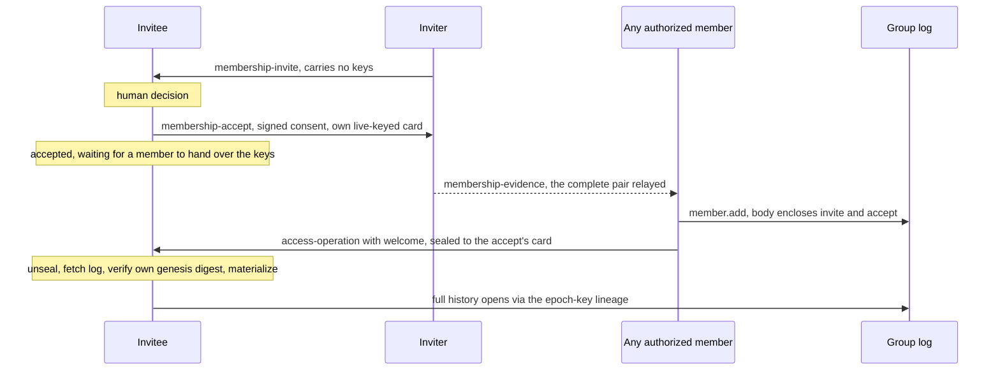
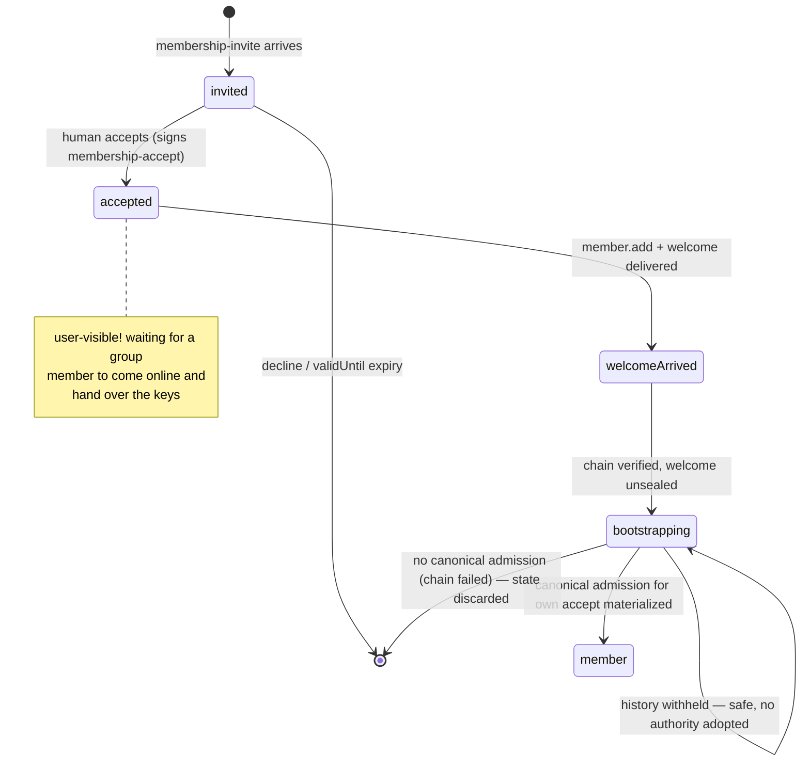

# RLTP Membership Tasks

**Real Life Trust Protocol — task types: Membership**

- **Status:** Editor's Draft
- **Version:** 0.9.0-draft (ninth casting)
- **Editors:** Anton Tranelis
- **Date:** 2026-08-12
- **Vocabulary namespace:** `https://real-life.org/rltp/v1`
- **Task-type namespace:** `https://real-life.org/trust-tasks/`
- **Target Trust Tasks framework version:** 0.4
- **Conformance profile:** `rltp-membership@0.9` (draft)
- **Position:** a task-type registration on top of the **RLTP Delivery
  Contract 0.17** (normative reference), carrying operations of the
  **RLTP Access Layer 0.24** (normative reference): the operation
  envelope of its §3.3 is the payload this specification transports,
  and **the Access layer owns every question of authority** —
  admission validity and canonicality (its §5.3), the `member.add`
  body profile (its §4.5), materialization and merge outcomes (its
  §3.5/3.6), key material (its §9.5), and the removal notice (its
  §10.2). This document owns the travel: which documents exist, what
  they bind, how they are checked on receipt, and what a receiver
  does with them.
- **Supersedes:** version 0.7 and earlier (archived as
  `archive/membership-tasks-0.7.md` … `-0.1.md`).

## Abstract

This document registers the task types with which membership changes
of an RLTP group travel between people: the **invitation** and its
explicit **acceptance**, and the carrier that delivers the
**admitting operation and its welcome** to a new member across the
replica boundary.
(The removal notice a removed member is owed travels as the Access
layer's own compact task, `removal-notice/0.1` — Access §10.2;
transition-bearing operation envelopes never cross the replica
boundary at all, Access §5.3.)

The dividing line is the replica boundary: inside a group, the
authority log replicates as shared state; **tasks carry operations to
parties who stand outside the replica** — the invitee who is not yet
a member, the removed member whom the capability gate has just shut
out. The log is canonical; a task is a feeder, never a second truth.
Authority never comes from a task: every operation carries its own
signatures, and its validity is judged by the Access layer's
materialization rules alone — issuance counts, arrival never.

Membership is entered only by explicit, cryptographically bound
consent, and the consent evidence travels **inside the admitting
operation**: the invitation and acceptance documents themselves,
verifiable by every replica. That makes admission verifiable without
private knowledge, lets **any authorized member** complete an
admission, and makes **invitation provenance provable** — who
invited whom is read from signatures in the log, never asserted by a
field.

## Status of This Document

This is an **Editor's Draft** with no standing beyond its own
argument, the ninth casting of this document. It is developed
through
the same adversarial convergence process as the Encounter Layer and
the Delivery Contract (casting, independent adversarial review, full
recast — never a patch); the seventh casting reached the
convergence criterion (a review round with no findings). The
eighth casting was the **alignment casting after the Access
Layer's own convergence** (0.24, twenty-one review rounds): it
returned the authority rules this document had carried
provisionally while Access was in flight — the `member.add`
materialization profile, the same-accept arbitration, the
removal-notice case — now adopted (and in three places improved)
by Access, so that membership travel **references** Access for
every authority question and specifies none itself. This ninth
casting answers round 8, which found two places where the
returned rules were not fully excised: the case-1 bootstrap kept
a weaker discard condition than Access §10.1, and the
one-accept-one-admission wording survived alongside the
idempotent same-subject rule that supersedes it. Both are made
consistent here; the boundary carrier is narrowed to its one
genuine cross-boundary use (the bootstrapping `member.add`), and
group state is keyed by genesis digest from the invitee's own
pinned invite. It has not yet completed its
own round. Known open
questions are collected in Section 9. Feedback is welcome via the
issues of the publication repository
(github.com/real-life-org/rltp-spec).

## 1. Introduction (informative)

### 1.1 What this fixes

The deployed app enforces membership on two disconnected planes: a
membership document that only clients check, and a relay registry
that only the relay checks. The seams show — a promoted admin passes
every client check and still cannot enforce a removal; a removed
member never canonically learns of the removal, because the same
capability gate that enforces it also cuts off the replica that would
tell them; an invitation hands the full key history to someone who
never consented to join. This specification is one half of the
repair: operations travel as first-class, acknowledged task documents
to exactly the parties the replica cannot reach, and keys travel only
after consent. The other half — one authority plane, the operation
log, with services fed by chain-proven epoch updates instead of their
own registries — belongs to the Access layer and its service ports.

### 1.2 The flow at a glance

1. A member sends an **invite** — no key material, but the inviter's
   contact card (so the answer has a key to travel under) and the
   group's genesis digest (so the invitee can later verify the
   bootstrap against what was offered).
2. The invitee decides, humanly, and sends an **accept**: signed by
   themselves, bound to that exact invite, carrying their own
   contact card (so the welcome has a key to travel under).
3. **Any authorized member** — not only the inviter — completes the
   admission: a `member.add` operation that carries the invite and
   the accept **inside its signed body**, travelling together with
   the **welcome** (the current epoch's keys, sealed to the invitee,
   digest-committed by the operation's signatures). The full history
   opens from the replica afterwards, epoch by epoch, through the
   key lineage the log itself carries (1.3). Until the welcome
   arrives, the invitee's state is honest and visible: *accepted —
   waiting for a group member to come online and hand over the keys*
   (Section 7).

The flow, as a picture (informative):

### 1.3 History through lineage, not through the welcome

The welcome carries **only the current epoch**. The group's history
is opened by the **epoch-key lineage** that the Access layer records
in the replicated log itself: at each epoch transition, the previous
epoch key travels encrypted under the new one. A new member holding
the current key therefore unlocks the entire readable history from
the replica, epoch by epoch — the group's shared world whole
(calendar, board, map), which is this profile's default. The
visibility policy narrows history exactly by omitting lineage
entries; nothing about history size ever burdens the welcome, and
nothing can be withheld from a new member that is not equally
withheld from the replica. The lineage is Access-layer property
and, since Access 0.24, a normative fact rather than a dependency
this document must demand: Access §7.1 requires every transition
to carry its lineage state explicitly (MO-6 discharged). The
full-history default of this profile is delivered exactly as far
as unbroken lineage reaches; across a narrowed or damaged span, a
bootstrap degrades honestly to current-epoch access. This document
transports no history either way.

### 1.4 The three principles inherited

- **Issuance counts, arrival never** (Encounter 1.3): an operation's
  validity is a function of its signatures and its causal position,
  never of when its task arrived.
- **Authenticity always has exactly one carrier** (Contract 1.1): the
  operation envelope carries its signatures, encloses its consent
  evidence, and commits to its welcome by digest, so
  `access-operation` documents carry no proof; the invitation and
  the acceptance carry proofs of their own, because nothing else
  carries their authenticity while they travel alone.
- **The acknowledgement is arrival, and arrival only** (Contract
  4.2): no acknowledgement of this specification is ever a consent,
  an acceptance of membership, or a policy proof. Consent has its own
  document, signed by the person consenting.

## 2. Conventions and Terminology

The key words "MUST", "MUST NOT", "REQUIRED", "SHALL", "SHALL NOT",
"SHOULD", "SHOULD NOT", "RECOMMENDED", "NOT RECOMMENDED", "MAY", and
"OPTIONAL" are to be interpreted as described in BCP 14 [RFC2119]
[RFC8174] when, and only when, they appear in all capitals.

The **interim securing profile** of Encounter 2.3 applies. The
**document profile, sealed envelope, staged dispositions, and
acknowledgement rules** of the Delivery Contract (Sections 3–6) apply
to every type registered here. **Task proofs of this document** (on
invite and accept) MUST verify under the key bound to the document
`issuer` anchor (Encounter 2.3), and the proof's `verificationMethod`
DID MUST equal that `issuer`.

**Group** — an Access-layer group. Its **identity is the genesis
digest** (Access §3.2 — the multibase multihash over the genesis
operation's proof-free signature input); the group DID is its
*address*, never its identity, and implementations key all group
state — pending stores, evidence authorization, bootstrap
verification — by genesis digest.
**Operation** — an Access-layer operation envelope (its §3.3):
self-addressing (`oid:`), causally referenced (`prev`), individually
signed (`proof.signatures`). **Materialization** — the Access layer's
deterministic derivation of group state from the operation DAG; an
operation is **canonical** per Access §3.5/§3.6 — judged at its
causal position, with merge outcomes governed by Access's closed
exception list. **Replica boundary** — the set of parties
holding (and entitled to hold) the group's replicated log at a given
materialized state. **Admission chain** — invite → accept →
`member.add`, carried in full inside the admitting operation
(Section 3.3). **Boundary-crossing `member.add`** — the
`access-operation` document that delivers an admitting `member.add`
to its own subject.

**The membership size budget:** a `membership-invite` and a
`membership-accept` document MUST NOT exceed **16 384 bytes** in
their JCS serialization. An oversized document is non-conformant at
issuance and `failed(validation-failed)` at receipt. The budget
exists so that complete enclosure (3.3) fits the Delivery Contract's
envelope bound in every normal construction, and it doubles as the
log-growth cap per admission. It is **not** a proof of fit: even
with Access §5.3's transported-variant caps on the enclosed proof
(at most 64 signatures and 16 credentials of at most 2048 bytes
JCS each), adversarially maximized documents can exhaust the
budget, so the sender MUST verify the complete
serialized task against the Contract's plaintext limit before
sealing (the Contract's stage-1 bound remains the authoritative
gate; where the admission cannot fit, the re-welcome fallback of
3.3 travels instead), and a welcome plaintext MUST NOT exceed
16 384 bytes in its
JCS serialization either.

**Enclosed cards are key transport, not enactment material:** the
contact cards inside invite and accept follow Encounter §6's
displayed form — their proof MUST verify under their `anchor`, and
they MUST carry neither `sentTo` nor `boundTo` and no challenge
obligation applies (they enter no enactment). No freshness is claimed
or needed — a seal needs a *live* key, not a fresh one; creating the
card for this thread is RECOMMENDED, required is only the retention
of Section 5.

## 3. Registered Task Types

### 3.1 `membership-invite/0.1`

The invitation: one member proposes membership to a person outside
the group. **It carries no key material and no operation** — nothing
a non-accepting recipient could hold against the group.

- `payload`: per `schemas/payload-membership-invite.schema.json` —
  `invite` object with:
  - `group` — the group DID;
  - `inviter` — anchor; MUST equal the document `issuer`;
  - `invitee` — anchor; MUST equal the document `recipient`. Signed
    into the invite so that consent cannot be transplanted: only
    this person's accept answers this invite;
  - `card` — the inviter's contact card. Its proof MUST verify under
    its `anchor`, and `card.anchor` MUST equal `inviter` — the
    accept is sealed to this card's key-agreement key, so ownership
    is a confidentiality requirement, not bookkeeping;
  - `genesisDigest` — **the group's identity** (Access §3.2: the
    multibase multihash over the genesis operation's proof-free
    signature input). It pins which group is being offered — an
    invitee bootstraps against exactly this digest and can never
    be steered into a sibling genesis (3.3), and materialization
    rejects an admission whose enclosed invite names a different
    digest than the group's own (Access §5.3 rule 2). It is a
    lineage identity, not a state commitment;
  - `validUntil` — RFC3339; bounds the invite's answerable life and
    the inviter's reply-key retention (Section 5), and MUST be ≥ the
    document's `issuedAt`. Stated honestly: the comparison runs
    against issuance times the issuer controls — it is an
    honest-clock bound and a retention anchor, not a cryptographic
    freshness proof; the effective gate on stale consent is the
    human admission decision (3.3);
  - optional display fields (`name`, `note`, bounded).
- `threadId`: fresh — opens the membership thread.
- `proof`: **REQUIRED**, verifying under `issuer` (Section 2).
- **Declarations (TT §7.3):** side effects: durable buffering and
  surfacing to the human only; exposure: recipient-only while
  travelling; on admission the invite becomes part of the group's
  log (3.3) and is thereby visible to the group — invitation is not
  anonymous, by design (provenance, 3.3).
- **Key obligation:** the inviter MUST retain the key-agreement
  private key of `card` at least until `validUntil` plus the longest
  adapter give-up horizon (Contract §5's retention rule, anchored to
  the invite instead of the card's last display).
- **Defined effect:** durable buffering plus surfacing for the
  recipient's decision. Accepting or ignoring is a human act; the
  acknowledgement says arrival, never inclination.

### 3.2 `membership-accept/0.1`

The explicit acceptance — the consent artifact. **Membership is
entered only through it:** a `member.add` admitting a subject across
the replica boundary MUST enclose a valid accept (3.3); without one,
issuing such a `member.add` is non-conformant, and a welcome MUST NOT
be sent.

- `payload`: per `schemas/payload-membership-accept.schema.json` —
  `accept` object with:
  - `group` — MUST equal the referenced invite's `group`;
  - `subject` — anchor; MUST equal the document `issuer` (consent is
    signed by the person consenting) **and** MUST equal the
    referenced invite's `invitee` (consent cannot be transplanted);
  - `ref` — the document digest of the invite being accepted
    (content-bound: this accept answers exactly that invitation);
  - `card` — the subject's contact card. Its proof MUST verify under
    its `anchor`, and `card.anchor` MUST equal `subject` — the
    welcome is sealed to this card's key-agreement key; a foreign
    card here would redirect the group's keys, so ownership
    verification is mandatory at every consumer (receipt AND
    admission AND materialization, 3.3).
- `threadId`: = the invite's `threadId`.
- `proof`: **REQUIRED**, verifying under `issuer` (Section 2).
- `recipient`: the invite's `issuer`. Other members receive the
  accept inside the admitting operation (3.3), not by fan-out.
- **Consistency (MUST, on receipt, before any effect):** proof
  verifies under `issuer`; `issuer` = `accept.subject`; `ref`
  matches a `membership-invite` this recipient actually sent on this
  thread; `accept.subject` = that invite's `invitee`; `accept.group`
  = that invite's `group`; `accept.card` verifies and its anchor
  equals `subject`; the accept's `issuedAt` **and** its
  `proof.created` are ≤ the invite's `validUntil` +
  `membership-skew` (Section 5). Any failure →
  `failed(validation-failed)`, no acknowledgement.
- **Defined effect:** durable recording of the consent. The consent
  is input to the group's admission policy (Access §4); the accept
  itself grants nothing. An accept is consent to **one
  membership** — the subject is a member once, however many
  canonical admissions enclose the accept (concurrent same-subject
  admissions are idempotent, Access §5.3) — and the accept is
  **consumed content-bound and never freed**: every canonical
  admission enclosing it consumes it, and no merge returns it to an
  unconsumed state (Access §5.3; the earlier castings'
  "one accept authorizes at most one admission" is withdrawn — it
  conflated the single membership effect with a single canonical
  operation, which idempotent admissions make wrong).

### 3.3 `access-operation/0.1`

The carrier for the **one operation that genuinely crosses the
replica boundary: the admitting `member.add` delivered to its own
subject**, the bootstrap. Round 8 narrowed this type to exactly
that: replication owns the inside (MO-1), so members already hold
operations; a removed member's notice is Access's own
`removal-notice/0.1` (its §10.2); transition key material travels
per recipient via `key-delivery/0.1` (Access §10.1); and
transition-bearing envelopes never leave the replica at all
(Access §5.3). **A conformant `access-operation/0.1` payload
therefore carries an admitting `member.add` and its welcome, and
nothing else** — the schema requires `op = member.add`, a
`member.add` body, and the welcome (there is no non-admitting
use). Leave and dissolve notices, if they are ever wanted, need
their own compact task types (MO-3), not this generic hole.

- `payload`: per `schemas/payload-access-operation.schema.json` —
  `operation` (the Access §3.3 envelope, an admitting `member.add`,
  validated against
  `schemas/access-operation-envelope.schema.json`) and the
  `welcome` (a `rltp-welcome/0.1` welcome seal, Section 4;
  REQUIRED — a boundary-crossing admission without keys would
  strand the subject).
- `threadId`: = the membership thread (the invite's).
- `proof`: **absent** — the operation envelope carries its own
  signatures (one carrier).
- **Outer/inner consistency (MUST, before any effect):**
  - the document `issuer` MUST equal `operation.author` or one of
    `operation.proof.signatures[].signer`;
  - **pre-buffer validation** (needs no group state; MUST pass
    before any durable buffering): payload schemas valid; the
    operation's `id` recomputes; every signature in
    `operation.proof` verifies under its signer's anchor;
  - the operation is an admitting `member.add` (its body per the
    profile below), the document
    `recipient` equals `operation.body.subject`, and
    `admission.welcome` equals the digest of the welcome's plaintext
    (Section 4), with the welcome's binding fields matching the
    operation.
  A violation is `failed(validation-failed)` and earns no
  acknowledgement.
- **The admission-only rule (MUST):** the payload's operation MUST
  be an admitting `member.add` carrying its welcome — this type
  has no other conformant shape (above; the schema requires it).
  A payload whose `op` is anything else, or an admitting
  `member.add` without a welcome, is non-conformant at the sender
  and `failed(validation-failed)` at the receiver.
- **Fit and the
  fallback (Access §5.3):** the sender's mandatory final
  serialized-size check (Section 2) governs fit; the enclosed
  operation carries a **transported variant proof** — at most 64
  signatures and 16 credentials, each credential at most 2048
  bytes JCS, never a replica's merged proof — and where the
  complete document still cannot fit the Contract's plaintext
  limit, **the self-contained re-welcome of Access §10.1 travels
  instead** (`key-delivery/0.1`, kind `re-welcome`, case-1
  semantics per Access §10.1's bootstrap rules): the subject
  bootstraps from it, and the admission evidence reaches them
  through replication afterwards. No admission is undeliverable.
  The admission-only rule already excludes every
  transition-carrying envelope (`member.remove`, `epoch.rotate`,
  `policy.change`, `visibility.change`, `document.detach`) — none
  is a `member.add` — and the schema additionally rejects any
  operation body carrying a `transition`, defence in depth against
  a future admitting operation that ever grew one. Access §5.3's
  boundary rule is the reason: a `keyDist` scaled to the retained
  set fits no carrier budget, and nothing outside the replica is
  entitled to it.
- **Declarations (TT §7.3):** side effects: mutating (log merge,
  bootstrap); exposure: recipient-only.
- **The `member.add` body (owned by Access §5.3, restated here
  informatively):** an admitting `member.add`'s body carries
  `subject` (the admitted anchor) and `admission` — **the full
  consent evidence**:
  `{ "invite": <the complete membership-invite document>,
     "accept": <the complete membership-accept document>,
     "welcome": <digest of the welcome plaintext, Section 4> }`.
  Enclosing the documents (not digests) is what makes admission
  verifiable without private knowledge: every replica — and every
  member who wants to complete an admission — holds the evidence.
  The documents are validated by their own schemas via the profile
  schema (`schemas/payload-access-operation.schema.json` applies the
  body profile when `operation.op` = `member.add`). **Validity,
  canonicality, consumption, and every merge question are the
  Access layer's** (its §5.3 — the profile this document carried
  provisionally has been adopted there and improved; MO-5
  discharged): admission is consent-bound with the exact
  cross-binding, window, and authorization checks this document's
  earlier castings stated, the genesis-digest binding included;
  **an accept is consumed by every canonical admission that
  encloses it, content-bound and merge-finally** — no accept ever
  frees again; and **concurrent admissions of one subject are
  idempotent**: the subject is a member through every candidate,
  none is voided and none is distinguished. The smallest-id
  arbitration of this document's castings one through seven is
  **withdrawn** — Access's convergence showed that any rule
  voiding or distinguishing a candidate hands an
  envelope-grinding party influence it must not have; nothing of
  the kind remains, and delivered welcomes are never invalidated
  by anything.
- **Invitation provenance (derived, never asserted):** who invited
  a member is read from the enclosed, signed invites of the
  subject's canonical admissions — in the log, verifiable by every
  member. Where concurrency produced several canonical admissions
  of one subject, each encloses a genuine signed act of invitation
  and provenance is simply plural — every entry true, attributable,
  and unforgeable. Applications MUST be able to display provenance
  from the log; no separately asserted "added by" field exists in
  this profile.
- **Defined effect — the bootstrap, and only the bootstrap.** The
  invitee MUST
     verify, before any effect: the pre-buffer checks; that
     `admission.accept`'s document digest equals the digest of **the
     invitee's own accept** (JCS-canonical identity); that
     `admission.invite`'s document digest equals the invitee's own
     `accept.ref` (and is thereby the invitee's own received
     invite); `body.subject` = own anchor = the enclosed
     `accept.subject`; `operation.group` = own accept's `group`;
     `admission.welcome` = digest of the enclosed welcome plaintext,
     whose binding fields match the operation (Section 4). These are
     the **case-1 pre-checks Access §10.1 names**; passing them, the
     invitee **adopts the welcome provisionally under Access §10.1's
     lifecycle**, which owns every remaining rule and this document
     does not restate: replicate scoped by the **invitee's own
     pinned `genesisDigest`** (verify the fetched genesis against
     it — a divergent lineage fails there); at first materialization
     the named admission must be **canonical with the invitee as
     subject AND the invitee a current member whose unsealed content
     key matches the current epoch's commitment** — not merely the
     historical presence of some canonical admission (a stale
     Epoch-7 welcome after a rotation or a removal fails this,
     exactly as Access §10.1 requires); one `provisional-window`
     per (genesisDigest, invitee), at most one buffered alternate,
     **complete wipe on any failure or on window expiry**, unique
     data preserved. This document adds nothing to that lifecycle
     and weakens no part of it; it only states that the welcome's
     travel is what makes the bootstrap possible, and that
     same-subject idempotence (Access §5.3) is why *which*
     canonical admission the invitee ends up under never matters.
- **No other case.** This type carries only the admitting
     `member.add` (the admission-only rule), so there is no
     "other operations" effect and no removal case — the removal
     notice is Access's `removal-notice/0.1` (its §10.2), a
     surfaced signed claim with no mandatory state effect.
- **Dependency (`incomplete(missing)`, Contract 6.2):** the
  bootstrap is **self-contained** — its effect MUST NOT require
  resolving the operation's `prev` closure against pre-existing
  local state, because the invitee has none. Two distinct,
  layered retentions apply and must not be conflated:
  - **The Delivery-level pending record** of the *document*, when
    the invitee cannot yet resolve the admission's closure: an
    `incomplete(missing: group-state)` disposition (Contract 6.2),
    pending store **keyed by document digest**, retention from
    first receipt, never reset, ≥ `bootstrap-retention`, discard
    after, fresh evaluation on later redelivery; triggers
    coalesced, quotas MAY behind the pre-buffer floor. This holds
    the wire document.
  - **The Access-level provisional security state** of the
    *adopted keys and replica* (Access §10.1): one
    `provisional-window` per (genesisDigest, invitee), complete
    wipe on failure or window expiry. This holds the unsealed
    material.
  The two are keyed differently on purpose — the document by its
  own digest (the invitee holds no group state to key by yet),
  the security state by the invitee's **own pinned
  `genesisDigest`** (§2), which the invitee has held since its
  invite, so sibling geneses sharing a group DID (Access §3.2)
  never collide. Only the invitee's own admitting `member.add`
  ever reaches either (the admission-only rule); no third party's
  operation can create a pending entry here.
- **Idempotency, two levels:** redelivery of the same document is
  `duplicate-known` (byte-identical re-ack); a different document
  carrying the same operation merges idempotently by operation id —
  effects keyed to new canonical transitions fire at most once per
  operation.

### 3.4 `membership-evidence/0.1`

The evidence relay's wire form: any holder of the consent pair MAY
hand it to any authorized member, so that any member can complete an
admission (the availability property of 1.2). The original documents
cannot simply be re-sealed — their signed `recipient` fields name the
invitee and the inviter, and the Contract's receiver principle would
rightly reject them — so they travel **enclosed**, exactly as they
later travel inside the admitting operation.

- `payload`: per `schemas/payload-membership-evidence.schema.json` —
  `evidence` object enclosing the COMPLETE `invite` and `accept`
  documents (proofs required; same shapes as `admission` in 3.3).
- `threadId`: = the membership thread (the invite's).
- `proof`: **absent** — the enclosed documents carry their own
  proofs; the relayer adds no authority and needs no signature (the
  same one-carrier reasoning as `access-operation`).
- **Consistency (MUST, before any effect — the pair-internal check
  set, enumerated):** both enclosed documents validate against their
  schemas and their proofs verify (invite under `invite.inviter`,
  accept under `accept.subject`, per Section 2 applied to enclosed
  documents); `accept.ref` = document digest of the enclosed invite;
  `accept.subject` = `invite.invitee`; `accept.group` =
  `invite.group`; the enclosed invite document's `recipient` =
  `invite.invitee` and the enclosed accept document's `recipient` =
  the enclosed invite document's `issuer`; both share the invite's
  `threadId`; `invite.validUntil` ≥ the invite document's `issuedAt`
  and the accept's `issuedAt` and `proof.created` ≤ `validUntil` +
  `membership-skew`; card ownership per 3.1/3.2. *(No equality of
  this list references an operation — evidence has none.)* Any
  failure → `failed(validation-failed)`, no acknowledgement.
- **Recipient authorization (MUST):** the sender addresses evidence
  only to a party it believes authorized to admit in
  `invite.group`; the receiver verifies **its own** authorization
  against its group state before the effect. A receiver holding no
  state for that group does not fail — the type declares the same
  `group-state` dependency as 3.3: the document is
  `incomplete(missing: group-state)` under the identical pending
  mechanics (keyed by document digest, retention from first
  receipt, `bootstrap-retention`); a receiver that resolves the
  state and finds itself unauthorized then disposes
  `failed(validation-failed)`.
- **Declarations (TT §7.3):** side effects: durable buffering and
  surfacing only; exposure: recipient-only.
- **Defined effect, semantically idempotent:** durable buffering of
  the verified pair as admission evidence, keyed by **the enclosed
  accept's document digest** — surfacing to the member's admission
  decision happens at most once per accept; a further wrapper for an
  already-held accept has a no-op effect and is still acknowledged
  (arrival is arrival). The evidence grants nothing and consumes
  nothing; issuing the admission remains a deliberate act under the
  group's policy.

## 4. The Welcome Seal

The welcome carries what the current epoch requires and nothing more;
history opens through the lineage in the replica (1.3).

- **Plaintext** is a `rltp-welcome/0.1` document
  (`schemas/welcome.schema.json`): `{ "v": "rltp-welcome/0.1",
  "group", "subject", "accept": <document digest of the accept this
  admission consumes>, "material": <the Access material object> }`.
  The binding
  fields (`v`, `group`, `subject`, `accept`) are owned by this
  specification and closed; `material` is owned by the Access layer
  and **pinned** (MO-4 discharged): it is the
  `rltp-access-material/0.24` object of Access §9.5, validated
  against `schemas/access-material.schema.json` — the current
  epoch's key material per the adapter registration, current epoch
  only, re-derivable, within this section's plaintext budget.
  (No implicit-capability blind exists: the implicit capability
  follows from membership itself, Access §6.) *(The welcome binds the accept, not the
  operation id: the operation's id covers `admission.welcome`, so a
  welcome pointing back at the id would be a hash fixed point and
  unconstructible. One carrier, one direction: the operation commits
  to the welcome.)*
- **Commitment:** `admission.welcome` in the operation body is the
  multibase multihash over `JCS(plaintext)`. The operation's
  signatures cover the body, so the welcome's one authenticity
  carrier is the operation: it cannot be swapped between groups,
  subjects, or admissions without breaking either the digest or the
  binding fields, which the receiver MUST verify against the
  operation (`group` = `operation.group`, `subject` =
  `body.subject`, `accept` = the document digest of the enclosed
  `admission.accept`).
- **Seal construction:** as Contract §5 with two deliberate
  differences — HKDF info `rltp/v1/welcome` (domain separation), and
  the plaintext is the `rltp-welcome` document, **never a delivery
  document**: a welcome seal never enters Contract 6.2. The
  recipient key is the key-agreement key of the **accept's enclosed
  card** (ownership-verified, 3.2); the subject MUST retain that key
  per Contract §5's retention rule from the accept's issuance.
- **Size:** the welcome plaintext MUST NOT exceed 16 384 bytes in
  its JCS serialization (Section 2); no continuation mechanism
  exists. Fit of the complete task is governed by the sender's
  mandatory final serialized-size check against the Contract's
  plaintext limit (Section 2) — never assumed.

## 5. Timing

| Parameter | Default | Meaning |
|---|---|---|
| `invite-validity` | P90D | default for `validUntil` when the inviter names none |
| `membership-skew` | PT5M | clock-skew allowance of this profile; widens every comparison of Section 3 toward acceptance (registered here — Encounter's `skew-tolerance` is pinned to its ceremony and not borrowed) |
| `bootstrap-retention` | P90D | minimum retention of an `incomplete(missing: group-state)` document, from first receipt; redelivery never resets it |

Delivery time is unbounded (Contract §7); no rule of this document
references arrival time for validity. The one issuance-time window —
accept against `validUntil` — is an honest-clock bound (3.1), widened
by `membership-skew`; clock tolerance never rejects.

## 6. What is deliberately absent

- **No member-update signal type.** The operations themselves travel
  as tasks; the canonical truth remains the materialized log.
- **No membership-level acknowledgement.** Arrival is the ack's
  whole meaning; group state is read from the log.
- **No service frames.** Services learn authority from chained,
  quorum-signed authorization views (Access §7.3), never from their
  own registries, and never via trust tasks.
- **No history transport.** The welcome carries one epoch; history
  is the replica's lineage (1.3). Fit is enforced by the sender's
  final size gate (Section 2), never assumed.

## 7. State Machines (informative)

**Invitee:** `invited (human decision pending) → accepted — waiting
for a group member to come online and hand over the keys → welcome
arrived → bootstrapping (fetch log, verify genesis against own
invite, materialize incl. own admission) → member` — the waiting
state MUST be user-visible as such; decline or expiry ends the
thread with local state only.

**Admitting member (any authorized member):** `admission evidence at
hand → verify chain → issue member.add enclosing invite + accept,
with welcome → done`. The evidence reaches non-inviter members via
`membership-evidence` (3.4) — that wire form is what makes "any
authorized member can admit" operationally true rather than merely
possible.

**Removed member:** `removal-notice arrives (Access §10.2) →
surfaced as a signed claim → verification attempt (replication) →
hygiene only on the member's own canonical application of the
removal` — the notice itself changes no state; a forged notice is a
surfaced, attributable lie with no mechanical effect.

## 8. Security Considerations

- **A task conveys, never authorizes.** Every acceptance decision
  about an operation is materialization; validate-then-consume holds
  throughout, and the pre-buffer checks keep even the pending store
  behind signature verification.
- **Consent is verifiable by everyone who must judge it:** the
  admitting operation encloses the signed invite and accept, so
  materialization verifies the chain itself — a malicious authorized
  member cannot make a consentless admission canonical, and
  consumption is content-bound and merge-final (every canonical
  admission consumes the accept it encloses; no accept ever frees
  again — Access §5.3).
- **Keys travel only after consent,** sealed to an
  ownership-verified key from the accept, digest-committed by the
  admitting operation. A person who never accepts never holds group
  material; a substituted card breaks a mandatory check at receipt,
  admission, and materialization alike.
- **History is as revocable as the replica:** the welcome cannot
  leak more than the current epoch; everything older is governed by
  the lineage in the log and the visibility policy.
- **The removal notice is a claim, never a lever:** it travels as
  Access's `removal-notice/0.1` (§10.2), is surfaced and verified,
  and has no mandatory state effect — hygiene binds only to the
  member's own canonical application of the removal. Any stronger
  effect would make every member signature a policy-free denial
  lever; the removal's enforcement never needed the notice (atomic
  rotation and replica eviction carry it — Access §5.3, §7.1).
- **Concurrency voids nothing:** same-subject admissions are
  idempotent (Access §5.3) — no displacement exists, no candidate
  is distinguished, delivered welcomes stay valid under every
  merge. Welcomes sealed by concurrent admitters of adjacent
  epochs are prospective-only exposure; the re-welcome duty of
  Access §3.6 covers any key gap the merge leaves.
- **Provenance without assertion:** the signed invites enclosed in
  the subject's canonical admissions answer "who invited"; where
  concurrency made provenance plural, every entry is a genuine
  signed act — there is no assertable field to forge and no
  arbitration to steer.
- **The permanence cost of enclosure, stated in full:** for every
  admitted member, the log permanently replicates the complete
  invite and accept — sender and recipient anchors, thread and
  document identifiers, issuance and proof timestamps, both contact
  cards including key identifiers and any `deliveryHints`, display
  fields, and both proofs. Invitation is not anonymous, by design;
  correlation across these fields is group-internal but permanent.
  The size budget (Section 2) caps growth at ≤ 32 KiB of evidence
  per admission; issuers SHOULD keep membership cards minimal — in
  particular, `deliveryHints` SHOULD be absent from cards enclosed
  in membership documents.

## 9. Open Issues

- **MO-1 Fan-out inside the boundary.** Whether operations SHOULD
  additionally travel as tasks to members whose replicas lag. This
  casting says: replication owns the inside.
- **MO-2 Policy-proof transport.** Richer admission policies need
  more inputs than one accept. Partially resolved by Access §5.3's
  transported variant proof (up to 64 signatures and 16 encounter
  credentials travel inside the enclosed admission, under the
  aggregate cost bound of Access §4.4); what remains open is
  transport for policy inputs beyond the admission case.
- **MO-3 Leave and dissolve notices.** The removal case is
  resolved (Access `removal-notice/0.1`, §10.2); whether leave and
  dissolve deserve analogous compact notices remains open.
- **MO-4/MO-5/MO-6 — discharged in Access 0.24.** The `material`
  schema is pinned (Section 4; Access §9.5); the `member.add` body
  profile and all materialization rules are Access §5.3's, with
  the same-accept consumption strengthened to content-bound
  merge-finality and the smallest-id arbitration withdrawn in
  favor of idempotent same-subject admissions; the epoch-key
  lineage is a normative Access fact (§7.1). This document
  references, and no longer carries, all three.

## 10. Conformance

- **Profile** `rltp-membership@0.9`; normatively references
  `rltp-delivery@0.17` and `rltp-access@0.24` (envelope §3.3,
  admission §5.3, material §9.5, key-delivery §10.1,
  removal-notice §10.2, views §7.3).
- **Normative schemas (shipped, offline closure):**
  `schemas/payload-membership-invite.schema.json` ·
  `schemas/payload-membership-accept.schema.json` ·
  `schemas/payload-membership-evidence.schema.json` ·
  `schemas/payload-access-operation.schema.json` ·
  `schemas/welcome.schema.json` ·
  `schemas/access-operation-envelope.schema.json` (transcription).
- **Vector plan:** *(round-1 set)* invite proof/issuer/recipient
  binding vectors · accept issuer/subject/ref/group vectors ·
  transplantation rejected · consumable accept: one accept, two
  concurrent adds → **both canonical, one membership, accept
  consumed once and never freed** (Access §5.3; the withdrawn
  "second non-canonical" is a regression check) · welcome digest
  and binding-field
  vectors · welcome next to non-admitting op rejected · issuer
  neither author nor signer rejected · pre-buffer rejections touch
  no storage · bootstrap re-welcome for an unresolved own
  admission → provisional per Access §10.1, re-evaluation, ack on
  completion · pending idempotency and retention vectors ·
  duplicate-known re-ack ·
  *(round-2 additions)* valid authorized operation with invented
  admission digests → materialization rejects (documents cannot be
  invented: they must enclose and verify) · own accept but
  substituted enclosed invite → `accept.ref` mismatch →
  materialization rejects and bootstrap rejects · operation group ≠
  enclosed accept/invite group → rejected · foreign card anchor in
  invite or accept → rejected at receipt, admission, and
  materialization · enclosed card with `sentTo`/`boundTo` →
  rejected (displayed form) · boundary-crossing `member.add`
  without welcome → `failed(validation-failed)` · post-expiry
  accept: `issuedAt` and `proof.created` beyond
  `validUntil + membership-skew` → rejected; backdated pair inside
  the window → accepted and honestly documented as human-gated ·
  bootstrap: divergent lineage (fetched genesis ≠ own invite's
  digest) → bootstrap fails, provisional state wiped · bootstrap
  at first materialization requires **current membership and
  current-epoch commitment match**, not merely a historical
  canonical admission — a stale Epoch-7 welcome after a rotation
  or removal → bootstrap fails and wipes (Access §10.1); window
  expiry with no resolution → wipe · admission-only rule: a
  payload whose `op` ≠ `member.add`, or a `member.add` without a
  welcome, → schema-rejected and `failed(validation-failed)` (no
  generic `incomplete` pending for third-party operations exists)
  · welcome size: plaintext over
  16 384 bytes JCS non-conformant (no continuation
  mechanism exists) · provenance read from the canonical admission
  equals the enclosed invite's signed inviter · *(round-3
  additions)* welcome constructibility: welcome binds the accept
  digest, never the operation id — a construction attempt with a
  back-pointer is impossible and the schema rejects the field ·
  concurrent consumption: two concurrent admissions enclosing the
  same accept on divergent branches → after merge **both are
  canonical** (same-subject admissions are idempotent, Access
  §5.3), the accept is consumed once and forever, membership and
  provenance identical on every replica, nothing distinguished ·
  size budget:
  invite or accept over 16 384 bytes JCS → non-conformant at
  issuance, `failed(validation-failed)` at receipt; the sender's
  final serialized-size check is the fit gate, never assumption ·
  enclosed
  document without proof → schema-rejected · welcome beside a
  non-`member.add` operation → schema-rejected · document-level
  materialization checks: enclosed invite recipient ≠ invitee,
  enclosed accept recipient ≠ invite issuer, thread mismatch,
  `validUntil` < invite `issuedAt` → each non-canonical · evidence
  relay (3.4): relayed pair validates as historical evidence and a
  member admitting from it produces a canonical admission; a
  tampered enclosed document fails its proof → rejected; a re-sealed
  ORIGINAL document (not enclosed) → `failed(wrong-recipient)` per
  the Contract, as intended · lineage absent → bootstrap degrades to
  current-epoch access, honestly surfaced, nothing else breaks ·
  *(round-4 additions)*
  size: sender-side final serialized check enforced; a schema-valid
  construction exceeding the Contract limit is rejected at the
  sender and, if sent anyway, at Contract stage 1 · welcome
  plaintext over 16 384 bytes JCS → non-conformant · *(round-5
  additions)* causal replay of an already-consumed accept →
  non-canonical outright; grinding by
  re-issuance dead · evidence to a
  non-member: receiver with state → `failed(validation-failed)`;
  receiver without state → `incomplete(missing: group-state)`,
  resolved on state arrival · repeated evidence wrappers for one
  accept → one surfacing, no-op effects, each wrapper acknowledged ·
  evidence check set is pair-internal: a validator referencing
  operation fields fails the suite ·
  *(eighth-casting additions — the Access-0.24 alignment)*
  no-transition rule: a payload whose operation body contains a
  `transition` (`member.remove`, `epoch.rotate`, `policy.change`,
  `visibility.change`, `document.detach`) → schema-rejected and
  `failed(validation-failed)`; a removal notice presented as an
  `access-operation` payload → non-conformant (it travels as
  `removal-notice/0.1`, Access §10.2) · transported variant caps:
  an enclosed admission proof with more than 64 signatures or 16
  credentials → schema-rejected; a credential above 2048 bytes JCS
  → non-conformant at the sender (Access §5.3) · re-welcome
  fallback: an admission whose complete serialized task exceeds
  the Contract's plaintext limit → non-conformant to send; the
  subject bootstraps via `key-delivery/0.1` kind `re-welcome`
  under Access §10.1's case-1 semantics, and the suite exercises
  that path end to end · genesis-digest binding: an enclosed
  invite whose `genesisDigest` differs from the group's genesis
  digest → non-canonical at materialization (Access §5.3 rule 2)
  and the invitee's bootstrap rejects the divergent lineage
  either way · concurrent same-subject admissions with
  **different** accepts → both canonical, both accepts consumed
  (content-bound, no accept frees again), provenance plural and
  every entry attributable · welcome material: validates against
  `access-material.schema.json` (`rltp-access-material/0.24`);
  a keydist-form object in a welcome → schema-rejected ·
  withdrawn-rule regression: a validator implementing the
  retired smallest-id arbitration rejects an admission that
  Access §5.3 accepts → fails the suite (the two specifications
  agree, by construction, on every admission verdict).
- Every normative statement is vector-testable or explicitly marked
  state-dependent.

## References

[RFC2119] · [RFC8174] BCP 14 · [RFC8785] JCS · [TT] ToIP DTGWG Trust
Tasks framework 0.4 · **RLTP Delivery Contract 0.17** (normative) ·
**RLTP Encounter Layer 0.19** (securing profile 2.3, principles 1.3,
contact card §6) · **RLTP Access Layer 0.24** (normative: operation
envelope §3.3, group identity §3.2, admission and key service duty
§5.3, material §9.5, `key-delivery/0.1` §10.1, `removal-notice/0.1`
§10.2, authorization views §7.3, epoch-key lineage §7.1).
