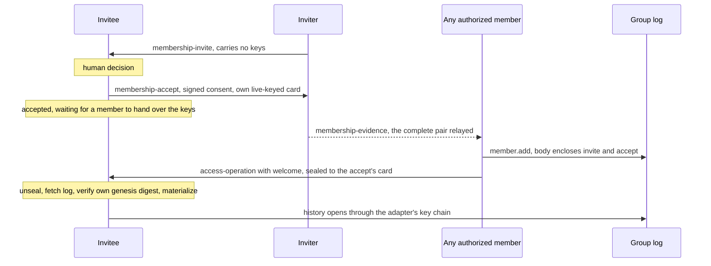

# RLTP Membership Tasks

**Real Life Trust Protocol — task types: Membership**

- **Status:** Editor's Draft
- **Version:** 0.17.0-draft
- **Editors:** Anton Tranelis
- **Date:** 2026-10-06
- **Vocabulary namespace:** `https://real-life.org/rltp/v1`
- **Task-type namespace:** `https://real-life.org/trust-tasks/`
- **Target Trust Tasks framework version:** 0.4
- **Conformance profile:** `rltp-membership@0.17` (draft). Registered
  task types: `membership-invite/0.2`, `membership-accept/0.2`,
  `access-operation/0.1`, `membership-evidence/0.2`
  (`membership-evidence/0.1` accepted). Welcome plaintext
  `rltp-welcome/0.1`.
- **Position:** a task-type registration on top of the **RLTP
  Delivery Contract 0.79** (normative reference; its §4.4 registry
  carries these types), carrying operations of the **RLTP Access
  Layer 0.54** (normative reference; wire forms `rltp-access/0.25`
  and `rltp-access-material/0.25`): the operation envelope of its
  3.3 is the payload this specification transports, and the Access
  layer owns every question of authority — admission validity and
  canonicality (its 5.3), the `member.add` body profile (its 4.5),
  materialization and merge outcomes (its 3.5 and 3.6), key material
  (its 9.4), and the removal notice (its 10.2). This document owns
  the travel: which documents exist, what they bind, how they are
  checked on receipt, and what a receiver does with them.
- **Companions:** RLTP Identity 0.51 (securing profile, 2.3); RLTP
  Encounter 0.30; RLTP Access Layer 0.54; RLTP Delivery Contract
  0.79.
- **Supersedes:** version 0.16 (archived as
  `archive/membership-tasks-0.16.md`). Earlier versions: Appendix A.

## Status of This Document

This is an Editor's Draft with no standing beyond its own argument.
The reference library implements its payload schemas and the welcome
seal; the bootstrap lifecycle it references is the Access layer's
and is exercised there. The next expected changes are the carrier
for a bootstrap under the experimental adapter `beekem/0.1` (MO-7)
and the move to Trust Tasks framework 0.7.0 together with the Access
layer and the Delivery Contract; each is a new version. Open
questions are listed in Section 9, and feedback is welcome via the
issues of the publication repository
(github.com/real-life-org/trust-protocol).


## Abstract

This document registers the task types with which membership changes
of an RLTP group travel between people: the **invitation** and its
explicit **acceptance**, the carrier that delivers the **admitting
operation and its welcome** to a new member across the replica
boundary, and the **evidence relay** that lets any authorized member
complete an admission. It carries operations of the RLTP Access
Layer 0.54 (envelope `rltp-access/0.25`, key material
`rltp-access-material/0.25`) over the Delivery Contract 0.79.

The dividing line is the replica boundary: inside a group, the
authority log replicates as shared state, and **exactly one
operation crosses the boundary as a task** — the admitting
`member.add` delivered to its own subject, the invitee who is not
yet a member and holds no replica to receive it from. The removed
member, whom the capability gate has just shut out, is owed a signed
**claim** rather than an operation (Access `removal-notice/0.1`, its
10.2). The log is canonical; a task is a feeder, never a second
truth. Authority never comes from a task: every operation carries
its own signatures, and its validity is judged by the Access layer's
materialization rules alone — issuance counts, arrival never.

Membership is entered only by explicit, cryptographically bound
consent, and the consent evidence travels **inside the admitting
operation**: the invitation and acceptance documents themselves,
verifiable by every replica. That makes admission verifiable without
private knowledge, lets **any authorized member** complete an
admission, and makes **invitation provenance provable** — who
invited whom is read from signatures in the log, never asserted by a
field. The welcome carries the keys of the current key state only,
sealed to the key the new member put into their acceptance, which
is also their first device; history opens from the replica.


## 1. Introduction (informative)

### 1.1 Essence

Membership of an RLTP group is state in the group's authority log
plus possession of the group's keys. Both are produced inside the
replica, and the replica cannot reach the one party that matters
most at the moment of admission: the person who is not yet a member.
This specification carries exactly what that person needs across
the replica boundary, and nothing else. Consent is a signed document
of the person consenting; the admitting operation encloses that
consent; the keys travel only after consent and only for the current
epoch; the removed member is owed a compact signed notice of their
own (Access 10.2). Every other movement of operations and keys is
replication or key delivery, which the Access layer and its ports
own.

### 1.2 The flow at a glance

0. The **prelude** (application-level, over the existing
   relationship channel): the inviter asks, the invitee's app
   derives the invitee's **member anchor** for the offered group
   from the genesis digest (Access 5.1, Identity §6's
   `group/<digest>` context) and answers with it. The inviter
   cannot derive another person's context anchor, so the formal
   invite can name it only after this exchange.
1. A member sends an **invite**: no key material, but the inviter's
   contact card at the inviter's own member anchor (so the answer
   has a key to travel under) and the group's genesis digest (so
   the invitee can later verify the bootstrap against what was
   offered). It names the invitee's member anchor from the prelude.
2. The invitee decides, humanly, and sends an **accept**: signed by
   themselves, bound to that exact invite, carrying their own
   contact card. That card is the key the welcome travels under, and
   the Access layer derives the person's first device binding from
   it (RLTP-ACC-5125).
3. **Any authorized member**, not only the inviter, completes the
   admission: a `member.add` operation that carries the invite and
   the accept **inside its signed body**, travelling together with
   the **welcome**: the key material of the current key state,
   sealed to the invitee, digest-committed by the operation's
   signatures. History opens from the replica afterwards through the
   chain the group's key adapter records (1.3). Until the welcome
   arrives, the invitee's state is honest and visible: *accepted,
   waiting for a group member to come online and hand over the keys*
   (Section 7).

The flow, as a picture (informative):



A service of class `blind` forwards these documents without reading
them; a service of class `view` or `log` knows more of the group
(Access 9.3), but no class gates an authority operation
(RLTP-ACC-9500). The carrier of this section travels through the
Delivery port in every case (3.3).

### 1.3 History through the key chain, not through the welcome

The welcome carries **only the current key state** (RLTP-ACC-9290).
The group's history is opened by the chain the group's key adapter
records in the replicated log itself: under `linear/0.1`, every
transition carries one lineage entry per key state it succeeds, each
making the previous content key readable under the new one
(RLTP-ACC-9760); under `beekem/0.1`, the tree's own history serves
the same purpose. A new member holding the current key therefore
unlocks the readable history from the replica, key state by key
state, the group's shared world whole (calendar, board, map). History
is never narrowed: nothing can be withheld from a new member that is
not equally missing from the replica (RLTP-ACC-9810). Where a
lineage edge is damaged, the gap is visible per edge and repairable
by the members who hold both sides (RLTP-ACC-9780, 9830); a bootstrap
across such a gap yields the key states the chain still reaches, and
honestly no more. Nothing about history size ever burdens the
welcome, and this document transports no history either way.

### 1.4 The three principles inherited

- **Issuance counts, arrival never** (Encounter 1.3): an operation's
  validity is a function of its signatures and its causal position,
  never of when its task arrived.
- **Authenticity always has exactly one carrier** (Contract 1.1): the
  operation envelope carries its signatures, encloses its consent
  evidence, and commits to its welcome by digest, so
  `access-operation` documents carry no proof; the invitation and
  the acceptance carry proofs of their own, because nothing else
  carries their authenticity while they travel alone.
- **The acknowledgement is arrival, and arrival only** (Contract
  4.2): no acknowledgement of this specification is ever a consent,
  an acceptance of membership, or a policy proof. Consent has its own
  document, signed by the person consenting.


## 2. Conventions and Terminology

### 2.1 Requirement language

The key words "MUST", "MUST NOT", "REQUIRED", "SHALL", "SHALL NOT",
"SHOULD", "SHOULD NOT", "RECOMMENDED", "NOT RECOMMENDED", "MAY", and
"OPTIONAL" in this document are to be interpreted as described in
BCP 14 [RFC2119] [RFC8174] when, and only when, they appear in all
capitals, as shown here.

Every normative statement of this document is one numbered rule of
the form `RLTP-MT-<Block><nnn>`. The block names the section the
rule belongs to (2xxx for Section 2, 3xxx for Section 3, and so on;
10xxx for Section 10); within a block, numbers advance in steps of
ten, except in block 3, which advances in steps of five: 3.1 starts
at 3005, 3.2 at 3200, 3.3 at 3300, 3.4 at 3700. A rule number is a
stable name, never reused, and gaps are left for insertions. Rules
of other RLTP documents are cited by their own identifiers
(`RLTP-ACC-…` for the Access layer). Paragraphs marked *Rationale*
and *Editor's note*, the "In plain terms" paragraphs, diagrams,
tables introduced as informative, and the sections marked
informative carry no requirement. A table carries requirements only
where a numbered rule says so; that rule then binds every row.

### 2.2 Division of labour with the Access layer

This document registers task types. It decides how membership
documents travel and how a receiver checks them; the Access layer
decides what they mean for the group.

**RLTP-MT-2010** — Every question of authority — admission validity
and canonicality (Access 5.3), the `member.add` body profile (Access
4.5), materialization and merge outcomes (Access 3.5, 3.6), accept
consumption, membership state, key material (Access 9.4,
RLTP-ACC-9360, RLTP-ACC-9362), and the removal notice (Access 10.2)
— MUST be decided by the Access layer's rules alone, and no rule of
this document overrides them.

**RLTP-MT-2020** — This document MUST be read as owning the travel
only: which documents exist, what they bind, how they are checked on
receipt, and what a receiver does with them.

**RLTP-MT-2030** — The materialized log MUST be the canonical truth
of group state, and a task of this document MUST NOT be treated as a
second source of it (RLTP-ACC-3370).

**RLTP-MT-2040** — An operation's validity MUST be judged by its own
signatures and its causal position under the Access layer's
materialization rules, never by the task that carried it or by the
time it arrived (RLTP-ACC-3180, RLTP-ACC-3370).

*Rationale.* Two documents that both judge admissions would sooner or
later judge one differently, and a group whose members disagree on
who belongs has split. A task is a delivery; if its arrival could
change state, whoever controls delivery timing — a relay, a delayed
peer, an attacker replaying old documents — would control the group.
Keeping authority in the signed operation and its position makes
every replica reach the same verdict from the same log, whatever
order the documents came in.

### 2.3 Terms

Terms of the Access layer — **member anchor**, **device card**,
**first device binding**, **key state**, **adapter**, **key port**,
**authorization view**, **implicit capability**, **materialization**,
**canonical** — are used as Access 2.2 and the rules it cites define
them; this document does not redefine them.

- **Group** — an Access-layer group; its identity is the genesis
  digest (Access 3.2, RLTP-ACC-3030), its group DID its address,
  never its identity.
- **Operation** — an Access-layer operation envelope
  `rltp-access/0.25` (Access 3.3): self-addressing (`oid:`),
  causally referenced (`prev`), individually signed
  (`proof.signatures`).
- **Materialization**, **canonical** — as Access 2.2 defines them;
  merge outcomes follow the conflict matrix and outcome rules of
  Access 3.6.
- **Replica boundary** — the set of parties holding, and entitled
  to hold, the group's replicated log at a given materialized
  state.
- **Admission chain** — invite → accept → `member.add`, carried in
  full inside the admitting operation (3.3).
- **Boundary-crossing `member.add`** — the `access-operation`
  document that delivers an admitting `member.add` to its own
  subject (3.3).
- **Consent pair** — one `membership-invite` document and the
  `membership-accept` document that answers it (3.1, 3.2).
- **Credential digest** — the multibase multihash over the JCS
  serialization of an invite's complete `payload.invite`, its proof
  included (RLTP-MT-2180).
- **Prelude** — the application-level exchange, over an existing
  relationship channel, in which the invitee's application tells
  the inviter the invitee's member anchor for the offered group
  (1.2).
- **Candidacy** — a consented, pre-admission display of a consent
  pair in the group space (3.4).
- **Welcome** — the sealed `rltp-welcome/0.1` document carrying the
  material of one key state to an admitted person (Section 4).

### 2.4 Securing and document profile

This document consumes the securing profile of the Encounter layer
(Encounter 0.30, 2.3), which restates the surface of Identity 0.51 it
consumes, and the document profile of the Delivery Contract 0.79.

**RLTP-MT-2110** — The securing profile of Encounter 2.3 MUST apply
to every artifact of this document.

**RLTP-MT-2120** — The document profile, sealed envelope, staged
dispositions, and acknowledgement rules of the Delivery Contract
(Sections 3 to 6) MUST apply to every type registered here.

**RLTP-MT-2130** — A task proof of this document (on the accept)
MUST verify under the key bound to the document `issuer` anchor
(Encounter 2.3).

**RLTP-MT-2140** — The task proof's `verificationMethod` DID MUST
equal the document `issuer`.

**RLTP-MT-2150** — A `membership-invite` document MUST carry no
document-level proof; its one authenticity carrier MUST be the
DataIntegrityProof of the enclosed DTG InvitationCredential,
verifying under the credential's `issuer`.

**RLTP-MT-2160** — The invite document's own `id`, `issuedAt`, and
`ceremony` MUST carry no authority at any consumer.

**RLTP-MT-2170** — A present `ceremony.enactment` on an invite
document MUST still recompute per Contract §3, and a failure MUST
reject the document.

**RLTP-MT-2180** — The identity of an invitation — for consent,
consumption, and idempotency — MUST be its credential digest, never
the digest of the enclosing document.

*Rationale.* One verifier, one key, one proof: a proof checked under
a key other than the issuer's anchor would let anyone holding some
key speak for someone else. The invite needs no second proof because
the credential already carries one, and a second proof over the
wrapper would be a second carrier that could disagree with the
first. The wrapper fields are outside every signature; if they
carried authority, a relay could rewrite them. The enactment check
stays a validity gate because a wrapper that claims an enactment it
cannot reproduce is malformed, not because it confers anything. If
the invitation's identity were the document digest, re-wrapping the
same credential would make a second invitation, and one consent
could be consumed twice.

**RLTP-MT-2190** — An implementation MUST key all group state of
this document — pending stores, evidence authorization, bootstrap
verification, provisional windows — by genesis digest, never by
group DID (RLTP-ACC-3040, RLTP-ACC-3065).

*Rationale.* Two geneses may share one group DID (Access 3.2). State
keyed by the DID would let a sibling group's documents fill, satisfy
or wipe the other group's pending entries and bootstrap.

### 2.5 The membership size budget

**RLTP-MT-2200** — A `membership-invite` and a `membership-accept`
document MUST NOT exceed 16 384 bytes in their JCS serialization.

**RLTP-MT-2210** — Issuing an oversized invite or accept MUST be
non-conformant, and a receiver MUST dispose one
`failed(validation-failed)`.

**RLTP-MT-2220** — A sender MUST verify the complete serialized task
against the Delivery Contract's plaintext limit before sealing
(RLTP-ACC-5330).

**RLTP-MT-2230** — The Contract's stage-1 bound MUST remain the
authoritative gate, and where an admission cannot fit, the
self-contained bootstrap in the recovery kind the adapter registers
MUST travel instead (RLTP-MT-3360; RLTP-ACC-5340, RLTP-ACC-5580).

**RLTP-MT-2240** — A welcome plaintext MUST NOT exceed 16 384 bytes
in its JCS serialization.

*Rationale.* The budget exists so that complete enclosure (3.3) fits
the Delivery Contract's envelope bound in every normal construction,
and it doubles as the cap on log growth per admission. It is not a
proof of fit: even within the transported variant's caps on the
enclosed proof (at most 64 signatures and 16 credentials of at most
2048 bytes each, RLTP-ACC-5320), adversarially maximized documents
can exhaust the budget. Without the sender's final check, such an
admission would fail at the receiver's stage 1 and strand the
invitee; with it, the sender sees the failure first and sends the
self-contained bootstrap, which always fits.

### 2.6 Enclosed cards

The contact cards inside invite and accept are key transport, not
enactment material. They follow Encounter §6's displayed form.

**RLTP-MT-2250** — An enclosed card's proof MUST verify under its
`anchor`, and that anchor MUST be the party's member anchor in the
group (Access 5.1) — for a party the group's materialized membership
already carries, the anchor it carries (RLTP-ACC-5080).

**RLTP-MT-2260** — An enclosed card MUST carry neither `sentTo` nor
`boundTo`.

**RLTP-MT-2270** — An enclosed card MUST NOT be held to a challenge
obligation, since it enters no enactment.

**RLTP-MT-2280** — An enclosed card MUST carry no `deliveryHints`.

**RLTP-MT-2290** — A consumer MUST NOT require freshness of an
enclosed card; a seal needs a live key, not a fresh one.

**RLTP-MT-2300** — A party SHOULD create the card it encloses for
the membership thread it encloses it in.

**RLTP-MT-2310** — The only duty on an enclosed card's key beyond
its validity MUST be retention: by the inviter per RLTP-MT-3090, by
the subject per RLTP-MT-4120 and RLTP-MT-4140.

*Rationale.* The log replicates every enclosed card for as long as
the group exists. A card carrying `sentTo`, `boundTo` or a challenge
would import enactment semantics into a document that has none, and a
reader could mistake a membership card for proof of a meeting.
Delivery hints are routing material; replicated forever beside a
member anchor, they would tie a group-scoped identity to a reachable
endpoint for every member who ever reads the log. Demanding freshness
would add a clock to a check that only needs the key to be held. A
card made for the thread keeps one key per membership and nothing a
reader can link to the party's other relationships.


## 3. Registered Task Types

This section registers four task types in the Delivery Contract's
registry: the invitation, the acceptance, the carrier that brings an
admitting operation and its welcome to its subject, and the evidence
relay. Each subsection states the payload, the document fields, the
receiver's checks, the declarations, and the defined effect of its
type.


### 3.1 `membership-invite/0.2`

*In plain terms.* An invite is a signed offer from one member to one
person: "join this group". It names the group by its fingerprint and
the person by the anchor their own app gave the inviter beforehand,
and it carries the inviter's card so the answer can be sealed. It
carries no keys and no operation, so a person who ignores it holds
nothing of the group. The invitee's app checks that the named anchor
really is its own for this group before anyone can answer.

The invitation: one member proposes membership to a person outside
the group.

**RLTP-MT-3005** — An invite MUST carry no key material and no
operation.

*Rationale.* A recipient who never accepts must hold nothing that
could be used against the group: no key opens its content, and no
operation can be replayed into its log.

**Payload.** Per `schemas/payload-membership-invite.schema.json`,
the payload is `invite`, a DTG InvitationCredential.

**RLTP-MT-3010** — `payload.invite` MUST be a conformant DTG
InvitationCredential (DTGWG Core Credentials WD01).

**RLTP-MT-3015** — `invite.@context` MUST be the three pinned
contexts (W3C v2, DTG v1, RLTP v1) in that order, and `invite.type`
MUST be `VerifiableCredential`, `DTGCredential`,
`InvitationCredential`, `MembershipInvite`.

**RLTP-MT-3020** — `invite.issuer` MUST be the inviter's member
anchor (Access 5.1; RLTP-ACC-5080 for an anchor the materialized
membership already carries) and MUST equal the document `issuer`.

**RLTP-MT-3025** — `invite.credentialSubject.id` MUST be the
invitee's member anchor, obtained in the prelude (1.2), and MUST
equal the document `recipient`.

*Rationale.* The invitee's anchor is signed into the credential so
that consent cannot be transplanted: only this person's accept, signed
under exactly this anchor, answers this invite. Without the binding, a
third party who obtained the invite could answer it under its own
anchor and be admitted on someone else's invitation.

**RLTP-MT-3030** — The invitee MUST verify, on receipt and before any
accept, that `invite.credentialSubject.id` equals its own derivation
from `invite.credentialSubject.genesisDigest` (Access 5.1,
RLTP-ACC-5050, RLTP-ACC-5060, including the canonical-`u`
re-encoding of the digest), and MUST dispose a mismatch
`failed(validation-failed)`, never answering it.

*Rationale.* The prelude travels over whatever channel the two people
share, and its answer can be lost, garbled or forged. Checking the
named anchor against the invitee's own derivation makes the prelude
irrelevant to soundness: an invite that names a wrong anchor, or the
right anchor for a different group, dies at its consumer before any
consent exists. The canonical re-encoding ensures that a digest
carried as `z` derives the same anchor as its `u` rendering, so an
encoding choice cannot fork one person into two members.

**RLTP-MT-3035** — `invite.credentialSubject.group` MUST be the group
DID.

**RLTP-MT-3040** — `invite.credentialSubject.genesisDigest` MUST be
the group's identity (Access 3.2), against which the invitee
bootstraps (3.3) and against which materialization checks every
admission enclosing the invite (RLTP-ACC-3070, RLTP-ACC-5440).

**RLTP-MT-3045** — `invite.credentialSubject.card` MUST be the
inviter's contact card in the `rltp-card/0.25` displayed form,
whose proof verifies under its `anchor`.

**RLTP-MT-3050** — `card.anchor` MUST equal `invite.issuer`.

*Rationale.* The group DID is an address that two geneses may share;
the genesis digest is what the invitee is actually offered, and
pinning it in the signed credential means that no bootstrap from a
sibling genesis and no admission into a different group can claim
this consent. The accept is sealed to the card's key-agreement key,
so a card that is not the inviter's own would redirect the invitee's
consent to whoever holds that key: ownership of the card is a
confidentiality requirement.

**RLTP-MT-3055** — `invite.validFrom` MUST be the issuance time, and
`invite.validUntil` MUST be at or after `invite.validFrom` and MUST
bound the invite's answerable life and the inviter's reply-key
retention (RLTP-MT-3090).

*Rationale.* `validUntil` is an honest-clock bound, not a freshness
proof; a backdated accept inside the window passes. The effective
gate on stale consent is the human admission decision (3.3), and
WD01's single-use guidance is met more strongly by accept
consumption (RLTP-ACC-5480): one accept enters the group once.

**RLTP-MT-3060** — `invite.taskContext` MUST be the membership
thread's `threadId`.

**RLTP-MT-3065** — `invite.credentialSubject` MAY carry the display
fields `name` and `note`, within the bounds of the schema.

**RLTP-MT-3070** — `invite.proof` MUST be a DataIntegrityProof
`eddsa-jcs-2022` under `invite.issuer`, including the proof-`@context`
copy (Encounter 2.3).

**Document fields.**

**RLTP-MT-3075** — The invite document's `threadId` MUST be fresh,
opening the membership thread, and MUST equal `invite.taskContext`.

**RLTP-MT-3080** — The invite document MUST carry no document-level
`proof` (RLTP-MT-2150).

**RLTP-MT-3085** — The declarations (TT §7.3) MUST be: side effects
durable buffering and surfacing to the human only; exposure
recipient-only while travelling, and visible to the group once a
consented candidacy (3.4) surfaces it or an admission encloses it
in the log (3.3).

*Rationale.* Invitation is not anonymous: provenance is read from the
signed invites in the log (3.3), so the group learns who invited
whom. Declaring this up front keeps an inviter from assuming a
privacy the protocol does not give.

**RLTP-MT-3090** — The inviter MUST retain the key-agreement private
key of `invite.credentialSubject.card` at least until
`invite.validUntil` plus the longest adapter give-up horizon
(Contract §5's retention rule, anchored to the invite).

*Rationale.* The accept is sealed to that key and may arrive at any
time within the window, after any delivery delay the adapters allow.
An inviter who discards the key earlier makes every late answer
unreadable, and the invitee's consent is silently lost.

**RLTP-MT-3095** — The defined effect MUST be durable buffering plus
surfacing for the recipient's decision, and the acknowledgement MUST
say arrival only, never the recipient's inclination.

*Rationale.* Accepting or ignoring is a human act. An acknowledgement
that hinted at a decision would leak it to the inviter before the
invitee made it, and a decision derived from receipt would be no
consent at all.


### 3.2 `membership-accept/0.2`

*In plain terms.* The accept is the invitee's signed "yes" to exactly
one invite. It names the invite by the fingerprint of the signed
credential, carries the invitee's own card so the keys can later be
sealed to it, and says whether the invitee agrees to be shown to the
group as a candidate before admission. Nobody becomes a member without
one, and one accept makes a person a member once, however many
admissions enclose it.

The explicit acceptance is the consent artifact.

**RLTP-MT-3200** — A `member.add` admitting a subject across the
replica boundary MUST enclose a valid accept (3.3; RLTP-ACC-5290).

**RLTP-MT-3205** — Issuing such a `member.add` without a valid
enclosed accept MUST be non-conformant.

**RLTP-MT-3210** — Without a valid accept, a welcome MUST NOT be
sent.

*Rationale.* Membership entered without consent is the failure this
document exists to prevent: a person added to a group, given its
keys, and shown to its members without ever having agreed. Because
the accept travels inside the admitting operation, every replica can
check the consent itself, and no member's word is needed for it.

**Payload.** Per `schemas/payload-membership-accept.schema.json`,
the payload is an `accept` object.

**RLTP-MT-3215** — `accept.group` MUST equal the referenced invite's
`credentialSubject.group`.

**RLTP-MT-3220** — `accept.subject` MUST be the invitee's member
anchor (Access 5.1) and MUST equal the document `issuer`.

**RLTP-MT-3225** — `accept.subject` MUST equal the referenced
invite's `credentialSubject.id`.

**RLTP-MT-3230** — `accept.ref` MUST be the credential digest of the
invite being accepted (RLTP-MT-2180), compared as digest equality
over decoded multihash bytes (Encounter 2.3).

*Rationale.* Consent is signed by the person consenting, under the
group-scoped anchor they will act as. If the subject could differ from
the invite's named invitee, anyone who saw an invite could accept it
for themselves; if the reference named the delivery wrapper instead
of the signed credential, one invitation re-wrapped would look like
two, and its consent could be counted twice.

**RLTP-MT-3235** — `accept.card` MUST be the subject's contact card,
whose proof verifies under its `anchor`.

**RLTP-MT-3240** — `accept.card.anchor` MUST equal `accept.subject`.

**RLTP-MT-3245** — Every consumer — at receipt, at admission, and at
materialization (3.3) — MUST verify the card's ownership.

*Rationale.* The welcome is sealed to this card's key-agreement key,
and the Access layer derives the person's first device binding from
it (RLTP-ACC-5125). A foreign card here would redirect the group's
keys to whoever holds that key and bind a stranger's device to the
new member. Checking ownership at every consumer means that a
substitution at any hop is caught by the next one.

**RLTP-MT-3250** — `accept.candidacy` MUST be present as a boolean:
`true` is the subject's signed consent to the pre-admission
candidacy surfacing of 3.4, `false` its signed refusal, permitting the
silent evidence relay only.

*Rationale.* Surfacing a candidacy publishes the pending admission to
the group, and group-space content cannot be reliably recalled
(RLTP-MT-3790). Only the person concerned may decide that, and only
a signed field makes the decision verifiable by every member who
handles the pair.

**Document fields.**

**RLTP-MT-3255** — The accept document's `threadId` MUST equal the
invite's `threadId`.

**RLTP-MT-3260** — The accept document MUST carry a `proof`
verifying under its `issuer` (Section 2).

**RLTP-MT-3265** — The accept document's `recipient` MUST be the
invite's `issuer`; other members receive the accept inside the
admitting operation (3.3) or as evidence (3.4), never by fan-out.

**RLTP-MT-3270** — On receipt and before any effect, the recipient
MUST verify: the proof verifies under `issuer`; `issuer` =
`accept.subject`; `accept.ref` matches the credential digest of a
`membership-invite` this recipient sent on this thread;
`accept.subject` = that invite's `credentialSubject.id`;
`accept.group` = that invite's `credentialSubject.group`;
`accept.card` verifies and its anchor equals `accept.subject`; and
the accept's `issuedAt` and its `proof.created` are each at most the
invite's `validUntil` plus `membership-skew` (Section 5).

**RLTP-MT-3275** — Any failure of RLTP-MT-3270 MUST be disposed
`failed(validation-failed)` without acknowledgement.

*Rationale.* An inviter that recorded an unchecked accept would carry
forged or mis-bound consent into an admission, where materialization
would reject it only after a member had acted on it. Matching
against invites the recipient actually sent rules out accepts to
invitations that never existed.

**RLTP-MT-3280** — The defined effect MUST be durable recording of
the consent as input to the group's admission policy (Access 4),
and the accept itself MUST grant nothing.

**RLTP-MT-3285** — An accept MUST be consent to one membership: the
subject is a member once, however many canonical admissions enclose
the accept (RLTP-ACC-3475).

**RLTP-MT-3290** — An accept MUST be consumed content-bound by every
canonical admission enclosing it and MUST never be freed by any
merge (RLTP-ACC-3485, RLTP-ACC-3545, RLTP-ACC-5480).

*Rationale.* Concurrent admissions of one subject are idempotent, so
counting admissions would be wrong: two members who admit the same
person at once both act correctly, and the person is a member once.
Consumption that a merge could undo would let a removed person be
re-admitted on the consent they gave the first time; content-bound
consumption that never frees means a new membership needs new
consent.


### 3.3 `access-operation/0.1`

*In plain terms.* One document carries the decision that admits a
person together with the keys that decision promised, straight to
that person. It carries nothing else: no removals, no rotations, no
history. The newcomer checks everything the document lets them
check, keeps the keys provisionally, fetches the group's log, and
becomes a member only once the log confirms the admission. If the
document is too big to travel, the keys travel alone and the log
brings the decision afterwards.

**RLTP-MT-3300** — `access-operation/0.1` MUST carry the one
operation that crosses the replica boundary: the admitting
`member.add` delivered to its own subject, the bootstrap.

**RLTP-MT-3305** — Key material for members MUST travel per device
through `key-delivery/0.1` (Access 10.1, RLTP-ACC-10105), never
through this type.

**RLTP-MT-3310** — The payload's `operation` MUST be an Access 3.3
envelope of version `rltp-access/0.25` carrying an admitting
`member.add`, valid against
`schemas/access-operation-envelope.schema.json`.

**RLTP-MT-3315** — The payload MUST carry `welcome`, a
`rltp-welcome/0.1` welcome seal (Section 4).

**RLTP-MT-3320** — `threadId` MUST equal the membership thread, the
invite's.

**RLTP-MT-3325** — The document MUST carry no `proof`.

*Rationale.* Replication owns the inside of the replica, so members
already hold every operation; a removed member's notice is the
Access layer's `removal-notice/0.1` (RLTP-ACC-5740); transition key
material is scaled to the retained set and entitled to nobody
outside the replica (RLTP-ACC-5350). What remains is the one person
the replica cannot reach. A boundary-crossing admission without
keys would strand that person, so the welcome is not optional. The
envelope carries its own signatures and commits to its welcome by
digest, so a document proof would be a second carrier of the same
authenticity. `member.add` is additive and carries no `keyOpDigest`
(RLTP-ACC-4380).

**RLTP-MT-3330** — The document `issuer` MUST equal
`operation.author` or one of `operation.proof.signatures[].signer`.

**RLTP-MT-3335** — Before any durable buffering, a receiver MUST
check that the payload schemas are valid, that the operation's `id`
recomputes, and that every signature in `operation.proof` verifies
under its signer's anchor over the signing input of the envelope's
own version.

**RLTP-MT-3340** — Before any effect, a receiver MUST check that the
operation is an admitting `member.add`, that the document
`recipient` equals `operation.body.subject`, and that
`admission.welcome` equals the digest of the welcome's plaintext
with the welcome's binding fields matching the operation (Section
4).

**RLTP-MT-3345** — A violation of RLTP-MT-3330 to RLTP-MT-3340 MUST
be disposed `failed(validation-failed)` and MUST earn no
acknowledgement.

**RLTP-MT-3350** — The payload's operation MUST be an admitting
`member.add` carrying its welcome; a payload whose `op` is anything
else, or an admitting `member.add` without a welcome, is
non-conformant at the sender and `failed(validation-failed)` at the
receiver.

*Rationale.* The pre-buffer checks need no group state and bound
what an unauthenticated sender can make a receiver store. The
outer/inner checks make the document and its enclosed operation
speak about the same admission, so a valid operation cannot be
wrapped for the wrong recipient or paired with another admission's
keys. The admission-only rule leaves no generic hole through which a
later operation type could cross the boundary unexamined.

**RLTP-MT-3355** — The enclosed operation MUST carry a transported
variant proof of at most 64 signatures and 16 credentials of at
most 2048 bytes each in JCS serialization, never a replica's merged
proof (RLTP-ACC-5310, RLTP-ACC-5320).

**RLTP-MT-3360** — Where the complete document cannot fit the
Contract's plaintext limit under the sender's final serialized-size
check (RLTP-MT-2220), the self-contained bootstrap of Access 10.1
MUST travel instead, as `key-delivery/0.1` in the recovery kind the
group's adapter registers (RLTP-ACC-5340, RLTP-ACC-5580), and the
admission evidence reaches the subject through replication
afterwards; no admission is undeliverable.

**RLTP-MT-3365** — An envelope carrying a transition (`member.remove`,
`epoch.rotate`, `policy.change`, `visibility.change`,
`device.revoke`, `document.detach`) MUST NOT be carried by this
type.

**RLTP-MT-3370** — The payload schema MUST reject any operation body
carrying a `transition`.

**RLTP-MT-3375** — The type MUST be declared with side effects
*mutating* (log merge, bootstrap) and exposure *recipient-only*
(Trust Tasks §7.3).

*Rationale.* A merged proof grows with the group's history and
would make admission size a function of the past; the transported
variant is bounded and suffices at the admission's position. The
fallback keeps every admission deliverable without ever carrying
history or a transition. The transition list is the Access layer's
catalogue of enforcement operations (RLTP-ACC-4380); the schema check
is defence in depth against an admitting operation that ever grew a
transition.

**RLTP-MT-3380** — The enclosed invite and accept MUST be validated
by their own schemas through the profile schema
`schemas/payload-access-operation.schema.json`, which applies the
`member.add` body profile (RLTP-ACC-5290).

**RLTP-MT-3385** — Concurrent admissions of one subject MUST be
treated as idempotent: the subject is a member through every
canonical candidate, none voided and none distinguished
(RLTP-ACC-3475).

**RLTP-MT-3390** — A delivered welcome of a rule-passing candidate
MUST NOT be invalidated by a concurrent admission of the same
subject (RLTP-ACC-5500).

*Rationale.* Enclosing the documents rather than their digests makes
admission verifiable without private knowledge: every replica, and
every member who wants to complete an admission, holds the evidence.
Validity, canonicality, consumption and every merge question are the
Access layer's (RLTP-MT-2010). Any rule that voided or distinguished
one of several candidates would hand an envelope-grinding party
influence it must not have.

**RLTP-MT-3395** — Who invited a member MUST be read from the
enclosed, signed invites of the subject's canonical admissions
(RLTP-ACC-5300).

**RLTP-MT-3400** — Applications MUST be able to display invitation
provenance from the log.

**RLTP-MT-3405** — No separately asserted "added by" field MUST exist
in this profile.

*Rationale.* Where concurrency produced several canonical admissions
of one subject, each encloses a genuine signed act of invitation and
provenance is simply plural, every entry true, attributable and
unforgeable. An asserted field would be the one entry nobody signed.

**RLTP-MT-3410** — Before any effect, the invitee MUST run the
pre-adoption checks its carrier permits.

**RLTP-MT-3415** — The embedded welcome, the payload of this section,
MUST be checked against the complete set of RLTP-MT-3335 and
RLTP-MT-3425 to RLTP-MT-3445.

**RLTP-MT-3420** — The self-contained bootstrap of Access 10.1
(`key-delivery/0.1` in the adapter's recovery kind), which carries
the sealed material alone, MUST be checked against the
carrier-independent subset RLTP-MT-3440 to RLTP-MT-3445 together
with the pin check of RLTP-ACC-10200, and no less.

**RLTP-MT-3425** — The document digest of `admission.accept` MUST
equal the digest of the invitee's own accept.

**RLTP-MT-3430** — The credential digest of `admission.invite`
(Section 2) MUST equal the invitee's own `accept.ref`, which
thereby pins `genesisDigest` (3.1).

**RLTP-MT-3435** — `body.subject` MUST equal the invitee's own
anchor and the enclosed `accept.subject`, and `operation.group` MUST
equal the invitee's own accept's `group`.

**RLTP-MT-3440** — The welcome seal MUST open under the key-agreement
private key of the card enclosed in the invitee's own accept (3.2),
and a seal opening under any other locally held key of the same
person MUST be rejected before adoption.

**RLTP-MT-3445** — The unsealed `material` MUST be a
`rltp-access-material/0.25` object valid against
`schemas/access-material.schema.json`, naming its key state in
`keyState` (RLTP-ACC-9362), its `keys` closed by the adapter
registration; a material carrying a field the adapter does not
register MUST be rejected before adoption.

**RLTP-MT-3450** — The carrier-independent subset MUST be exactly
what Access 10.1 lists for its self-contained bootstrap
(RLTP-ACC-10200).

**RLTP-MT-3455** — The operation-dependent checks MUST be deferred to
first materialization for a self-contained bootstrap, where the
Access layer binds canonicality and the material's key state against
the log (RLTP-ACC-10290).

**RLTP-MT-3460** — The self-contained bootstrap MUST inherit the
embedded welcome's trust sequence, provisional adoption followed by
verification at the log, and MUST NOT claim a stronger pre-check it
cannot perform.

**RLTP-MT-3465** — Any failure of the checks a carrier permits MUST
be disposed `failed(validation-failed)`, nothing adopted and no
state written.

*Rationale.* A bootstrapping invitee holds no group state, so the
embedded set is complete: there is nothing further to check against.
The accept and invite digests tie the admission to the invitee's own
consent and own received invitation, whatever wrapper carried them.
The seal check names the one qualifying key, so a welcome sealed to
a superseded or compromised key of the same person fails here,
however successfully the delivery layer resolved the recipient key
identifier against it (Contract §5). The material check is run
before adoption and not only at first materialization because a
malformed material must never be held, even provisionally. The
re-welcome has no operation to run the other checks against, so it
runs the subset the Access layer lists and defers the rest to the
log; that is the same sequence, not a weaker one.

**RLTP-MT-3470** — Passing the checks its carrier permits, the
invitee MUST adopt the welcome provisionally under the lifecycle of
Access 10.1 (RLTP-ACC-10210 to RLTP-ACC-10330), which this document
references and does not restate.

**RLTP-MT-3475** — The invitee MUST replicate scoped by its own
pinned `genesisDigest` and verify the fetched genesis against it
(RLTP-ACC-3070, RLTP-ACC-3085, RLTP-ACC-10260).

**RLTP-MT-3480** — At first materialization, the named admission MUST
be canonical with the invitee as subject (RLTP-ACC-10290).

**RLTP-MT-3485** — At first materialization, the invitee MUST be a
member of the materialized state (RLTP-ACC-10290); a welcome whose
subject has since been removed fails here.

**RLTP-MT-3490** — At first materialization, the unsealed material
MUST verify against the log's binding of the key state it names
(RLTP-ACC-9362, RLTP-ACC-10290).

**RLTP-MT-3495** — The invitee MUST hold one `provisional-window` per
(`genesisDigest`, invitee) and at most one buffered alternate
(RLTP-ACC-10210, RLTP-ACC-10230).

**RLTP-MT-3500** — A single candidate's failure MUST wipe that
candidate's provisional state and immediately check the buffered
alternate (RLTP-ACC-10250, RLTP-ACC-10320).

**RLTP-MT-3505** — Only when every held candidate has failed, or the
`provisional-window` expires with no log arrival, MUST everything
provisional be wiped (RLTP-ACC-10330).

**RLTP-MT-3510** — Unique data MUST be preserved through every wipe
(RLTP-ACC-10280).

**RLTP-MT-3515** — The pre-adoption checks of this section MUST be
the Delivery-side checks on a delivered document, and everything
after adoption MUST be governed by Access 10.1 and referenced, never
restated.

*Rationale.* Membership state is the Access layer's, whose eviction
on a canonical removal makes a removed subject a non-member
(RLTP-ACC-5670); its first-materialization gate is where the member
condition binds. A welcome from an older key state after a rotation
that kept the subject a member passes that gate: the material is
checked against the key state it names, the invitee becomes a
member, and the current key reaches it under the key service duty
like any member's (RLTP-ACC-5580). Same-subject idempotence is why which canonical
admission the invitee ends up under never matters. The division of
labour has exactly one direction, and both carriers converge on the
same post-adoption gate.

**RLTP-MT-3520** — This type MUST carry no removal case; the notice
to a removed member is the Access layer's `removal-notice/0.1`, a
surfaced signed claim with no mandatory state effect
(RLTP-ACC-5740, RLTP-ACC-10410).

**RLTP-MT-3525** — The bootstrap's effect MUST NOT require resolving
the operation's `prev` closure against pre-existing local state.

**RLTP-MT-3530** — When the invitee cannot yet resolve the
admission's closure, the document MUST be disposed
`incomplete(missing: group-state)` (Contract 6.2) into a pending
store keyed by document digest, with retention from first receipt,
never reset, of at least `bootstrap-retention`, discard after,
fresh evaluation on later redelivery and coalesced triggers.

**RLTP-MT-3535** — Quotas on the pending store MAY sit behind the
pre-buffer floor.

**RLTP-MT-3540** — The Delivery-level pending record MUST be keyed by
document digest and the Access-level provisional security state by
the invitee's own pinned `genesisDigest`, and the two MUST NOT be
conflated.

**RLTP-MT-3545** — Only the invitee's own admitting `member.add` MUST
ever reach the pending store or the provisional state.

*Rationale.* The invitee has no group state to key by, so the wire
document is keyed by its own digest; the security state is keyed by
the genesis digest the invitee has held since its invite, so sibling
geneses sharing a group DID (Access 3.2) never collide. The
admission-only rule means no third party's operation can create a
pending entry here. The pending record holds the wire document; the
provisional state holds the unsealed material; a wipe of one is not
a wipe of the other.

**RLTP-MT-3550** — Redelivery of the same document MUST be disposed
`duplicate-known` with a byte-identical re-acknowledgement.

**RLTP-MT-3555** — A different document carrying the same operation
MUST merge idempotently by operation id, effects keyed to new
canonical transitions firing at most once per operation.

**RLTP-MT-3560** — The recipient of the welcome MUST be the admitted
person at its member anchor, sealed to the person's first device
binding, which the Access layer derives from the accept's card
(RLTP-ACC-5125); further devices receive material only after
`device.add`, per device, through `key-delivery/0.1`
(RLTP-ACC-5140, RLTP-ACC-10105).

**RLTP-MT-3565** — After every held candidate has failed or the
window has closed, the invitee MUST request afresh from its
still-held invite and accept by an authenticated key request
(RLTP-ACC-10330).

**RLTP-MT-3570** — `access-operation/0.1` MUST travel through the
Delivery port (RLTP-ACC-10010) and MUST NOT be stored or forwarded
as a replication object; the service rules of Access 9.3 do not
apply to it.

*Rationale.* A person has one accept and therefore one key the
welcome can be sealed to; a second device cannot hold group keys
before the person is a member, and afterwards the key service duty
reaches it like any device. The fresh request is the invitee's own
way back after a failed bootstrap and needs no new consent. Naming
the Delivery port closes the reading that a service of class `view`
could gate the welcome of a person who is not yet in its view.


### 3.4 `membership-evidence/0.2`

*In plain terms.* The inviter may not be the member who is online
when the invitee is waiting. Evidence lets whoever holds the signed
invite and accept hand both, unchanged, to any member who can admit,
together with vouches from members who know the candidate if the
group's policy asks for them. The relayer signs nothing and adds no
authority; the receiving member checks the pair, and still decides
for itself whether to admit. If the invitee agreed to it, the pair
may also be shown to the group as a candidacy.

The evidence relay's wire form.

**RLTP-MT-3700** — Any holder of a consent pair MAY hand it to any
member it believes authorized to admit, so that any authorized
member can complete an admission (1.2).

**RLTP-MT-3705** — The consent pair MUST travel enclosed in a
`membership-evidence` document, never as the original documents
re-sealed to a new recipient.

*Rationale.* An admission that only the inviter can complete fails
whenever the inviter is offline, and the invitee waits indefinitely
for one device. The original documents cannot simply be forwarded:
their signed `recipient` fields name the invitee and the inviter,
and the Contract's receiver principle rightly rejects a document
addressed to someone else. Enclosing them, exactly as they later
travel inside the admitting operation, keeps every signature intact.

**Payload.** Per `schemas/payload-membership-evidence.schema.json`
(type URI `https://real-life.org/trust-tasks/membership-evidence/0.2`),
the payload is an `evidence` object.

**RLTP-MT-3710** — `evidence` MUST enclose the complete `invite`
document (carrying its credential's proof and no document-level
proof) and the complete `accept` document (carrying its document
proof), in the same shapes as `admission` in 3.3.

**RLTP-MT-3805** — `evidence` MAY carry `vouches`, an array of at
most 16 `vouch@2` credentials (RLTP-ACC-5360) supporting this
candidacy, alongside the consent pair (RLTP-ACC-5390,
RLTP-ACC-5320).

**RLTP-MT-3715** — The evidence document's `threadId` MUST be the
membership thread's (the invite's).

**RLTP-MT-3720** — The evidence document MUST carry no
document-level `proof`.

*Rationale.* The enclosed documents carry their own proofs; a
relayer's signature would add no authority and would make the
relayer's identity a precondition of an admission that does not
depend on it. Vouches travel here because a policy with a vouch
component can only be satisfied by vouches the admitting member
holds (RLTP-ACC-4130), and the member who can admit is not
necessarily the one the vouchers know. Sixteen is the transported
variant's credential cap; more vouches could never travel in the
admission they support. Without vouches the member is omitted, never
sent empty, so the absence of vouches has one form.

**RLTP-MT-3725** — Before any effect, the receiver MUST verify the
pair-internal check set: both enclosed documents validate against
their schemas; the invite credential's DataIntegrityProof verifies
under its `issuer` and the accept's proof under `accept.subject`;
`accept.ref` = the credential digest of the enclosed invite;
`accept.subject` = `invite.credentialSubject.id`; `accept.group` =
`invite.credentialSubject.group`; the enclosed invite document's
`recipient` = `invite.credentialSubject.id`; the enclosed accept
document's `recipient` = the enclosed invite document's `issuer`;
both enclosed documents carry the enclosed invite document's
`threadId`, which equals `invite.taskContext`; `invite.validUntil`
is at or after `invite.validFrom`; the enclosed accept document's
`issuedAt` and its `proof.created` are each at most
`invite.validUntil` plus `membership-skew`; and card ownership holds
per RLTP-MT-3045 to RLTP-MT-3050 and RLTP-MT-3235 to RLTP-MT-3245.

**RLTP-MT-3810** — Before any effect, the receiver MUST verify that
every enclosed vouch validates against
`schemas/access-vouch.schema.json`, verifies under its `issuer`, has
`credentialSubject.id` = `accept.subject`,
`credentialSubject.endorsement.accept` = the document digest of the
enclosed accept document, and
`credentialSubject.endorsement.genesisDigest` =
`invite.credentialSubject.genesisDigest`.

**RLTP-MT-3730** — No check of RLTP-MT-3725 or RLTP-MT-3810 MUST
reference an operation.

**RLTP-MT-3735** — Any failure of RLTP-MT-3725 or RLTP-MT-3810 MUST
be disposed `failed(validation-failed)` without acknowledgement.

*Rationale.* In these checks `invite` names the enclosed invite
credential (the `payload.invite` of the enclosed invite document)
and `accept` the enclosed accept document's payload; the enclosing
documents are named explicitly. The set is the one materialization
applies to an admission's enclosed pair (RLTP-ACC-5420 to
RLTP-ACC-5450), so a pair that passes here cannot fail there for a
reason the receiver could have seen, and a pair that a member
cannot verify never reaches its admission decision. Evidence has no
operation; a check that consulted one would be checking something
that does not exist. A vouch's binding to the accept and the genesis
digest is checkable without group state and is checked here; whether
its issuer is in the policy currency depends on the position of an
admission that does not yet exist, and is materialization's question
(RLTP-ACC-4190).

**RLTP-MT-3740** — A sender MUST address evidence only to a party it
believes authorized to admit in `invite.credentialSubject.group`.

**RLTP-MT-3745** — The receiver MUST verify its own authorization to
admit against its group state before the effect.

**RLTP-MT-3750** — A receiver holding no state for the group MUST
dispose the document `incomplete(missing: group-state)` under the
pending mechanics of RLTP-MT-3530, keyed by document digest, with
retention from first receipt of at least `bootstrap-retention`.

**RLTP-MT-3755** — A receiver that resolves the group state and
finds itself unauthorized MUST then dispose the document
`failed(validation-failed)`.

*Rationale.* A non-member that buffered and surfaced evidence would
learn of a pending admission it has no part in. A member whose
replica has not yet caught up, on the other hand, is likely
authorized and should not lose the pair to a timing accident; the
pending mechanics hold the document until the state arrives and
then judge it once.

**RLTP-MT-3760** — The declarations (TT §7.3) MUST be: side effects
durable buffering and surfacing only; exposure recipient-only.

**Candidacy.**

**RLTP-MT-3765** — A member holding a verified pair whose accept
carries `candidacy: true` SHOULD surface the candidacy — the consent
pair and the candidate's display profile at its member anchor —
into the group space as Layer-4 content.

**RLTP-MT-3770** — A candidacy MUST NOT be treated as authority;
the only authority over an admission is the materialized
`member.add`.

**RLTP-MT-3775** — A pair whose accept carries `candidacy: false`
MUST NOT be surfaced.

**RLTP-MT-3780** — On completed admission and on the invite's expiry
(`validUntil`), the surfacing member SHOULD remove the candidacy
content.

**RLTP-MT-3785** — A group's refusal MUST NOT be made an observable
event, so removal of candidacy content before expiry MUST remain at
the surfacing member's discretion.

**RLTP-MT-3790** — An implementation MUST treat removal of
candidacy content as best-effort and MUST NOT present a surfaced
candidacy as recallable.

*Rationale.* Where a group's policy wants vouching, members can act
only on a candidate they can see: vouch over an existing
relationship, meet first, or introduce the candidate further
(Network Visibility §8). A candidacy that counted as authority would
let anyone who can write group-space content steer admissions;
authority stays in the signed operation. The candidate's refusal to
be shown is signed and binds every member who handles the pair. Only
observable events end a candidacy: an artifact announcing "we decided
against" would disclose the group's judgement of a person, so no
such artifact exists. Group-space content is replicated, and a
replica that has seen it may keep it; an unsuccessful candidacy under
`candidacy: true` may remain visible as a historical fact. That is
exactly why surfacing is opt-in by a signed field.

**RLTP-MT-3795** — The defined effect MUST be durable buffering of
the verified pair as admission evidence keyed by the enclosed accept
document's digest, surfacing to the member's admission decision at
most once per accept; a further wrapper for an already-held accept
MUST have no effect beyond its acknowledgement, except that a
receiver MAY add vouches it does not yet hold, up to 16 per accept.

**RLTP-MT-3800** — Evidence MUST grant nothing and consume nothing;
issuing the admission MUST remain a deliberate act of a member under
the group's policy.

*Rationale.* Keying by the accept collapses every relay of one
consent onto one decision, so a pair forwarded by several members
does not prompt the admitting member several times. Arrival is
acknowledged even when it changes nothing, because withholding the
acknowledgement would make the relayer retry. Evidence that consumed
the accept would let a relayer burn a person's consent without
admitting them.

**Type versions.**

**RLTP-MT-3815** — A receiver MUST also accept
`membership-evidence/0.1` (`schemas/payload-membership-evidence-0.1.schema.json`,
the same payload without `vouches`) under the same rules, and a
sender MUST issue `membership-evidence/0.2`.

*Rationale.* The two versions differ only by the optional vouch
array, so a `/0.1` document is a `/0.2` document without vouches;
refusing it would strand pairs relayed by implementations that have
not yet moved, for no gain.


## 4. The Welcome Seal

*In plain terms.* The welcome is a small sealed box with the keys of
the group's current key state, addressed to the one person being
admitted and locked with the key that person put into their
acceptance. The admitting operation names the box by its fingerprint,
so nobody can swap boxes between groups, people or admissions. The
box holds no history; history opens from the replica.

**RLTP-MT-4010** — The welcome MUST carry the material of the current
key state and nothing more (RLTP-ACC-9290); history opens through the
chain the group's adapter records in the replica (1.3).

**RLTP-MT-4020** — The welcome plaintext MUST be a `rltp-welcome/0.1`
document (`schemas/welcome.schema.json`): `{ "v": "rltp-welcome/0.1",
"group", "subject", "accept": <document digest of the accept this
admission consumes>, "material": <the Access material object> }`.

**RLTP-MT-4030** — The binding fields `v`, `group`, `subject` and
`accept` MUST be owned by this specification and closed.

**RLTP-MT-4040** — `material` MUST be a `rltp-access-material/0.25`
object of Access 9.4, valid against
`schemas/access-material.schema.json`, naming in `keyState` the key
state its `keys` belong to (RLTP-ACC-9362).

**RLTP-MT-4050** — The material MUST be re-derivable at any later
materialized position whose current key state is the one it names
(RLTP-ACC-9370) and MUST fit this section's plaintext budget
(RLTP-ACC-9380).

**RLTP-MT-4060** — The welcome MUST carry no implicit-capability
blind; the implicit capability follows from membership itself
(RLTP-ACC-6030, RLTP-ACC-6050).

**RLTP-MT-4070** — The welcome MUST bind the accept, never the
operation id (RLTP-ACC-3005).

*Rationale.* The operation's id covers `admission.welcome`, so a
welcome pointing back at the id would be a hash fixed point and
unconstructible; one carrier, one direction: the operation commits
to the welcome. The material names its key state because the epoch
number is a counter, not an identity (RLTP-ACC-7042); after a merge
of concurrent transitions, only the key state says which keys these
are. Re-derivability lets any member complete an admission at any
later position with the same key state, without a stash of old
welcomes.

**RLTP-MT-4080** — `admission.welcome` in the operation body MUST be
the multibase multihash over `JCS(plaintext)`.

**RLTP-MT-4090** — The receiver MUST verify the binding fields
against the operation: `group` = `operation.group`, `subject` =
`body.subject`, `accept` = the document digest of the enclosed
`admission.accept`.

*Rationale.* The operation's signatures cover the body, so the
welcome's one authenticity carrier is the operation: it cannot be
swapped between groups, subjects or admissions without breaking
either the digest or the binding fields.

**RLTP-MT-4100** — The seal MUST be constructed as Contract §5 with
two differences: HKDF info `rltp/v1/welcome` (RLTP-ACC-11080), and
the plaintext is the `rltp-welcome` document, never a delivery
document, so a welcome seal never enters Contract 6.2.

**RLTP-MT-4110** — The recipient key MUST be the key-agreement key of
the accept's enclosed card (ownership-verified, 3.2), which is the
key of the person's first device binding (RLTP-ACC-5125).

**RLTP-MT-4120** — The subject MUST retain that key from the accept's
issuance.

**RLTP-MT-4130** — No continuation mechanism MUST exist for the
welcome; the plaintext budget of RLTP-MT-2240 is the whole of it,
and fit of the complete task is governed by the sender's final
serialized-size check (RLTP-MT-2220).

**RLTP-MT-4140** — A member MUST keep the key-agreement private key
of its admission card for as long as it is a member
(RLTP-ACC-5550).

*Rationale.* Domain separation keeps a welcome from ever verifying
as a delivery document. The accept's card is the one key the invitee
chose and proved to own; it is also what the Access layer makes the
first device binding, so the welcome and the device structure agree
on one key. A re-welcome or refresh after a lost bootstrap is sealed
to the same card (RLTP-ACC-5580), which is why the key outlives the
accept: discarding it would strand a member who ever needs material
again.


## 5. Timing

*In plain terms.* An invite can be answered for ninety days unless
the inviter chooses otherwise. Clocks may be five minutes apart, and
that slack only ever helps an answer through, never rejects one. A
document that waits for group state is kept at least ninety days.
How long a document took to arrive never decides whether it is
valid.

The parameters of this document, as an informative summary of the
rules below:

| Parameter | Default | Meaning |
|---|---|---|
| `invite-validity` | P90D | window of an invite whose inviter names none (RLTP-MT-5010) |
| `membership-skew` | PT5M | clock-skew allowance of this document (RLTP-MT-5020) |
| `bootstrap-retention` | P90D | minimum retention of a pending document (RLTP-MT-5030) |
| `provisional-window` | P30D (Access) | provisional bootstrap window, the Access layer's (RLTP-MT-5060) |

**RLTP-MT-5010** — Where the inviter names no other window,
`invite.validUntil` MUST be `invite.validFrom` plus
`invite-validity`, which is P90D.

**RLTP-MT-5020** — `membership-skew` MUST be PT5M and MUST widen
every time comparison of Section 3 toward acceptance; Encounter's
`skew-tolerance` MUST NOT be used in its place.

**RLTP-MT-5030** — A document disposed `incomplete(missing:
group-state)` MUST be retained for at least `bootstrap-retention`,
which is P90D, measured from first receipt, and redelivery MUST NOT
reset that time.

**RLTP-MT-5040** — No validity verdict of this document MUST depend
on a document's arrival time (Contract §7; RLTP-ACC-3180).

**RLTP-MT-5050** — The comparison of an accept's `issuedAt` and
`proof.created` against `invite.validUntil` MUST be the only
issuance-time window of this document, and `membership-skew` MUST
only widen it.

**RLTP-MT-5060** — `provisional-window` MUST be the Access layer's
parameter (RLTP-ACC-10300), and this document MUST NOT register a
value of its own for it.

*Rationale.* Delivery time is unbounded (Contract §7): a document may
wait in a relay or on a phone that is off for weeks. A verdict that
depended on arrival would make the same document valid on one
replica and invalid on another, and would let whoever controls
delivery delay decide admissions. The one window that remains bounds
an honest clock, not an adversary: a backdated accept inside the
window passes, and the human admission decision is the real gate on
stale consent. Skew tolerance therefore only widens, because a
tolerance that rejected would turn ordinary clock drift into lost
consent. `membership-skew` is registered here rather than borrowed
from Encounter, whose tolerance is pinned to its ceremony and may
change with it. The retention floor is counted from first receipt
so that a sender who redelivers cannot keep a document alive
indefinitely, and a receiver cannot drop it earlier than the invitee
may need. The provisional window belongs to the lifecycle the Access
layer owns; a second value here could only disagree with it.


## 6. What is deliberately absent

*In plain terms.* Members already share the group's log, so nothing
here sends operations to them; the only operation that travels as a
task is the one that admits a new person, to that person. There is no
"I joined" acknowledgement, no message telling servers who belongs,
and no history in the welcome. Each of these is left out on purpose,
because each would be a second place where the truth could differ
from the log.

**RLTP-MT-6010** — Inside the replica boundary, operations MUST
travel by replication only, never as tasks of this document, and
outside it the admitting `member.add` to its own subject (3.3) MUST
be the only operation that travels.

**RLTP-MT-6020** — `member.leave` and `group.dissolve` MUST NOT
travel as `access-operation` payloads; compact notices for them do
not exist in this version (MO-3), as `removal-notice/0.1` exists for
a removal (Access 10.2).

*Rationale.* A second channel for operations inside the boundary
would give members two views of the log that can disagree, and the
task view would be the one an attacker can delay, reorder or
withhold. A generic carrier for any operation would let a
transition-bearing envelope leave the replica, carrying key material
to parties not entitled to it (RLTP-ACC-5350). The canonical truth
remains the materialized log (RLTP-MT-2030).

**RLTP-MT-6030** — An acknowledgement of a type of this document
MUST mean arrival only, and group state MUST be read from the log,
never from an acknowledgement.

*Rationale.* An acknowledgement that meant "joined" or "admitted"
would be a membership claim signed by a delivery layer, outside the
log and outside every policy.

**RLTP-MT-6040** — A service MUST learn a group's authority state
only from what its declared class grants — authorization views for
class `view`, the log itself for class `log` (RLTP-ACC-9545,
RLTP-ACC-9560, RLTP-ACC-9570) — never from a registry of its own and
never from a task of this document.

*Rationale.* A service that kept its own member registry, or learned
membership from tasks passing through it, would be a second authority
plane: a promoted member could pass every client check and still be
refused by the service, and a removed member could keep access the
log has already ended. A service of class `blind` learns nothing of
the group's authority at all and forwards ciphertext. No class gates
an authority operation (RLTP-ACC-9500); the carrier of 3.3 travels
through the Delivery port in any case (RLTP-MT-3570).

**RLTP-MT-6050** — The welcome MUST carry the material of one key
state only, and history MUST be read from the replica as far as the
adapter's chain reaches (RLTP-ACC-9280, RLTP-ACC-9290), with fit
enforced by the sender's final size check (RLTP-MT-2220).

*Rationale.* A welcome that carried history would grow with the
group's age until no carrier could hold it, and would let an
admitting member hand a new member content the replica does not give
them. Keeping history in the replica means a new member can read
exactly what the log makes readable, and nothing more or less
depends on who wrote the welcome.


## 7. State Machines

This section is informative except for its rules RLTP-MT-7010 to
RLTP-MT-7060, which are normative; the diagrams and prose after them
depict Section 3.3 and Access 10.1.

**RLTP-MT-7010** — An invitee's application MUST show the waiting
state after an accept — accepted, waiting for a group member to
come online and hand over the keys — to the user as such.

**RLTP-MT-7020** — A decline, or an invite's expiry before any
accept, MUST end the invitee's thread with local state only.

**RLTP-MT-7030** — The bootstrapping state MUST end in `member` only
when RLTP-MT-3480, RLTP-MT-3485 and RLTP-MT-3490 hold at first
materialization (RLTP-ACC-10290).

**RLTP-MT-7040** — Where the diagrams of this section and Section
3.3 or Access 10.1 can be read apart, Section 3.3 and Access 10.1
MUST govern.

**RLTP-MT-7050** — A holder of a consent pair that wants a member
other than the inviter to admit MUST hand the pair over as
`membership-evidence` (3.4).

**RLTP-MT-7060** — A removed member MUST apply hygiene only on its
own canonical application of the removal, never on a removal notice
alone (RLTP-ACC-10410).

*Rationale.* An invitee who sees nothing after accepting cannot tell
a pending admission from a lost one, and will accept again or give
up; the waiting state is the honest answer. A decline sends nothing,
because a declined invitation is the invitee's business and an
announcement of it would tell the inviter more than the invitee
chose to say. A bootstrap that could end in `member` on a weaker
condition than 3.3 would leave an invitee believing it belongs to a
group whose log says otherwise. Without the evidence wire form,
"any authorized member can admit" would be true only for members the
invitee can reach directly. A notice is a claim anyone in the group
could sign; hygiene keyed to it would let one member wipe another's
replica by assertion.

**Invitee.** `invited (human decision pending) → accepted, waiting
for a group member to come online and hand over the keys → welcome
arrived → bootstrapping (provisional under Access 10.1: fetch the log
scoped by the own pinned genesis digest, materialize, check the own
admission against the materialized state) → member`. A single
candidate's failure wipes that candidate and checks the buffered
alternate at once; only when every held candidate has failed, or the
`provisional-window` closes with no log arrival, is the bootstrap
wiped completely, and the invitee then requests afresh from its
still-held invite and accept (RLTP-MT-3565). A welcome whose key
state a later rotation has superseded still ends in `member`; the
current key state reaches the new member as it reaches every
retained member (Access 7.1, 10.1).

```mermaid
stateDiagram-v2
    [*] --> invited: membership-invite arrives
    invited --> accepted: human accepts (signs membership-accept)
    invited --> [*]: decline / validUntil expiry
    accepted --> welcomeArrived: member.add + welcome delivered
    note right of accepted
        user-visible: waiting for a group
        member to come online and
        hand over the keys
    end note
    welcomeArrived --> bootstrapping: every pre-check the carrier permits passes, incl. seal opens under own accept card and material well-formed for the adapter — adopted provisionally, one window per genesisDigest + invitee
    welcomeArrived --> [*]: a pre-check fails — nothing adopted, no state written
    bootstrapping --> member: own admission canonical AND invitee a member of the materialized state AND material verifies against the log's binding of the key state it names
    bootstrapping --> bootstrapping: single candidate fails (e.g. invitee removed) — wipe that candidate, check the buffered alternate at once
    bootstrapping --> bootstrapping: log not yet resolvable — waiting inside the window, at most one buffered alternate
    bootstrapping --> wiped: every held candidate has failed, or the provisional-window closes with no log arrival
    wiped --> accepted: provisional keys and replica wiped, unique data preserved; authenticated key request from the still-held invite and accept
```

**Admitting member (any authorized member).** `admission evidence at
hand → verify the pair → issue member.add enclosing invite and
accept, with welcome → done`. The evidence reaches members other
than the inviter as `membership-evidence` (3.4).

**Removed member.** `removal-notice arrives (Access 10.2) → surfaced
as a signed claim of its issuer → verification by replication →
hygiene only on the member's own canonical application of the
removal`. The notice itself changes no state; a forged notice is a
surfaced lie attributable to its `issuer` (RLTP-ACC-10350,
RLTP-ACC-10360), with no mechanical effect.


## 8. Security Considerations

Each consideration below names the attack or failure it answers;
where it states a requirement, the requirement is a numbered rule,
most of which restate in one place what Sections 2 to 4 require.

**A task conveys, never authorizes.**

**RLTP-MT-8010** — Every acceptance decision about an operation MUST
be made by materialization, and the pre-buffer checks
(RLTP-MT-3335) MUST keep even the pending store behind signature
verification.

*Rationale.* Validate-then-consume holds throughout. A receiver that
buffered unverified operations would let any sender fill its pending
store with forged admissions and turn its storage into a denial of
service; a receiver that acted on an operation because a task
delivered it would let the delivery path decide authority.

**Consent is verifiable by everyone who must judge it.**

**RLTP-MT-8020** — Materialization MUST verify the consent chain
enclosed in an admission itself (RLTP-ACC-5420 to RLTP-ACC-5450),
so that no authorized member can make a consentless admission
canonical.

*Rationale.* An authorized member who wants to add someone against
their will, or to add a person nobody invited, has to produce a
signed accept from that person for that invite; no policy proof
substitutes for it. Consumption is content-bound and merge-final
(RLTP-MT-3290), so a consent once used cannot be used again for a
later re-admission.

**Keys travel only after consent.**

**RLTP-MT-8030** — Group key material MUST reach a person outside
the replica only sealed to the key-agreement key of the card that
person enclosed in their own accept, and the invitee MUST reject a
seal that opens under any other key, whatever key the delivery
layer resolved (RLTP-MT-3440).

*Rationale.* A person who never accepts never holds group material,
and a substituted card breaks a mandatory check at receipt, at
admission, and at materialization alike. The consented key is the
only key: a welcome sealed to a superseded or compromised key of the
same person is the attack of someone who holds that old key, and the
delivery layer's willingness to resolve a recipient key identifier
is a routing fact, never a consent fact. For the same reason the
unsealed material must be well-formed for the named adapter before
adoption (RLTP-MT-3445): an unregistered field in key material is
refused while the state it would touch is still empty.

**History is as readable as the replica.**

**RLTP-MT-8040** — The welcome MUST NOT carry more than the material
of one key state; content of earlier key states MUST become readable
to a new member only through the replica, as far as the adapter's
chain reaches (RLTP-ACC-9280, RLTP-ACC-9290), and under visibility
`open` by `history.expose` from the genesis (RLTP-ACC-8070,
RLTP-ACC-8080).

*Rationale.* A new member reads the group's history as far as the
chain reaches, by design: shared maps, calendars and boards are
useful whole. Nothing is withheld from a new member that is not
equally missing from the replica, so an admitting member cannot hand
one newcomer more than another. A group that must not show its past
to newcomers cannot express that in this version; it has to start a
new group. A damaged lineage edge ends the readable history at that
edge, visibly and repairably (RLTP-ACC-9780), and is never an
authorized closing of history.

**The removal notice is a claim, never a lever.**

**RLTP-MT-8050** — A removal notice MUST have no mandatory state
effect beyond being surfaced and verified, and hygiene MUST bind
only to the member's own canonical application of the removal
(RLTP-ACC-10410, RLTP-ACC-10420).

*Rationale.* Any stronger effect would make every member's signature
a policy-free lever: one member could make another wipe its replica
by sending a notice. Enforcement of a removal never needed the
notice: the removal transition's rotation and the replica's eviction
of the former member carry it (RLTP-ACC-5670, RLTP-ACC-9230).

**Concurrency voids nothing.**

**RLTP-MT-8060** — A key gap left by merging an admission with a
concurrent epoch transition MUST be closed by the key port's healing
duty (RLTP-ACC-3490, RLTP-ACC-3835, RLTP-ACC-9320), never by voiding
a delivered welcome.

*Rationale.* Same-subject admissions are idempotent (RLTP-ACC-3475):
no displacement exists, no candidate is distinguished, and a
delivered welcome of a rule-passing candidate stays valid
(RLTP-ACC-5500). A rule that voided welcomes on merge would let a
party that can grind envelope identifiers decide which admission
survives. Welcomes sealed by concurrent admitters of adjacent key
states expose only content from their key state onward; the healing
duty brings the new member into the merged key state.

**Provenance without assertion.**

**RLTP-MT-8070** — Provenance MUST be read from the signed invites
enclosed in the subject's canonical admissions only, and where
concurrency made it plural, every entry MUST be shown, none
arbitrated away.

*Rationale.* There is no assertable "added by" field to forge and no
arbitration to steer: every entry is a genuine signed act of
invitation, verifiable by every member.

**The permanence cost of enclosure.**

**RLTP-MT-8080** — Every anchor an admission encloses MUST be a
member anchor of the group — for the invitee always one scoped to
the group (RLTP-ACC-5090), for an inviter the anchor the
materialized membership carries (RLTP-ACC-5080) — and an enclosed
card MUST carry no `deliveryHints` (RLTP-MT-2280).

*Rationale.* For every admitted member, the log permanently
replicates the complete invite and accept: sender and recipient
anchors, thread and document identifiers, issuance and proof
timestamps, both contact cards including key identifiers, display
fields, and both proofs. Invitation is not anonymous. Correlation
across these fields is confined to the group's members and to a
service the group registers with class `log` (Access 13), but it is
permanent, so it must be
limited to identifiers that mean nothing outside the group: every
anchor a newcomer brings is scoped to the group, routing material is
forbidden, and the coordinate that would join a person across
groups appears nowhere. One residue remains: a member whose anchor
the materialized membership carries without group scope
(RLTP-ACC-5080) invites under that anchor, and its invites carry it
into the log. The size budget (RLTP-MT-2200) caps the
growth at 32 KiB of evidence per admission; issuers keep membership
cards minimal by rule.

**The prelude adds no transplant surface.**

**RLTP-MT-8090** — The member anchor the prelude supplies MUST be
trusted only through the invitee's own derivation check
(RLTP-MT-3030) and the accept's signature under that anchor
(RLTP-MT-3220), never through the channel it travelled on.

*Rationale.* The invitee's member anchor travels to the inviter over
whatever relationship channel the two share. A forged prelude answer
could only name an anchor whose accept the forger cannot sign, or
one the invitee's own derivation rejects; either way no consent
results.


## 9. Open Issues

1. **MO-1 Fan-out inside the boundary.** Whether operations should
   additionally travel as tasks to members whose replicas lag. This
   version says: replication owns the inside (RLTP-MT-6010).
2. **MO-2 Policy-proof transport.** Richer admission policies need
   more inputs than one accept. The transported variant proof (up to
   64 signatures and 16 vouches inside the enclosed admission,
   RLTP-ACC-5320) and the vouches of `membership-evidence/0.2` (3.4)
   carry the admission case; transport for policy inputs beyond it
   is open.
3. **MO-3 Leave and dissolve notices.** Whether `member.leave` and
   `group.dissolve` deserve compact notices to the parties they
   affect, as a removal has `removal-notice/0.1` (Access 10.2).
4. **MO-7 Bootstrap under `beekem/0.1`.** Under `beekem/0.1` the
   recovery kind is `material` (RLTP-ACC-9897), and key operations
   and material for an admitted device travel as replication items
   (RLTP-ACC-9895), which an invitee without a replica cannot yet
   receive. Whether the embedded welcome carries a `keys.op`
   (RLTP-ACC-9890) for the invitee's first device, and whether a
   `material` delivery carries the self-contained bootstrap that
   RLTP-ACC-10200 states for the re-welcome, is to be settled with
   the Access layer; until then a bootstrap under `beekem/0.1` is
   experimental.


## 10. Conformance

**RLTP-MT-10010** — The profile `rltp-membership@0.17` MUST be read
against `rltp-delivery@0.79`, `rltp-access@0.54` with its wire forms
`0.25` (envelope 3.3, group identity 3.2, member identity and device
bindings 5.1, admission, vouch and candidacy 5.3, views 7.3, service
9.3, material 9.4, `key-delivery/0.1` 10.1, `removal-notice/0.1`
10.2), `rltp-encounter@0.30` with wire 0.25 (securing profile 2.3,
contact card §6), and RLTP Identity 0.51.

**RLTP-MT-10020** — This profile MUST pin the Access wire `0.25` in
two places: in prose (RLTP-MT-10010, RLTP-MT-4040) and as a `const`
in its own schemas — `v` = `rltp-access/0.25` for the enclosed
operation in `payload-access-operation.schema.json`, and `material.v`
= `rltp-access-material/0.25` in `welcome.schema.json`.

**RLTP-MT-10030** — The transcribed Access schemas MUST keep
unversioned `$id`s, and this profile's schemas MUST `$ref` the
resource, never a version of it.

**RLTP-MT-10040** — An Access wire-version change MUST require a new
version of this document or a documented compatibility statement
before this profile accepts the new wire.

**RLTP-MT-10050** — A conformant sender and receiver MUST produce and
accept only the wire versions RLTP-MT-10020 pins, and MUST reject an
envelope or material of any other version, even where the shared
Access transcription admits it.

**RLTP-MT-10060** — No Access section number cited in this document
MUST be read against an Access wire other than `0.25` without a new
version of this document.

*Rationale.* The Access transcriptions are shared between the Access
layer and its companions and change under the same `$id` when Access
moves; a pin that lived only there would move with them, silently.
Pinning by `const` in this document's own schemas makes a change of
the Access wire a visible failure of this profile's fixtures instead
of a quiet acceptance of later semantics. Refusing the older wire
removes the legacy readings of the compatibility statement
RLTP-ACC-11100 from every receiver of this profile: a `0.24`
material names no key state, and a receiver that accepted it would
have to guess which keys it holds after a merge of concurrent
transitions. Section numbers drift between Access versions, and a
citation read against the wrong version points at a different rule.

**RLTP-MT-10070** — The following schemas MUST be normative and MUST
ship with offline closure: `schemas/payload-membership-invite.schema.json`
· `schemas/payload-membership-accept.schema.json` ·
`schemas/payload-membership-evidence.schema.json`
(`membership-evidence/0.2`) ·
`schemas/payload-membership-evidence-0.1.schema.json`
(`membership-evidence/0.1`) ·
`schemas/payload-access-operation.schema.json` ·
`schemas/welcome.schema.json` — plus, by reference, the Access
transcriptions `schemas/access-operation-envelope.schema.json`,
`schemas/access-material.schema.json` and
`schemas/access-vouch.schema.json`, the Delivery schemas
`schemas/rltp-delivery-document.schema.json` and
`schemas/sealed-envelope.schema.json`, and
`schemas/contact-card.schema.json`.

**RLTP-MT-10080** — Every normative statement of this document MUST
be vector-testable or named in the state-dependent set: the
statements of scope (RLTP-MT-2010, RLTP-MT-2020, RLTP-MT-7040,
RLTP-MT-10060), tested through the rules they defer to; key
retention (RLTP-MT-2310, RLTP-MT-3090, RLTP-MT-4120, RLTP-MT-4140);
human decision and display (RLTP-MT-3095, RLTP-MT-3280,
RLTP-MT-7010, RLTP-MT-7020); candidacy surfacing and its lifecycle
(RLTP-MT-3765 to RLTP-MT-3790); the sender's addressing belief
(RLTP-MT-3700, RLTP-MT-3740); card creation (RLTP-MT-2300); pending
retention over time (RLTP-MT-3530, RLTP-MT-5030); the provisional
window and the request afresh (RLTP-MT-3495 to RLTP-MT-3510,
RLTP-MT-3565); and the service rule RLTP-MT-6040 — each exercised
with controlled state and clock.

**RLTP-MT-10090** — A vector and a conformance report MUST reference
rules by their `RLTP-MT` identifiers, against the identifier list
`conformance/membership-rule-ids-0.17.txt`.

**RLTP-MT-10100** — The vector suite MUST cover every rule identifier
of this document, by a vector or by the state-dependent set of
RLTP-MT-10080.

*Rationale.* A verifier needs the shapes offline, without resolving
anything. A rule without a vector, and without a named reason for
having none, drifts. Identifiers make the trace from rule to vector
mechanical in both directions.

**Shipped vectors.**

- `vectors/dtg-credentials.json` — invite and accept forms under the
  `membership-invite/0.2` and `membership-accept/0.2` schemas,
  credential digests, member-anchor derivation from a `u`- and a
  `z`-rendered genesis digest, `membership-skew` at 300 seconds, the
  size budget, and the enclosed-card profile, beside the Access
  layer's `vouch@2` forms.
- `vectors/membership-tasks.json` — the admission carrier: an
  `access-operation/0.1` payload with an `rltp-access/0.25`
  `member.add` (id and author signature recomputable), its welcome
  seal (plaintext, JCS, digest, seal under `rltp/v1/welcome` to the
  accept card) and the task document around it; the evidence relay as
  `membership-evidence/0.1` and `/0.2` with vouches; negatives as
  declared mutations that fail at a named point, and binding
  negatives that stay schema-valid. Generated by
  `scripts/gen-membership-tasks-vector.mjs`.

### 10.1 Normative schemas

The schemas of RLTP-MT-10070 that this document owns, transcribed.
The shipped files are the source; a difference between a file and
its transcription is a defect of the release.

#### `schemas/payload-membership-invite.schema.json`

```json
{
  "$schema": "https://json-schema.org/draft/2020-12/schema",
  "$id": "https://real-life.org/trust-tasks/membership-invite/0.2",
  "title": "Payload: membership-invite/0.2 (rltp-membership@0.17, target Trust Tasks framework 0.4)",
  "description": "Payload schema per Trust Tasks 6.3 ($id = Type URI, describes only the payload). The invitation is a conformant DTG InvitationCredential (DTGWG Core Credentials WD01): issuer = the inviting member's anchor (MUST equal the document issuer), credentialSubject.id = the invitee's member anchor (MUST equal the document recipient; accept.subject MUST equal it), group/genesisDigest/card are WD01-legal additional subject properties, validUntil bounds the invite's answerable life and the inviter's reply-key retention, taskContext = the membership thread (MUST equal the document threadId). The credential's DataIntegrityProof is the one authenticity carrier: the enclosing document carries no document-level proof (Membership Tasks RLTP-MT-2150, 3.1).",
  "type": "object",
  "required": [
    "invite"
  ],
  "additionalProperties": false,
  "properties": {
    "invite": {
      "type": "object",
      "required": [
        "@context",
        "type",
        "issuer",
        "credentialSubject",
        "validFrom",
        "validUntil",
        "taskContext",
        "proof"
      ],
      "additionalProperties": false,
      "properties": {
        "@context": {
          "type": "array",
          "minItems": 3,
          "maxItems": 3,
          "prefixItems": [
            {
              "const": "https://www.w3.org/ns/credentials/v2"
            },
            {
              "const": "https://firstperson.network/credentials/dtg/v1"
            },
            {
              "const": "https://real-life.org/rltp/v1"
            }
          ],
          "items": false
        },
        "type": {
          "type": "array",
          "minItems": 4,
          "maxItems": 4,
          "allOf": [
            {
              "contains": {
                "const": "VerifiableCredential"
              }
            },
            {
              "contains": {
                "const": "DTGCredential"
              }
            },
            {
              "contains": {
                "const": "InvitationCredential"
              }
            },
            {
              "contains": {
                "const": "MembershipInvite"
              }
            }
          ]
        },
        "issuer": {
          "$ref": "#/$defs/didKey"
        },
        "credentialSubject": {
          "type": "object",
          "required": [
            "id",
            "group",
            "genesisDigest",
            "card"
          ],
          "additionalProperties": false,
          "properties": {
            "id": {
              "$ref": "#/$defs/didKey"
            },
            "group": {
              "$ref": "#/$defs/didKey"
            },
            "genesisDigest": {
              "$ref": "#/$defs/multibaseMultihash"
            },
            "card": {
              "$ref": "https://real-life.org/rltp/v1/schemas/contact-card.schema.json",
              "description": "the inviter's contact card (displayed form): carries the key-agreement key the accept will be sealed to"
            },
            "name": {
              "type": "string",
              "maxLength": 200
            },
            "note": {
              "type": "string",
              "maxLength": 2000
            }
          }
        },
        "validFrom": {
          "$ref": "#/$defs/rfc3339utc"
        },
        "validUntil": {
          "$ref": "#/$defs/rfc3339utc"
        },
        "taskContext": {
          "$ref": "#/$defs/uuid"
        },
        "proof": {
          "type": "object",
          "additionalProperties": false,
          "required": [
            "type",
            "cryptosuite",
            "created",
            "verificationMethod",
            "proofPurpose",
            "proofValue",
            "@context"
          ],
          "properties": {
            "type": {
              "const": "DataIntegrityProof"
            },
            "cryptosuite": {
              "const": "eddsa-jcs-2022"
            },
            "created": {
              "$ref": "#/$defs/rfc3339utc"
            },
            "verificationMethod": {
              "type": "string",
              "pattern": "^did:key:z6Mk[1-9A-HJ-NP-Za-km-z]{44}#z6Mk[1-9A-HJ-NP-Za-km-z]{44}$"
            },
            "proofPurpose": {
              "const": "assertionMethod"
            },
            "proofValue": {
              "type": "string",
              "minLength": 65,
              "maxLength": 89,
              "pattern": "^z[1-9A-HJ-NP-Za-km-z]+$",
              "description": "multibase base58btc of an Ed25519 signature (exactly 64 bytes): 'z' plus 64 to 88 base58 characters — the Encounter 2.3 form, shared verbatim by all three RLTP credential schemas."
            },
            "@context": {
              "type": "array",
              "minItems": 3,
              "maxItems": 3,
              "prefixItems": [
                {
                  "const": "https://www.w3.org/ns/credentials/v2"
                },
                {
                  "const": "https://firstperson.network/credentials/dtg/v1"
                },
                {
                  "const": "https://real-life.org/rltp/v1"
                }
              ],
              "items": false
            }
          }
        }
      }
    }
  },
  "$defs": {
    "didKey": {
      "type": "string",
      "pattern": "^did:key:z6Mk[1-9A-HJ-NP-Za-km-z]{44}$"
    },
    "multibaseMultihash": {
      "type": "string",
      "pattern": "^(u[A-Za-z0-9_-]{45}[AQgw]|z[1-9A-HJ-NP-Za-km-z]{44,48})$",
      "description": "multibase(multihash sha2-256) per Encounter 2.3: emit u, accept u/z"
    },
    "rfc3339utc": {
      "type": "string",
      "maxLength": 24,
      "pattern": "^[0-9]{4}-(0[1-9]|1[0-2])-(0[1-9]|[12][0-9]|3[01])T([01][0-9]|2[0-3]):[0-5][0-9]:[0-5][0-9](\\.[0-9]{1,3})?Z$",
      "description": "RFC3339 UTC 'Z', at most 3 fractional-second digits, 24 characters maximum — the Encounter 2.3 securing profile's timestamp language, shared verbatim by all three RLTP credential schemas: a syntactic gate, calendar validity is a parse-time check."
    },
    "uuid": {
      "type": "string",
      "pattern": "^[0-9a-f]{8}-[0-9a-f]{4}-4[0-9a-f]{3}-[89ab][0-9a-f]{3}-[0-9a-f]{12}$"
    }
  }
}
```

#### `schemas/payload-membership-accept.schema.json`

```json
{
  "$schema": "https://json-schema.org/draft/2020-12/schema",
  "$id": "https://real-life.org/trust-tasks/membership-accept/0.2",
  "title": "Payload: membership-accept/0.2 (rltp-membership@0.17, target Trust Tasks framework 0.4)",
  "description": "Payload schema per Trust Tasks 6.3 ($id = Type URI, describes only the payload). The consent artifact: subject MUST equal the document issuer and the referenced invite's credentialSubject.id; ref binds this accept to exactly one invitation by credential digest, the multibase multihash over the JCS of the invite's complete payload.invite including its proof (Membership Tasks RLTP-MT-2180, RLTP-MT-3230); card is the subject's contact card, whose key-agreement key the welcome is sealed to and from which the Access layer derives the subject's first device binding (RLTP-ACC-5125); card proof MUST verify and card.anchor MUST equal subject; the key is retained for as long as the subject is a member (RLTP-ACC-5550). candidacy is the subject's signed consent to or refusal of candidacy surfacing (Membership Tasks 3.4). The document MUST carry a proof verifying under the issuer. An accept is consent to one membership and is consumed content-bound, never freed (RLTP-MT-3285, RLTP-MT-3290; Access 5.3).",
  "type": "object",
  "required": [
    "accept"
  ],
  "additionalProperties": false,
  "properties": {
    "accept": {
      "type": "object",
      "required": [
        "group",
        "subject",
        "ref",
        "card",
        "candidacy"
      ],
      "additionalProperties": false,
      "properties": {
        "group": {
          "$ref": "#/$defs/didKey"
        },
        "subject": {
          "$ref": "#/$defs/didKey"
        },
        "ref": {
          "$ref": "#/$defs/multibaseMultihash"
        },
        "card": {
          "$ref": "https://real-life.org/rltp/v1/schemas/contact-card.schema.json",
          "description": "the subject's contact card (displayed form): carries the key-agreement key the welcome will be sealed to"
        },
        "candidacy": {
          "type": "boolean",
          "description": "the subject's explicit, signed consent (true) or refusal (false) to the pre-admission candidacy surfacing into the group space (Membership 3.4); false means silent evidence relay only"
        }
      }
    }
  },
  "$defs": {
    "didKey": {
      "type": "string",
      "pattern": "^did:key:z6Mk[1-9A-HJ-NP-Za-km-z]{44}$"
    },
    "multibaseMultihash": {
      "type": "string",
      "pattern": "^(u[A-Za-z0-9_-]{45}[AQgw]|z[1-9A-HJ-NP-Za-km-z]{44,48})$",
      "description": "credential digest of the invite being accepted: multibase multihash over the JCS of the complete payload.invite including its proof (Membership Tasks 3.2, section 2)"
    }
  }
}
```

#### `schemas/payload-membership-evidence.schema.json`

```json
{
  "$schema": "https://json-schema.org/draft/2020-12/schema",
  "$id": "https://real-life.org/trust-tasks/membership-evidence/0.2",
  "title": "Payload: membership-evidence/0.2 (rltp-membership@0.17, target Trust Tasks framework 0.4)",
  "description": "Payload schema per Trust Tasks 6.3 ($id = Type URI, describes only the payload). The evidence relay: the complete invite and accept documents travel enclosed (their signed recipients are facts of the pair, not the task's recipient), so any authorized member can verify the consent chain and complete the admission; optional vouches (vouch@2, at most 16, Access RLTP-ACC-5360, RLTP-ACC-5390) travel alongside. The task document carries no proof; the enclosed documents and vouches carry their own. Normative rules in Membership Tasks 3.4. membership-evidence/0.1 is this payload without vouches and remains accepted (RLTP-MT-3815).",
  "type": "object",
  "required": [
    "evidence"
  ],
  "additionalProperties": false,
  "properties": {
    "evidence": {
      "type": "object",
      "required": [
        "invite",
        "accept"
      ],
      "additionalProperties": false,
      "properties": {
        "invite": {
          "allOf": [
            {
              "$ref": "https://real-life.org/rltp/v1/schemas/rltp-delivery-document.schema.json"
            },
            {
              "properties": {
                "type": {
                  "const": "https://real-life.org/trust-tasks/membership-invite/0.2"
                },
                "payload": {
                  "$ref": "https://real-life.org/trust-tasks/membership-invite/0.2"
                },
                "proof": false
              }
            }
          ]
        },
        "accept": {
          "allOf": [
            {
              "$ref": "https://real-life.org/rltp/v1/schemas/rltp-delivery-document.schema.json"
            },
            {
              "required": [
                "proof"
              ],
              "properties": {
                "type": {
                  "const": "https://real-life.org/trust-tasks/membership-accept/0.2"
                },
                "payload": {
                  "$ref": "https://real-life.org/trust-tasks/membership-accept/0.2"
                }
              }
            }
          ]
        },
        "vouches": {
          "type": "array",
          "minItems": 1,
          "maxItems": 16,
          "items": {
            "$ref": "https://real-life.org/rltp/v1/schemas/access-vouch.schema.json"
          },
          "description": "vouch@2 credentials supporting this candidacy: credentialSubject.id = accept.subject, endorsement.accept = document digest of the enclosed accept, endorsement.genesisDigest = the invite's genesisDigest (RLTP-MT-3810)"
        }
      }
    }
  }
}
```

#### `schemas/payload-membership-evidence-0.1.schema.json`

```json
{
  "$schema": "https://json-schema.org/draft/2020-12/schema",
  "$id": "https://real-life.org/trust-tasks/membership-evidence/0.1",
  "title": "Payload: membership-evidence/0.1 (rltp-membership@0.17, target Trust Tasks framework 0.4)",
  "description": "Payload schema per Trust Tasks 6.3 ($id = Type URI, describes only the payload). membership-evidence/0.1, accepted by every receiver (Membership Tasks RLTP-MT-3815): the payload of membership-evidence/0.2 without vouches. The complete invite and accept documents travel enclosed (their signed recipients are facts of the pair, not the task's recipient), so any authorized member can verify the consent chain and complete the admission. The task document carries no proof; the enclosed documents carry their own (one carrier). Normative rules in Membership Tasks 3.4.",
  "type": "object",
  "required": [
    "evidence"
  ],
  "additionalProperties": false,
  "properties": {
    "evidence": {
      "type": "object",
      "required": [
        "invite",
        "accept"
      ],
      "additionalProperties": false,
      "properties": {
        "invite": {
          "allOf": [
            {
              "$ref": "https://real-life.org/rltp/v1/schemas/rltp-delivery-document.schema.json"
            },
            {
              "properties": {
                "type": {
                  "const": "https://real-life.org/trust-tasks/membership-invite/0.2"
                },
                "payload": {
                  "$ref": "https://real-life.org/trust-tasks/membership-invite/0.2"
                },
                "proof": false
              }
            }
          ]
        },
        "accept": {
          "allOf": [
            {
              "$ref": "https://real-life.org/rltp/v1/schemas/rltp-delivery-document.schema.json"
            },
            {
              "required": [
                "proof"
              ],
              "properties": {
                "type": {
                  "const": "https://real-life.org/trust-tasks/membership-accept/0.2"
                },
                "payload": {
                  "$ref": "https://real-life.org/trust-tasks/membership-accept/0.2"
                }
              }
            }
          ]
        }
      }
    }
  }
}
```

#### `schemas/payload-access-operation.schema.json`

```json
{
  "$schema": "https://json-schema.org/draft/2020-12/schema",
  "$id": "https://real-life.org/trust-tasks/access-operation/0.1",
  "title": "Payload: access-operation/0.1 (rltp-membership@0.17, target Trust Tasks framework 0.4)",
  "description": "Payload schema per Trust Tasks 6.3 ($id = Type URI, describes only the payload). Carries exactly one thing across the replica boundary: an admitting member.add with its welcome, delivered to its own subject (Membership Tasks 3.3). The enclosed operation is an Access envelope rltp-access/0.25 (Access 0.54; const below, RLTP-MT-10020); member.add is additive and carries no keyOpDigest. Replication owns the inside, a removed member's notice is Access's removal-notice/0.1 (its 10.2), transition key material travels via key-delivery/0.1 (its 10.1), and transition-carrying envelopes never leave the replica (RLTP-ACC-5350). The schema therefore requires op = member.add, the member.add body, and the welcome seal, and additionally rejects any operation body carrying a transition. The envelope carries its own signatures, so the task document carries no proof, and the document issuer MUST be the operation's author or one of its signers. The enclosed member.add proof is a transported variant capped at 64 signatures and 16 credentials (each credential at most 2048 bytes JCS, a prose rule; RLTP-ACC-5320), never a replica's merged proof. Validity, canonicality, consumption, and every merge question are Access 5.3's; this schema is transport shape only.",
  "type": "object",
  "required": [
    "operation",
    "welcome"
  ],
  "additionalProperties": false,
  "allOf": [
    {
      "properties": {
        "operation": {
          "properties": {
            "v": {
              "const": "rltp-access/0.25"
            }
          },
          "required": [
            "v"
          ]
        }
      },
      "description": "wire pin (Membership Tasks RLTP-MT-10020, RLTP-MT-10050): the enclosed envelope is rltp-access/0.25; any other version is rejected, whatever the shared Access transcription admits"
    },
    {
      "properties": {
        "operation": {
          "properties": {
            "op": {
              "const": "member.add"
            },
            "body": {
              "not": {
                "required": [
                  "transition"
                ]
              }
            }
          },
          "required": [
            "op"
          ]
        }
      },
      "description": "admission-only rule (Membership Tasks 3.3): op MUST be member.add; no-transition rule as defence in depth (Access 5.3)"
    },
    {
      "properties": {
        "operation": {
          "properties": {
            "proof": {
              "properties": {
                "signatures": {
                  "maxItems": 64
                },
                "credentials": {
                  "maxItems": 16
                }
              }
            }
          }
        }
      },
      "description": "transported-variant caps on the enclosed admission proof (Access 5.3)"
    }
  ],
  "properties": {
    "operation": {
      "allOf": [
        {
          "$ref": "https://real-life.org/rltp/v1/schemas/access-operation-envelope.schema.json"
        },
        {
          "if": {
            "properties": {
              "op": {
                "const": "member.add"
              }
            },
            "required": [
              "op"
            ]
          },
          "then": {
            "properties": {
              "body": {
                "type": "object",
                "required": [
                  "subject",
                  "admission"
                ],
                "properties": {
                  "subject": {
                    "type": "string",
                    "pattern": "^did:key:z6Mk[1-9A-HJ-NP-Za-km-z]{44}$"
                  },
                  "admission": {
                    "type": "object",
                    "required": [
                      "invite",
                      "accept",
                      "welcome"
                    ],
                    "additionalProperties": false,
                    "properties": {
                      "invite": {
                        "allOf": [
                          {
                            "$ref": "https://real-life.org/rltp/v1/schemas/rltp-delivery-document.schema.json"
                          },
                          {
                            "properties": {
                              "type": {
                                "const": "https://real-life.org/trust-tasks/membership-invite/0.2"
                              },
                              "payload": {
                                "$ref": "https://real-life.org/trust-tasks/membership-invite/0.2"
                              },
                              "proof": false
                            }
                          }
                        ],
                        "description": "the COMPLETE membership-invite document; authenticity = the enclosed credential's DataIntegrityProof (document-level proof absent) — verifiable by every replica"
                      },
                      "accept": {
                        "allOf": [
                          {
                            "$ref": "https://real-life.org/rltp/v1/schemas/rltp-delivery-document.schema.json"
                          },
                          {
                            "required": [
                              "proof"
                            ],
                            "properties": {
                              "type": {
                                "const": "https://real-life.org/trust-tasks/membership-accept/0.2"
                              },
                              "payload": {
                                "$ref": "https://real-life.org/trust-tasks/membership-accept/0.2"
                              }
                            }
                          }
                        ],
                        "description": "the COMPLETE membership-accept document, proof REQUIRED"
                      },
                      "welcome": {
                        "type": "string",
                        "pattern": "^(u[A-Za-z0-9_-]{45}[AQgw]|z[1-9A-HJ-NP-Za-km-z]{44,48})$",
                        "description": "multibase multihash over JCS of the welcome plaintext (Membership Tasks section 4)"
                      }
                    }
                  }
                }
              }
            }
          }
        }
      ]
    },
    "welcome": {
      "type": "object",
      "required": [
        "sealed"
      ],
      "additionalProperties": false,
      "properties": {
        "sealed": {
          "$ref": "https://real-life.org/rltp/v1/schemas/sealed-envelope.schema.json",
          "description": "welcome seal (HKDF info rltp/v1/welcome, never a delivery document): plaintext = rltp-welcome/0.1 (welcome.schema.json), sealed to the key-agreement key of the accept's ownership-verified card, the subject's first device binding (RLTP-ACC-5125)"
        }
      }
    }
  }
}
```

#### `schemas/welcome.schema.json`

```json
{
  "$schema": "https://json-schema.org/draft/2020-12/schema",
  "$id": "https://real-life.org/rltp/v1/schemas/welcome.schema.json",
  "title": "RLTP Welcome (rltp-welcome/0.1, rltp-membership@0.17)",
  "description": "The plaintext of a welcome seal (Membership Tasks Section 4): binding fields (v, group, subject, accept) are owned by Membership Tasks and closed; the receiver verifies them against the admitting operation. material is owned by the Access layer: the rltp-access-material/0.25 object of Access 9.4, naming in keyState the key state its keys belong to (RLTP-ACC-9362), validated against access-material.schema.json; the welcome carries the material of the current key state only (RLTP-ACC-9290), never the keydist form, and history opens through the adapter's chain in the replicated log. The digest over JCS(this document) is committed in the admitting operation's body (admission.welcome), the welcome's one authenticity carrier. The welcome binds the accept digest, never the operation id: the id covers admission.welcome, so a back-pointer would be an unconstructible hash fixed point.",
  "type": "object",
  "required": [
    "v",
    "group",
    "subject",
    "accept",
    "material"
  ],
  "additionalProperties": false,
  "properties": {
    "v": {
      "const": "rltp-welcome/0.1"
    },
    "group": {
      "$ref": "#/$defs/didKey"
    },
    "subject": {
      "$ref": "#/$defs/didKey"
    },
    "accept": {
      "type": "string",
      "pattern": "^(u[A-Za-z0-9_-]{45}[AQgw]|z[1-9A-HJ-NP-Za-km-z]{44,48})$",
      "description": "document digest of the accept this admission consumes (= digest of admission.accept)"
    },
    "material": {
      "allOf": [
        {
          "$ref": "https://real-life.org/rltp/v1/schemas/access-material.schema.json"
        },
        {
          "properties": {
            "v": {
              "const": "rltp-access-material/0.25"
            }
          },
          "required": [
            "keyState"
          ],
          "description": "wire pin (Membership Tasks RLTP-MT-10020, RLTP-MT-10050): the material form rltp-access-material/0.25 with keyState; the keydist form and rltp-access-material/0.24 are rejected"
        }
      ],
      "description": "Access-owned: the rltp-access-material/0.25 object of Access 9.4 with keyState (RLTP-ACC-9360, RLTP-ACC-9362)"
    }
  },
  "$defs": {
    "didKey": {
      "type": "string",
      "pattern": "^did:key:z6Mk[1-9A-HJ-NP-Za-km-z]{44}$"
    }
  }
}
```

### 10.2 Vector plan (informative)

The test goals of this document, by subject. Goals marked *shipped*
are covered by `vectors/dtg-credentials.json`; the rest are to be
written.

- *Invite and accept binding:* invite proof, issuer and recipient
  binding · accept issuer, subject, `ref` and group binding · consent
  transplantation rejected · an accept signed by an anchor other than
  the invite's `credentialSubject.id` (a forged prelude) → rejected ·
  an invite whose `credentialSubject.id` differs from the invitee's
  own derivation → `failed(validation-failed)`, never answered · a
  `z`-encoded `genesisDigest` derives the same member anchor as its
  `u` rendering (*shipped*).
- *Time and size:* an accept whose `issuedAt` or `proof.created` lies
  beyond `validUntil + membership-skew` → rejected; a backdated pair
  inside the window → accepted, documented as human-gated · an invite
  or accept over 16 384 bytes JCS → non-conformant at issuance,
  `failed(validation-failed)` at receipt (*shipped* for the schema
  side) · a schema-valid construction over the Contract's plaintext
  limit → rejected at the sender and, if sent anyway, at Contract
  stage 1 · a welcome plaintext over 16 384 bytes JCS →
  non-conformant.
- *Enclosed cards:* a card whose anchor differs from the document's
  member anchor → rejected at receipt, admission and materialization
  · a card with `sentTo` or `boundTo` → rejected · a card with
  `deliveryHints` → `failed(validation-failed)` at receipt and
  non-canonical at materialization · an invitee anchor not scoped to
  the group → non-conformant at issuance and non-canonical
  (RLTP-ACC-5090) · an inviter anchor that the materialized
  membership carries without group scope → valid (RLTP-ACC-5080).
- *Consumption and concurrency:* one accept, two concurrent
  admissions, also on divergent branches → both canonical, one
  membership, the accept consumed once and never freed · concurrent
  same-subject admissions with different accepts → both canonical,
  both accepts consumed, provenance plural and every entry
  attributable · causal replay of a consumed accept → non-canonical;
  re-issuance gains nothing · two admissions enclosing byte-different
  wrappers around one invite credential → one invitation, one
  consumption · a validator that arbitrates concurrent admissions by
  smallest id and so rejects an admission Access 5.3 accepts → fails
  the suite.
- *Admission evidence in the operation:* a valid authorized operation
  with invented admission digests → materialization rejects · an
  own accept with a substituted enclosed invite → `accept.ref`
  mismatch, materialization and bootstrap reject · operation group ≠
  enclosed accept or invite group → rejected · enclosed invite
  document recipient ≠ invitee, enclosed accept recipient ≠ invite
  issuer, thread mismatch, `validUntil` < `validFrom` → each
  non-canonical · an enclosed invite whose `genesisDigest` differs
  from the group's → non-canonical, and the invitee's bootstrap
  rejects · a `member.add` citing only surfaced candidacy content
  without enclosed consent → non-canonical · provenance read from the
  canonical admission equals the enclosed invite's signed issuer.
- *Carrier:* a welcome beside a non-`member.add` operation →
  schema-rejected · a document `issuer` that is neither author nor
  signer → rejected · pre-buffer rejections touch no storage · a
  payload whose `op` ≠ `member.add`, or a `member.add` without a
  welcome → schema-rejected and `failed(validation-failed)` · an
  operation body with a `transition` (`member.remove`,
  `epoch.rotate`, `policy.change`, `visibility.change`,
  `document.detach`, `device.revoke`) → schema-rejected · a removal
  notice, `member.leave` or `group.dissolve` as payload →
  schema-rejected · an enclosed admission proof with more than 64
  signatures or 16 credentials → schema-rejected; a credential over
  2048 bytes JCS → non-conformant at the sender · an enclosed accept
  without its document proof, or an enclosed invite with one →
  schema-rejected · an `rltp-access/0.24` envelope as payload
  operation → schema-rejected and `failed(validation-failed)` · an
  `rltp-access/0.25` `member.add` without `keyOpDigest` → valid.
- *Welcome:* digest and binding-field vectors · a construction with a
  back-pointer to the operation id → schema-rejected · material
  `rltp-access-material/0.25` with `keyState` → valid; the keydist
  form or `rltp-access-material/0.24` → schema-rejected · a seal that
  opens under a superseded or compromised key of the invitee, not the
  accept card's → `failed(validation-failed)` before provisional
  adoption, even where the delivery layer resolved that key · a
  material carrying a field the named adapter does not register →
  rejected before provisional adoption · the welcome's recipient key
  equals the key-agreement key of the subject's derived first device
  binding (RLTP-ACC-5125); a second device of the subject receives no
  material before its `device.add`.
- *Bootstrap:* an admission over the plaintext limit → non-conformant
  to send; the subject bootstraps from the self-contained recovery
  kind of its adapter (`re-welcome` under `linear/0.1`) end to end ·
  an embedded-welcome receiver applying less than the full
  pre-adoption set, or a re-welcome receiver demanding an
  operation-dependent check or applying less than RLTP-ACC-10200's
  subset → fails the suite · a fetched genesis ≠ the own invite's
  digest → bootstrap fails, provisional state wiped · a subject
  admitted and then removed, handed a correct re-welcome → never
  `member` · a welcome naming a key state that a later rotation
  superseded, the invitee still a member → `member`, the material
  verifying against the binding of the key state it names · an
  active failing candidate A and a valid buffered candidate B → A's
  failure wipes A alone, B is checked at once and succeeds · window
  expiry with no log arrival → complete wipe, then an authenticated
  key request from the held invite and accept · pending idempotency
  and retention · `duplicate-known` re-acknowledgement.
- *Evidence:* a relayed pair validates, and a member admitting from
  it produces a canonical admission · a tampered enclosed accept or
  invite credential → rejected · a mutated wrapper field of the
  invite document (`id`, `issuedAt`) changes no verdict · a present
  `ceremony.enactment` that does not recompute →
  `failed(validation-failed)` · a re-sealed original document instead
  of an enclosed one → `failed(wrong-recipient)` · evidence to a
  non-member: with state → `failed(validation-failed)`, without
  state → `incomplete(missing: group-state)`, resolved on state
  arrival · repeated wrappers for one accept → one surfacing, each
  acknowledged · a validator referencing operation fields fails the
  suite · `membership-evidence/0.2` with up to 16 bound vouches →
  accepted; 17 vouches → schema-rejected; a vouch with another
  subject, accept digest or genesis digest →
  `failed(validation-failed)`; a vouch whose issuer is outside the
  policy currency → accepted as evidence and inadmissible at
  materialization · `membership-evidence/0.1` → accepted with the
  same effect.
- *History:* under `linear/0.1`, a lineage edge missing between two
  key states → the bootstrap succeeds, history is readable up to the
  edge, and the gap is surfaced per edge (RLTP-ACC-9780).
- *Profile closure:* the profile string in the header, in this
  section, and in every profile-bearing schema title of 10.1 are
  identical (Access-owned transcriptions carry the Access version) ·
  the shared envelope transcription admits a `0.24` envelope while
  this profile's payload schema rejects it.


## Appendix A (informative): changelog

One line per version; the archived text is under `archive/`.

| Version | Date | Change |
|---|---|---|
| 0.1 | 2026-08-10 | First draft: `membership-invite/0.1`, `membership-accept/0.1`, `access-operation/0.1`; genesis-digest pin; `bootstrap-retention`. |
| 0.2 | 2026-08-10 | Welcome seal; consent pair enclosed in the signed `member.add` body; pre-buffer validation; enclosed cards as key transport; history through the epoch-key lineage. |
| 0.3 | 2026-08-11 | Accept consumption; `membership-skew`. |
| 0.4 | 2026-08-11 | Membership size budget of 16 384 bytes; evidence relay; permanence cost of enclosure stated. |
| 0.5 | 2026-08-11 | `membership-evidence/0.1` as the evidence relay's wire form. |
| 0.6 | 2026-08-11 | Merge-stable accept consumption; evidence recipient authorization; idempotent evidence effect. |
| 0.7 | 2026-08-11 | Rotation on displacement of a concurrent admission. |
| 0.8 | 2026-08-12 | Authority rules referenced from the Access layer: idempotent same-subject admissions, `removal-notice/0.1`, welcome material pinned to the Access material schema; transition-bearing envelopes excluded from the carrier. |
| 0.9 | 2026-08-12 | Carrier narrowed to the admitting `member.add`; bootstrap discard per Access 10.1; group state keyed by genesis digest. |
| 0.10 | 2026-08-12 | One complete pre-adoption checklist; state machine bound to current membership and the provisional window. |
| 0.11 | 2026-08-12 | Separate checklists for embedded welcome and re-welcome; a candidate's failure distinguished from the window's. |
| 0.12 | 2026-08-24 | Member anchors throughout; prelude; no `deliveryHints` on enclosed cards; candidacy surfacing. |
| 0.13 | 2026-08-24 | Prelude checked by the invitee's own derivation; `membership-accept/0.2` with a signed `candidacy`; candidacy lifecycle. |
| 0.14 | 2026-08-24 | Candidacy ends on observable triggers only; a group's refusal is not an observable event. |
| 0.15 | 2026-08-24 | Companion pins aligned (Delivery 0.21, Access 0.29, Encounter 0.28). |
| 0.16 | 2026-08-24 | `membership-invite/0.2` as a DTG InvitationCredential; the credential digest as the invitation's identity; pins Delivery 0.79, Access 0.53, Encounter 0.29. |
| 0.17 | 2026-10-06 | Numbered rules with separate rationale; Access 0.54 pinned (`rltp-access/0.25`, `rltp-access-material/0.25` with `keyState`), 0.24 forms refused; welcome sealed to the first device binding; history without narrowing; `membership-evidence/0.2` with optional vouches; pins Identity 0.51, Encounter 0.30. |


## References

[RFC2119] · [RFC8174] BCP 14 · [RFC3339] · [RFC8785] JCS · W3C Data
Integrity EdDSA Cryptosuites v1.0 (`eddsa-jcs-2022`) · W3C Verifiable
Credentials Data Model 2.0 · DTG Credential Specification (ToIP
DTGWG, Core Credentials WD01: InvitationCredential,
EndorsementCredential) · [TT] ToIP DTGWG Trust Tasks framework 0.4 ·
**RLTP Identity 0.51** (contexts and the `group/<digest>` label §6) ·
**RLTP Encounter Layer 0.30**, wire 0.25 (securing profile 2.3,
principles 1.3, contact card §6) · **RLTP Delivery Contract 0.79
(normative)** (document profile §3, registry 4.4, sealed envelope §5,
dispositions §6, delivery time §7) · **RLTP Access Layer 0.54
(normative)**, wire 0.25 (group identity 3.2, operation envelope
3.3, materialization and conflict matrix 3.5–3.6, `member.add` body
profile 4.5, member identity and device bindings 5.1, admission,
vouch and key service duty 5.3, `member-mapping@1` 5.5, authorization
views 7.3, history exposure §8, key port 9.2, service 9.3, material
and adapters 9.4, `key-delivery/0.1` 10.1, `removal-notice/0.1` 10.2,
evolvability §11, privacy §13) · RLTP Network Visibility 0.29
(introduction act §8).
